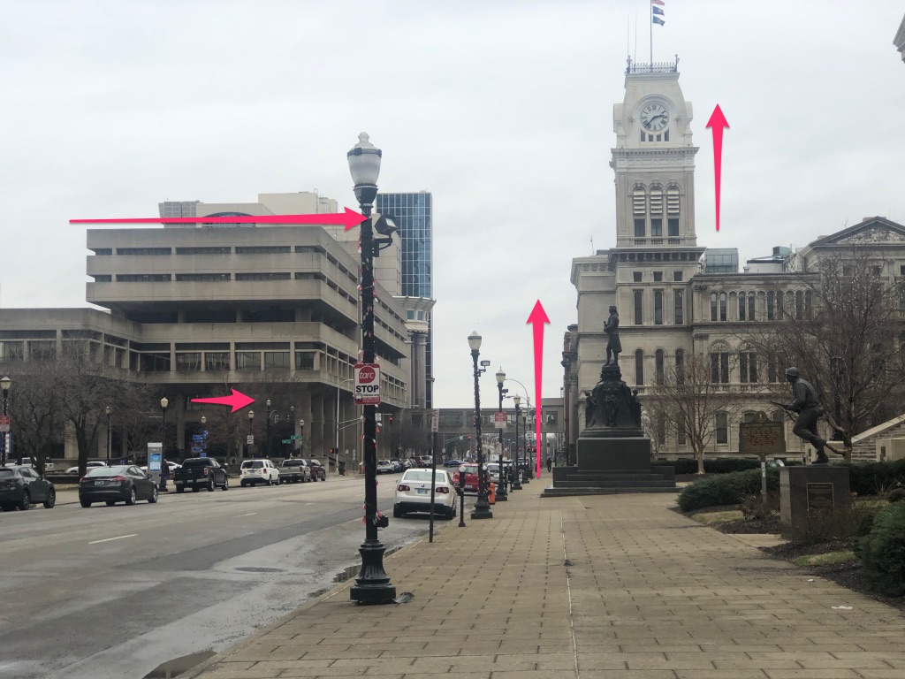
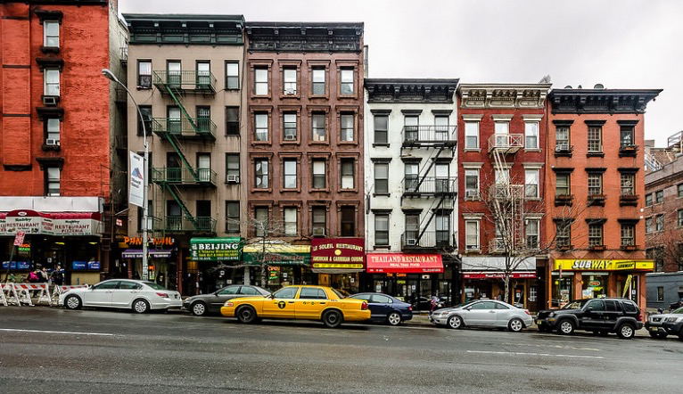
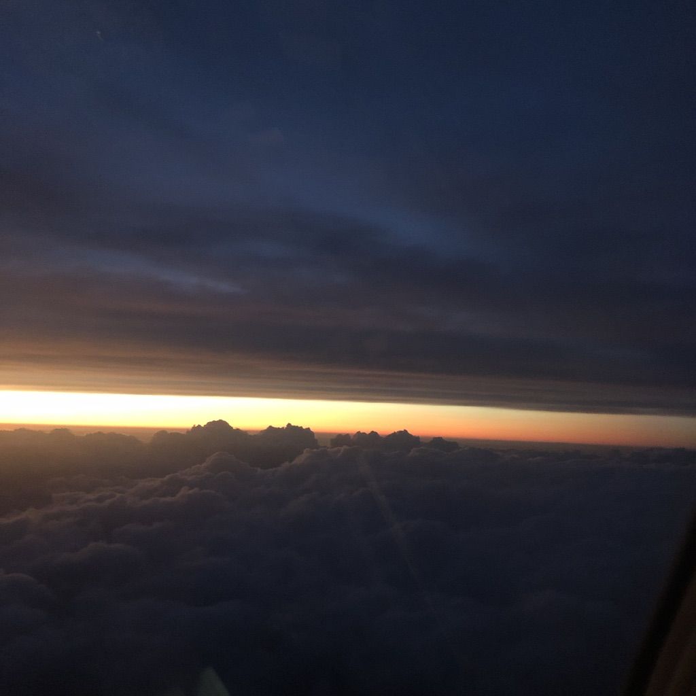

Hi all,

This is the first edition of my newsletter, currently entitled _the curtain_.

Each week on Tuesday I’ll send out a new edition that will talk about theatre, media, and what I’ve been learning about. I’ll include some personal updates, but mostly it’s a way to share my thinking.

One thing I’m constantly thinking about is how to better integrate the internet with being a theatre artist. It’s one thing [Jeremy O'Harris](https://www.instagram.com/jeremyoharris/) does incredibly well. So that’s one of the many reasons for starting a newsletter. Finding an online place to externalize thinking and process generated by being in theatre.

Anyway, you can reply directly to the emails and I’ll get them. I love to have conversations so if you’re interested, just hit reply.

Thanks for reading. And if you enjoy, forward it to your friends. They can sign up [here](https://guscuddy.substack.com/).

---

## New Ideas

Last week I finished up the 43rd Humana Festival of New American Plays at Actors Theatre of Louisville, where I performed in [The Corpse Washer](https://www.actorstheatre.org/shows/2018-2019/the-corpse-washer/), directed by Mark Brokaw and written by Naomi Wallace and Ismail Khalidi. I really had an amazing time. In my week back, I tried to jot down some of the lessons I learned about theatre, directly or indirectly inspired by the Festival.

1.  Creating new theatre is hard. It's loopy and weird and collaborative and there is no magical formula.
    
2.  Let go of the writer -> director -> actor fascist hierarchy. There is a balance to be made. Give actors ownership and agency over the text, not reverence.
    
3.  A building with five shows rehearsing at the same time has palpable energy. Doing deep work in a closed, productive rehearsal room (trying to invite serendipitous wonder), and then coming out and meeting other people who are coming out of their own rehearsals, to share lunch or a conversation, is a wonderful feeling.
    
4.  Continually, shows that lean into their unique theatricality are the most successful productions. With each year that passes, each new media form that emerges, this only becomes more and more true. One step further, plays and productions that lean into sculpting energy in a three-dimensional space -- considering the dimensions, shadows, nooks and crannies of the actual space -- are the most exciting. Productions that acknowledge acting as a physical feat are also very effective.
    
5.  Theatre is our most potent exploder of time. Productions that can explode time are beautiful and can explore the invisible, the all-at-once. They reach for the transcendent. And then they disappear into nothingness, like all time does, like everything does. (Differentiating them from any digital form.)
    
6.  Stage moving pictures are better than stage still pictures.
    
7.  The [Peak-End theory](https://en.wikipedia.org/wiki/Peak%E2%80%93end_rule) applies to theatre: we remember the peak, and the ending. When I think about the best theatre I've seen throughout my life, I think almost always of the 1-3 peaks in the show, and the ending. That’s what we take with us, so it’s worth crafting those.
    
8.  Imposter syndrome is a part of being an artist. As is feeling inadequate. As is the feeling of emptiness after a production. As is the feeling that when you have no job lined up, you will never work again.
    
9.  Theatre that accesses the unconscious wells inside us is always the best theatre. It can move us in unconscious ways we cannot explain. It's also often the theatre that is [most misunderstood](https://twitter.com/chris_shinn/status/1116482341105483778).
    

---

## What I Learned

#### The Corpse Washer

The process of making _The Corpse Washer_ helped me learn a ton about Iraq, the Middle East, and Islam. We had some of the best dramaturgs in the world, who brought in amazing guests. Iraq has been decimated over the last 30+ years, in so many ways by the United States’ direct involvement.

I’d recommend reading [the original novel](https://amzn.to/2IBoTQH) by Sinan Antoon, which is wonderful and harrowing. He also wrote two op-eds in the New York Times that were helpful in my research:

**[Living With Death in Baghdad](https://www.nytimes.com/2016/07/21/opinion/living-with-death-in-baghdad.html)**

> “**We are all corpses, waiting to die**,” said one man standing at the site the day after the attack. A friend wrote to let me know that he survived by sheer luck. He had planned to go to Karrada the night of the bombing, but was delayed by traffic. When I shared my own recollections about walking in the neighborhood years ago, he responded, **“In Baghdad, taking a walk these days could take you to the cemetery.”**

**[Fifteen Years Ago, America Destroyed My Country](https://www.nytimes.com/2018/03/19/opinion/iraq-war-anniversary-.html)**

> No one knows for certain how many Iraqis have died as a result of the invasion 15 years ago. **Some credible estimates put the number at more than one million**. You can read that sentence again. **The invasion of Iraq is often spoken of in the United States as a “blunder,” or even a “colossal mistake.” It was a crime.** Those who perpetrated it are still at large. Some of them have even been rehabilitated thanks to the horrors of Trumpism and a mostly amnesiac citizenry. (A year ago, I watched Mr. Bush on “The Ellen DeGeneres Show,” dancing and talking about his paintings.) **The pundits and “experts” who sold us the war still go on doing what they do.** **I never thought that Iraq could ever be worse than it was during Saddam’s reign, but that is what America’s war achieved and bequeathed to Iraqis**.

Sinan saw the show, and liked it!

https://twitter.com/sinanantoon/status/1113078410002251776

_(If you click on the video link you can see me bowing)_

_Translation: Last Saturday, I travelled to Louisville to see the play (The Corpse Washer) which was adapted to the stage in English by Naomi Wallace and Ismail Khalidi. A strange feeling to see and hear my characters say what I said before. Jawad, Ammoury, Reem, Hammoudy, Fartusi. One hour and half and the dream finished, and the audience clapped._

---

#### Thinking About Cities

Louisville’s downtown made me think a lot about the nature of cities. It’s a city that reminds me in a lot of ways of Rochester. It’s weird, cool, and its downtown is sort of depressing.

##### Horizontal and Vertical Lines

Most modern architecture have a trend of horizontal lines and windows, which are very brutal and depressing. There's a theory that in nature good things grow upwards, and bad things grow sideways -- I'm not sure I completely buy that, but I definitely buy the horizontal vs vertical argument. If you look at old New York City skyscrapers, their windows and lines are mostly vertical -- reaching for the heavens -- and very exciting and uplifting to look at. Now, however, many modern buildings feature boring, ugly, horizontal lines and windows.

Let's see what this looks like in Louisville:

 

On the left there is an example of a more modern building with horizontal lines and windows. It's really unpleasant and frightening to look at. On the right is an older building that has big vertical windows and lines -- when I look at it, I am inspired.

_"Vertical windows frame the standing human figure. They represent the idea of people standing erect inside the house."_ \- James Howard Kunstler

++

**[Death to Minimalism](https://www.currentaffairs.org/2019/02/death-to-minimalism%0A)**

Modern design has a strong emphasis on minimalism, to the point that every new building in Brooklyn seems to look exactly the same. But there's a strong case against it, that it is lifeless (the building on the left above is almost definitely more "minimalist", but also more dead).

Nathan J. Robinson writes in Current Affairs:

> **Minimalism is the aesthetic language of gentrification**...
> 
> **Ornamentation makes the world more interesting**. It stimulates the imagination, it means that you can look at something twice, three times, four times, and still not notice things. I think the reason people find it beautiful is not because of some nostalgia for Victorianism but because it is delightful to have a world dotted with small visual easter eggs. Contemporary design deprives us of these wonderful, whimsical features, even as we have the capacity to build more of them than ever before. **Why can’t you put gargoyles on a building anymore?** **I blame capitalism, with its relentless push for efficiency and technological progress, and its lack of interest in creating things that add unquantifiable value.**

++

**[The City of Lost Love](https://www.nytimes.com/2019/02/16/opinion/sunday/our-secret-city.html%0A)** 

Speaking of cities, Kaitlyn Greenidge has a lovely piece in the New York Times about how we have our own personal maps of the city we live in: 

> If you live in New York long enough, and date and make friends here, **you have your own secret map of the city** and the places that make you nostalgic, that make you wish it were 10 years ago, that make you thank the powers that be that time doesn’t stand still.

Cities are so wonderful and fascinating to think about.

But it's easier to be nostalgic of this:

 

_(vertical lines)_

And harder of this:

 

_(horizontal lines)_

---

#### Marshall McLuhan

I’ve been reading a lot of McLuhan recently, a prophetic philosopher of media who predicted the internet. I’m working through his book [Understanding Media](https://amzn.to/2Pcmkpn) now. It’s made me think a lot about technology and its effects on our senses, going all the way back to the invention of the alphabet. How does text, speech, literacy, vision affect how we perceive the world? His old [interview in Playboy](https://www.nextnature.net/2009/12/the-playboy-interview-marshall-mcluhan/) (!) is a good place to start:

> **…societies have always been shaped more by the nature of the media with which men communicate than by the content of the communication.**

> Before the invention of the phonetic alphabet, man lived in a world where all the senses were balanced and simultaneous, a closed world of tribal depth and resonance, an oral culture structured by a dominant auditory sense of life...The primary medium of communication was speech, and thus no man knew appreciably more or less than any other — which meant that there was little individualism and specialization, the hallmarks of “civilized” Western man.

> The man of the tribal world led **a complex, kaleidoscopic life precisely because the ear, unlike the eye, cannot be focused and is synaesthetic rather than analytical and linear…**

> The overhauling of our traditional political system is only one manifestation of the retribalizing process wrought by the electric media, which is **turning the planet into a global village.**

---

#### Beautiful Language

Maria Popova’s first sentence of her new book [Figuring](https://amzn.to/2XeMM4p):

> All of it—the rings of Saturn and my father’s wedding band, the underbelly of the clouds pinked by the rising sun, Einstein’s brain bathing in a jar of formaldehyde, every grain of sand that made the glass that made the jar and each idea Einstein ever had, the shepherdess singing in the Rila mountains of my native Bulgaria and each one of her sheep, every hair on Chance’s velveteen dog ears and Marianne Moore’s red braid and the whiskers of Montaigne’s cat, every translucent fingernail on my friend Amanda’s newborn son, every stone with which Virginia Woolf filled her coat pockets before wading into the River Ouse to drown, every copper atom composing the disc that carried arias aboard the first human-made object to enter interstellar space and every oak splinter of the floorboards onto which Beethoven collapsed in the fit of fury that cost him his hearing, the wetness of every tear that has ever been wept over a grave and the yellow of the beak of every raven that has ever watched the weepers, every cell in Galileo’s fleshy finger and every molecule of gas and dust that made the moons of Jupiter to which it pointed, the Dipper of freckles constellating the olive firmament of a certain forearm I love and every axonal flutter of the tenderness with which I love her, all the facts and figments by which we are perpetually figuring and reconfiguring reality—it all banged into being 13.8 billion years ago from a single source, no louder than the opening note of Beethoven’s Fifth Symphony, no larger than the dot levitating over the small i, the I lowered from the pedestal of ego.

---

## Assorted links and notes

*   _[Fairview](https://www.pulitzer.org/winners/jackie-sibblies-drury)_ [won the Pulitzer](https://www.pulitzer.org/winners/jackie-sibblies-drury). It was up against _Dance Nation_ and _[What the Constitution Means to Me](https://www.vulture.com/2019/03/heidi-schreck-tony-kushner-what-the-constitution-means-to-me.html)_. Three strong pieces of theatre, all written by women. It’s been a great past year of new plays. All three of these plays leaned heavily into their unique theatricality, with _Fairview_ going one step further and addressing the audience’s gaze itself.
    
*   _The Thin Place_ (\*\*\*\*) and _How to Defend Yourself_ (\*\*\*\*\*) were two highlights of Humana for me. I hope and expect both of them to find New York homes.
    
*   I liked Austin Kleon’s new book _[Keep Going](https://amzn.to/2GrTSNE)_ for artists. (_[Notes](https://www.evernote.com/l/AQPSB0pHiz5JW7p93riKKNAMQIn4Uz78m7Y))_
    
*   [Playwright Aleshea Harris on Hundred to One podcast](https://podcasts.apple.com/us/podcast/get-to-know-aleshea-harris/id1457732581?i=1000434401733). _([Notes](https://www.evernote.com/l/AQN03rleaG9NFJfDT_33JccAGnLjdAvifSk))_
    
*   [State of the Play panel](https://www.americantheatre.org/2019/03/25/offscript-live-at-the-signature-the-state-of-the-play/) with Lucas Hnath, Robert O’Hara, Leigh Silverman, and Alexis Williams (_[Notes](https://www.evernote.com/l/AQM3tMf3YjFEjZRekUki_bOLRWrn2_qUMYk)_)
    
*   [Playwright Christopher Shinn on Theater Fag podcast](https://soundcloud.com/user-203757292/20-playwright-christopher-shinn) (_[Notes](https://www.evernote.com/l/AQN8FR0kzIFIY7SK1BeASHlPWBA7txIEw4g)_)
    
*   [Playwright Jeremy O’Harris on Talk Easy podcast](https://overcast.fm/+GXg6taF5Q) _([Notes](https://www.evernote.com/l/AQOncx4YbQxCq7_0FBt5LpEMFD5E7flsQMw))_
    
*   I love both of Sally Rooney’s novels _Conversations with Friends_ and _Normal People_, the latter out just coming out now in the US. Many hail her as the voice of our generation. That’s a wildly loaded phrase, but she sure is great. [Vox on Normal People](https://www.vox.com/culture/2019/4/15/18311342/normal-people-sally-rooney-book-review). [The Ringer profile on Sally Rooney](https://www.theringer.com/2019/4/16/18311711/sally-rooney-normal-people-conversations-with-friends-millennial-novel).
    

That’s it for this week!

 

Talk soon,

\-Gus