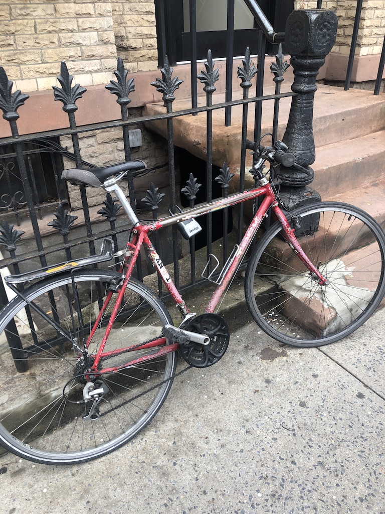

Hey everyone,

The sun is finally shining in New York, and I’m reminded that Spring is the best time of year. This is the second straight year I’ve been out of the city for February and March, so I can’t really complain about the worst of Winter. But still. This is the moment when you start to love New York again, before the mad sweltering heat of July-August. (Fall is the other best time. The in-between seasons.)

But sunshine is just objectively better. It carries with it happiness and possibility and good vibes.

I get it now.

I get why people move to LA. “It was the light that brought everybody to L.A. to make films in the early days,” David Lynch writes in [Catching the Big Fish](https://amzn.to/2ZDotiO).

Light is powerful. Light is good.

Anyway.

---

## Thoughts

I've been thinking about podcasts and theatre a lot, and how they interrelate. I have a theory about their paradoxical relationship.

I started listening to podcasts in high school. Most of them weren’t very slick, just a couple people talking into microphones. The form has grown and evolved since then, with many successful shows having a slick finish. But it also strikes me that many of the most successful podcasts (like Joe Rogan or Marc Maron) are still just people having conversations into a microphone.

And I think this notable, because it’s something podcasts are great for.

Sure, I do like podcasts like Serial, or This American Life, or Reply All. Narrative podcasts with a bit more “oomph”. There will always be a place for them.

But recently I was listening to Comedy Bang Bang, one of my original favorite podcasts. And I realized that what they do on that podcast — great comedic actors doing great character work, playing wildly on the imagination — only works because of the form. I like the TV show, but it is a qualitatively different type of experience. In a podcast, your brain fills in the rest. You imagine these ridiculous characters having these ridiculous conversations, and you go with it. On TV, a medium that can struggle with being too literal, you don’t get that. You don’t get that when you know it’s crafted and you can see everything.

And via podcast, you feel a type of intimacy. The relationship is warm. I feel like I know all these people on Comedy Bang Bang, despite not having seen any one of them live. But I know their comedy, and I know their laugh, and I laugh with them. When I listen, I feel like I’m having a secret conversation with them, even though I’m obviously not. (And I think this is different from the radio of old — podcasts [feel more intimate](https://www.guscuddy.com/2018/11/01/intimacy-is-alluring.html).)

This is also why I don’t really like live episodes of podcasts. I don’t want to hear other people responding. I want to own this experience myself, I want to be the sole arbiter. So it can be frustrating, and somewhat dissociating, listening to a group of other people respond to what have, up to this point, jus been voices in your head. 

It also speaks to this idea of the “ritual economy”. Comedy Bang Bang has put out at least one new episode every week for as long as I can remember. I know they are going to be there for me. I don’t listen to every episode. That’s not the point. The point is that I know it’s there, and I know I can trust them. That, coupled with podcasts’ intimacy, is very powerful.

So recorded podcasts, I think, are best left raw. I don’t want to hear prepared comedy on a podcast. I want to hear something raw that is improvised, making it all the more wonderful to drop in on. Because, like most people, I listen to podcasts while doing other things, like commuting or doing laundry. So I actually don’t want to have the laboriousness of preparation weighing me down. I don’t want to feel like I need to listen to every word or I have missed something. (This is part of why audiobooks frustrate me.) Instead, I want the podcast to play fast and loose, allowing me to zone out for a minute and drop back in.

On the other hand, the inverse is true with theatre.

Theatre is live. It wants to _feel_ improvised, but it actually wants to _be_ totally _crafted_.

That is, theatre needs to impress me. My favorite theatre often starts with what seems like a raw, empty space, seeming to show that a production doesn’t have any tricks up its sleeves. But then it pulls out tricks anyway. For me, this is what _The Thin Place_ and _How to Defend Yourself_ did at Humana. As Simon Stone [puts it](https://www.surfacemag.com/articles/simon-stone-talks-yerma-set-design/): “show the audience how impossible an idea is, then do it right in front of their eyes”. I want to be swept away and have a guttural, emotional experience. Theatre is its own, completely unique experience. 

So while theatre is live, it should be rigorously prepared. And while podcasts are recorded and prepared, they should feel live and raw. Recorded and raw, live and crafted. It’s an idea I’ve been thinking about.

This is why I believe podcasts and theatre are perfect corollaries. Together, they form a great barbell -- two extremes that are held together (quick and dirty digital podcasts on one side, slow and labor-intensive analog theatre on the other) -- for a [young theatre company](https://www.portertheater.com/). ;-)

---

## Learnings

#### **Translations and** _**The Odyssey**_

I finally finished Emily Wilson's translation of _[The Odyssey](https://amzn.to/2VXQAac)_. A strong recommend from me, and I'm going to move on to her Seneca translations next. She has a way of writing with startling clarity. It's a terrific translation.

Translations and adaptations are fascinating to think about. They filter down how we perceive a work. For instance, what does it mean that this is the first translation of _The Odyssey_ into English by a woman? 

["Tell me about a complicated man," the text begins](https://www.vox.com/identities/2017/11/20/16651634/odyssey-emily-wilson-translation-first-woman-english). Stories, and the nature and politics of how they are told, infect our consciousness. They matter.

Wilson has done a tremendous job on Twitter at providing insights into the challenges of translation. [Here's a collection of her threads](https://www.emilyrcwilson.com/emilyrcwilson-scholia).

Her work is really inspiring, as adaptations in theatre are something I want to work on myself.

---

#### [Lucas Hnath profile](https://www.newyorker.com/magazine/2019/04/22/lucas-hnath-lets-actors-fight-it-out-onstage)

Hnath had a big profile in The New Yorker, largely discussing his new plays _Hillary and Clinton_ (on Broadway now) and _The Thin Place_ (premiered at Humana).

There was some fun stuff in the profile. The best line:

> One advantage he had was that he wrote easily and quickly, and deleted and rewrote just as quickly. “**Writing is like feces**,” he told me. “**You’re going to make it one way or another**. There’s more where that came from. For me, **it’s more about, like, the shaping of the stuff**.”

???

---

## Assorted

*   [I love the Brooklyn Nets](https://www.theringer.com/nba/2019/4/23/18511843/brooklyn-nets-philadelphia-76ers-nba-playoffs-the-process).
    
*   [“Why We Spend Our Brief Lives Indoors, Alone, and Typing” by Tim Kreider](https://humanparts.medium.com/why-we-spend-our-lives-indoors-alone-typing-e3b1a98e6f45)
    
*   Sara Holdren is always great, but she’s been on a tear recently: [a critique of Hillary and Clinton](https://www.vulture.com/2019/04/review-metcalf-and-lithgow-in-hillary-and-clinton.html), [Taylor Mac’s new show](https://www.vulture.com/2019/04/theater-shakespeare-riffed-on-relentlessly-in-gary.html), and an evisceration of Roundabout’s straight-out-of-the-1950s [All My Sons](https://www.vulture.com/2019/04/theater-review-annette-bening-on-broadway-in-all-my-sons.html) (like, why are you doing that play in nyc and doing nothing with it except lazily casting Tracy Letts and Annette Bening?)
    
*   The WGA vs Agents battle has been fascinating. [Over 7000 writers have fired their agents](https://www.vulture.com/2019/04/more-than-7000-wga-writers-fire-agents.html). Collective action works. Someone tell that to [Jon Robin Baitz](https://deadline.com/2019/04/jon-robin-baitz-rebuffs-wga-demand-fire-agents-caa-writer-agency-dispute-1202596415/). 🤦🏻‍♂️
    
*   I’ve really enjoyed [T Magazine’s America 2024](https://www.nytimes.com/interactive/2019/04/10/t-magazine/america-2024.html) series, where they asked playwrights to imagine America five years into the future (notably Jeremy O’Harris - who also performs his monologue, Jackie Sibblies Drury, and Lynne Nottage). It’s an impressive, interactive experience online.
    

---

#### Photo of the week

 

This bike was sitting in front of an apartment with a “free bike” sign. So we took it.

---

That’s all for this week! If you liked this, you can forward it to friends, or tell them to sign up [here](http://guscuddy.substack.com).

\-Gus