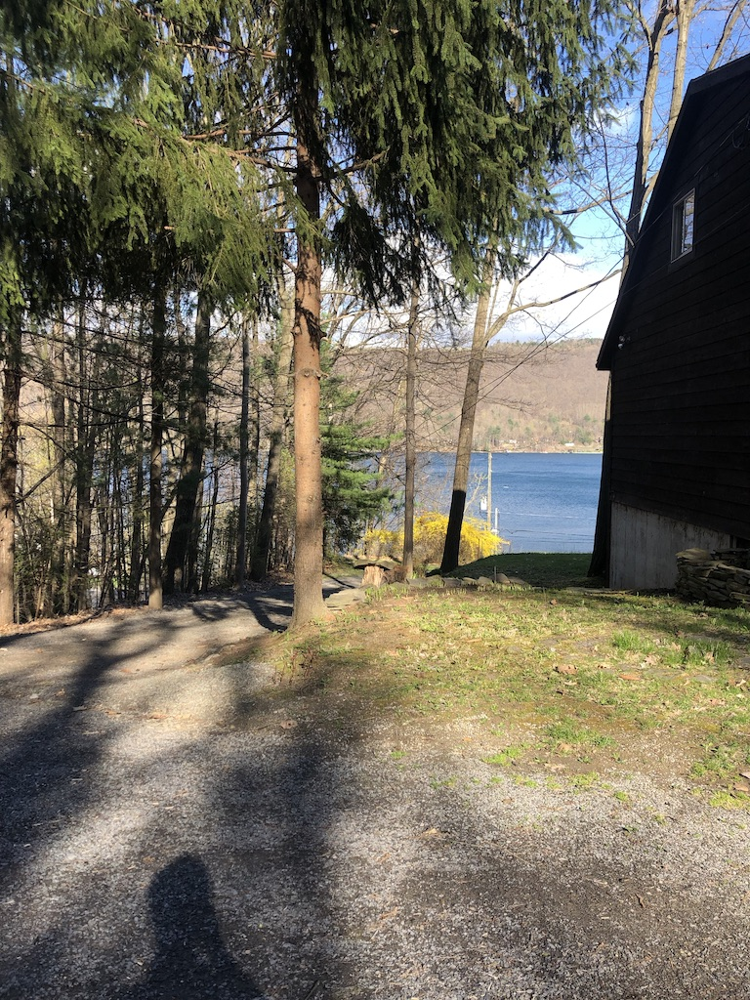

Happy Tuesday!

It’s been a good week. I saw some great theatre, travelled home for the weekend, and in general feel good. I post pictures and short videos on [my Instagram](https://www.instagram.com/guscuddy/), so follow me there if you’re interested.

I updated [my website](http://guscuddy.com/), with photos from some shows (including *[The Corpse Washer](https://www.guscuddy.com/shows/corpsewasher)*), and [a whole new Notes page](https://www.guscuddy.com/notes/). The aim there is to have a place to share the notes I take on books which have been my primary source of learning over the last few years (along with videos, podcasts, travel and experiences).

I am a little bit crazy and make my website not through Squarespace, Wordpress, Wix or anything like that. Instead, I hand-code it through [Jekyll](https://jekyllrb.com/). I use [Tachyons](http://tachyons.io/) to help style it. I write posts and pages in [Markdown](https://daringfireball.net/projects/markdown/). And I host it on a combination of [Github Pages](https://pages.github.com/) and [Netlify](https://netlify.com/). I really enjoy it, and I’m thinking about doing some freelance website design for theatre artists. If this interests you, email me. (You can reply directly.)

As I mentioned last week, I finished Emily Wilson’s translation of *[The Odyssey](https://amzn.to/2LbHSEh)*. I really enjoyed it, and updated [my notes](https://www.guscuddy.com/notes/odyssey).

---

### Theatre

🏆 The [nominations for the Drama Desk awards](http://www.playbill.com/article/nominations-for-the-2019-drama-desk-awards-announced-oklahoma-tootsie-rags-parkland-lead-the-pack) and [Tony awards](http://www.playbill.com/article/2019-tony-award-nominations-hadestown-and-aint-too-proud-lead-the-pack) were announced. Of the two, the Drama Desk are far more interesting (Taylor Reynolds’ directing nomination for *Plano* is well-deserved). But I am happy for Heidi Schreck for her Tony nominations. There’s an idea that theatre and/or Broadway is progressive, but this couldn’t be further from the truth:

https://twitter.com/jeremyoharris/status/1122963230169673729

https://twitter.com/Casey_Mink/status/1122884383747211264

Broadway continues to churn out uninspiring, complacent material. It’s disturbing. Though _To Kill A Mockingbird_’s snub (the highest grossing play ever — because it’s the most expensive) is interesting.

🙌🏾 [Wesley Morris is writing about theatre now](https://www.nytimes.com/2019/04/25/theater/african-american-playwrights.html), and I couldn’t be more excited about it. The New York Times Theatre section badly needs his voice. He’s their most interesting, deeply thinking writer by far. (It’s gotten to the point where I just generally try not to read any of their main critics’ reviews, for fear of giving them more power than they already have.) Here he writes about this amazing class of black playwrights we have, and how their plays are truly a new paradigm in theatre, and art itself:

> What further distinguishes Ms. Drury, Mr. Harris and Ms. Harris is a belief in the possibilities of form that puts their ingenuity in the larger company of folks like the rappers Tierra Whack, a newbie, and Kanye West, a part-time underdog; and writer-directors like Boots Riley and Jordan Peele.
>
> Now they’re all part of a standard to which I’m holding all kinds of other artists, all kinds of other products. Is this thing I’m watching, reading, listening to going down deep enough, far out there enough, inward enough? Is it doing the most it can to provoke, unnerve and dazzle me? Is it awake to what else this country is — and has always been?

Highly recommended, but there’s a spoiler in it for *Fairview* if you still have not seen it and managed to avoid knowing about the ending.

🤦🏻‍♂️ I enjoyed yelling at Terry Teachout on [this episode of Three on the Aisle](https://overcast.fm/+BB4LiHMXw), where they discuss Oklahoma, Hadestown, and casting. If that’s your thing, have at it.

### Literature and Creativity

✒️ I loved [Margaret Atwood’s appearance on Conversations with Tyler](https://overcast.fm/+PbpIyt-DM). They had a very charming relationship. I really like how Cowen’s conversations are anything but bland — he asks weird, unusual questions that prompt interesting responses. They spend a lot of time discussing Canada, for instance. Atwood also highly recommended Lewis Hyde’s [The Gift](https://amzn.to/2PF31Fj), so I started that this week.

### Media Round Up

#### 🎭 Theatre

##### *[Ain’t No Mo’](https://www.publictheater.org/Tickets/Calendar/PlayDetailsCollection/18-19-Season/Aint-No-Mo/)* at The Public

Glad I was able to catch the buzzed about [Ain’t No Mo](https://www.publictheater.org/Tickets/Calendar/PlayDetailsCollection/18-19-Season/Aint-No-Mo/) at The Public. I enjoyed it a lot. Some parts work better than others, but I’m all in on Jordan Cooper, at 24, becoming a theatre celebrity. [He appeared on The Breakfast Club](https://www.youtube.com/watch?v=37R1kwv1HWg) with Lee Daniels the day we saw it, so he wasn’t performing. But like: when was the last time playwrights hit the mainstream like this?

##### *[Plano](https://www.clubbedthumb.org/productions/2018/plano/)* at The Connelly

I loved *Plano*:

https://twitter.com/guscuddy/status/1121446198236327941

Expertly directed by Taylor Reynolds, with a really dynamite cast that never lets things slip away, it’s like an Edward Albee-David Lynch crossover. Go see it.

##### *[The Humans](https://www.syracusestage.org/showinfo.php?id=87)* at Syracuse Stage

My dad directed this and my mom designed the costumes. I thought it was an excellent production, and I’m struck by how resonant this play *should* be among regional theatre audiences, particularly the ones in working class cities like Rochester and Syracuse. Whether or not that’s actually true is another matter.

##### *The Royale* at Geva Theatre Center

Pirronne Yousefzadeh directed this exciting production with a terrific cast. It’s incredibly theatrical, and I was encouraged by how full and thrilled the audience was, as well as how (moderately) diverse they were.

#### 📺 TV

##### *The Good Place* - Season 1

I’m way behind on TV so this is embarrassing, but man do I love this show. It’s really fun.

#### 🎙 Podcasts

##### *[Comedy Bang Bang](https://www.earwolf.com/episode/10th-anniversary-part-1/)* [10th Anniversary](https://www.earwolf.com/episode/10th-anniversary-part-1/)

I mentioned how long I’ve been listening to Comedy Bang Bang last week, and now here we are at ten years. They did what every fan could have ever wanted: released a ten hour episode featuring tons and tons of favorite guests. What a treat. Here's [a conversation with Scott Aukerman](https://aux.avclub.com/scott-aukerman-talks-10-years-of-comedy-bang-bang-and-1834366092) discussing 10 years.

---

### End Note

If you’re enjoying this, I’d love it if you shared it with friends. [You can send them here to sign up](https://guscuddy.substack.com/). I’d really appreciate it!

And if you come across anything interesting this week, feel free to send it my way! I love sharing links and having conversations.

Have a great week.

\-Gus
