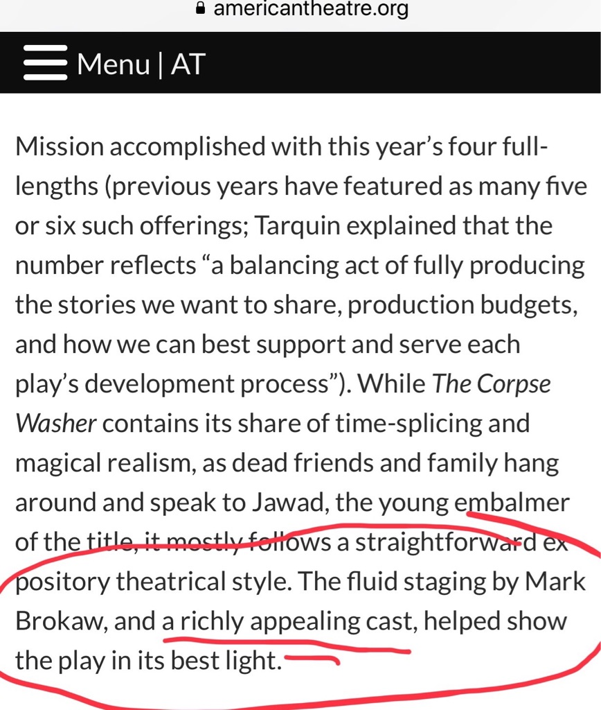
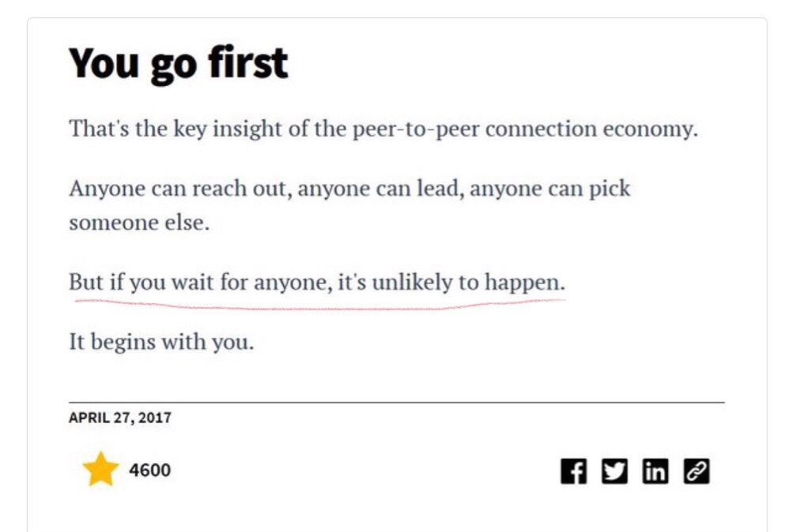
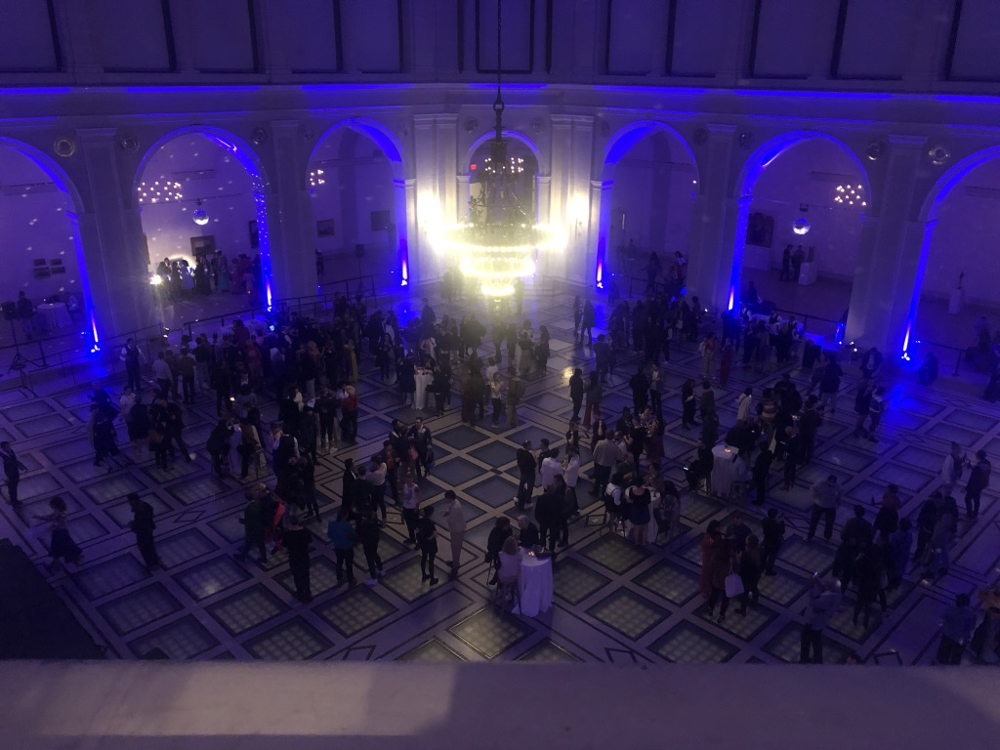

Hi friends-

Happy Tuesday!

This is the fourth edition of my weekly newsletter. If you’re receiving this, you either signed up or I added your email because we’re friends. Hope you enjoy!

++

**[The Qualities of Good Theatre](https://www.guscuddy.com/2019/05/07/qualities-of-great-theatre.html)**

I wrote a post on the qualities of good theatre. It’s meant to answer a simple question: what do we talk about when we talk about good theatre? It’s not at all exhaustive, but it was fun to write and think about what I particularly like to see in theatre, in more universal terms.

++

**[Humana got reviewed by American Theatre](https://www.americantheatre.org/2019/04/28/humanas-changing-conversation-and-who-leads-it/)**[.](https://www.americantheatre.org/2019/04/28/humanas-changing-conversation-and-who-leads-it/) _The Corpse Washer_ got a nice shout out: 

 

---

## Thinking about Media

#### **[Avengers, MCU, Game of Thrones, and the Content Endgame](https://www.rogerebert.com/mzs/avengers-mcu-and-the-content-endgame)**

Really loved this piece from Matt Zoller Seitz, on the merging of film and TV into a homogenous stream of content, which is the future of these forms of media.

I think this opens the door for a really interesting opportunity for theatre: it can furiously stake its place as a _live experience_, versus a piece of content. There’s a place for both. Digital content on the one hand, analog experiences on the other.

These sorts of experiences are becoming rare and scarce, and therefore increasingly valuable. Think of the swell in demand for festivals like Coachella, Bonaroo, and Burning Man, or the uptick in interest in psychedelics. They cannot be replicated by the digital. Theatre can position itself among these (in its own, different, more affordable light), instead of trying to be a pale, watered-down imitation of digital content.

++

#### **[Successful People Listen to Audiobooks](https://thebaffler.com/latest/successful-people-listen-to-audiobooks-caplan-bricker)**

(The title is sarcastic.)

> For many of these listeners, **the turn to audiobooks is a function of what scholar Jonathan Crary calls “24/7,” a way of organizing society under late capitalism that ignores the rhythms and textures of daily life and blurs the distinction between work and leisure time**. My monthly Audible subscription, however much I enjoy it, encourages this compression of labor and non-labor. It also helps fund a tech monopoly hell-bent on colonizing not only my precarious industry, but all of human existence—including sleep. To accomplish the latter on a market-mandated schedule, I buy a talking book to drown out my mind and its automatic striving to stay busy at all times.

There’s just so much to learn, so much to do, so much to consume!

Like this author, I’m trying to take more walks without my earbuds in. We live in a time where you can be learning 24/7 — consuming great content, all the time. But we also need time to just wander and dream, without feeling the need to consume an Audiobook on 1.5x speed, because there’s just so much to get through. (I am very guilty of this.)

++

#### **[The Netflix-Twitter Complex](https://thebaffler.com/latest/the-netflix-twitter-complex-atad)**

> “Every action Netflix takes must be understood as a function of their corporate vision: one in which every person on the planet with a bank account is paying them a monthly fee for a bottomless catalogue of content fed by algorithms and features purpose-built for endless binging. The righteous stands on Twitter, the paeans to new voices and diverse representation, all serve that monomaniacal goal”

Thought provoking article on Netflix’s incessant social media accounts. I don’t agree with all of it, but it is fascinating to think how social media turns Corporations into people. [Wendy’s Twitter](https://twitter.com/Wendys) is another good (read: scary) example of this. 

---

## Interesting Things from the Week

#### [Depression affects the whole world](http://www.theguardian.com/society/2019/apr/30/busting-the-myth-that-depression-doesnt-affect-people-in-poor-countries)

> Far from exposing depression as a uniquely western phenomenon, Patel’s research in Zimbabwe led him to conclude that **depression is a fundamental human experience**. “The basic nature of emotional pain is no different than physical pain,” he said. “The way they seek help may be different, but human beings feel it in the same way.”

Recommended read.

++

#### Take Action

My theme for this year is action. I like this from Seth Godin:

++

#### Assorted:

*   [Naval Ravikant on The After On podcast](https://overcast.fm/+JrL7HYeZw), discussing potential threats to the end of the world. 2 parts, recommended but only if you want to freak yourself out/learn about the very real dangers of the inevitable rise of scary technologies.
    
*   [A chimpanzee using Instagram.](https://mobile.twitter.com/_DanielSinclair/status/1121252893586276352)Very revealing.
    
*   [New Erotica for Feminists.](https://www.mcsweeneys.net/articles/new-erotica-for-feminists)
    
*   [Biodegradable shopping bags buried for three years didn’t degrade](https://www.nationalgeographic.com/environment/2019/04/biodegradable-shopping-bags-buried-for-three-years-dont-degrade/)
    
*   [Adam Sandler returned to SNL and it was kind of delightful](https://www.theringer.com/2019/5/5/18530073/saturday-night-live-adam-sandler-host), especially his moving homage to Chris Farley.
    

---

## Photo of the Week

 

This is one of the nicest rooms in the Brooklyn Museum, which I had never seen before. We went to their Spring Opening, which featured some great new exhibits: _**[Garry Winogrand: Color](https://www.brooklynmuseum.org/exhibitions/garry_winogrand)**, **[Nobody Promised You Tomorrow: Art 50 Years After Stonewall](https://www.brooklynmuseum.org/exhibitions/stonewall)**,_ and _**[Liz Johnson Artur: Dusha](https://www.brooklynmuseum.org/exhibitions/johnson_artur)**_. I really enjoyed them all. Garry Winogrand is one of my favorite photographers and the exhibit showing his rarely seen color photographs is pretty cool.

---

## End Note

If you’re enjoying this, I’d love it if you shared it with friends. [You can send them here to sign up](https://guscuddy.substack.com/). I’d really appreciate it.

Have a great week!

\-Gus