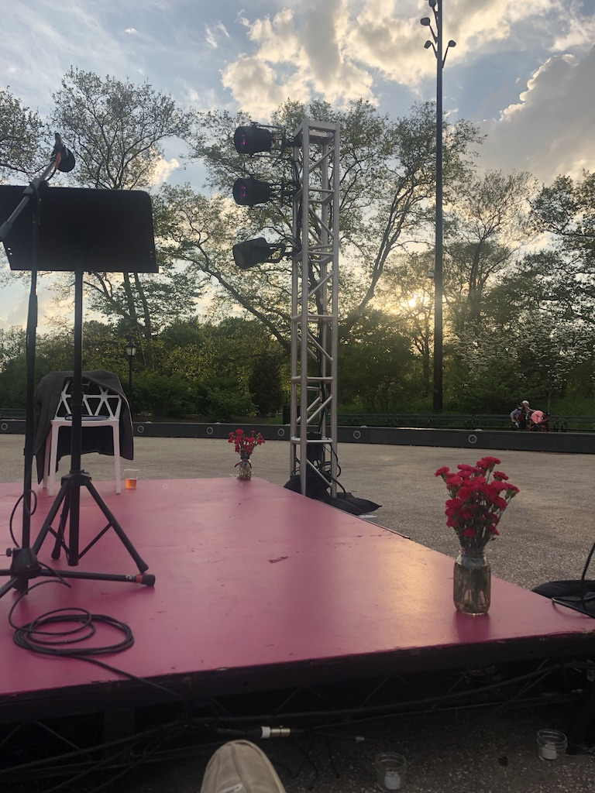

Hi all,

Happy Tuesday! Hope you’re having a good week.

++

Something I keep thinking about is the relationship between the future of theatre and the internet.

As I note in my learning section below, there has been a huge rise in popularity of "downtown" playwrights. There are pieces in Vogue, GQ, the (non-theatre section) New York Times, and other places on the class of writers we have now. Many celebrities were spotted at Will Arbery’s _Plano._ [Jeremy O'Harris](https://twitter.com/jeremyoharris) is working with Rihanna:

https://twitter.com/rihanna/status/1130459830219501568

https://twitter.com/jeremyoharris/status/1130172675471626241

What the hell is going on?

I have a theory.

I believe the future of theatre relies on leveraging the internet. Creating works of extremely exciting quality, but also marketing work through distinct individual personalities.

If you look at what Jeremy O'Harris has done, so much of it -- besides writing the scintillating *Slave Play* -- is through the internet and his social media presence. He has a personal monopoly on his own "naked brand".

I believe many theatre institutions are stuck in an old mindset about marketing on the internet, thinking that it is something separate from the work that you dump money into and hire "marketers" to do. But I think the internet flips marketing on its head. People on the internet want to interact with people, not institutions. (Think about how Netflix, Wendys, and all these corporations use their social media accounts like they're a single person.) Jeremy O'Harris has made theatre cool on the internet (in his constantly growing concentric circles of influence) by owning his presence completely. He is the opposite of boring. But this presence is its own marketing, inseparable from the work -- all his upcoming shows will now be sold out in NYC.

Another example would be *Hamilton*, which did its own marketing. It had an amazing soundtrack (a digital product), and a creator who insisted on constantly creating public content online (Ham4Ham).

Millennials and Gen Z acquire trust digitally. They want to go beyond buying some product, or going to see a play or movie or concert in a context-less void. Instead, they want to create emotional connections with creators. And the best way to do this is to create some form of public content online, and developing a personal brand.

I think the future of American Theatre rests in people, rising above the institutions that enable them. I still believe strongly in the importance of these institutions, but I also believe the discourse in theatre cannot be trapped within these institutions, a distinctly pre-internet idea. We need real people, real personalities, real discourse. Not just just among playwrights but among directors, critics, and anyone involved. I think of how critic Jose Solis (who sees more theatre than anyone) [has crafted a niche on Twitter for attempting to diversify audiences](https://twitter.com/josesolismayen?ref_src=twsrc%5Egoogle%7Ctwcamp%5Eserp%7Ctwgr%5Eauthor). I think of [how Jordan E. Cooper is a playwright appearing on The Breakfast Club](https://www.youtube.com/watch?v=37R1kwv1HWg).

I believe the uptown - downtown wall being broken down is more a product of this shift in how we consume content -- combined with this superb crop of playwrights -- rather than any one institution. As I discussed [last week](https://guscuddy.substack.com/p/the-curtain-51419), I think the internet has enabled a hyperlink consciousness which connects everything together. Traditional hierarchies (Broadway, Off-Broadway, Off-Off-Broadway) are stale. The internet enables people to realize that you can go to a theatre that is not on Broadway and get an experience that is way better, way more electric, way more alive than most of what's currently on Broadway. In the old model, Broadway was always considered "premium". Now, the best, most hype-driven theatre provides a jolt of electricity, a live experience you couldn't get anywhere else -- and is often not on Broadway. (In fact, I don't even think about whether I'm seeing something on Broadway, off-Broadway, or off-off-Broadway anymore. I barely know how the distinctions work.)

These experiences tend to be popular because theatre is one of the only things right now that lies beyond algorithms. Almost all other forms of content we consume -- social media, Netflix, Hulu, HBO, Disney -- are created and distributed with algorithms. But theatre doesn't allow that. It's its own unique experience. But the irony is that, in order to get people to reach for these algorithm-less experiences, we need the internet.

_I’m open to constructive comments and disagreements with any of this — let me know!_

---

## New Things

I updated my website again, including my philosophy of theatre and art. **[Check it out here.](http://guscuddy.com/)**

++

#### [Post \[Replay\] : Good theatre runs smooth](https://www.guscuddy.com/2018/11/15/good-theatre-runs-smooth.html)

I wrote this article last year on my theory of how good theatre relies on using our System 1 brain -- or our "fast" brain, coined by Daniel Kahneman. I revisited it because I want to expand on this idea: it's my link between Peter Brook and modern psychology. It was inspired by [this article about director Robert Icke](https://www.ft.com/content/9a8367aa-bebb-11e5-9fdb-87b8d15baec2):

> “I think when theatre involves that sort of cleanness of aesthetic combined with real emotion from the actors, it functions like that \[using your fast brain\]. It creates space for your quick brain to get in there and paint the rest of the scene on. It certainly did in A View from the Bridge. And that’s glorious because it means you, as the audience, are genuinely participating in the creation of the art work.”

**[You can read my post here.](https://www.guscuddy.com/2018/11/15/good-theatre-runs-smooth.html)**

---

## What I'm learning about

#### The uptown - downtown teardown

[Vogue had an article last week](https://www.vogue.com/article/broadway-playwrights-actors-directors-june-2019-issue) about downtown playwrights reshaping the uptown theatrical landscape, and how radical it is. Besides the photo being horribly awkward, the article is a bit light (weird that it doesn't mention *What the Constitution Means to Me* -- a Clubbed Thumb show -- making it to Broadway and getting nominated for Best Play). But what it does speak to is that hip playwrights are literally in vogue. There's a real movement happening there. Diep Tran also [wrote an article about this uptown-downtown melding](https://www.americantheatre.org/2019/03/26/uptown-vs-downtown-tear-down-this-wall/) recently.

#### [All forms of entertainment compete with one another](https://www.vox.com/recode/2019/5/16/18627272/eugene-wei-remains-day-blog-status-apple-netflix-hulu-hbo-peter-kafka-recode-media-podcast-interview)

From Eugene Wei on *Recode Media*:

> The biggest change in our lifetime is that entertainment is now fungible. At any moment in time, you can pick up your phone and you can read the New York Times, you can watch Netflix, you can watch YouTube, you can go to Instagram, you can go to Twitter. In the consumer’s mind now, all forms of entertainment trade off against each other. You might say that, hey, this podcast, or listening to some music on Spotify isn’t the same as playing Fortnite. When Netflix says that they compete with Fortnite, actually **all forms of entertainment compete with all forms of entertainment now**.

#### [Brian Koppelman screenplay outline](https://briankoppelman.com/2019/02/18/billions-golden-frog-time-script-and-outline-episode-211/)

For anyone interested in the writing process for film and television, [Brian Koppelman](https://twitter.com/briankoppelman), co-creator and writer of *Billions*, is a great follow on Twitter.

I really like that he shares his process. [You can read the outline and teleplay for an episode of Billions for free on his website](https://briankoppelman.com/2019/02/18/billions-golden-frog-time-script-and-outline-episode-211/). It's interesting and helpful to see how extensive outlines are, and how they develop into the final product.

#### [Education abundance](https://seths.blog/2019/05/toward-abundant-systems/)

Seth Godin, "Toward Abundant Systems":

> The cultural turning point of our moment in time, the one that’s just beginning to be realized, is that education is an abundant system, not a scarce one.
>
> Space on the Harvard campus is highly valued and also scarce.
>
> But **if we can break education out of the campus/scarcity mindset and instead focus on learning, learning at scale, learning that happens despite status not because of it–then we can begin to shift many of the other power structures in our society**.

#### Buddy the dog

http://twitter.com/SlenderSherbet/status/1129458102246547456

---

## Read/Seen

My brother sent me [this amazing collection](http://extension765.com/soderblogh/33-seen-read-2018) of everything Steven Soderbergh saw and read in 2018. So I'm doing something similar.

A \* indicates recommended. A \*\* indicates highly recommended.

05/14 🎭 *[Dying City](https://2st.com/shows/current-production/dying-city)* [at Second Stage](https://2st.com/shows/current-production/dying-city)

05/16 🎭 *[I thought I would die but I didn’t](https://www.thetanknyc.org/calendar/itiwdbid-may-11)* at The Tank\*

This weird and provocative play from Bailey Williams is hyper-smart and pretty disturbing. I wasn't totally on board with every shift it takes, but it was as original a play as I've seen recently. Features an amazing cast, smart direction by Sarah Blush, and costume designs by the wonderful Dina Abd El-Aziz. [Great review from Helen Shaw](https://www.timeout.com/newyork/theater/i-thought-i-would-die-but-i-didnt). Plays till 5/23.

05/20 - 🎭 *[The Misanthrope](https://www.moliereinthepark.org/)* [- Moliere in the Park](https://www.moliereinthepark.org/)

---

## End Note

_A beautiful night in Prospect Park._

++

Thanks for reading! Hello to any new readers! If you’re enjoying this, I’d love it if you shared it with friends. [You can send them here to sign up](https://guscuddy.substack.com/). I’d really appreciate it.

And if you come across anything interesting this week, feel free to send it my way! I love sharing links and having conversations.

Have a great week.

\-Gus
