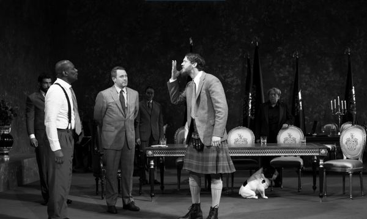
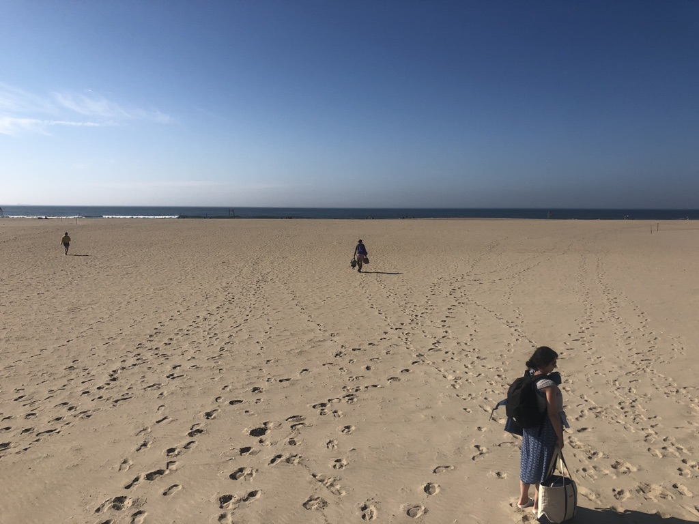
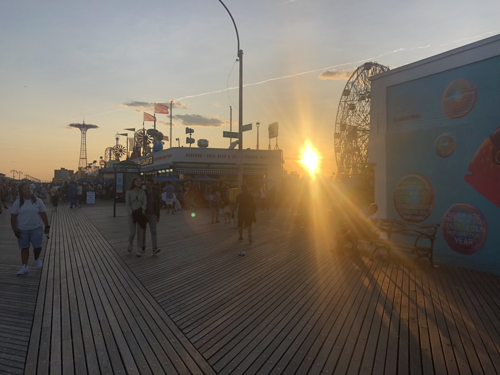

Hi all,

Hope everyone had a wonderful Memorial Day weekend.

It’s raining now, but it was a gorgeous 80+ degrees in NYC on Sunday and Monday, which meant it was time to go to the beach. My feet have horrible streaks of red because of my Icarian hubris re: sunscreen, but that’s OK, because I love the beach like few other things. I love the sand and the waves and the dumb poetry of it all. The feeling of the heat on your body and the sand on your feet and the salty cleansing of the water. It’s filled with nostalgia and freedom.

[It’s also a psychically complex place.](https://www.nytimes.com/2017/06/01/podcasts/at-the-movies-the-beach-is-the-ultimate-freedom-and-in-life.html) It has a strange and lengthy history in the world of pop culture. Some people don’t like it, and that’s OK. It can be a weird mix of fantasy and nightmare. Personally, I find the beach to be soulful and liberating, a place for expression and pondering. But I know for many people that’s not the case. It’s an American symbol worth examining.

++

Side note, does anyone know any good beach plays? There are obviously plenty of good and famous beach movies. Am I missing something obvious here?

---

### New things

#### [Short Post \[Replay\]: On textual fidelity](https://www.guscuddy.com/2018/11/14/on-textual-fidelity.html)

I wrote this short post last year on the difference between honoring the spirit and the letter when re-staging classics. It's a concept I learned from director Robert Icke. It came up again this week as I thought about the new KING LEAR. I'm going to deepen this idea with some future writing, beyond this short and somewhat clunky post.

I’ll be back next week with some new (!) writing.

---

### What I learned this week

#### Disability representation

 

There are plenty of problems in Sam Gold’s new production of KING LEAR, but one thing it does well is expand disability representation, a horribly underrepresented area in theatre right now. His LEAR casually casts a deaf actor, Russel Harvard, who is simply a part of the world, and not explained beyond that. It’s a vision for a more inclusive theatre, and a more inclusive world in totality. Many old white people in the audience I was with didn’t like it, leaving at intermission saying “why were they doing all that signing? I just don’t understand.” ([The audience also disturbingly laughs when Gold has Edgar (Sean Carvajal) plead for his life as a refugee in Spanish 🤦🏻‍♂️.](https://twitter.com/josesolismayen/status/1129575179129171968?s=21))

Gold did something similar with his 2017 GLASS MENAGERIE, casting Maddison Ferris as Laura, a young actor with muscular dystrophy who uses a wheelchair. It was moving and progressive, but many critics were jarred and thought it was manipulative. I find this line of thinking fairly repellent. From a [great piece in Howlround by Ryan Donovan](https://howlround.com/re-membering-canon): “Ferris’s wheelchair apparently did not sit well with critics who prefer their disability metaphoric and their texts sacred.“

Gold has his fair share of very strong critics (like [Hilton Als](https://www.newyorker.com/magazine/2019/04/15/sam-golds-self-serving-vision-of-king-lear)) who view his recent productions as self-serving and fetishizing. They aren’t without a point. (For the record, I didn’t like KING LEAR that much.) But I think there is something deeper going on in many critics’ dislike of Gold’s casting, including Als here. I’ve been rethinking my own biases when it comes to disability representation. I’m thinking more about how inaccessible theater buildings in New York generally are (and how inaccessible the city itself is), and how little diversity among differently abled bodies there is in theatre.

---

#### Realism in theatre

[Thomas Ostermeier](https://www.amazon.com/Theatre-Thomas-Ostermeier-Peter-Boenisch/dp/1138914479):

> **The attitude of realism attempts to portray the world as it is, and not as it looks**. It attempts to **comprehend realities** and to **reconfigure** them, to **give them a form**. This attitude attempts to use the recognisable in order to provoke surprise and astonishment.

Christopher Shinn talked about a similar idea [on the Theater Fag Podcast](https://soundcloud.com/user-203757292/20-playwright-christopher-shinn) as well: that his work is not naturalism but instead an exploration of real things. An important distinction.

---

#### Emotions and productivity

I re-read some articles from my favorite author on productivity, Tiago Forte. One of his best works is [Productivity for Precious Snowflakes](https://www.ribbonfarm.com/2016/01/28/productivity-for-precious-snowflakes/). This goes way beyond generic bullet journal-type advice, and is a deep dive exploration into how to leverage emotions and moods into the future of doing work. It’s very esoteric, so only recommended for certain types of people interested in this stuff.

> In other words, **the true purpose of note-taking is transporting states of mind (not just information) through time**. This is why pictures, sketches, and diagrams often work better than text. We don’t usually think of them as notes, but songs, smells, and tastes work even better. As HBR puts it: “A visual model becomes one of the most effective tools for minimizing alignment-attrition; a visualization formalizes an emergent idea and solidifies it at a moment in time.” Or as Craig Mod more eloquently says, “**To return to a book is to return not just to the text but also to a past self**. We are embedded in our libraries. To reread is to remember who we once were, which can be equal parts scary and intoxicating.”
> 
> Thinking about the value inherent in every unique state of mind, and how one can actively pursue and assimilate these states, I’m struck by a quote by Picasso: “It took me four years to paint like Raphael, but a lifetime to paint like a child.” You could say that his work was a technology of forgetting. It’s encouraging to realize that many of the states of mind we seek are not “out there” somewhere, to be hunted down and consumed. They are states of mind belonging to our past selves — we wouldn’t crave it if we had never experienced it. **We have to go backwards and remember what we once knew, not forwards to some perfected version of ourselves**. What would you pay to experience child-like wonder for a day? To watch Star Wars Episode IV for the first time again? To have the ability to snap your fingers at any time and see your writing, your painting, your app with the fresh eyes of a novice?

---

#### Quality website design

 

---

#### Richard scary dog that I really like

 

---

### Media log

\*A \* indicates recommended. A \*\* indicates highly recommended.\*

05/21 - KING LEAR at the Cort Theatre

05/25 - LUNCH BUNCH // Clubbed Thumb Summerworks\*

Clubbed Thumb has been on quite a tear recently. I loved this odd, innovative and compact play about food as existential dread. Great performances, and a wonderful and heartening ending. Hope it has a life beyond this.

Also I can't stop listening to Big Thief's new album _UFOF_.

---

### End Note

 

_Obligatory pictures of Riis Park (top) and Coney Island (bottom). Both contain fantasies and nightmares._

++

Thanks for reading! Hello to any new readers! If you’re enjoying this, I’d love it if you shared it with friends. [You can send them here to sign up](https://guscuddy.substack.com/). I’d really appreciate it. (And a reminder that you can always read the Archive [here](https://guscuddy.substack.com/archive).)

If you come across anything interesting this week, feel free to send it my way! I love sharing links and having conversations.

Have a great week.

\-Gus