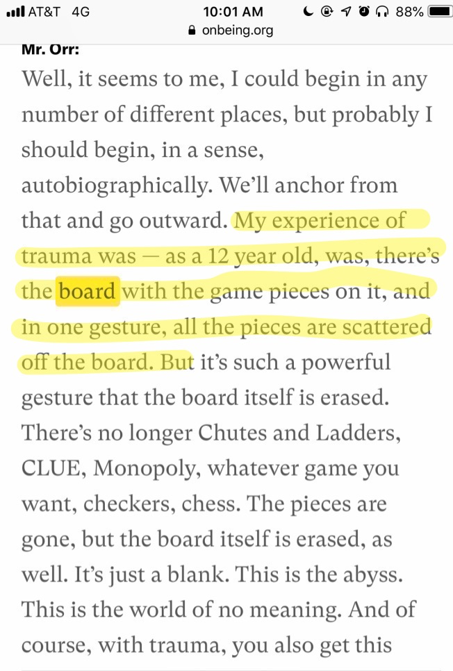
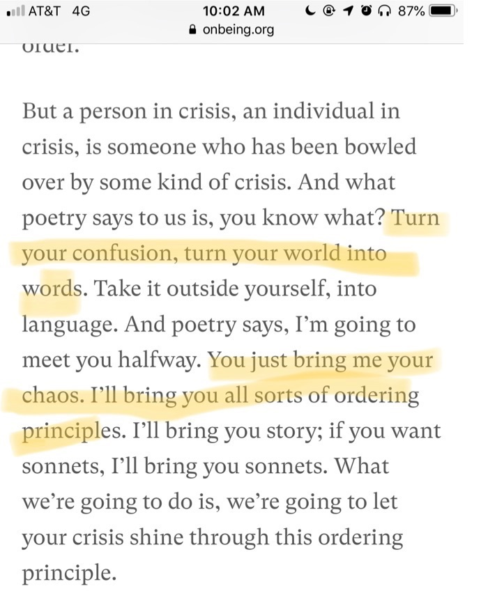
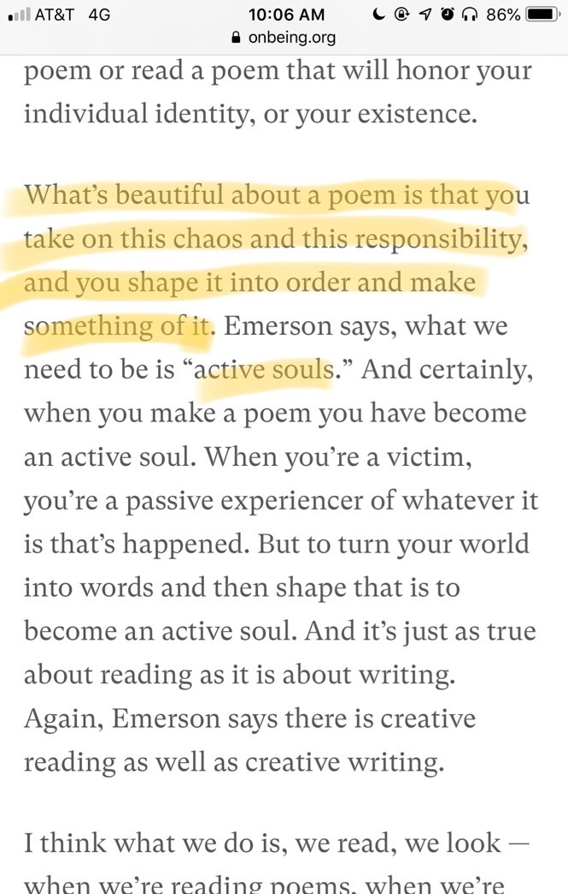
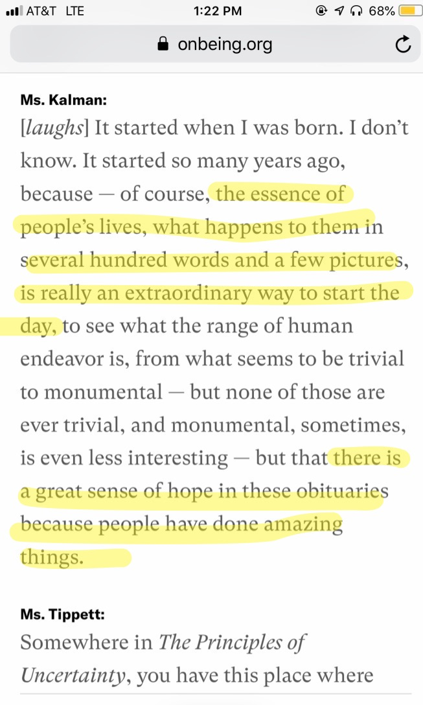
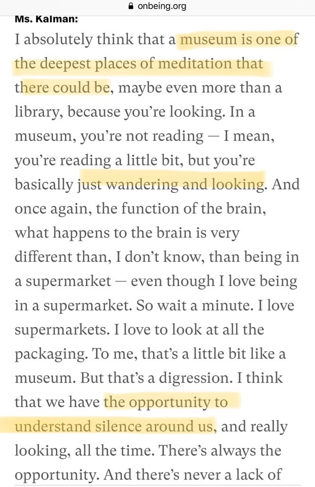
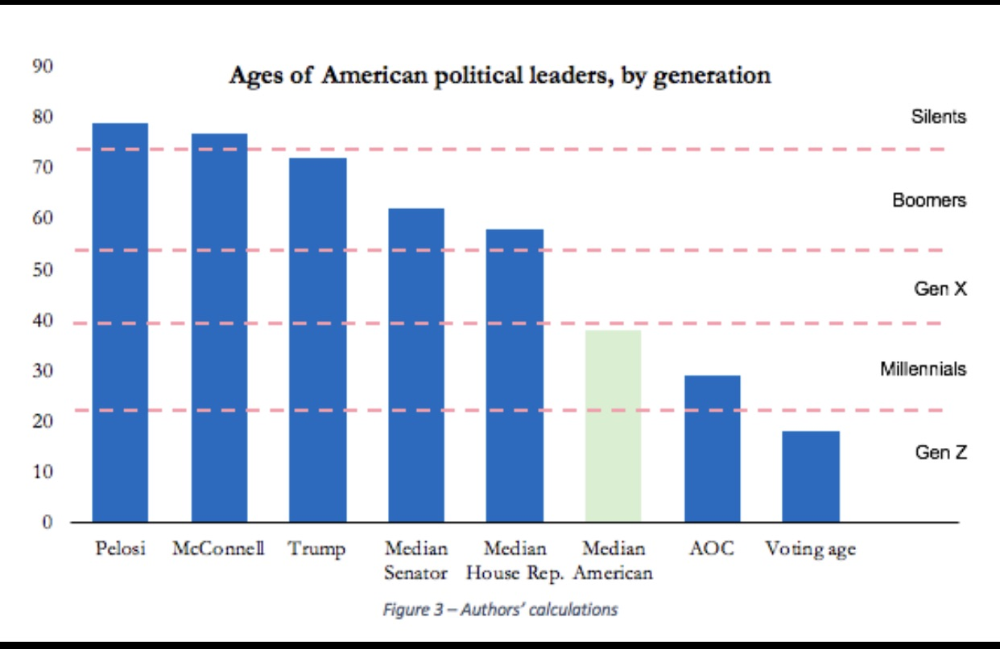
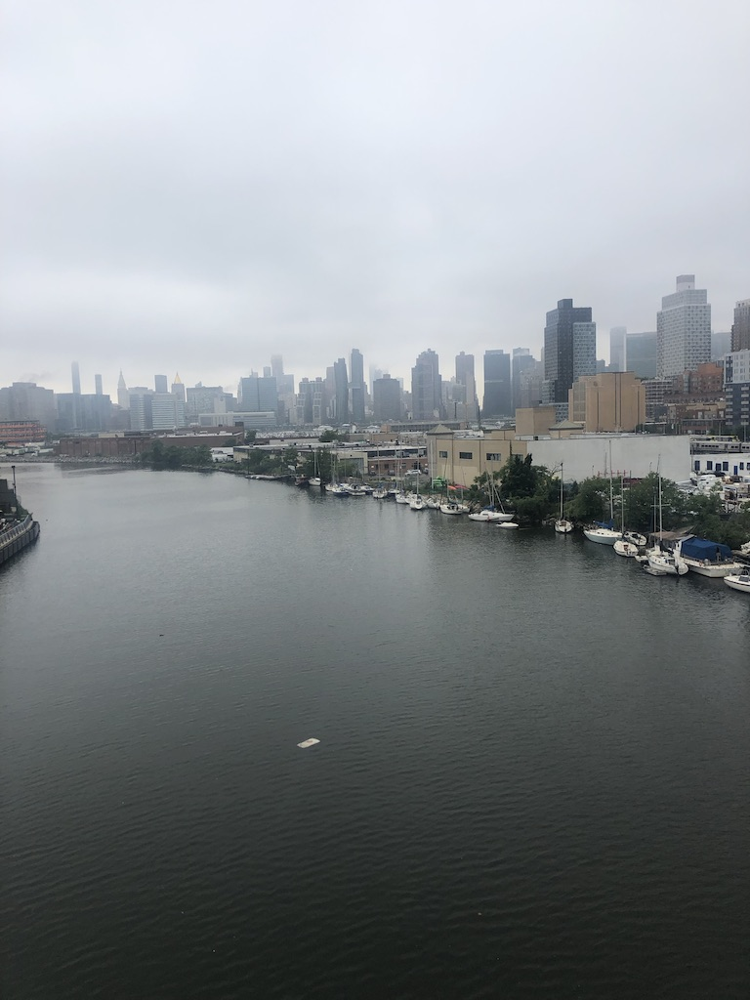

Hi all,

Happy Tuesday. I hope your day is going well.

We have been in the thick of a frankly torturous apartment search, but it hopefully seems to be drawing to a close. The next step, of course, is the actual move -- which is equally stressful. But in these times, grateful to have a home and for all the wonderful things in my life that I often take for granted!

++

A couple weeks ago I wrote about theatre and the internet. Theatre is one of the few things we experience that is beyond the algorithms that drive all internet and technology. But it does face a threat to a sort of algorithm. It’s what I call **"The Scott Rudin Problem**".

Producer Scott Rudin is one of the biggest, most powerful names in theatre and film. But I have noticed recently that he produces theatre like he's filling in algorithmic mad libs. "Sam Gold directs... Glenda Jackson in... William Shakespeare's King Lear... featuring \[insert celebrated TV actor here\], \[insert beloved theatre veteran here\]." It's how I felt about _The Waverly Gallery_ (which Rudin produced as well) -- a bizarre and boring production with a talented line-up on paper, but that fell completely flat when assembled as a living, breathing thing. It's theatre without a soul, without a real reason to exist.

If theatre is to succeed it needs to trust the artists and people behind it to create organic, unique work, not to be coldly assembled together and manufactured in a successful producer's dream-laboratory. It doesn't work like that. It can't be created according to objective, rational algorithms and equations. Because theatre isn't rational. It's something beyond that entirely.

---

## This week’s tidbits:

#### **[Regional Theatre vs New York](https://tucson.com/entertainment/arizona-theatre-company-s-new-artistic-director-seeks-to-improve/article_f979e4a1-d170-545a-9a12-548bd78f07f3.html%0A)**

Liked [this interview](https://tucson.com/entertainment/arizona-theatre-company-s-new-artistic-director-seeks-to-improve/article_f979e4a1-d170-545a-9a12-548bd78f07f3.html%0A) with the great Sean Daniels on taking over Arizona Theatre Company:

> **You can either have New York telling you what you’ll be seeing in two or three years, or you can be doing shows before New York**,” says Daniels. “In the past we’ve done a lot of solid work, but it’s been a lot of what New York did three years ago. I’m ready to start saying that great theater in our country starts in Arizona. That plays go from here and then go to New York. Or not even New York, but to the rest of the country.

That's a damn good attitude to have.

---

#### **Poetry and Trauma**

A beautiful conversation with lyric poet Gregory Orr, on the shaping of grief and trauma with language:

 

The conversation ends with a lovely poem from Orr:

_To be alive: not just the carcass_

_But the spark._

_That's crudely put, but…_

_If we're not supposed to dance,_

_Why all this music?_

[Listen to it here.](https://onbeing.org/programs/gregory-orr-shaping-grief-with-language/#transcript)

---

#### **Maira Kalman on Obituaries, Walking, Trees and Museums**

Continuing my Krista Tippett kick, I re-listened to this convo with my favorite artist, Maira Kalman.

Kalman starts her day with coffee and the obituaries:

 

She walks three times a day with her friend in Central Park:

"**Walking and looking at trees really is one of the glories of the world**, and we say "rejoice" when we see these things."

And she loves museums as a deeply spiritual place:

 

[Listen to the interview here.](https://onbeing.org/programs/maira-kalman-daily-things-to-fall-in-love-with-jan2019/%0A)

And pick up one of Kalman's books, while you're at it. I recommend _[The Principles of Uncertainty](https://www.mairakalman.com/books/adult/the-principles-of-uncertainty/#1)_.

---

#### **Ages in American Politics**

 

source: [The Atlantic](https://www.theatlantic.com/ideas/archive/2019/05/coming-generation-war/588670/) (recommended read, though with reservations)

---

#### **[The tragedy of Airpods](https://www.vice.com/en_us/article/neaz3d/airpods-are-a-tragedy%0A)**

> These are AirPods. They’re a collection of atoms born at the dawn of the universe, churned beneath the surface of the earth, and condensed in an anthropogenic parallel to the Big Crunch—a proposed version of the death of the universe where all matter shrinks and condenses together. Workers are paid unlivable wages in more than a dozen countries to make this product possible. Then it’s sold by Apple, the world’s first trillion-dollar company, for $159 USD. **For roughly 18 months, AirPods play music, or podcasts, or make phone calls. Then the lithium-ion batteries will stop holding much of a charge, and the AirPods will slowly become unusable**. They can’t be repaired because they're glued together. They can’t be thrown out, or else the lithium-ion battery may start a fire in the garbage compactor. **They can’t be easily recycled, because there’s no safe way to separate the lithium-ion battery from the plastic shell. Instead, the AirPods sit in your drawer forever**."

I really like my AirPods but this is a terrific piece eviscerating them.

---

#### **[In praise of goats](https://hedgehogreview.com/issues/the-human-and-the-digital/articles/for-the-love-of-goats%0A)**

> A dog’s eye is much like a human’s, the pupil expanding and contracting but always remaining circular. But both cats and goats have pupils that contract into ellipses or rectangles; the shape is horizontal in a goat’s sclera and vertical in a cat’s. The slitting in both cases helps the animals filter out bright light that would otherwise overwhelm an ocular organ adapted to see in the dark. There is something a little unsettling about creatures that are able to observe obscure goings-on that we others can only imagine. Both goats and cats are acquainted, I imagine, with the uncertain forms we occasionally glimpse flickering just beyond the cone of the car’s headlights as we round a corner on a country night. **People who have spent a long time around goats know that they have an air of ancient knowledge about them**. **Now and then, for reasons known only to themselves, they will refuse a scratch or a treat and turn one eye to look into the distance toward the mountaintops or an oncoming storm, or into the starry night.**

Goats :-)

---

#### **Great theatre feels like a special rendezvous**

I love this quote from Anne Bogart's _A Director Prepares_:

> **En route to rehearsal I want the sensation of heading towards an exciting, romantic, turbulent rendezvous**. A rehearsal should feel like a date. Both as a director and as an audience member, **I want to find the actors attractive, uncategorizable and undismissable**. The best productions I have directed issue from a rehearsal process charged with erotic interest.

---

#### **[Podcasts are fingers pointing at the moon](https://nplusonemag.com/issue-34/the-intellectual-situation/friends-of-the-pod/%0A)**

> Podcasts are second-order cultural productions, records of reactions, consumption in real time. Most of them expand on existing mass-culture obsessions: sports, TV, gossip, crime. They create more culture by attending to culture, but without ever lapsing into criticism. Hosts instead serve as panel commentators on our niche hobbies — Korean skincare, Spider-Man comics — and pet political concerns, such as Supreme Court oral arguments or Pew Research Center polling data. They take the amiable chatter of live television — where our interests would never get the ratings to warrant a dedicated show — and carry it into the more affordable realm of audio. **The more culture we consume and process alone, on our computers and phones, the more we appreciate the company of others who, in dishing about our common interests, can approximate the collectivity we crave.**

I like podcasts but this is a fun essay illuminating their capitalistic pitfalls.

---

#### **Assorted:**

*   [Diep Trans profiles Jackie Sibblies Drury](https://www.americantheatre.org/2019/05/29/jackie-sibblies-drury-thinking-and-feeling/)
    
*   [Television critic Emily VanDerWerff on coming out as Trans at age 37](https://www.vox.com/culture/2019/6/3/18647615/coming-out-transgender-handmaids-tale-emily-todd-vanderwerff)
    
*   [Almeida Artistic Director Rupert Goold interviewed on Exeunt podcast](https://overcast.fm/+EuwCh9Qkg)
    
*   [The history of iTunes (RIP) as told through error messages](https://allenpike.com/2019/itunes-error)
    
*   [Jenny Odell: How to Do Nothing on Hurry Slowly podcast](https://hurryslowly.co/jenny-odell/?utm_source=Jocelyn+K.+Glei%27s+newsletter&utm_campaign=47dc611c3d-Newsletter_12_07_17_COPY_01&utm_medium=email&utm_term=0_0d0c9bd4c2-47dc611c3d-156835973&mc_cid=47dc611c3d&mc_eid=ee68570f23)
    
*   [Rachel Syme on taking baths (tweetstorm)](https://twitter.com/rachsyme/status/975892699067961344)
    

---

## End Note

 

_Walking the Pulaski Bridge from Greenpoint to Long Island City. Notice the lonely plastic bag (or something) in the water._

++

Thanks for reading! If you enjoyed this, I’d love it if you shared it with friends. You can forward this email, or [send them here to sign up](https://guscuddy.substack.com/). I’d really appreciate it. (And a reminder that you can always read the Archive [here](https://guscuddy.substack.com/archive).)

You can reply directly to this email and I’ll get it, so feel free to do so about anything. I love having conversations.

Have a great week!

\-Gus