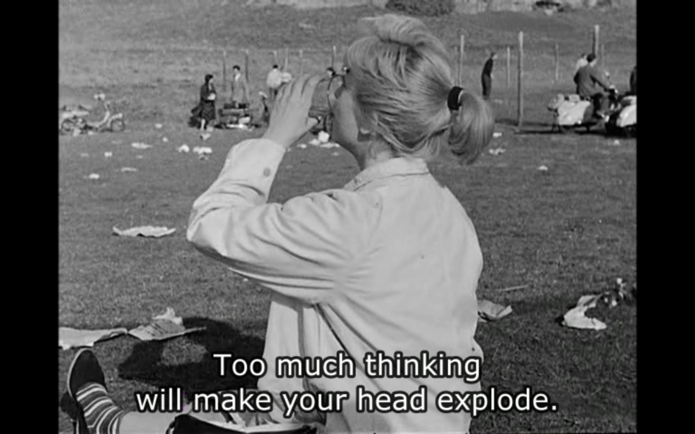
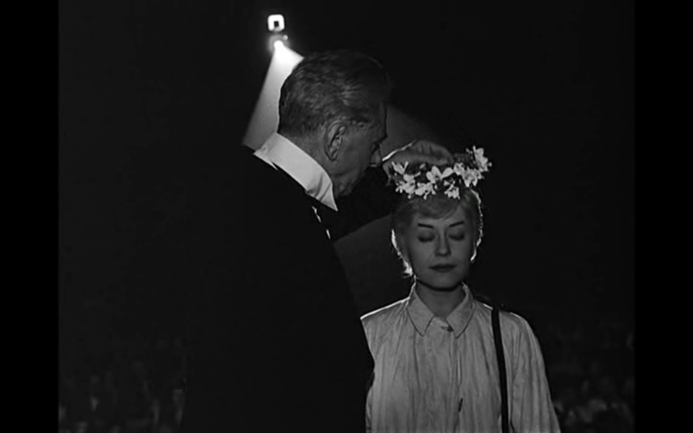
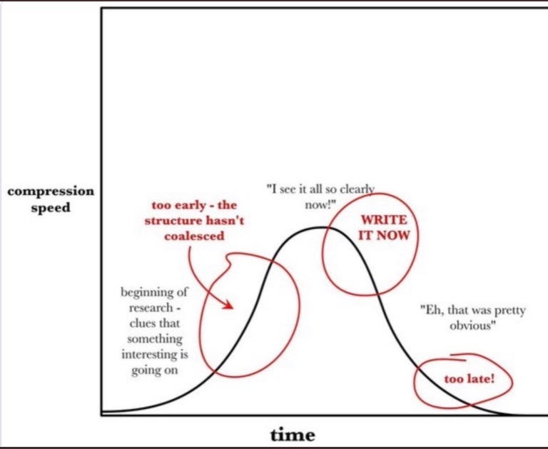
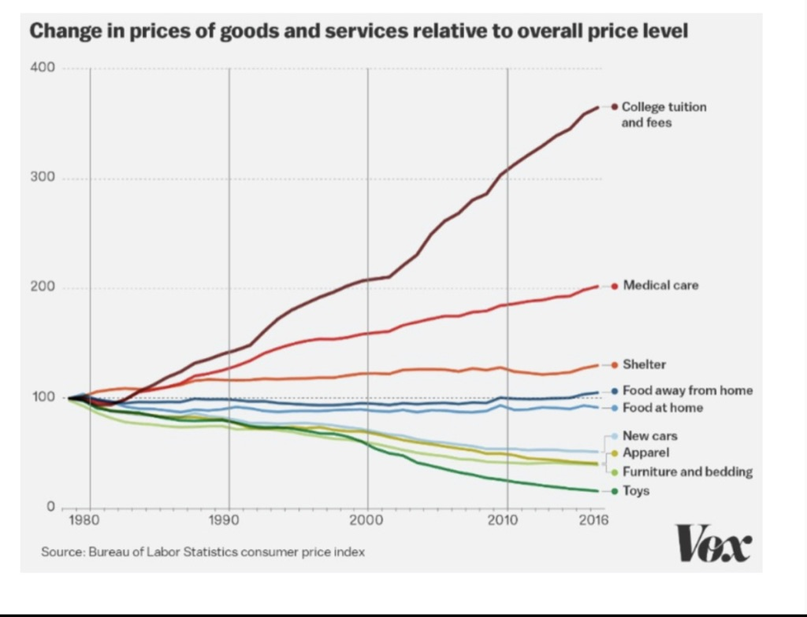
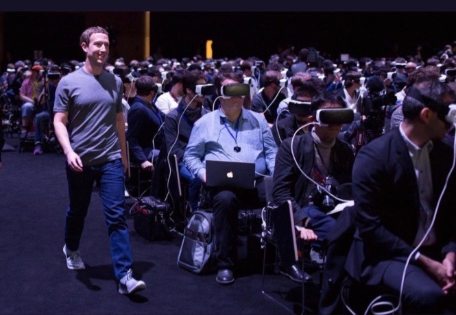

Hi everyone,

Hope you had a good Tuesday.

We’ve finally moved! Still assembling the new place, but it’s got good vibes already. This week has been crazy, so today’s newsletter is a bit shorter than normal, and more picture heavy.

++

Whenever awards seasons come around (the Tonys), it’s important as an artist to remember the destructive nature of jealousy. Art and creativity are abundant. More great art is a good thing for everyone. It doesn’t take away.

While seeing people get awards for their art (whether good or bad), it’s easy to compare yourself. It’s easy to feel inadequate, or that they don’t deserve it.

But awards are silly. Art is not a zero sum game. There are no winners and losers.

The following feelings are normal feelings for anyone that makes any kind of art as their “main” thing (even if it’s not their living):

1.  Inadequacy
    
2.  Shame
    
3.  Emptiness
    
4.  Feeling like you’ll never work again
    
5.  Impostor syndrome
    
6.  Anger
    
7.  Guilt
    
8.  Melancholy
    

The important thing is to not let the feelings eat us up. They are part of the game, but we don’t need to identify with them. Feeling emotions and experiencing moods is a sign we are functioning humans, functioning artists.

Celebrating others successes is good. But it’s not always easy.

---

## This Week’s Tidbits

#### [Rachel Chavkin’s acceptance speech](https://www.youtube.com/watch?list=PLZQfnFyelTBOQ15kmHSgEbdjzLMWzZpL7&v=VG4ZIuGpZ58)

Now, to the awards. Everyone’s been passing around Rachel Chavkin’s acceptance speech, and rightfully so. As Jeremy O’Harris [tweeted](https://twitter.com/jeremyoharris/status/1137889058875760641), she did the thing that so many allies say they will do and never do:

> I wish I wasn’t the only woman directing a musical on Broadway this season. There are so many women who are ready to go. There are so many artists of color who are ready to go. And we need to see that racial diversity and gender diversity reflected in our critical establishment too. **This is not a pipeline issue. It is a failure of imagination by a field whose job is to imagine the way the world could be**. So let’s do it.

---

#### [How to Write a Movie](http://scriptnotes.net/403-how-to-write-a-movie)

This great solo Scriptnotes podcast from co-host and Chernobyl creator Craig Mazin is a really dense masterclass on writing screenplays. I took [extensive notes](https://www.evernote.com/l/AQMlp1D5upBKsa_YpDD9XuUt7ikxzjCiUbk). As Mazin notes, this is really only scratching the surface, but there’s a lot to learn here. (And it’s not a formula, ie Save the Cat.) Especially liked his clear definition of theme, antithesis, thesis, and synthesis.

Also, if you’ve seen Chernobyl, you can read the screenplays for free (uploaded by Mazin) [here](https://johnaugust.com/library).

I love when creators are generous with their work and creative process like this.

---

#### Nights of Cabiria

 

---

#### Inspiration is perishable

 

---

#### [Roads or Buildings?](https://seths.blog/2019/06/roads-or-buildings/)

> **If you want to make a long-term impact, build the roads.**
> 
> Stewart Brand points out that if you compare two maps of downtown Boston–from 1860 and 1960, for example–virtually every single building has been replaced. Gone.
> 
> But the roads? They haven’t changed a bit. The curbs and boundaries and connections are largely as they were. With the exception of a Big Dig, a Robert Moses or an earthquake, the roads last forever.
> 
> That’s because systems built around communication, transportation and connection need near-unanimous approval to change. Buildings, on the other hand, begin to morph as soon as the owner or tenant decides they need to.
> 
> **When creating an organization, a technology or any kind of culture, the roads are worth far more than the buildings.**

\-[Seth Godin](https://seths.blog/2019/06/roads-or-buildings/)

---

#### Listen to people

https://twitter.com/RyanFMandelbaum/status/1134208441961058304

---

#### College tuition vs everything else

 

---

#### [The Go-For-It-Window](https://www.perell.com/blog/go-for-it-window)

Do the thing only you can do:

> You know you’ve found the Go-For-It Window when you’re simultaneously woke and confused; **when you’re shocked your idea doesn’t already exist**; when you know something nobody else does; and when it feels like others see the world in black and white, while you see the world with vibrant, technicolor glasses.

---

#### Facebook is eating the world

 

---

## End Note

 

_[“Moon Maiden” by Lisa Vanin](https://www.lisavanin.com/#/moon-maiden/)_

++

As usual, thanks for reading.

If you enjoyed this, you can share it with friends by forwarding this email, or [sending them here to sign up](https://guscuddy.substack.com/). I’d really appreciate it. (And a reminder that you can always read the Archive [here](https://guscuddy.substack.com/archive).)

You can reply directly to this email and I’ll get it, so feel free to do so about anything.

Have a great week!

\-Gus