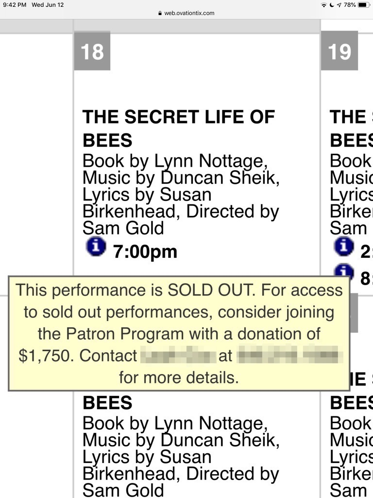
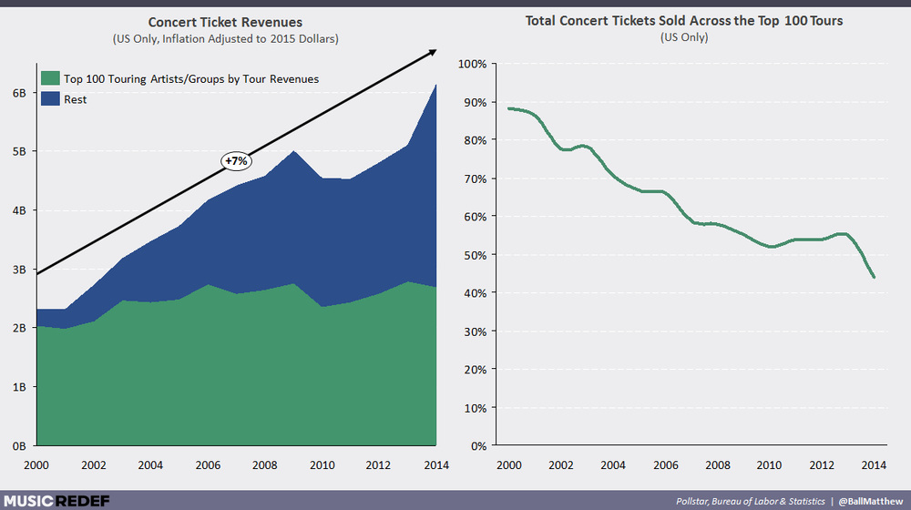

Hi everyone,

Happy Tuesday.

We spent the weekend just outside of Fort Lauderdale, Florida, where it was hot and humid and pouring rain all weekend! Even though the weather wasn’t great, it was still fun to get out of NYC, even if only to marvel at the disastrously horrid urban design of somewhere like [Hallandale Beach](https://www.google.com/search?q=hallandale+beach&safe=active&source=lnms&tbm=isch&sa=X&ved=0ahUKEwjEnfza3PTiAhVjneAKHX0BAmIQ_AUIEigD&biw=1280&bih=689) (egads, look at those hyper-dominant [horizontal lines](https://guscuddy.substack.com/p/the-curtain-41619)!).

++

#### **Art and the Unconscious**

There are some things in this world that cannot be explained. Deep, dark mysterious things. Things that stem from some ancient unwaking origin, drifting in the netherworld between sleep and somewhere else. Things that exist in the far reaches of the unconscious.

Our brains cannot quite understand these things. Consciousness is not enough. Instead, we repress our un-understandings and fears and traumas deep into the depths of our own unconscious.

Sometimes, we have to put down the burden of our consciousness. Rationality and logic can only get us so far.

This is why people turn toward things like religion and art.

We experience art not to connect with the literal-minded, rational side of ourselves, but to connect to something far deeper and more uncertain. Great art must come from the unconscious so that we, as an audience, can put down our fears and make the leap into that unknown.

Otherwise, we’re left wondering: what’s the point? Where’s the deeper mystery at play here?

---

## This Week's Tidbits

#### **Theatre Ticket Prices**

 

This is a major problem. [The most depressing thing about theatre today is excessive seat prices.](https://www.whatsonstage.com/edinburgh-theatre/news/peter-brook-the-prisoner-international-festival_47341.html)

Note that this is still a problem in places with subsidized theatre (though admittedly less of one). So what should the goal of subsidy be? To be able to take a young person who doesn't see theatre, show them the best work that there is, and do it for an incredibly accessible price.

This isn't an easy problem to solve. Theatre's inherent scarcity, in a city like New York, makes this partially a supply and demand issue. But it also runs deeper than that—for instance, why isn't there more touring work?—and it's theatre's biggest problem that's worth solving.

---

#### **[Reviving classics is like using a plug adapter](http://www.open.ac.uk/arts/research/pvcrs/2015/icke)**

> I keep giving this analogy to everyone of adaptation being like a plug adaptor. So you’re standing in a room and your hair’s wet, and you’re holding a hairdryer. You try and plug it in but it doesn’t work. You can try and hammer it in if you want but you’re still going to have wet hair. **You’re confident that the thing you’re holding in your hand, the old thing you’re holding, can dry your hair, if only you can get the energy present in the room into the old thing**. **That’s what it’s like with an old play sometimes**. You go, ‘I’m sure that the Oresteia, after I’ve spend some time with it, can work: **I have an impulse, an instinct, that it can dry my hair – it’s going to be really exciting, it’s going to do exactly what I want it to do, but I have to find a way of plugging it into the room I’m standing in, because if I don’t I’m just showing them this thing that once could dry hair and now doesn’t**.’ If I can find a way of reworking the way it connects with the room so that it comes alive, suddenly it feels like it felt in 458 BC again, one hopes.

\- Robert Icke

---

#### **Concert Attendance is going up**

 

Music is finding ways to redefine itself in the 21st century. Artists outside the Top 100 in music are making more money doing concerts than before. People don't just want to stay home and listen to their work for free on Spotify. They long for the real thing—a live experience. How can this translate to theatre? Hmm…

---

#### **[Aleshea Harris on New Play Development](https://www.theintervalny.com/interviews/2018/03/aleshea-harris-on-is-god-is/)**

> It can be tricky to get into a room with people you don’t know and have a reading and invite an audience to say whatever they want to say about your work. I, personally, don’t believe in that. **I think that the writer should choose her critical friends, and those should be the folks she listens to.** **I don’t think it’s always useful to just have this barrage of responses to a work.** I would say encourage and nurture the writer’s voice and her ideas about what it is that she needs, even if it’s, “I just need to do this,” and then walk out of the room and go away. My feedback can be your responses to it that aren’t a Q&A afterward.

\-Aleshea Harris

---

#### **[The Kilroys List 2019](https://thekilroys.org/)**

The Kilroys released their [annual list](https://thekilroys.org/) of highly recommended under-produced new plays by woman, trans, and non-binary playwrights. It's a tool to help topple the patriarchy, and I'd love to see more of these sorts of things. Lots of good reading on the list. I can personally recommend Lily Padilla's _How to Defend Yourself_, one of my favorite plays of the year.

---

#### **Break Rules**

http://twitter.com/unravelofstack/status/1138544604091887617

Reminds me of this Steve Jobs quote:

> Life can be much broader once you discover one simple fact: Everything around you that you call life was made up by people that were no smarter than you and you can change it, you can influence it, you can build your own things that other people can use.

---

#### [The Aesthetic Gentrification of Silicon Valley](https://www.theverge.com/2016/8/3/12325104/airbnb-aesthetic-global-minimalism-startup-gentrification)

Speaking of Steve Jobs...

> We could call this strange geography created by technology "AirSpace." It’s the realm of coffee shops, bars, startup offices, and co-live / work spaces that share the same hallmarks everywhere you go: a profusion of symbols of comfort and quality, at least to a certain connoisseurial mindset. Minimalist furniture. Craft beer and avocado toast. Reclaimed wood. Industrial lighting. Cortados. Fast internet. The homogeneity of these spaces means that traveling between them is frictionless, a value that Silicon Valley prizes and cultural influencers like Schwarzmann take advantage of. Changing places can be as painless as reloading a website. You might not even realize you’re not where you started.

[Great piece](https://www.theverge.com/2016/8/3/12325104/airbnb-aesthetic-global-minimalism-startup-gentrification) from Kyle Chayka.

---

#### **[Advice is useless](https://thepointmag.com/2019/examined-life/against-advice-agnes-callard)**

> The moral of every great person’s story seems to be that they were not trying to retell another’s. Indeed, one of the paradoxes of advice seems to be that those most likely to be asked for it are least likely to have taken anyone else’s: their projects of “becoming” are the most particularized of all.

\-Agnes Callard

---

## End

 

_photo by [Etsuro Takihara](https://500px.com/photo/104270659/poppy-field-twilight-by-etsuro-takihara)_

++

Thanks for reading, friends.

If you enjoyed this, you can share it with friends by forwarding this email, or [sending them here to sign up](https://guscuddy.substack.com/). I’d really appreciate it. (And a reminder that you can always read the Archive [here](https://guscuddy.substack.com/archive).)

You can reply directly to this email and I’ll get it, so feel free to do so about anything.

Have a great week!

\-Gus