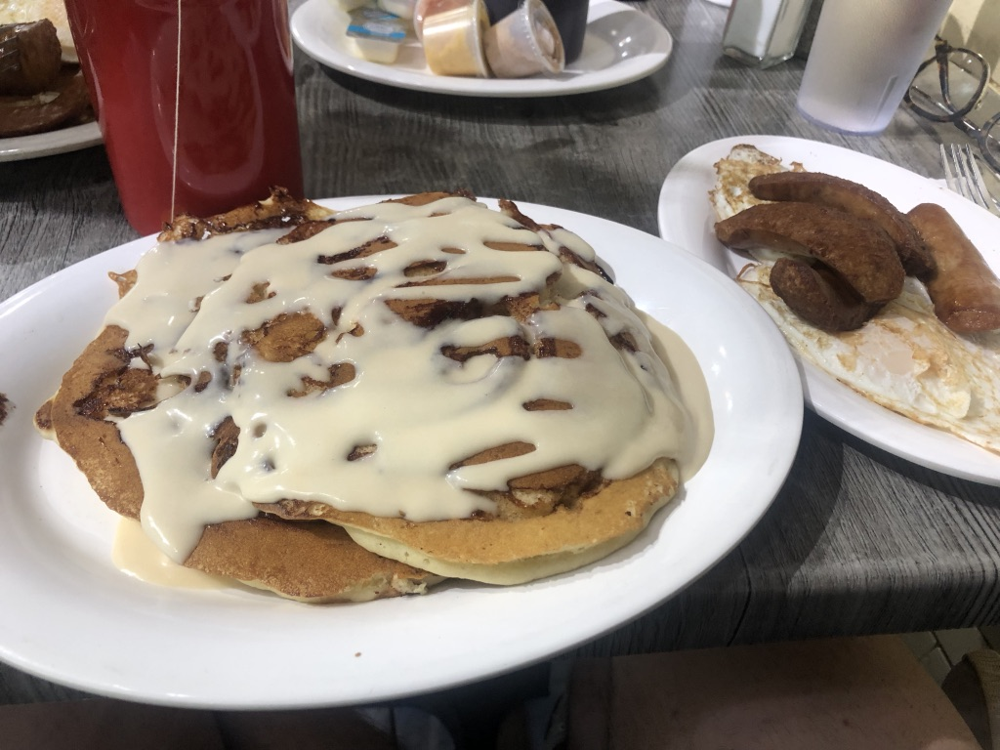
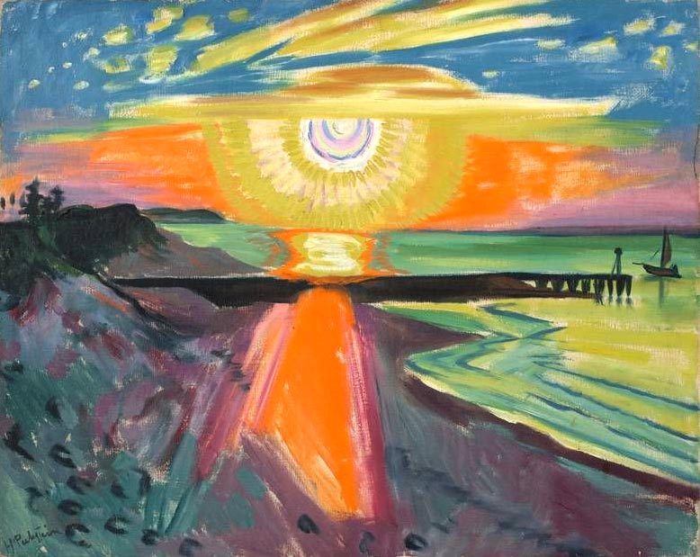

Hi everyone,

Hope you're having a good week!

It's officially summer. I think summers are the best, but each year I also forget about the suffocating humidity of New York summers. They are brutal and I think I've sweat more just waiting on the Subway platform in the last week than I did in the past few months combined. Anyway, the best summer movie is _Do the Right Thing_, and I'm not interested in hearing any other takes! 

++

## **New Things**

I published last week's comments about "[Art and the Unconscious](https://www.guscuddy.com/2019/06/25/art-and-unconscious.html)" on my website.

You can't always take the analytical position. Sometimes you have to lay down the burden of consciousness.

_[You can read the full short essay here.](https://www.guscuddy.com/2019/06/25/art-and-unconscious.html)_

---

## **This week's nuggets**

#### **[The future of theatre criticism?](https://www.kickstarter.com/projects/janejung/3views-on-theater)**

I'm pretty excited about [3Views on Theater](https://www.kickstarter.com/projects/janejung/3views-on-theater), the new online journal starting this fall led by [The Lillys](https://the-lillys.org/). If there's one thing I've come to realize even through writing this newsletter it's that theatre -- and the arts in general -- [need more people writing and talking about them](https://www.vulture.com/2018/12/i-make-plays-i-write-criticism-im-not-my-own-enemy.html). [Theatre needs more critics](https://www.whatshouldwedo.com/blog/jeremy-o-harris/). More critics focused on rigor, deep thinking, and illumination. More women critics, [more critics of color](https://www.larktheatre.org/blog/problem-white-critics-critiquing-work-artists-color/). If it wants to step beyond the decision-making power that the New York Times currently holds, it needs some real force behind encouraging writing about theatre. 3Views does seem to be a promising start. I think we can also do more. [Here's an interview in American Theatre about it.](https://www.americantheatre.org/2019/06/03/can-3views-change-theatre-criticism/)

---

#### **[The Unsolved Mystery of Peter Bergmann](https://www.irishtimes.com/life-and-style/people/the-unsolved-mystery-of-peter-bergmann-1.3923308)**

Speaking of [deep, mysterious things that cannot be explained](https://www.guscuddy.com/2019/06/25/art-and-unconscious.html), here's a weird and wild mystery in Sligo, Ireland -- the small town where we lived for a year in 2003 -- about a man who called himself Peter Bergmann who checked into a hotel, emptied a mysterious plastic bag thirteen times, then appeared dead on a beach five days later. Wonderful read. Life is strange.

---

#### **[Lin-Manuel Miranda and Conan O'Brien](https://overcast.fm/+O5Dth9Bxo)**

I liked Conan interviewing Lin on his podcast. They go pretty in-depth on talking about the creative process, and have an especially great discussion about lyrics and rhyming. Recommended.

---

#### **The wonder of consciousness**

The opening paragraph of _Anam Cara_, by John O'Donohue:

> **It is strange to be here. The mystery never leaves you alone**. **Behind your image, below your words, above your thoughts, the silence of another world waits**. A world lives within you. No one else can bring you news of this inner world. **Through the opening of the mouth, we bring out sounds from the mountain beneath the soul**. These sounds are words. The world is full of words. There are so many talking all the time, loudly, quietly, in rooms, on streets, on television, on radio, in the paper, in books. The noise of words keeps what we call the world there for us. We take each other’s sounds and make patterns, predictions, benedictions, and blasphemies. Each day, our tribe of language holds what we call the world together. **Yet the uttering of the word reveals how each of us relentlessly creates. Everyone is an artist**. Each person brings sound out of silence and coaxes the invisible to become visible.

---

#### **[In Defense of Villainesses](https://www.tor.com/2016/08/09/in-defense-of-villainesses/)**

A great article on the issues with how animation (well, Disney) depicts female villains. Pop culture infects our consciousness.

> Why is it that female cartoon villains get to be all of these things, to have all of these things? **Why do they get to have hairstyles—no, Hairstyles, with a capital Hair—while their protagonist counterparts are drawn small and soft and childlike? Why does Ursula get to have a beauty mark and the most impeccably waterproof makeup a sea witch could hope for, while Ariel gets the same wide-eyed small-jawed face as every other white Disney princess?** Why does Maleficent get a headpiece that defines menacing elegance and dark grandeur, while Aurora gets generic late-fifties bangs? Why does Shego get to mouth off to Drakken and read magazines by the pool and decide what is and isn’t her job, while Kim Possible has to leap into action regardless of whether she’s tired or sad or sick or, heaven forbid, too busy?

---

#### **[‘The Compatibility of Opposites’: A Portrait of Lebanon](https://www.nybooks.com/daily/2019/06/19/the-compatibility-of-opposites-a-portrait-of-lebanon/)**

> **Lebanon is both the center of the world and a dead end**. The broken little village of a planet that is sick. **Chaotic, polluted, and corrupt beyond belief, this is a country where beauty and human warmth constantly find ways to break through. It is impossible to name that feeling of being assaulted and charmed at the same time**. You are in the city center, you stroll down a sidewalk eighteen inches wide, assailed from all sides by the confusion of buildings and traffic, torn between the appeal of the sea and the stench of garbage, and suddenly your gaze is soothed by the play of light on a stone wall, by bougainvilleas cascading from an ancient balcony, by the balcony itself.

A piece by Dominique Eddé.

---

#### **Pancake of the week**

 

The Cinnamon Bun pancakes at Tom's Restaurant in Brooklyn. Oof.

---

#### **Dog of the week**

 

---

## **End**

 

_Max Pechstein,_ _Sonnenuntergeng an der see, 1921_ (via [The Paris Review](https://www.theparisreview.org/blog/2019/06/21/summer-is-made-of-the-memory-of-summer/))

++

Thanks for reading, friends.

If you enjoyed this, you can share it with friends by forwarding this email, or [sending them here to sign up](https://guscuddy.substack.com/). I’d really appreciate it. (And a reminder that you can always read the Archive [here](https://guscuddy.substack.com/archive).)

You can reply directly to this email and I’ll get it, so feel free to do so about anything.

Have a great week!

\-Gus