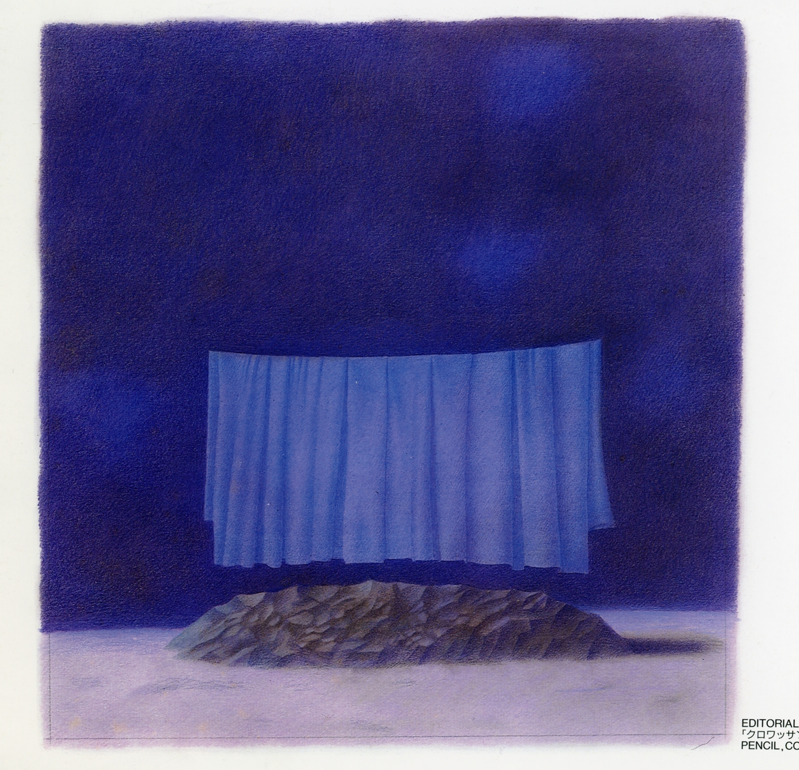

Hey everyone,

Happy Tuesday. Hope the heat and humidity is treating you well, if you’re in a summer situation where that’s the thing.

I spent the majority of Sunday refreshing Twitter as the Brooklyn Nets acquired both Kyrie Irving and Kevin Durant. Somehow, the team [with the worst attendance in the league in 2019](http://www.espn.com/nba/attendance) managed to “win” free agency, seemingly replacing the New York Knicks (James Dolan: [sell the team](https://twitter.com/ringernba/status/1145440986425729024?ref_src=twsrc%5Etfw)). I don't have any original insight about that really, except that sports are fun, and [Sean Marks](https://en.wikipedia.org/wiki/Sean_Marks) is a genius.

++

Lots of links and things to share this week. I’ll be back with some new writing of my own next week.

---

## **What I learned this week**

#### **[Tonya Pinkins interviews Jeremy O’Harris on the theatrical moment, white supremacy, and sexual politics](https://www.americantheatre.org/2019/07/01/slave-play-racism-doesnt-have-a-safe-word/%0A)**

How much should you know about a play before seeing it?

> I didn’t want anyone to know anything about it. I feel as though I’ve been asked to enter into a lot of experiences and have been told too much about them, you know? I **feel like we live in a time that robs theatre of its chance to actually do that thing that happens at a party where someone says something that changes the energy in the room immediately, right?** If everyone already knew that I was going to say that to the person I said it to in that moment, it wouldn’t have landed the same way, because everyone would have been prepared. And I think that **not having preparation is a good thing for the theatrical moment**. These new demands we have on the way we talk about a play before we see it, where people are like, “I should have known that before I saw it,” are really complicated for me, because that robs me personally of the thing I like most in theatre, which is why I don’t tend to read reviews until I see a play.

[Tonya Pinkins and Jeremy O'Harris have an honest, brilliant conversation about theatre, race, sexuality, politics, white supremacy, and humor](https://www.americantheatre.org/2019/07/01/slave-play-racism-doesnt-have-a-safe-word/%0A). There's so much more packed in this interview. Highly recommended.

---

#### **[Slavery and our mythologies](https://www.nybooks.com/daily/2019/06/11/the-lehman-trilogy-and-wall-streets-debt-to-slavery/)**

[Great piece](https://www.nybooks.com/daily/2019/06/11/the-lehman-trilogy-and-wall-streets-debt-to-slavery/) in _The New York Review of Books_ on the major issues with _The Lehman Trilogy_ (and also _Hamilton_), but more importantly on the concerning trend of disavowing that slavery has anything to do with the story being told (it does):

> **If** _**The Lehman Trilogy**_ **holds up a mirror to our moment, it is by registering slavery in a peripheral glance only to look away**. Early in the play, Emanuel tells Henry, “I don’t want to sell buckets and spades to slaves.” Henry responds: “We sell to whoever will buy. Here in America, everything changes.” As an instance of the disavowal so often at work in popular accounts of slavery’s influence on modern America, this exchange is staggering. Slaves did not buy and sell; they were bought and sold. **In endorsing the great American myth of transformation, the play implies that capitalism itself is emancipatory, that it might magically transform chattel into customers—and just as magically transform a dubious refusal to talk about slaves into a virtuous refusal to sell to slaves**. The play thus succumbs to the abstraction it deplores, evading the material conditions that produced wealth to focus on capitalism as a transcendent promise of freedom and empowerment, endorsing the logic of a consumerist political economy.

> While scholars painstakingly examine the interconnections of slavery and capitalism, showing the complex traffic between Northern industrial and Southern cotton economies **too many of our popular accounts still view slavery as the South’s “peculiar institution” and treat it as a discrete, if horrifying, historical anomaly**. **This is how disavowal manages cognitive dissonance: it means conceding the existence of slavery, while refusing to believe that it has anything to do with the story you are telling; it means willfully pushing slavery to the edges of your consciousness and being saved by the logic of exception**.

---

#### **Boredom is your bullshit detector**

Boredom is a sign you're alive. It simply means your bullshit detector is functioning properly. Boredom in theatre is deadly. Life is too short to be bored at the theatre.

> **The greatest guiding principle I know of in my work, one to which I always pay the most attention, is boredom**. In the theatre, boredom, like the slyest of devils, can appear at any moment. The slightest thing and he jumps on you, he's waiting and he's voracious. He is always ready to slip invisibly into an action, a gesture or a sentence. Once one knows this, **all one needs is to trust one's own built-in capacity to be bored and use this as a reference, knowing that it is what one has in common with all the beings on Earth**. It's extraordinary; if during a rehearsal or an exercise I say to myself, IfI'm bored, there must be a reason for it,' then, out of desperation, I have to look for the reason. So I give myself a jolt and out comes a new idea-which jolts the other person, who jolts me back. **As soon as boredom appears, it is like a flashing red light**.

> Of course, each person has a different boredom quotient. What one must develop in oneself has nothing to do with restlessness or a poor attention span. **The boredom I am speaking about is the sense of no longer being held riveted in the unfolding action**.

From _[There Are No Secrets](https://www.bloomsbury.com/uk/there-are-no-secrets-9780413694904/)_ by Peter Brook.

---

#### **[How Phoebe Waller-Bridge writes](https://www.kcrw.com/culture/shows/the-treatment/phoebe-waller-bridge-fleabag)**

I loved [Phoebe Waller-Bridge (Fleabag) on Elvis Mitchell's](https://www.kcrw.com/culture/shows/the-treatment/phoebe-waller-bridge-fleabag) _[The Treatment](https://www.kcrw.com/culture/shows/the-treatment/phoebe-waller-bridge-fleabag)._ I highly recommend the whole interview.

Waller-Bridge discusses specificity in her writing process, giving characters weird tics, giving actors challenges, making your characters make a choice, and writing to music. My favorite part, though, was when she talked about objectives and super objectives -- terms from Stanislavski that I really hate (an objective is for a scene, a super objective is for life). How many people have super objectives in real life? Instead, Waller-Bridge says, ask: _what's the worst thing that could happen to this character_? _What's the worst thing that could happen today? What's the worst thing that could happen in their life?_ That's how you  get to something along the lines of a super objective, in a much more natural, realistic way.

---

#### **[Walking and thinking and writing](https://lithub.com/robert-macfarlane-i-wanted-the-reader-to-undertake-a-descent-into-the-darkness/)**

Really enjoyed writer Robert MacFarlane's [interview on Paul Holdengraber's podcast](https://lithub.com/robert-macfarlane-i-wanted-the-reader-to-undertake-a-descent-into-the-darkness/). My favorite bit was when they talked about the power of walking, and its importance to the creative process.

---

#### **[On thinking, with a clock](http://revisionisthistory.com/episodes/31-puzzle-rush)**

Malcolm Gladwell's [season four premiere](http://revisionisthistory.com/episodes/31-puzzle-rush) of his podcast _Revisionist History_ was really lovely. Gladwell explores the LSAT (and attempts to take it), and why the legal world (and standardized tests in general) have clocks on them. Shouldn't the goal be rigorous, in-depth thinking -- not speedy and sloppy memorization? Then he dives into talking to Hikaru Nakamura, one of the best chess players in the world, on chess and clocks -- and why different players are the best in the world at the different speeds chess can be played at.

These tests are a function of the pre-internet world, when memorization and information was scarce. Now, information is abundant and what is scarce is [deep, slow thinking](https://sivers.org/slow).

---

#### **[Jeremy O’Harris interviews Kevin Abstract about being a queer artist](https://www.gq.com/story/kevin-abstract-brockhampton-interview)**

A weird and moving conversation between Brockhampton’s Kevin Abstract and theatre celebrity/_the curtain_ favorite Jeremy O'Harris on loneliness, empathy, sharing your trauma, and impostor syndrome. Recommended.

> **I became friends with one of my idols and heroes recently, Shia LaBeouf**. Every Friday at my house, we do this thing called **Friday therapy**. I **invite a bunch of artists from L.A., and we sit in my kitchen**. It could be 40 people. **One by one, we go in a circle and say what our week looked like. It's taught me a lot.**

> **Kevin**: People call it **impostor syndrome** or whatever, but I feel like **all artists have that in a way**. I don't fucking know. I don't know what it is. This feeling I have, just lean into it and that'll become the work. **Lean into that insecure space and being unsure**. **There is magic in that**. If you do the same thing for 10 hours straight, you'll catch the magic. If I can't come up with a chorus immediately, I'll sit in front of the microphone for 30 minutes, an hour, until something comes. I'll force it. Through that frustration, you catch some magic, even if it's a tiny thing that doesn't make sense in that moment, maybe hours later you figure out how to put it into your work.
> 
> **Jeremy**: I get that. I'm constantly wrestling impostor syndrome. **The only thing I can do to stop impostor syndrome is by giving myself insane deadlines and being like, "This play has to come out next season, because I just told someone it would be done."**

_(Thanks_ [Ian Edlund](https://twitter.com/ianedlund) for the rec!)

---

## End Note

 

_Artwork by [Tsunemasa Takahashi](https://www.behance.net/tsunet)._

//

Thanks for reading, friends!

If you enjoyed this, you can share it with friends by forwarding this email, or [sending them here to sign up](https://guscuddy.substack.com/). I’d really appreciate it. (And a reminder that you can always read the Archive [here](https://guscuddy.substack.com/archive).)

You can reply directly to this email and I’ll get it, so feel free to do so about anything.

Hope everyone has a fun holiday weekend!

\-Gus