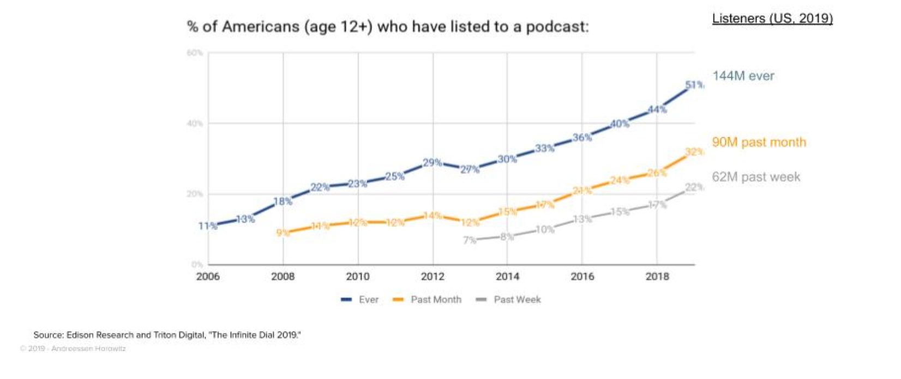
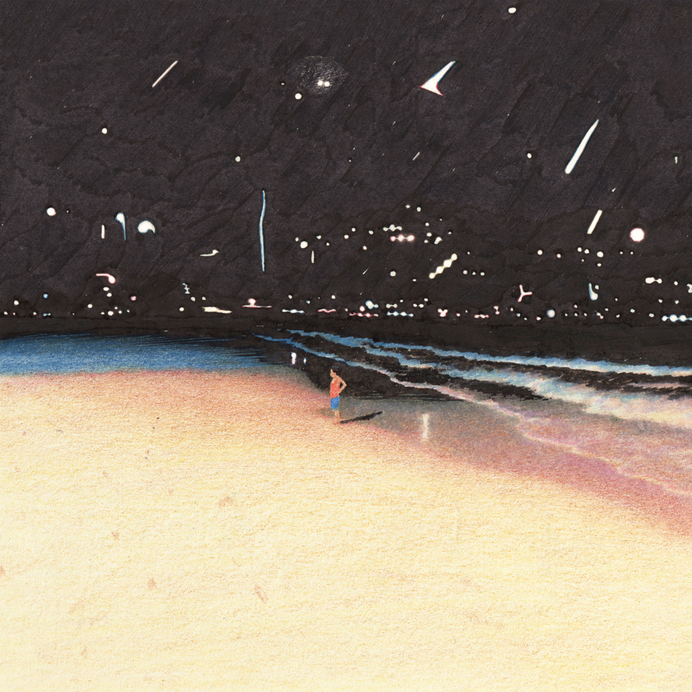

Hi everyone,

Hope your week has been off to a great start.

We just got back into NYC today after heading up to Keuka lake for the past week. There's something about being on, in, and around water that is truly cleansing and rejuvenating. It's one thing that's hard to find in the confines of the city.

++

A friend recently asked me about what sort of attitudes you need to have for being an actor. I thought about that for a while. I think the answers are true across all creative forms.

First, on the career side, you need to be able to deal with rejection and uncertainty. There’s no way around that.

On the "art" side, you need to be able to connect with your inner childlike sense of wonder, be like a kid in a sandbox. You need to switch off the oppressive, conscious brain for a little while, begin to merge the conscious and subconscious. Acting—as with all great art—is irrational, and so it can’t really be thought about: it must be performed from the unconscious. When your conscious, rational brain turns on it starts to plan things out, which is deadly. Then, it begins to make you judge yourself in the moment, and start to consider what everyone who's watching you is thinking. Finally, and worst of all, it realizes the ultimate irrationality of the art, shouting: _what the hell are you doing? Why are you up on stage in front of all of these people making a fool of yourself?_ _Why can’t you just be like a normal person?_

So you need to connect to something more important than all that. But most importantly, you need to relax and _just be there_. Which is easier said than done. Because you don't need any sort of personality or attitude for acting: the personality we are all craving is _you_. You, as a human being, in all your complexity. We are searching for authenticity above all else, especially in an age that pits corporations as people. We are looking to connect with real human beings, not facsimiles of the actual thing.

---

## This week’s tidbits

#### **Eco Conscious Theatre**

I saw a production this weekend that advertised itself as being environmentally conscious, using only recycled props and set pieces. This is a great and interesting trend that I hope theaters will take more seriously.

Theaters produce an incredible amount of waste, for being supposedly conscious to the realities of climate change. I'd like to see more theaters think carefully about the materials they use for making theatre, and other changes they can make to be leaders in this space (such as electricity, lighting, heating, and not using playbills). Theatre’s inherent ephemerality and often expensive and wasteful budgets aren’t really a good look in a generation with an eye towards total sustainability.

_[(Relevant American Theatre piece)](https://www.americantheatre.org/2018/10/23/make-theatre-not-waste/)_

---

#### **[Elena Ferrante on ellipses and writing](https://www.theguardian.com/lifeandstyle/2018/jun/30/elena-ferrante-dialogue-imposes-an-ellipsis)**

I've been finally reading Elena Ferrante's brilliant Neapolitan novels (on book two now), and I binge read her weekly columns in the Guardian. I really liked [her explanation for why she no longer uses ellipses](https://www.theguardian.com/lifeandstyle/2018/jun/30/elena-ferrante-dialogue-imposes-an-ellipsis):

> I stopped using them definitively when, as a result of personal experience, I became convinced that **no discourse, once begun, should ever be suspended**. I’m talking about oral communication: **if you take on the responsibility of starting a sentence, you should bring it to an end** – even if you’re being shouted at, even if you’re being insulted, and you regret that you started to speak, and you flounder, lose confidence, the words no longer come to you.
> 
> An old inclination for the fade-out has changed over the years into an aversion to prevaricating, to the secretive signal. If you have to speak, then speak, I say to myself, and get to the end. **Even when dialogue imposes an ellipsis** – in novels, they get out of hand – **I do everything to avoid it**. If I can’t, **I prefer to reduce them from three to one, an abrupt interruption** – so instead of “I’d like to see you again but…” I prefer “I’d like to see you again but.” **You have to pay the price in a cut-off sentence, note its ugliness, and rectify it by learning to get, at least when it comes to words, to the point.**

It's an example of an artist taking seriously this idea that form matters. Structure matters. It's all political. Even down to the way you use punctuation.

---

#### [Why you shouldn’t necessarily just let people enjoy things](https://thebaffler.com/kate-takes/dont-let-people-enjoy-things-wagner)

[A great defense of criticism](https://thebaffler.com/kate-takes/dont-let-people-enjoy-things-wagner) in response to the condescending meme of "Let People Enjoy Things", frequently summoned when people criticize Disney movies:

> The subtext LPET image is a fourfold confession: 1) “I do not want to feel judged for my consumption choices”; 2) “I want to silence people who disagree with me about this particular piece of media by making them feel like they are cheerless or judgmental”; 3) “I recognize an aspect of this piece of media that is worthy of criticism, and I am defensive of this;” and (4) “I do not want to think critically about the things I consume, and if I absorb any criticism about the things I consume it will magically ruin my enjoyment of them.”

---

#### **Podcasts are growing very, very fast**

 

There continues to be huge unexplored territory here for theaters. I'm not sure what it exactly looks like, but I think experimentation in this space could be a major positive for the future of theatre.

---

## **End Note**

 

_artwork by [Kyutae Lee](https://www.behance.net/gallery/48917131/drawing)._

_++_

Thanks for reading, friends! Hello to any new readers.

As usual, if you enjoyed this, you can share it with friends by forwarding this email, or [sending them here to sign up](https://guscuddy.substack.com/). I’d really appreciate it. (And a reminder that you can always read the Archive [here](https://guscuddy.substack.com/archive).)

You can reply directly to this email and I’ll get it, so feel free to do so about anything.

Hope you have a great week.

\-Gus