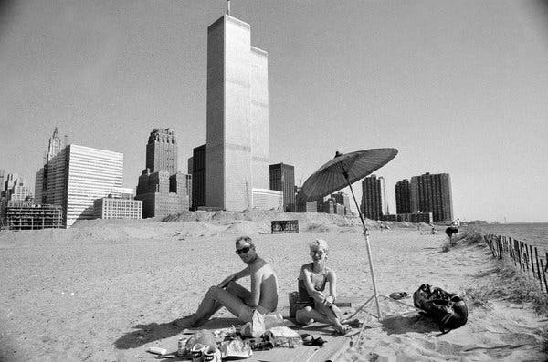
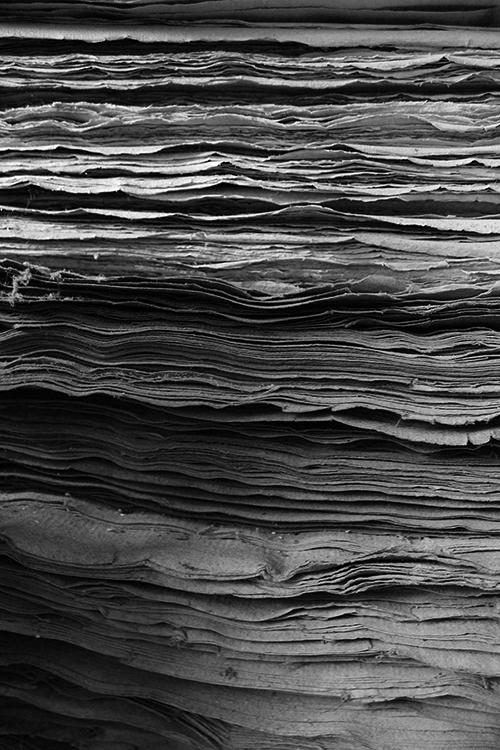

Hey all,

Hope you're having a great Tuesday.

++

It's been a bit of a crazy weekend.

First, it's too damn hot in New York! This weekend's temperatures reached heat-emergency-temperatures, with a heat index of over 100. At the tail end of this emergency, Con Ed had another power outage (its second in the last week and a half!) that affected 33,000 people in Brooklyn. We were not among those affected, but it has a feel of: how the hell is this city going to run at all in the future? It's not going to get any easier...

https://twitter.com/CarterBays/status/1152648650725756928

After a medical scare (that ended up being very OK, don't worry!) we spent all of Friday night slash Saturday morning in the SUNY Downstate ER. It was a sad reminder of many of the problems with our health system (it took many hours to be seen at all).

We ended up staying up for the sunrise—not via our own will—something I haven't done in a long, long time. The dawn was a nascent crimson-turning-blue. It made me feel strangely emotional and almost nostalgic, but I'm not sure for what, exactly. Then, getting on the uptown B44, I felt a sense of deep wonder at the city we live in: not quite a positive feeling, not quite negative, but drifting in between. I looked around at everyone on the crowded bus. It was hard to tell who was up late, who was up early. Belonging in the late crowd made me feel like we were wandering on some strange plane of existence, before finally going to bed.

With that lack of sleep and also this heat, I've been daydreaming a lot about water, about seeking refuge in its coolness. Thinking about the feeling of jumping into water off rocks and short bridges, the feeling of fingers in wet sand, and feet in shallow water. New York summers have a way of making you crave vacation. 

Speaking of which, did you know [there used to be a beach in downtown, later replaced by Battery Park City](https://www.nytimes.com/2019/06/17/nyregion/battery-park-city-beach.html)?

 

++

Last week's collection of links were fairly theatre-focused. This week it's a bit more esoteric and wide-ranging, circling around similar themes that always interest me (art, time, creativity, capitalism and society, nature).

---

## **Notes from the Week**

#### **[heidi schreck](https://podcasts.apple.com/us/podcast/heidi-schreck-7-23-19/id814550071?i=1000445112818)**

[Wonderful conversation with actor/writer Heidi Schreck](https://podcasts.apple.com/us/podcast/heidi-schreck-7-23-19/id814550071?i=1000445112818) (_What the Constitution Means to Me_) on [Brian Koppelman's podcast](https://podcasts.apple.com/us/podcast/the-moment-with-brian-koppelman/id814550071).

It's really interesting to how she balanced and continues to balance acting and writing, theatre and television. She's had her foot in many worlds, which is really interesting -- in downtown theatre and in mainstream television.

I was surprised to hear that many people, including friends, discouraged her from taking _What the Constitution Means to Me_ to Broadway when she did, thinking that there were too many plays crammed into the season, and that an essentially one-woman show on Broadway would have trouble selling. It's exciting to see that completely proven wrong.

I wrote about Heidi last week, after _What the Constitution Means to Me_ was one of the few Broadway shows that recouped its money.

---

#### **[how to do nothing](https://medium.com/@the_jennitaur/how-to-do-nothing-57e100f59bbb)**

Jenny Odell gave a keynote in 2017 that inspired her new book of the same title, about gardens, birds, and resisting the attention economy. [The full text is available on Medium](https://medium.com/@the_jennitaur/how-to-do-nothing-57e100f59bbb). It's a really lovely read and an antidote to feeling like all of our time has been commoditized:

> **What is missing from that surreal and terrifying torrent of information and virtuality is any regard, any place, for the human animal, situated as she is in time and in a physical environment with other human and nonhuman entities**. It turns out that **groundedness requires actual groundedness**, in the ground.
> 
> …
> 
> There are certain people who would like to use technology to escape their own mortality. Ironically, this desire is a perfect illustration of the death drive from the Maintenance Manifesto (“separation, individuality, Avant-Garde par excellence; to follow one’s own path — do your own thing; dynamic change”). To such people I propose that a **far more parsimonious way to live forever is to exit the trajectory of productive time, so that a single moment might open almost to infinity**. As John Muir once said, “Longest is the life that contains the largest amount of time-effacing enjoyment.”

---

#### **[the sweetgreen-ification of society](https://themargins.substack.com/p/the-sweetgreen-ification-of-society%0A)**

Along that same theme, everything is being consumed by startups. They all use the same words, even if they're just selling salads: "passion", "purpose", "community".

> **We are losing the spaces we share across socioeconomic strata**. Slowly, but surely, we are building the means for an everyday urbanite to exist solely in their physical and digital class lanes. It used to be the rich, and then everyone else. **Now in every realm of daily consumer life, we are able to efficiently separate ourselves into a publicly visible delineation of who belongs where**.

(My favorite example of conscious-capitalism-advertising gone wrong, though, is still [this Subway commercial](https://twitter.com/rysimmons/status/1144283018825277440?ref_src=twsrc%5Etfw%7Ctwcamp%5Etweetembed%7Ctwterm%5E1144283018825277440&ref_url=https%3A%2F%2Ftwitter.com%2Frysimmons%2Fstatus%2F1144283018825277440)...)

---

#### **[on plants versus decoration](https://thebaffler.com/kate-takes/plant-parenthood-wagner)**

Houseplant sales in the US have grown almost 50% over the past three years, to $1.7 billion. Why? 

> Turns out those bespoke macramé hangers and fiddle-leaf figs are big business now, and a general rule of capitalism throughout history is: **what’s good for business is usually bad for living things.**
> 
> This brings us to a broader issue I have with houseplant culture: **plants are not furniture; they are living things**. **The concept of “decorating with plants” to me sounds about as stupid as “decorating with cats**.” Plants, such as ferns, that need more intensive care than, say, “leaving them in the window and watering them once a month,” are frequently called “fickle” or “hard”— exhibiting the palpable disdain plant culture bloggers have for plants that don’t behave properly when faced with neglect. **Keeping a plant alive is frequently seen as an inconvenience, an encumbrance in advance of a self-affirming Instagram post**. At the same time, plenty of lip service is paid to theories about why millennials like houseplants, including the idea that they are somehow a way of coping with delayed parenthood. The answer is never simply because houseplants are fucking awesome.

---

#### **[the memory of ice](https://www.the-tls.co.uk/articles/public/the-blue-of-time/)**

A wonderful bit of nature writing from Robert Macfarlane (he had [a great interview](https://lithub.com/robert-macfarlane-i-wanted-the-reader-to-undertake-a-descent-into-the-darkness/) with Paul Holdengraber a few weeks ago), on the memory of ice, the color blue, and the nature of landscapes:

> \[Ice\] **remembers and it tells – tells us that we live on a fickle planet, capable of swift shifts and rapid reversals**
> 
> **Ice has a memory and the colour of this memory is blue**.
> 
> The blue of time is **glimpsed in the depths of crevasses**. The blue of time is glimpsed at the calving faces of glaciers, where bergs of 100,000-year-old ice surge to the surface of fjords from far below the water level. The blue of time is so beautiful that it pulls body and mind towards it.

---

#### **the relationship of time and creativity**

Some notes:

John Cleese has [five factors for creativity](https://www.brainpickings.org/2012/04/12/john-cleese-on-creativity-1991/):

1.  Space
    
2.  **Time**
    
3.  **Time**
    
4.  Confidence
    
5.  Humor
    

David Lynch says: “**If you want to get** **one hour of good painting in, you have to have four hours of uninterrupted time.”**

But a good reminder: [you never actually have time, only intentions](http://www.raptitude.com/2017/05/you-never-have-time-only-intentions/). We never will own time:

> You may have noticed **almost nobody has enough time**. Somehow, even after decades of life experience, we cannot seem to corral all of our responsibilities within the amount of time we have. It should be simple math, but it never works out.

---

## **End Note**

 

_art by [Lyubov Fonareva](https://www.behance.net/gallery/52481521/Paper?tracking_source=for_you_recommendations)_

++

Thank you for reading! If you’re a new reader, welcome. I send this out every Tuesday. You can read the [full Archive here](https://guscuddy.substack.com/archive).

If you enjoyed this, you can share it with friends by forwarding this email, or [sending them here to sign up](https://guscuddy.substack.com/).

If you don’t already, follow me on [Twitter](http://twitter.com/guscuddy) and [Instagram](http://instagram.com/guscuddy) for more.

And you can reply directly to this email and I’ll get it, so feel free to do so about anything.

Hope you have a great week!

\-Gus