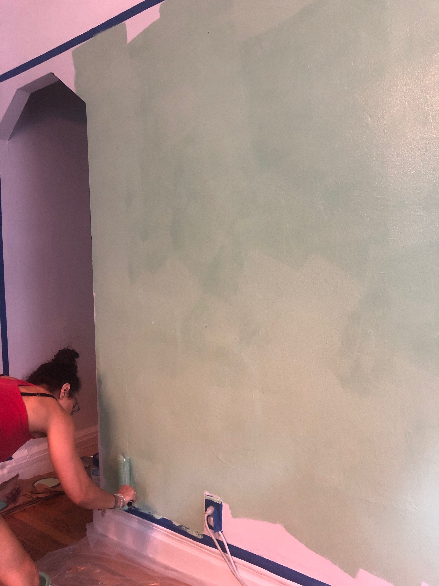
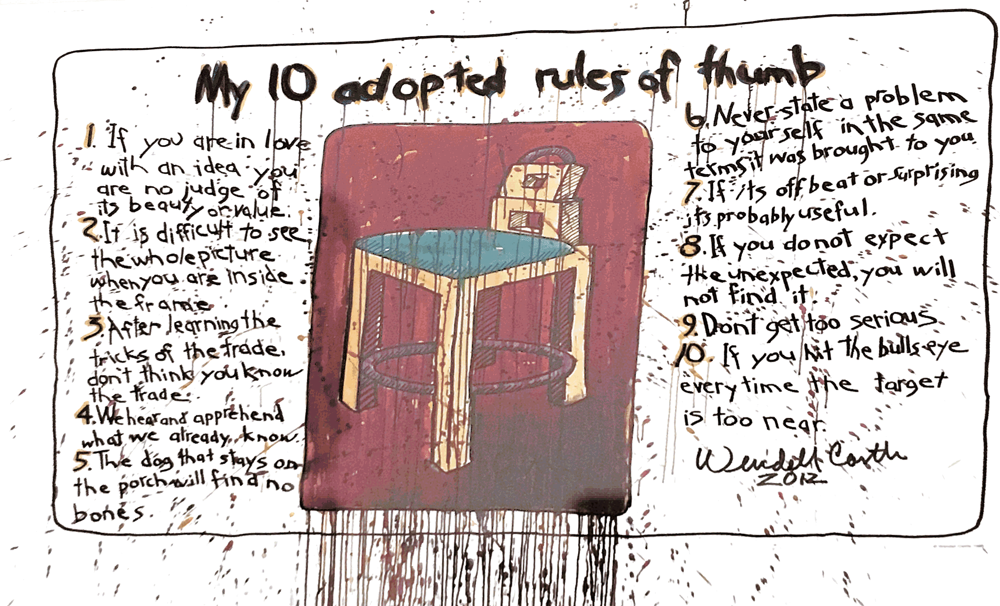
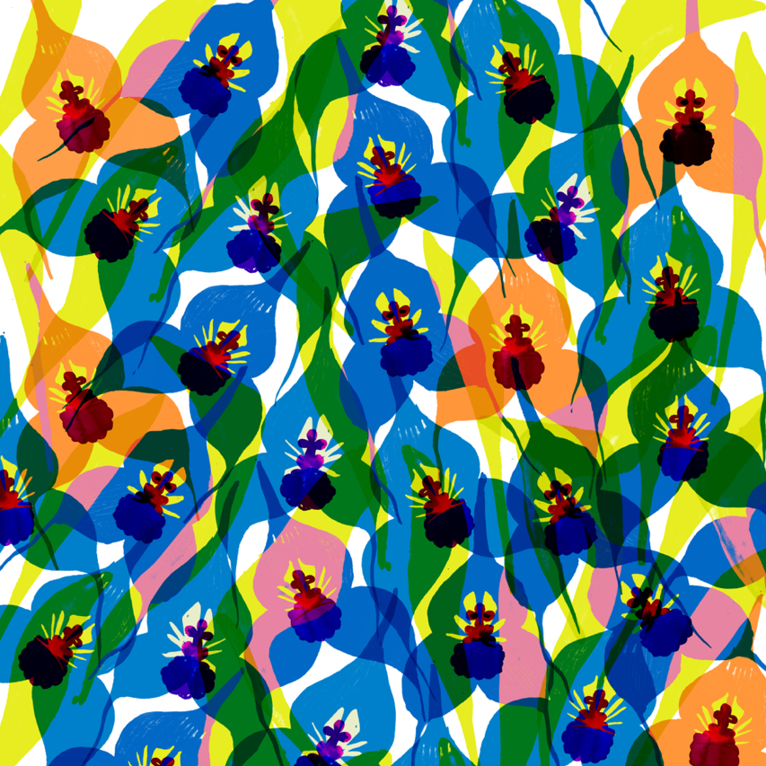

Hi all,

Happy Tuesday!

New York is still in the peaks of a brutal summer, with suffocating heat and air. I think it's been giving me weird dreams. Every night, they get more and more strange. Dreams about log cabins and overgrown grass and basements with upside-down doors. Dreams about performing, finger puppets, and the wind. I can't quite put them together. Please let me know if you have any ideas.

++

We did finally see _[A Strange Loop](https://www.playwrightshorizons.org/shows/plays/strange-loop/)_ this week, after our first attempt getting cancelled because of the [blackout in Manhattan](https://guscuddy.substack.com/p/the-curtain-71619-).

I thought it was pretty brilliant and electric, though it did lose me a couple brief times in its second half. I loved Larry Owens (and recommend [his wonderful podcast](https://foreverdogproductions.com/fdpn/podcasts/what-makes-u-sing/)). And at this point, I would be very surprised if it did not transfer to Broadway.

++

In other news, we painted our apartment pretty colors! Here's a very small preview:

 

++

This week’s notes have a lot of saved tweets. Anyway, let's get into it:

---

### **THIS WEEK'S NOTES**

#### **[wendell castle](http://www.wendellcastle.com) rules of thumb**

 

---

#### **"do the work for yourself"**

http://twitter.com/briankoppelman/status/1154361011656364032

---

#### **peregrines**

I have been doing a deep dive on Werner Herzog lately, and the first book he recommends over and over is _[The Peregine](https://www.nyrb.com/products/the-peregrine?variant=1094932429)_ by J.A. Baker, a strange and wonderful nature book from 1967 on peregrine falcons. The language in it is just beautiful, and I'd highly recommend it:

> I saw my first peregrine on a December day at the estuary ten years ago. The sun reddened out of the white river mist, fields glittered with rime, boats were encrusted with it; only the gently lapping water moved freely and shone. I went along the high river-wall towards the sea. The stiff crackling white grass became limp and wet as the sun rose through a clear sky into dazzling mist. Frost stayed all day in shaded places, the sun was warm, there was no wind.

---

#### **"the desire to be liked"**

http://twitter.com/chris_shinn/status/1153794301186334723

---

#### **don’t let disney fool you**

https://twitter.com/willow_catelyn/status/1153328996899315715 

---

#### **grassroots theatre criticism re-organization**

Jose Solís has been killing it:

http://twitter.com/josesolismayen/status/1155537805289897992

---

#### **a motto for theatre**

**“Everyone is welcome and no one is safe”**

\- [Robert O’Hara](http://www.speakeasystage.com/everyone-is-welcome-and-no-one-is-safe/%0A)

---

#### **on** _a strange loop_ and this theatrical moment

[Jeremy O'Harris tweetstorm](http://twitter.com/jeremyoharris/status/1155227991930212353):

> You who read the trades know I’ve been very dubious of the “Black Theatrical Renaissance ™️” that many ppl have tried to umbrella me and my contemporaries beneath.
> 
> A. Bc it flattens our work which is a tool of white supremacy and capitalism.
> 
> B. Bc I’ve read it all before.
> 
> Yet let last night while marveling at @larryowenslive’s virtuoso performance of “AIDS is God’s Punishment” I started to well and did feel that I **was witnessing and a part of a rare moment in NYC theatre that feels game changing**.
> 
> This moment doesn’t feel specifically black (although I think we are in a moment of artistic production wherein the leaders of the pack are primarily from the African diaspora) but it does feel specifically honest. Where **individual truths inside a work take precedent over form**.
> 
> …
> 
> It also feels like work that seems to be rebelling less against “trump” and more **against the relative artistic malaise of the Bush & Obama years**. (Not to say great work wasn’t made then but moreso formal invention waned). Was there something about those presidencies that allowed us to reject radical vulnerability and formal invention?

---

## End Note

 

_art by [Sarah Edith](https://www.behance.net/sarahedith)_

++

Thank you for reading! If you’re a new reader, welcome. I send this out every Tuesday. It’s a collection of what I’m thinking and learning about each week, usually centering around theatre and culture. You can read the [full Archive here](https://guscuddy.substack.com/archive).

If you enjoyed this, you can share it with friends by forwarding this email, or [sending them here to sign up](https://guscuddy.substack.com/).

If you don’t already, follow me on [Twitter](http://twitter.com/guscuddy) and [Instagram](http://instagram.com/guscuddy) for more.

And you can reply directly to this email and I’ll get it, so feel free to do so about anything.

Hope you have a great week!

\-Gus