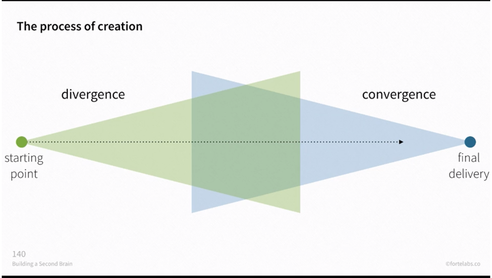

Hey all,

Hope you're having a lovely Tuesday.

++

I saw two things this week across two different mediums that I'd like to talk about, both made by straight white men, both praised pretty highly by most white critics, but both problematic and disappointing.

The first is Quentin Tarantino's latest, _Once Upon a Time in...Hollywood._ Like many people, I have a bit of a complicated and twisted relationship with Tarantino, unsure if I find him repulsive or subversive, and if I do find him repulsive how much that impacts my pure enjoyment of his somewhat addicting movies, and whether or not that retroactively affects my view of his older movies like, say, _Pulp Fiction_ — one of the movies that got me into movies in the first place (as I'm sure it did for many people of my generation). On the one hand, I really thought _Hollywood_ was pretty repulsive, the worst of the worst of Tarantino's impulses. At the same time, it sickeningly held my attention for all of its 165 minutes. (Something I can't say for _Coriolanus_, discussed below.) This contradiction is at the heart of Tarantino.

Nostalgia is the guiding ship of _Hollywood_, and it's a type of nostalgia that is regressive, not just pleasantly wistful. The film has a white-only cast (except for a bizarre and offensive Bruce Lee parody), and glorifies the cis straight white man of old Hollywood, longing for an era where men could just be men. Brad Pitt plays an old stuntman named Cliff Booth, sure—but he is actually Tarantino's twisted fantasy of a Hollywood superhero, come to save us from a new era of hippies and diversity. It's telling, then, that Booth has a weird and ambiguous history of violence against women. After all, this is the same Tarantino that was [good friends with Harvey Weinstein](https://www.nytimes.com/2017/10/19/movies/tarantino-weinstein.html), but was "ashamed" he didn't take further responsibility.

And yet, perhaps Tarantino is aware of this. Perhaps he is wrestling with this darkness, not enforcing it, [as critic K. Austin Collins puts forth](https://www.vanityfair.com/hollywood/2019/07/tarantino-once-upon-a-time-in-hollywood-revenge-fantasy-manson-family):

> **Resonances like these are what make Hollywood too complicated to write off—and too menacing, however subtly, to strictly enjoy**. Per usual with Tarantino, the attitudes that tempt me to turn on the movie in some moments are the same things that make his work worth wrestling with, in others.

Collins—sadly one of the few black film critics working for a major publication, it should be noted—makes some good points, and is one of the critics I most enjoy reading, so he's worth checking out. I'm not sure I completely buy it, though. Richard Brody calls it ["obscenely regressive"](https://www.newyorker.com/culture/the-front-row/review-quentin-tarantinos-obscenely-regressive-vision-of-the-sixties-in-once-upon-a-time-in-hollywood) in a very well-articulated review, and one that I largely agree with. (Which, to be fair, Collins discusses in his piece.)

Many critics refers to this as Tarantino's most "personal" film, the one where he's most self-reflective. But then many of these critics are the same old white men as Tarantino, secretly longing for a time that worked better for them. I just can't reconcile the film's off-putting nostalgia—a type of nostalgia not dissimilar to nostalgia trumpeted by Trump, Republicans, Brexit—with its complexities.

But while I found _Hollywood_ to at least be entertaining (for lack of a better word), I can't say the same about the production of _Coriolanus_ running at the Delacorte Theater in Central Park, produced by the Public.

This is the first production I've ever seen of _Coriolanus_ (I was disappointed I couldn't see Robert LePage's [production at Stratford last year](https://www.youtube.com/watch?v=jwzFH8zU9xQ)), one of the most underproduced Shakespeares. I actually think it's a very compelling play, though a bit difficult to wrap your head completely around, with lots of arguments and political-speak, and an unlikable central character. Its interrogation of violence, heroism and leadership actually has some crossover points with _Hollywood,_ though with far more rigor and complexity.

Director Daniel Sullivan's _Coriolanus_, though, is largely flaccid. Its dystopian set and costumes are one of the more tired modern Shakespeare tropes there is, perfectly general and unspecific enough to make one think that the production might have a point. (From the [great Sara Holdren takedown](https://www.vulture.com/2019/08/theater-review-shakespeare-in-the-parks-coriolanus.html): "pinning screenshots from _Fury Road_ to your production’s mood board isn’t enough"). Unfortunately, it doesn't seem to have any point. It meanders on for three deadly hours without quite knowing what it's saying. As Holdren points out, it's the type of deadly Shakespeare that makes you think you're bored because you don't understand. But actually, it's just boring.

This is the kind of Shakespeare that will continue to turn Shakespeare into an elitist thing, no matter how many free performances you do in Central Park. And it also speaks to something fundamental I believe: boredom is our best bullshit detector. If you feel boredom, there's not something wrong with you: it's almost definitely the production's fault. (We do need to differentiate between attention span and boredom—but even then, I'm skeptical.)

For some reason, NYC theatre dictator-for-life Ben Brantley [loved it and gave it a Critic's Pick](https://www.nytimes.com/2019/08/05/theater/coriolanus-shakespeare-park-review.html). It's sad to think many people—who might already have a well-earned distrust of Shakespeare—will go to this production and think they’re not smart enough because they don’t understanding what's going on. What this says about the state of Shakespeare in America is not exactly heartening.

I believe that theatre has the potential to be a complex, immersive, transcendent experience. But far too often it is outclassed by movies, even if just from a pure entertainment perspective.

> Theatre has the potential—unknown in other art forms—of replacing a single viewpoint by a multitude of different visions. **Theatre can present a world in several dimensions at once, whereas the cinema, although it tirelessly seeks to be stereoscopic, is still confined to a single plane.**

\- Peter Brook

---

## **Notes from the week**

#### **Divergence and Convergence**

Creativity is essentially a series of divergences and convergences:

 

In the beginning, you diverge: you brainstorm, you try new things, you have conversations and discussions, you create an abundance of material.

At a certain point, you must converge: make decisions, cut things, ignore new inbound material.

Divergence is fun. But convergence is necessary, even though there is a certain violence in deciding. Anne Bogart writes in _A Director Prepares_:

> To try to say something in a state of flux even if you do not know the right thing to say is the point. **Make an observation**. To be silent, to avoid **the violence of articulation** alleviates the risk of failure but at the same time there is also no possibility of advancement.

Divergence without convergence will never result in anything tangible, anything that can be shared with others. In theatre, the rehearsal process eventually must converge in a public performance, or else what were we doing? Each day of rehearsal, too, might consist of its own micro divergence and convergence: actors explore possibilities, but towards the end of the day you come to some sort of decision or conclusion, at least for now.

Don't forget to converge. It's the thing I often forget to do. (How many half-finished writing projects do I have on my computer, from too much divergence?)

---

#### **Some Notes on Learning**

I've had a bit too much downtime this week, so I opened up my personal pandora's box by trying to re-kindle my childhood love of computers and programming. I've been developing a Ruby script that takes the theatre review you're reading, and adds all the relevant information to a database in Airtable, so that you can then track it. (It's the very, very beginning of a bigger idea I've always had, to make something akin to [Letterboxd](https://letterboxd.com) for theatre.) I’ll share more on this project soon, if it amounts to anything.

What I've learned about learning is that it's way better to have a goal or endpoint in mind before attempting to just "learn something". Any time I've tried to just read a book to learn programming, without any real idea in mind, it falls flat. Textbooks are a bit of a vacuum. Instead, learn as you go: I knew what I wanted, so I hacked it together until it started working. The byproduct is that you internalize the concepts much more. 

I suspect this would probably work with learning a foreign language, too. Every effort I've ever had in that regard has failed because I never have a real goal or endpoint, just a vague desire—or in the case of school, need—to learn the language in general.

Learning by doing—when tied with motivation to accomplish something tangible—is very powerful.

---

#### **What makes Sara Holdren so good?**

I liked this tweet from playwright Haleh Roshan:

https://twitter.com/halehroshan/status/1158835367782617089

---

#### **RIP Toni Morrison**

 

> “We die. That may be the meaning of life. But we do language. That may be the measure of our lives.” 

[From her terrific 1993 Nobel Lecture.](https://www.nobelprize.org/prizes/literature/1993/morrison/lecture/) _Song of Solomon_ was a very impactful book for me when I was 17, unlike anything I had ever read before.

---

#### **End Note**

Thank you for reading! If you’re a new reader, welcome. I send this out every Tuesday. You can read the [full Archive here](https://guscuddy.substack.com/archive).

If you enjoyed this, you can share it with friends by forwarding this email, or [sending them here to sign up](https://guscuddy.substack.com/).

If you don’t already, follow me on [Twitter](http://twitter.com/guscuddy) and [Instagram](http://instagram.com/guscuddy) for more.

And you can reply directly to this email and I’ll get it, so feel free to do so about anything.

Hope you have a great week!

\-Gus