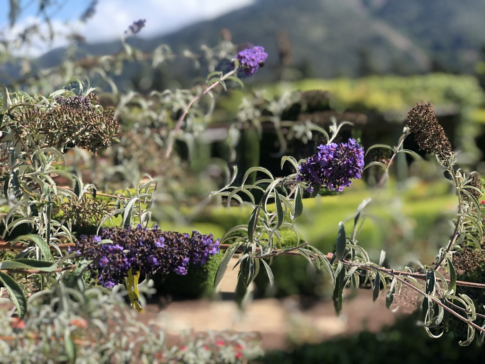

Hi friends,

Hope you're having a great week.

++

#### **Some Thoughts on Setups and the Writing Process** 

> **It’s crucial to have a setup, so that, at any given moment, when you get an idea, you have the place and the tools to make it happen.**

**\-** David Lynch, _Catching the Big Fish_

My brother was in town the other night, and we talked a bit about setups.

It's important, when working in any sort of creative capacity, to have a setup. That way, you can capture ideas and information, and turn them into words and work.

Max is getting his PhD in Sociology, so he uses an academic setup. I use a similar, but slightly different one.

Throughout the week, I capture information (highlights from books and articles, tweets and images, experiences and ideas) into the app Evernote. I use it to manage all my ideas and knowledge. I’ll organize them into categories based on actionability (how relevant is a piece of information to what I’m working on or interested in). Then, I can search through my notes for ideas, or I can assemble this newsletter by looking back on what I’ve captured this week.

My setup looks like this:

 

But there are many other setups that are possible: a sketchbook, pen and paper, the Notes app, crayons, a spreadsheet, index cards.

The tools don't matter. Paul Thomas Anderson writes his screenplays in Microsoft Word. Annie Baker writes her plays on the computer because she likes the way the Times font in 11pt looks. Both those seem awful to me, but they're the ones with the pedigree.

What's key is to have some sort of setup for transforming ideas and research into the work. Jeremy O. Harris wrote _Slave Play_ [based on his notes](https://twitter.com/jeremyoharris/status/1078793595396730880), which were transformed through his own life experience into a play. Annie Baker reads and reads until she hits a critical mass, transforming that research into her work.

Brains forget things. They can’t hold on to everything. Having a setup lets you offload all the things your brain is trying to hold onto, and make room for more creativity.

---

## **Notes from the Week**

#### **[whiteness and patriarchy in actor training](https://howlround.com/whiteness-patriarchy-and-resistance-actor-training-texts)**

A great piece in Howlround. This is something I have also noticed whenever I have tried recently to read any old acting text: they're insufferably sexist and racist. If you want to know how misogyny is baked into the history of acting, just read the opening page of _Acting: The First Six Lessons._ Amy Steiger writes:

> The naturalization of binaries and hierarchies is one of the ways **whiteness and masculinity maintain institutional dominance**, relying on two things that are evident in these texts: 1) creating a narrative where **resistance is obscured** or depicted as unnecessary, foolish, or wrong; and 2) **reinforcing the image of an embodied, emotional, and often feminized “Other” that needs to be helped along by the more rational minds who are unquestionably in charge**. A market-driven context often reinforces the illusion that, for actors, dissent and critical thinking are inherently political, and training for professional work should take place outside of politics.

---

#### **[umberto eco on writing](https://thereader.mitpress.mit.edu/umberto-eco-how-to-write-a-thesis/)**

Specifically, a thesis. But much is applicable to writing in general, if you collect writing advice (like I do):

> **You are not Proust. Do not write long sentences**. If they come into your head, write them, but then break them down. Do not be afraid to repeat the subject twice, and stay away from too many pronouns and subordinate clauses.

---

#### **[on algorithmic dysphoria](https://kylechayka.substack.com/p/algorithmic-dysphoria-when-the-recommendations)**

Algorithms run much of the world of media, communications, and advertising. They feed us most content that we consume. (Theatre, for the most part, lies outside the oppression of algorithms.)

Sometimes, though, they're wrong:

> **Sometimes there’s an algorithmic mismatch:** your recommendations don’t line up with your actual desires or they match them too late for you to participate in the Cultural Moment. It **induces a dysphoria or a feeling of misunderstanding**—you don’t see yourself in the mirror that Netflix shows you.

When algorithms don't support a show that ends up being cancelled, you can end up following a show that has no ending because of its lack of virality. These go to the dead place of streaming, exist in the "Uncanny Valley of content".

---

#### **lil nas x**

Lil Nas X's self-told story of "Old Town Road" is both inspiring and an exercise in post-post-modern emoji-English:

 

---

#### **[Another take on](https://www.theringer.com/the-bill-simmons-podcast/2019/8/12/20802381/once-upon-a-time-in-hollywood-wesley-morrishttps://www.theringer.com/the-bill-simmons-podcast/2019/8/12/20802381/once-upon-a-time-in-hollywood-wesley-morris)** _[Once Upon a Time in Hollywood](https://www.theringer.com/the-bill-simmons-podcast/2019/8/12/20802381/once-upon-a-time-in-hollywood-wesley-morrishttps://www.theringer.com/the-bill-simmons-podcast/2019/8/12/20802381/once-upon-a-time-in-hollywood-wesley-morris)_

[I didn't like](https://guscuddy.substack.com/p/the-curtain-8619-) _Once Upon a Time in Hollywood_, but many people did. I really enjoyed hearing the great Wesley Morris on Bill Simmons' podcast analyze and largely defend the movie from criticisms like mine. A lot of their discussion focuses on the magnetism of Brad Pitt's star power, but also Tarantino's non-clueless intentionality in making a movie about these straight white men. I don't completely buy it, but I respect the other side.

---

## **End Note**

 

_We were in Carmel, California for a wedding this weekend. It was very pretty: the sun cratering down onto the plants; the green and the feeling of floating amongst nature, in all its wondrous complexity._

++

Thank you for reading! If you’re a new reader, welcome. I send this out every Tuesday. You can read the [full Archive here](https://guscuddy.substack.com/archive).

If you enjoyed this, you can share it with friends by forwarding this email, or [sending them here to sign up](https://guscuddy.substack.com/).

If you don’t already, follow me on [Twitter](http://twitter.com/guscuddy) and [Instagram](http://instagram.com/guscuddy) for more.

And you can reply directly to this email and I’ll get it, so feel free to do so about anything.

Hope your week is filled with love and goodness.

\-Gus