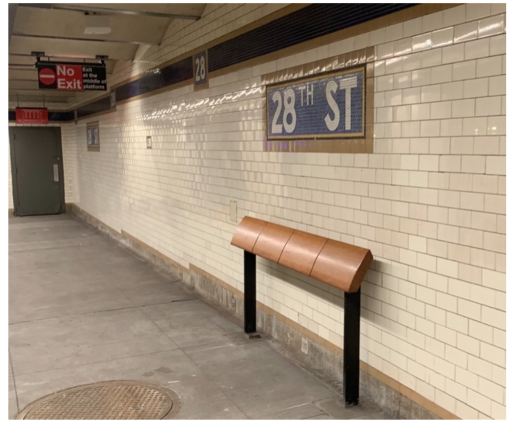

Hi all,

Hope you're having a lovely Tuesday.

++

#### **Simplicity, Complexity, and Agency**

These days, more and more, I crave simplicity. Abundance can be overwhelming.

It feels impossible to make a decision anymore in 2019. We are so inundated with choices in every facet of life, that I resort to checking _The Wirecutter_ for things like the best power strip, the best water bottle, or the best shelf. There's so many choices that I have to know _the best_ for everything. It's as if the internet age has encouraged a paranoia that we're always wrong, as if there is always a better choice out there.

I want decisions made for me, whenever possible. Simple menus, simple choices, simple options. I don't want to waste time thinking about what brand of toilet paper to buy—just tell me.

But simplicity should not come at the cost of agency. I don't want Social Media companies to "simplify" my life to make a profit. I don't want the rigorous complexity of life wiped away for the sake of a slick, simple buffet. The problem with capitalism and Silicon Valley is that their relentless optimization—and "simplification"— of life means the discouragement of the ornate, the slow, the unconscious, and the complex.

Algorithms simplify by using our personal information to attempt to mimic the unconscious, and deliver us the content we want at that time. They can be shockingly accurate, but they are also a trap, removing any sort of randomness and serendipity out of life.

So instead, we must grapple with the personal desire to simplify in the face of complexity (a natural human desire, why we tell stories and myths) versus the grand technocratic simplification of life to the point of mundanity.

One way to do that is to unplug, regularly. 

This is a reminder I keep needing to give myself: it's good to step outside of the never-ending now of the internet. Good to simply sit there and think, or talk with a friend, or interact with real things, like grass or dirt or water: things that cannot be simplified by some capitalist desire, but just exist, and are simple.

"**To end sorrow one must have a very clear, very simple mind. Simplicity is not a mere idea. To be simple demands a great deal of intelligence and sensitivity."**

**\- Krishnamurti**

---

## **⚡️ Notes from the Week**

#### **[hostile](https://gothamist.com/2019/08/14/hostile_architecture_nyc.php?fbclid=IwAR0Yd0kpF3Qe9Oj8lAlTHqk4JK71pF9Ft1QIZD4l-qSBiV6O0u5MBoXfwIIhttps://gothamist.com/2019/08/14/hostile_architecture_nyc.php?fbclid=IwAR0Yd0kpF3Qe9Oj8lAlTHqk4JK71pF9Ft1QIZD4l-qSBiV6O0u5MBoXfwII)** [architecture in nyc](https://gothamist.com/2019/08/14/hostile_architecture_nyc.php?fbclid=IwAR0Yd0kpF3Qe9Oj8lAlTHqk4JK71pF9Ft1QIZD4l-qSBiV6O0u5MBoXfwIIhttps://gothamist.com/2019/08/14/hostile_architecture_nyc.php?fbclid=IwAR0Yd0kpF3Qe9Oj8lAlTHqk4JK71pF9Ft1QIZD4l-qSBiV6O0u5MBoXfwII)

My partner Mari sent me this terrific article on hostile architecture in NYC. Once you see it, you can't unsee it: cities are turning against their homeless populations in the form of passive aggressive urban design. You can't find a place to sit because there's spikes; benches are replaced by weird leaning things; surfaces have objects to prevent lying down or skateboarding.

 

> Hostile design is an age-old concept (just look at the slanted perimeter walls around Central Park), and according to Armborst, it's not restricted to built structures. It can range from an overtly **oppressive policy like redlining to one more subtly irritating like the piping of classical music into a public plaza to deter skateboarders**.
> 
> "**The city is lacking spaces that can allow people to just sit and relax and enjoy themselves** that doesn’t come with a barrier \[of\] entry associated with money," she said.

cf. with [Jenny Odell - How to do Nothing](https://medium.com/@the_jennitaur/how-to-do-nothing-57e100f59bbb)

---

#### **[maria dizzia on acting](https://podcasts.apple.com/us/podcast/id1472948181)**

I really loved the amazing Maria Dizzia on the new podcast _Actors: On Process_ (recommendation courtesy of Johann George!). [Here are my notes.](https://www.evernote.com/l/AQOopX_A3rNJeI9UJQcqPZ2nApKa_6F4LUA) It gets into the weeds of acting and scoring scripts, so recommended if you're into that. And, more importantly, at 1:12 I'm mentioned! ☺️

++

#### **some misc. acting notes** 

Here are some notes from my scene study class this week:

*   Don't apologize for the work you are doing. Take pride in your work.
    
*   Pay attention to how your nerves manifest.
    
*   It's not worth all the tension before an audition.
    
*   Joy and Crying: two sides of the same coin. Both involve lots of breath and losing control.
    
*   Don't just act with your hands: stand there and be vulnerable. It's the difference between good and great—between Patrick Stewart and Ian McKellan
    

---

**[we have ruined childhood](https://www.nytimes.com/2019/08/17/opinion/sunday/childhood-suicide-depression-anxiety.html)**

An essay on childhood, as it was once known, seemingly ending. Free time is scarce. The simple act of play is being squeezed out. Regimented schedules dominate inside and outside of school. Depression and suicide rates are rapidly rising:

> A 2019 study published in the Journal of Abnormal Psychology found that between 2009 and 2017, rates of depression rose by more than 60 percent among those ages 14 to 17, and 47 percent among those ages 12 to 13.
> 
> The number of children and teenagers who were seen in emergency rooms with suicidal thoughts or having attempted suicide doubled between 2007 and 2015.

---

## **🍂 End Note**

_simplicity and complexity_

++

Thank you for reading! If you’re a new reader, welcome. I send this out every Tuesday. You can read the [full Archive here](https://guscuddy.substack.com/archive).

If you enjoyed this, you can share it with friends by forwarding this email, or [sending them here to sign up](https://guscuddy.substack.com/).

If you don’t already, follow me on [Twitter](http://twitter.com/guscuddy) and [Instagram](http://instagram.com/guscuddy) for more.

And you can reply directly to this email and I’ll get it, so feel free to do so about anything.

Hope you have a wonderful week,

\-Gus