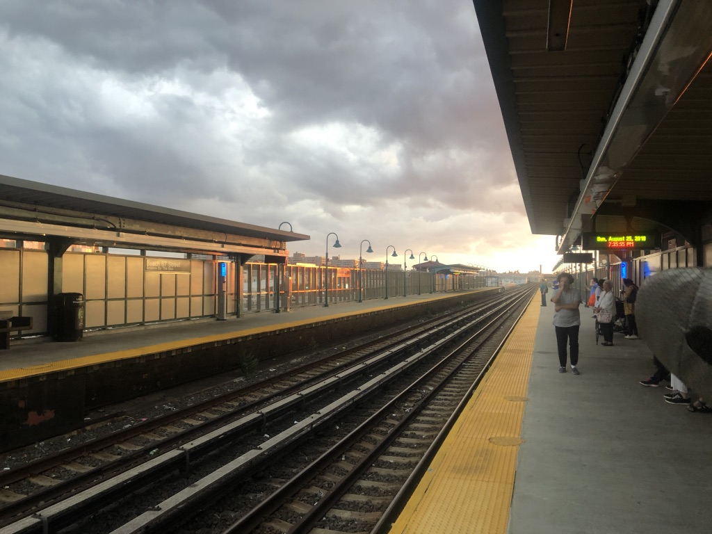

Hi all,

Hope you're having a lovely Tuesday.

This is my 20th issue! As always, thank you for reading. I love putting this together every week.

Some big ideas to discuss.

---

## **⚡️ Notes from the Week**

#### **An exploration of empathy and its limitations**

In [Ashley Chang's dramaturgical essay](https://www.playwrightshorizons.org/shows/trailers/backstory-trouble-empathy/) on Will Arbery's _Heroes of the Fourth Turning_, she considers the value of empathy. It's well worth a read.

The idea that theatre and art are vehicles of empathy is popular and persistent.

The playwright Simon Stephens (whose monologue _Sea Wall_ is currently on Broadway) writes in his book _A Working Diary_: "This is what theatre is for. It exists to exercise our empathy. It is an empathy machine."

There is even a popular belief that art encourages empathy, and that this empathy will save the world.

Consider, for example, Barack Obama. Obama was fond of quoting Atticus Finch: "You never really understand a person until you consider things from his point of view…until you climb into his skin and walk around in it." He considered the power of great books to be their ability to enable us to empathize with others. This empathy, in turn, guides his entire politics and worldview.

But is empathy enough? How much are we supposed to empathize with true evil and hypocrisy? And how much of our empathy is colonized?

It's a Brechtian idea that empathy is not important in theatre, but it's also rooted in the Ancient Greeks: the notion that we go to the theatre not to experience emotion, but to see and hear ideas.

This is an issue some people have had with recent plays like _Fairview_ or _Slave Play_: that they are not fully allowing traditional white empathy to come into play.

In an [interview with](https://www.vulture.com/2019/03/jeremy-o-harris-slave-play-daddy-profile.html) _[Vulture](https://www.vulture.com/2019/03/jeremy-o-harris-slave-play-daddy-profile.html)_, Jeremy O. Harris spoke about this expectation thrust upon black and brown creators:  

> **One of the pleasures of theater \[is\] being around a hyperarticulate argument. When we leave, we can continue those arguments with the people we’re with**. And while people can see reflections of humanity inside of those arguments, perhaps **people attached more humanity onto them** than I necessarily think anyone needs to. I feel that argument is thrown a lot on black and brown work because **we go to black and brown work for empathy and not for argument**. **The people want that work to teach us how to feel about others instead of allowing others to make us think.**

Hannah Gadsby, in her special _Nanette_, flips the empathy model on its head as well: she refuses to allow any slip of empathy for the perpetrator of violence upon her. Instead, [she focuses on her own traumatic response](https://howlround.com/are-we-traumatizing-people).

Many works of art in recent years have approached this problem differently, by showing sexual violence on the screen or stage. Often, they are unconsciously asking us to exercise some level of emotion and empathy for the violent perpetrators.

To be clear: I'm not sure where I stand on empathy and theatre. I think it's important and valuable, but I do recognize that it can also be [banal](https://www.nybooks.com/daily/2019/03/02/the-banality-of-empathy/).

---

#### **Curation in the age of the internet**

Last week, I wrote about how the internet age has given us an over-abundance of information: it's impossible to make a decision anymore.

But human curation acts as one antidote. It can reach beyond the coldness of algorithms to offer something warm and specific instead. It is one of the most valuable and scarce skills we have.

Human curation differs from algorithmic curation. When humans curate, they bring their entire human experience with them, offering context, history, compassion, and a soul. When computers curate, they consider only what data can consider: the world of bits. They can't grasp metaphor, abstraction, or the world of atoms.

In this rapidly changing landscape of information and media, curators play a pivotal role in shaping what sort of things we actually consume. Which is really my way of saying: more people should curate!

And to be clear: [curation is not a new thing](https://kylechayka.substack.com/p/the-digital-curation-problem). It’s just that the digital world presents a whole new problem of too-many-things to be solved.

---

#### **1619 Project**

I have been working my way through The New York Times' superb [1619 Project](https://www.nytimes.com/interactive/2019/08/14/magazine/1619-america-slavery.html), led by Nikole Hannah-Jones, and I recommend you do the same. (It's also [riled up](https://www.newsweek.com/new-york-times-1619-project-uses-slavery-advance-left-wing-propaganda-opinion-1456180) [conservatives](https://www.nationalreview.com/2019/08/the-1619-projects-potted-history/) who are upset at...something?)

Hannah-Jones' essay is a [haunting piece on how Black Americans formed America into a Democracy](https://www.nytimes.com/interactive/2019/08/14/magazine/black-history-american-democracy.html):

> Conveniently left out of our founding mythology is the fact that one of the primary reasons the colonists decided to declare their independence from Britain was because they wanted to protect the institution of slavery
> 
> For the most part, black Americans fought back alone. Yet we never fought only for ourselves. The bloody freedom struggles of the civil rights movement laid the foundation for every other modern rights struggle. This nation’s white founders set up a decidedly undemocratic Constitution that excluded women, Native Americans and black people, and did not provide the vote or equality for most Americans. But the laws born out of black resistance guarantee the franchise for all and ban discrimination based not just on race but on gender, nationality, religion and ability.

I also loved _Curtain_ favorite Wesley Morris' [piece on the history of Black Music being stolen](https://www.nytimes.com/interactive/2019/08/14/magazine/music-black-culture-appropriation.html):

> If blackness can draw all of this ornate literariness out of Steely Dan and all this psychotic origami out of Eminem; if it can make Teena Marie sing everything — “Square Biz,” “Revolution,” “Portuguese Love,” “Lovergirl” — like she knows her way around a pack of Newports; if it can turn the chorus of Carly Simon’s “You Belong to Me” into a gospel hymn; if it can animate the swagger in the sardonic vulnerabilities of Amy Winehouse; if it can surface as unexpectedly as it does in the angelic angst of a singer as seemingly green as Ben Platt; if it’s the reason Nu Shooz’s “I Can’t Wait” remains the whitest jam at the blackest parties, then it’s proof of how deeply it matters to the music of being alive in America, alive to America.

Both are highly recommended.

---

## **🍂 End Note**

 

_on the way back from rockaway beach._

++

Thank you for reading! If you’re a new reader, welcome. I send this out every Tuesday. You can read the [full Archive here](https://guscuddy.substack.com/archive).

If you enjoyed this, you can share it with friends by forwarding this email, or [sending them here to sign up](https://guscuddy.substack.com/).

If you don’t already, follow me on [Twitter](http://twitter.com/guscuddy) and [Instagram](http://instagram.com/guscuddy) for more.

And you can reply directly to this email and I’ll get it, so feel free to do so about anything.

Hope you have a wonderful week,

\-Gus