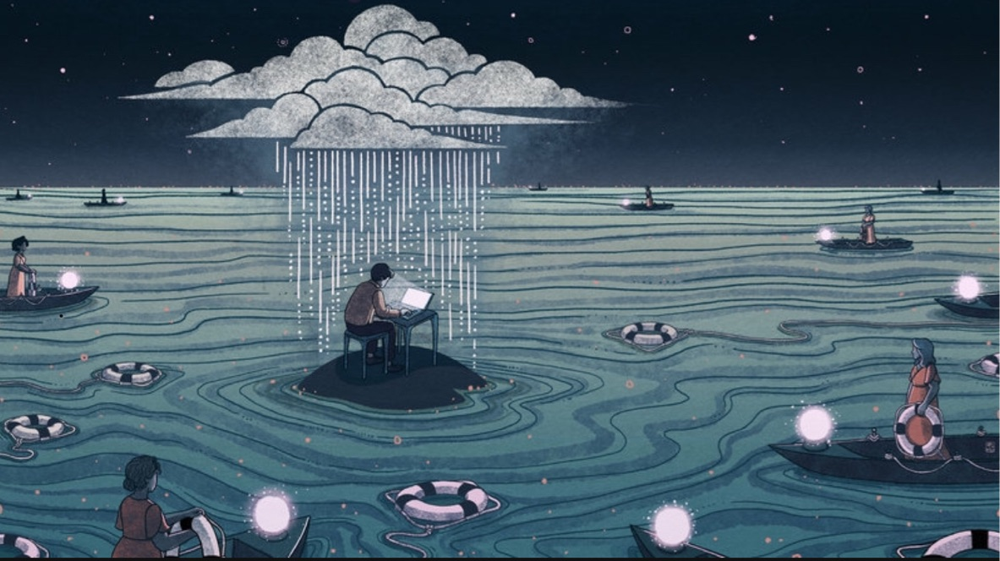

Hi all,

Hope you're having a wonderful Tuesday, and happy September!

---

## **⚡️ Notes from the Week**

#### **[blackness and queerness in american theatre today](https://www.americantheatre.org/2019/07/24/black-queer-and-here/)**

[Interesting piece](https://www.americantheatre.org/2019/07/24/black-queer-and-here/) on feeling seen by Michael R. Jackson's brilliant and specific _A Strange Loop_, and how unfortunately rare this experience is (though is getting more common in a post-_Moonlight_ era), in a landscape that seeks "enterpainment" for oppressed people's stories, in an industry that has historically highlighted the gay, cis white male experience:

> **Most stories featuring queer characters of color forefront the atrocities that inherently arise from the stigmatization of one’s sexual agency and one’s race**. **Rather than showcasing the beauty within the full expression of queerness**—such as falling in love or (in A Strange Loop) standing up to your parents—**too often writers are defaulting to trauma**.

> But this is part of a larger issue: **that of Black artists working within a primarily white system who feel they must commodify their pain for white consumption**. And of white producers not feeling like they’re able to challenge artists of color to look deeper, of them thinking of these artists as a single diversity slot or purveyor of issue plays, instead of artists whose careers and ideas need to be invested in. At the live event, Robert O’Hara had some advice for white producers: “You have to be able to live inside the power and the privilege that you have, and also continue to demand the rigor, intellect, and dexterity that the work requires so that it does not just become a play but a \[major stepping stone for a\] career.”  

---

#### **[AirPods are an unfortunate new extension of humanity](https://reallifemag.com/always-in/)**

I've written about AirPods here before a couple times. I own them and am a sucker for them. Unfortunately, [they are a tragedy](https://www.vice.com/en_us/article/neaz3d/airpods-are-a-tragedy), and won't decompose for millennia.

Beyond that, they represent the new frontier to our lives to be commandeered by late capitalism: aural landscapes. There is a Marshall McLuhan idea here that technology are extensions of human abilities and senses, that in turn alter our sensory balance and consciousness. Phones are a perfect example: they have become appendages to our bodies, reshaping how we interact with reality.

AirPods—and small, ubiquitous wireless earbuds—could represent another shift. People who wear them in NYC can attest: they're almost always in.

That's [the title of this great piece](https://reallifemag.com/always-in/):

> AirPods foster a different approach to detachment: **Rather than mute the surrounding world altogether, they visually signal the wearer’s choice to perpetually relegate the immediate environment to the background.**

> **Once everyone has earbuds that are always in, physical proximity will no longer confer a social expectation of shared experience**. With no one trying to overcome the AirPod Barrier anymore, it might become pervasive and invisible. **Living with AirPods always in would become established as a new way of being**.

And as iPhones and Instagram have [reshaped the nature of home design](https://www.theverge.com/2016/8/3/12325104/airbnb-aesthetic-global-minimalism-startup-gentrification) and transformed how people interact with locations, so too could aural platforms reshape how ambient sound and noise is perceived:

> A dominant aural information platform could have a similar effect, **fostering a world where we might as well leave our headphones on because there’s nothing around us worth hearing**.

It reminds me of [Jenny Odell on deep listening and public spaces](https://medium.com/@the_jennitaur/how-to-do-nothing-57e100f59bbb).

---

#### **[ignoring impending doom](https://theoutline.com/post/7754/climate-change-doomsday-cults-prophecy)**

[A fun and also frightening essay](https://theoutline.com/post/7754/climate-change-doomsday-cults-prophecy) on how so many of us live our lives with the "Here’s hoping what we’re predicting doesn’t come true after all” mantra: 

> I find myself thinking about doomsday cults fairly often as I wander the aisles inside the Target near the apartment I share with my girlfriend and our dog. This happened most recently during New York’s first heatwave of the year, the air doing its best to convince you it’s nearing 110 degrees, a preview of what’s to come. It’s impossible to tell from the inside, **an almost pathological level of self-deception**. Every minute spent inside that artificial oasis is another ticked away before our contract with the Earth runs out. The plentiful “Live, Laugh, Love” decor shapeshifts from a directive for your kooky aunt into a taunt.

---

#### **[on songs and memory](https://www.theparisreview.org/blog/2019/04/11/on-believing/)**

> Once, on a drive back from Windsor, a friend asked, “What is the point of the song if we don’t know what we shouldn’t stop believing in?” And another said, “Yeah, what is the feeling we should be holding on to, exactly?” **The only way to answer is to measure how many things we love have been made into ghosts, and how much time we have spent grasping at them.**

\-Hanif Abdurraqib

(thanks for the rec, maddy!)

---

#### **[an ode to coney island](https://believermag.com/logger/coney-island/)**

We went to Coney Island this weekend, before the weather (maybe) starts to change. It's truly an incredible place.

I liked [this ode](https://believermag.com/logger/coney-island/) to the wild edge of New York:

> All of it is there the moment you come down off the train, all of it spread out for you, this zombie cathedral, everyone rowdy and half-naked and drenched, where in the sand you can have a sockless epiphany so delicious you’ll want to send a sincere text to everyone you’ve ever met. Where you can have a crisis too, wandering a billion wooden planks and turning around, where you can lean into malaise. Where there is no extravagance or acrobatic displays of irony or Manhattan’s flattening pressure of ambition.

---

#### **[formal invention sells on broadway](https://www.playbill.com/article/grosses-analysis-what-the-constitution-means-to-me-breaks-box-office-record-in-final-week-on-broadway)**

One of the most original shows on Broadway was also one of the most financially successful this year:

> Heidi Schreck’s Tony-nominated What the Constitution Means to Me broke the box-office record at the Helen Hayes Theater during its final week on Broadway. The Pulitzer Prize finalist grossed $638,509 the week ending August 25, the highest of any production at the Broadway venue in an eight-performance week. (The record was previously held by Rock of Ages with a gross of $583,527 for the week ending January 4, 2015.)

A lesson in there.

---

#### **[orson welles eviscerating other directors](https://twitter.com/JFrankensteiner/status/1158576800060100608)**

 

---

#### **scary satire**

 

---

#### **Bad subway advertising of the week**

 

Does anyone know wtf is going on with this series of ads

---

## **🍂 End Note**

 

_[art by christina chung](https://www.npr.org/2019/04/11/712276022/the-end-of-empathy)_

++

Thank you for reading! If you’re a new reader, welcome! I send this out every Tuesday. You can read the [full Archive here](https://guscuddy.substack.com/archive).

If you enjoyed this, you can share it with friends by forwarding this email, or [sending them here to sign up](https://guscuddy.substack.com/).

If you were forwarded this email and haven’t signed up for weekly emails, you can click below:

[Sign up now](https://guscuddy.substack.com/subscribe?)

And you can reply directly to this email and I’ll get it, so feel free to do so about anything.

Hope you have a wonderful week,

\-Gus