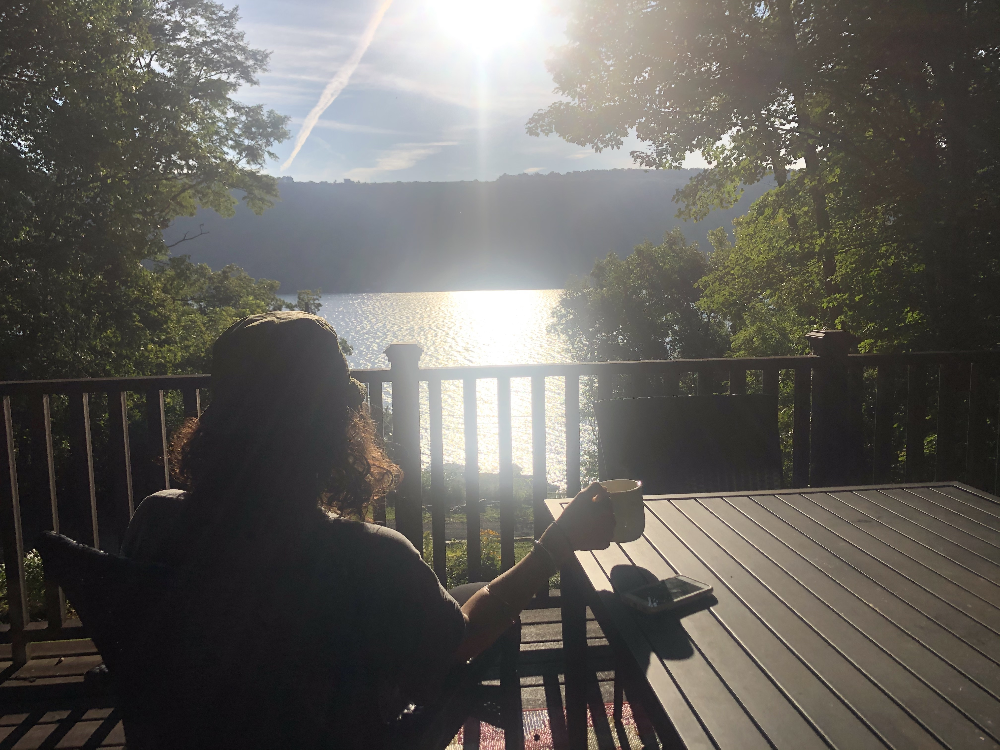
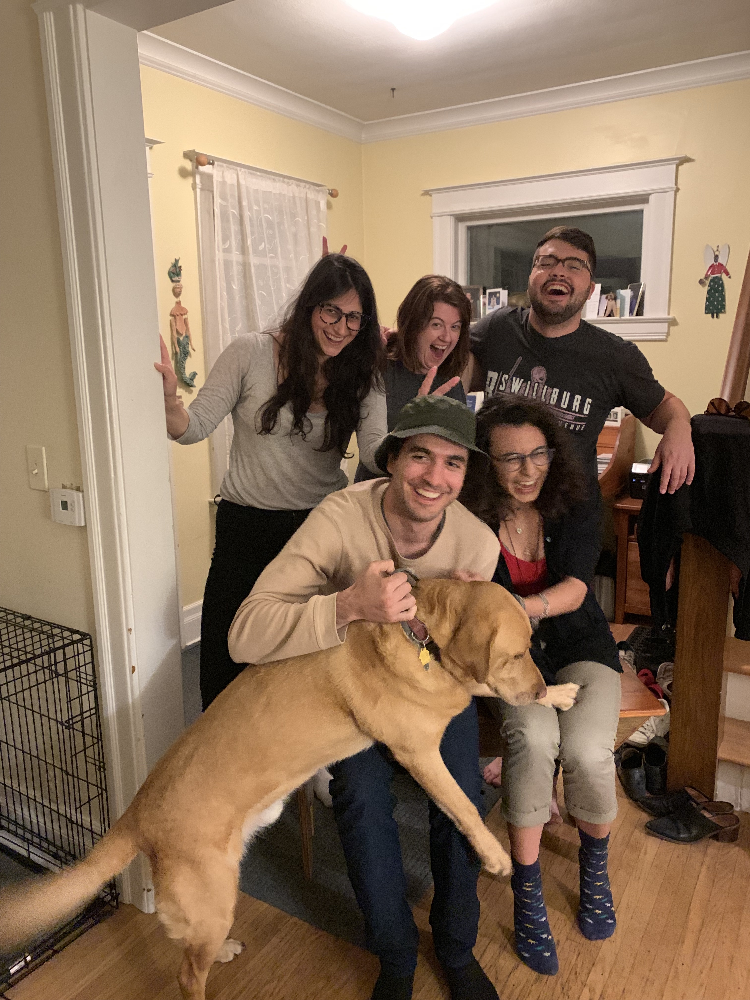

Hi all,

Hope you're having a lovely Tuesday.

Today, I have three short essays on ideas I've been exploring. They all revolve around stories. Let me know if you like it, or like the [previous weeks’](https://guscuddy.substack.com/archive) format (primarily links).

++

#### **on memories, presence & narrative**

I was back home in Rochester this weekend, visiting family. It was an amazing time, filled with great people, food, love and laughter.

We ended by driving up to Keuka Lake and spending 24 hours there:

 

In trips like this, I'm struck by the importance of wrestling with the experiencing and remembering selves, coined by Daniel Kahneman and explained in Derren Brown's book _Happy_: 

> We have two selves that both operate within us: **the experiencing self and the remembering self**. We don’t make decisions based on our experiences. We make them based on the stories of our experiences. **It is this remembering self with which we should be more concerned**. Mere pampering to the experiencing self is not enough; we want memories too.

It seems we under-invest in the creation of great memories. Memory is important: it makes us happier, gives our lives meaning.

So what makes good memories? Time with friends and loved ones. Wild experiences. Seeing new things, and not worrying about the rain. In short: [peaks and good endings](https://en.wikipedia.org/wiki/Peak%E2%80%93end_rule).

But memories can be slippery. They can turn into narrative, which can move quickly downstream into something rather dangerous. Because we can never get all the details right in our memories. We forge new things and omit other things, see ourselves as a protagonist, force our memory into a narrative where there wasn't one. Instead, there was just life, just people. 

And besides, what is a memory? Nothing. It's powerless. An illusion. It fades away. Where does it go? Nowhere. And yet: for some mysterious reason these memories shape us.

In some way, our entire concept of our self is just a container of all of our memories. Whether they are the truth or not is something else entirely.

But life is not a story, really. It can't be hammered into a three-act structure. It is far deeper, far more complex. Life is the present moment, undulating and pulsing and appearing and disappearing. And it is also much else.

How can we balance the present, experiencing self and the remembering, storytelling self? How can we recognize the validity of both?

++

_"the end of all our exploring will be to arrive where we started and know the place for the first time."_ \- T.S. Eliot

_‘Human nature is not a machine to be built after a model, and set to do exactly the work prescribed for it, but a tree, which requires to grow and develop itself on all sides, according to the tendency of the inward forces which make it a living thing’_ \- John Stuart Mill.

---

#### **Is the past worth excavating? 🤔**

Something I've been thinking and conversing about a lot is the value of old things. Specifically, old texts and old plays written by dead white men.

One thing that interests me a lot is how we can use aesthetic intervention to flip the subtext of these works on their head. [Robert Icke did it with Ibsen's](https://www.newstatesman.com/culture/music-theatre/2018/10/wild-duck-lie) _[The Wild Duck](https://www.newstatesman.com/culture/music-theatre/2018/10/wild-duck-lie)_. [Daniel Fish did it with](https://www.vulture.com/2019/04/the-brightness-amid-the-menace-re-reviewing-oklahoma.html) _[Oklahoma](https://www.vulture.com/2019/04/the-brightness-amid-the-menace-re-reviewing-oklahoma.html)_. Brandon Jacobs-Jenkins [wrote a different kind of adaptation in](https://sohorep.org/an-octoroon) _[An Octoroon](https://sohorep.org/an-octoroon)._  (It's worth noting that three of my examples are white men.)

I constantly think about how the past ripples into culture and the work we do, whether we like it or not. For instance, one of the most "influential" movies ever made is D.W. Griffith's seminal, deeply awful and racist _Birth of a Nation_. Its influence lurks over not only filmmaking, but culture itself. In Wesley Morris' superb [2016 piece about society's fear of black male sexuality](https://www.nytimes.com/interactive/2016/10/30/magazine/black-male-sexuality-last-taboo.html), he writes:

> Griffith established a permanent template with this movie, not just for filmed action but for American popular and political culture — a fantasia of white supremacy, black inhumanity and the tremendous racial anger that’s still with us today.

Is it better to ignore this heinous creation, or confront it directly? And what about the less explicitly problematic works, like Shakespeare, Ibsen, or old musicals? 

I'm very interested in how these stories—our Western canon—have become pervasive, myths that are a part of us not because we necessarily know them outright, but because their influence is so strong that they have influenced all subsequent culture leading up to us.

I think that finding ways to tell new stories about these old myths can be cathartic. It can release us from their bondage over us, especially when it flips the texts against themselves. Theatre, at the very least, always happens in the present tense.

But I also understand if other artists want to bury these stories completely, to never produce a dead white man's work again — even if it's completely re-contextualized. It's a question I keep grappling with: is the past worth excavating? Or can we just look forward? 

---

#### **The race to own stories**

Ever since humans were humans, we have been telling stories. It seems we are hardwired for them, that we are story-forming creatures.

But before there were words, there was speech.

It was in this world, where humans were undifferentiated by the didactic tunnel vision of language, that we were one giant mind. Integrated, we were interwoven by myth and ritual, collectively growing, connecting with one another, and embracing belonging. There was, in effect, a collective unconscious, engrained by stories we told and heard.

##### The Power of Stories

Stories control the world. It's long been that way, since we scrawled narrativized paintings onto dimly lit walls and danced wondrously around fires under the stars.

The invention of the alphabet made these stories grow from the collective aural experience to the rise of actual civilizations.

Stories turned into religion, which turned into war; government, which turned into power; money, which turned into greed.

It was stories that moved us, literally and emotionally, through thick and thin. It is through stories we reached for transcendence.

Stories can be macro (human rights) or micro (a poem). In the micro, they take on many forms. In the macro, they can be used for good and for evil.

##### Stories Are Our Consciousness

The micro can lead into the macro, like creeks turn into rivers turn into oceans. What starts as a bedtime story can turn into mythology, can turn into religion. Micro stories can lead to macro issues. The racism and sexism of micro Disney cartoons has been an agent of macro White Supremacy and the patriarchy. The two are inseparable.

So pop culture -- the collective micro stories we tell -- gives us a window into the otherwise mysterious consciousness of humanity.

We cannot pretend that the stories we tell are not political, that they don't have real world consequences, that they won't be intertwined with macro problems. The filmmaker Paul Thomas Anderson refuses to put guns in is movies, because he understands that he has a responsibility as an artist, that micro stories (involving guns) can promote a macro problem (guns are sexy, guns are ubiquitous).

Stories infect our consciousness because everything we take in affects us in some way. It all makes an impression somewhere in our subconscious. Memories we never knew existed can be radiantly triggered by something mundane passing by, like the look and color of that car that cut you off. In this way the mind is an incredible beast.

##### The Evolution of Stories

Marshall McLuhan points out that there have been three major revolutions in media:

> There have been three basic technological innovations: the invention of the phonetic alphabet, which jolted tribal man out of his sensory balance and gave dominance to the eye; the introduction of movable type in the 16th Century, which accelerated this process; and the invention of the telegraph in 1844, which heralded an electronics revolution that will ultimately retribalize man by restoring his sensory balance.

Since Gutenberg, stories have been able to spread quicker and quicker.

Technology has increased that pace. The 20th century saw the rise of film and television. With the internet in the 21st Century we have increased our storytelling capacities exponentially, to the point where we are all integrated by stories.

This explains why there is now a race to own stories, among the world's major companies. Apple just announced its latest $4.99/month streaming platform, meant to compete with Netflix, Disney, HBO, Amazon…the list goes on. These massive companies are investing billions of dollars into owning the most stories, each competing for our attention.

What does it mean that the world’s richest companies are investing the most money not in saving the world, but producing stories? I’m not quite sure. But it does scare me.

---

## **🍂 End Note**

 

_hilary, vanessa, max, blake (the dog), me, mari._

++

Thank you for reading! If you’re a new reader, welcome. I send this out every Tuesday. You can read the [full Archive here](https://guscuddy.substack.com/archive).

If you enjoyed this, you can share it with friends by forwarding this email, or [sending them here to sign up](https://guscuddy.substack.com/).

If you were forwarded this email and haven’t signed up for weekly emails, you can click below:

[Sign up now](https://guscuddy.substack.com/subscribe?)

And you can reply directly to this email and I’ll get it, so feel free to do so about anything.

Hope you have a wonderful week,

\-Gus