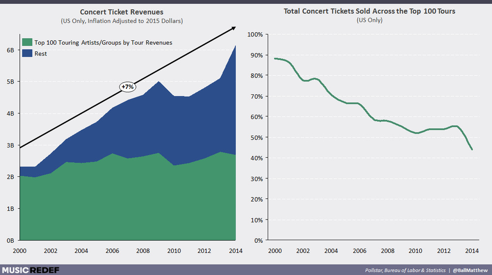

Hi all, 

Hope you're having a wonderful day.

I got some good responses from last week, so I've doubled down on writing this week. I have a new longer work-in-progress essay called "The State of the Audience", sparked by talk on Twitter about phone use in theatre. Then after that, some notes from the week.

Enjoy!

---

## The State of the Audience

Recently, some crazy things happened that shook theatre twitter to its core. 

As I understand it:

1.  Rihanna (!) came to see the downtown hit _Slave Play_ on Broadway, in previews, but...
    
2.  She was running late, so they held the show for her. After the show started...
    
3.  She texted on her phone three times (!!)...
    
4.  To the playwright, Jeremy O. Harris (!!!), who was watching from the back. Who texted back (!!!!).
    

A debate arose online over whether or not Rihanna should be shamed for her phone use. (And a smaller debate over whether we should hold the curtain for a celebrity. [But when Dionysus is coming](https://twitter.com/jeremyoharris/status/1173361628953399296?s=21)...) Harris—who has defended phone use in the theatre before—took a stand once again:

http://twitter.com/jeremyoharris/status/1173356007873032195

Can phones and theatre co-exist?

To answer that, I think we need to examine what exactly the state of the audience is in the 21st century.

#### The Role of the Audience

It's difficult to overstate how connected we are to our phones. We touch them over 2,600 times a day, and for many of us they pretty much never leave our side. The reality is that we have a whole new generation of digital natives: young people who grew up with the internet and digital devices as central to how they interact with the world.

The other reality, of course, is that the majority of American theatergoers are old and white. Many still have an old world mindset about the preciousness of theatre, insisting that it should feel [less like a party and more like a funeral](https://twitter.com/jeremyoharris/status/1173362472159535105?s=21).

This alienates young audiences who don't know what the point of theatre is (why would you want to attend a funeral?), and is further exasperated by boring theatre that caters to old, rich, white New Yorkers (I'm thinking of two NYC institutions in particular that shall not be named). 

But this is not entirely a new issue, of course. Brecht wrote about it all the way back in his 1926 essay "Emphasis on Sport":

> "**The demoralization of our theatre audiences springs from the fact that neither theatre nor audience has any idea what is supposed to go on there**. When people in sporting establishments buy their tickets they know exactly what is going to take place; and that is exactly what does take place once they are in their seats."

When people go to a sports game, they know exactly what to expect: amazing athletes performing at their best, hopefully a dramatic game. Along the way they can get out of their seat, use the bathroom, go buy food and drinks, use their phones, and generally be rowdy—all things that are extreme no-nos in theatre.

Concerts are the same way. People know exactly what to expect: their favorite bands playing their favorite music. And if they're lucky, often a lot more than that (think Beyoncé’s legendary Coachella performance, or Kanye’s _Yeezus_ tour). Because let's be real: many concerts are way more exciting than most theatre. As Robert Icke [points out in an interview](https://www.standard.co.uk/go/london/theatre/robert-icke-on-getting-hate-mail-why-mary-stuart-is-like-the-brexit-vote-and-ending-boredom-in-a3723841.html):

> My friends pay a fortune to see Stormzy or Beyoncé — but you don’t come back from seeing Beyoncé saying, ‘I was kind of bored’. She always delivers. Theatre loves to talk about its ‘right to fail’ and I sometimes think that can be used as an excuse for lack of rigour. 

 

_Concert attendance is going up, despite streaming music._

When young people go to theatre, they often have no idea what to expect. Are they going to be yelled at or shamed? Are they going to be lectured about the good old days? Or are they just going to be bored? 

How often can a young person of color go to the theatre, on average, and say that their experience has been reflected on stage? Can the stage reflect the audience, and the audience reflect the stage? Because right now, it's not the case.

#### The Unbearable Whiteness of the Audience

Playwright Aleshea Harris recently expressed something [on a podcast](https://www.stitcher.com/podcast/4th-street-bridge/hundred-to-one-with-christopher-rivas/e/59902010) that has stuck with me:

"I go to the theatre a lot and feel like I’m ease dropping on a conversation that has nothing to do with me.”

To be non-white in many theatre audiences is to be—and feel—alone. (This, of course, was the genius of _Fairview_.)

The oppression of whiteness infects every area of theatre, at every level. It goes from the top—producers and executives—all the way down to the audience. It leads old white people to suspect young brown and black people in the audience for being troublemakers for using their phones, or laughing too loudly. (Even though when a phone goes off in the theatre, you can almost guarantee it's an old person's.)

This is why it's so god damn exciting that Jeremy O. Harris has announced that _Slave Play_, upon the challenge of musician Kelela (!), is doing [a performance dedicated to an all black audience](https://rpm-email-assets.s3.amazonaws.com/SP/SP_012_E_BLACK_OUT_EMAIL/SP_012_E_BLACK_OUT_EMAIL.html). By inverting the balance, the gaze of the audience—and what the show amounts to—takes on a different, much deeper meaning:

http://twitter.com/jeremyoharris/status/1173704383667810305

#### Theatre Etiquette

Jeremy O. Harris appeared on Buzzfeed's AM2DM last year, explaining why he doesn't frown on digital natives checking their phones at the theater:

https://twitter.com/am2dm/status/1173931791645908993

His point: are we actually pushing away a whole new generation of young theatergoers because of stupid rules?

When I see young people from public schools on a field trip attend the theatre for the first time, the first thing they are told repeatedly and strictly are the **rules of theatre**: no phones, no talking, no loud noises, no getting up. Violate these and you are a bad audience member. We will kick you out. It’s such a violent and oppressive introduction, that it’s hard not to see why many young people don’t go to theatre after that.

But why such etiquette? After all, house lights are a relatively recent invention. And everyone knows that Elizabethan audiences were the most rowdy!

https://twitter.com/saybarra/status/1173564326243917824

(To be fair, I actually disagree: I do think [the largest barrier is price](https://www.whatsonstage.com/edinburgh-theatre/news/peter-brook-the-prisoner-international-festival_47341.html), but I also fully support the point Ybarra is making.)

When I attended the opening of _Coriolanus_ at The Public's Shakespeare in the Park earlier this year, I was yelled at by an old white man at intermission to put my phone away. I asked why. He said because it was turning my brain into mush. Into mush! 

What are people so afraid of? Short attention spans? I don't buy it. Young people have so many options of entertainment, that a casual check of the phone doesn't necessarily mean they are disengaged. (And if it does, it's usually because the show is boring.)

Are phones the biggest enemy of theatre? Nope. Boring, expensive, white theatre and the excessive etiquette that targets young people of color is way more of a threat to theatre’s survival.

#### Envisioning a new era of theatre audiences

> It is always the popular theatre that saves the day. Through the ages it has taken many forms, and there is only one factor that they all have in common—a roughness.
> 
> \- Peter Brook, _The Empty Space_

Theatre is not supposed to be precious. It's supposed to be a little rough around the edges.

_Slave Play_—which is selling very well—feels important. It could, in its own way, redefine what popular theatre means. Popular theatre in New York usually means old and white and expensive—all attributes that _Slave Play_ actively is trying to subvert. It's the show that Rihanna is going to. It's the show that is diversifying Broadway audiences. And it's the show whose playwright is welcoming the roughness of young people using their phones during it.

There are other examples of theaters trying to redefine popular theatre with contemporary roughness. [The Yard in London](https://www.nytimes.com/2019/02/03/theater/yard-theater-london-now-festival.html), which is a cross between risky theatre and nightclub, is one: 

> The theater’s hip, edgy work attracts an unusually young crowd: 70 percent of the audience is under the age of 35, according to Mr. Miller. And it is breaking down the boundaries between watching a play, hanging out with a beer and raving till 6 a.m. “Audiences are cross-pollinating,” Mr. Miller said. “We’re creating a new theater audience, who see that it can be as invigorating as dancing in a club.”

I'm sure there are many other examples out there.

In the end, I don't think theatre can afford to be so high-brow about how it brings in young audiences. The important thing is to get people into the room, engaging with theatre in a new way, whatever that means.

Besides, no matter who is in the audience, the height of theatre remains the same: to build a bridge between the normal world of the audience and the drama on stage, between the conscious and unconscious, revealing an entire invisible world that we never knew existed, yet was right before us, the entire time. And then, in a moment, it disappears. You had to be there.

---

## **⚡️ Notes from the Week**

#### **sara holden stepping down**

Sara Holdren, the best theatre critic, is stepping down this Fall from Vulture:

http://twitter.com/swholdren/status/1173684319048613890

I'm going to write more on this next week. She's going to pursue what she actually wants to do: direct shows. But she leaves behind a two year legacy of completely elevating the game for theatre criticism and discourse, showing that theatre practitioners really ought to be writing about theatre, not just leaving it to the "critics".

---

#### **more from** [1619 project](https://www.nytimes.com/interactive/2019/08/14/magazine/1619-america-slavery.html)

If you haven't checked out the New York Times' excellent 1619 Project, on the legacy of slavery in our country, you should. There are some tremendous pieces in there, each exploring the complex, horrendous entanglements that make up our history.

It's shocking to me that slavery [does not have any consensus on how to be taught in schools](https://www.nytimes.com/interactive/2019/08/19/magazine/slavery-american-schools.html%0A):

> Unlike math and reading, states are not required to meet academic content standards for teaching social studies and United States history. **That means that there is no consensus on the curriculum around slavery, no uniform recommendation to explain an institution that was debated in the crafting of the Constitution and that has influenced nearly every aspect of American society since**.

---

#### **NYTW is leading the way**

http://twitter.com/MrDavidGordon/status/1171829668351270914

I agree.

---

#### **[Rupert Goold and Rebecca Frecknall in conversation](https://almeida.co.uk/almeida-theatre-podcast-episode-1)**

The Almeida Theatre rebooted their podcast, with [Artistic Director Rupert Goold interviewing Rebecca Frecknall](https://almeida.co.uk/almeida-theatre-podcast-episode-1). I thought their interview could have gone deeper, but I really like Rebecca Frecknall a lot. She led a portion of a directing workshop I did in 2018, and has had quite the rise in London. Speaking of New York Theatre Workshop, she directs the [new Martyna Majok play](https://www.nytw.org/show/sanctuary-city/) there this season.

---

#### **[Still Processing](https://www.nytimes.com/column/still-processing-podcast)**

My favorite podcast, [Still Processing](https://www.nytimes.com/column/still-processing-podcast), is back. Wesley and Jenna discuss the 2020 Democratic candidates. If you don't listen, I highly recommend it. They are two of the writers I admire the most.

---

#### **Lil Nas X's Creative Process**

I found Lil Nas X's creative process for "Panini" to be pretty inspiring, and an amazing use case for digital notes:

http://twitter.com/LilNasX/status/1170684378969587712

---

## **🍂 End Note**

 

_art by [Lilianna Lasocka](https://www.behance.net/gallery/49662397/Night-orchard?tracking_source=for_you_feed_recommended)_

++

Thank you for reading! If you’re a new reader, welcome. I send this out every Tuesday. You can read the [full Archive here](https://guscuddy.substack.com/archive).

If you enjoyed this, you can share it with friends by forwarding this email, or [sending them here to sign up](https://guscuddy.substack.com/).

If you were forwarded this email and haven’t signed up for weekly emails, you can click below:

[Sign up now](https://guscuddy.substack.com/subscribe?)

And you can reply directly to this email and I’ll get it, so feel free to do so about anything.

Hope you have a wonderful week,

\-Gus