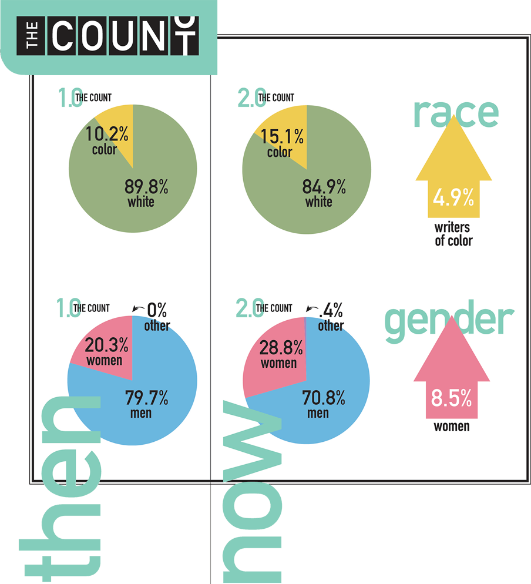

This week: the state of criticism—part two of my new series on the state and future of theatre—and notes from the week after that.

---

## The State of Criticism

Recently, New York Magazine theatre critic Sara Holdren [announced](http://twitter.com/swholdren/status/1173684319048613890) she was stepping down from her position to pursue her main interest: directing theatre. In her short two year stint Holdren was a force, re-invigorating theatre criticism for many theatre artists in New York.

While it's sad to see her go, she began to open the door for me to what truly great theatre criticism can be: not only putting work in its proper context, but making the reader a better, more rigorous artist.

This is not something the New York Times theatre section does, despite being perhaps the most powerful force in theatre in New York City. That this dictatorial position is held by two aging white men with questionable taste is another matter.

I'd like to explore what the state of criticism is in theatre and art today, how it can be improved, and what the future might look like.

#### The Critic's Job

> "One of the most radical things you can do in this culture of the inexact is to finish a sentence."
> 
> \-Anne Bogart, _And Then, You Act_

Criticism is not just an opinion. (Though it is that, too.) Criticism is deep thinking about a particular piece of art, what its successes and shortcomings might be, and how the work might fit into a larger context.

Good criticism is active, in the political sense. It doesn't just assert a positive or negative judgement, but considers it as connected to everything. In critic Richard Brody's book _Everything is Cinema_, on the work of Jean-Luc Godard, he considers what it means to approach Godard's work: 

> If everything is cinema, then approaching Godard’s vast work in any meaningful way necessarily means being prepared to deal with everything: **politics, art, philosophy, history, nature, beauty, lust, torment, money, love, and the random element**.

I believe that this approach is appropriate for almost all art. And while he writes this sentence as specific to Godard, Brody's reviews reflect that he uses "everything is cinema" as a lens for considering all film.

In the 21st century, this goes beyond just cinema. Everything is theatre. Everything is art. The great cultural critic Wesley Morris considers this [in an interview](https://slate.com/news-and-politics/2018/02/wesley-morris-on-the-nexus-of-entertainment-and-politics-twitter-and-three-billboards.html):

> I feel like I’ve always approached criticism with a degree of morality, right? Like, not as a moralizer, but just as somebody who wants to make sure that the culture we’re getting is at least morally aware of how it’s functioning. My goal as a critic is... **mostly to connect the work to what’s happening in the world**, and in making that connection, there’s a charge that happens. **You can call whatever that charge is—connecting art and works of mass culture to social movements in politics and whatever is happening in various parts of the world and the country—a kind of activism**.

With the internet enabling a sort of hyperlink consciousness that sees everything as being interconnected, one can start to see some of the implications of this. On the one hand, no piece of art exists in a vacuum, now more so than ever. And on the other, art and culture and media are becoming synonymous words to cover the vast spectrum of things that can be considered: theatre, movies, TV, music, literature, online content, essays, podcasts, and more. A 21st Century critic finds it more and more difficult to just "stay in their lane".

Cross-pollination is a good thing, especially for theatre. The more writers who don't work exclusively in theatre who then write about theatre, the better. Theatre—as cinema, as all art—can encompass everything. 

So when Wesley Morris—who started as a film critic—[writes about theatre](https://www.nytimes.com/2019/04/25/theater/african-american-playwrights.html), it is unquestionably a good thing:

> But occasionally, a play ends and nobody really knows what to do, because it just took an audience to outer space, to the center of the earth, to this new electric zone that knows what’s wrong with this country and isn’t afraid to personify it, laugh at it, behold it. Even though the work may take place at hospitals or in the presence of a shrink, it doesn’t care about comfort. **It’s haywire, rude, blunt, poetic, self-reflective, sexually unpredictable, emotionally catastrophic, exhaustively acted, intelligent, searching and unafraid.**

In that sense, perhaps we should retire the somewhat loaded and old world word "critic", and just call them "writers". It's worth a consideration. (However, to avoid confusion, I will still refer to someone who thinks and writes about art critically as a "critic" for the remainder of the essay.)

#### Scarcity of Viewpoints and Atheist White Male Aesthetics

There simply aren't enough theatre critics.

An extreme power law operates within theatre criticism, where 95% of the power comes from the New York Times, and especially its two lead writers, who are white men. Not only is this frightening for obvious reasons, but there's also just a startling lack of alternate viewpoints. And having one singular person of color as the tokenized critic representing all theatre made by people of color is not enough:

> The thing that I want to see more of in general is more critics of color, more women, but also just more critics. People keep thinking: They hire one black critic who will finally have a black voice on the matters of black theater in America. I **promise you, if you have seven black critics sit down to see Fairview, Sugar in Our Wounds, and Pass Over, they’re all going to say a different one was the best one** 
> 
> \- [Jeremy O. Harris](https://www.whatshouldwedo.com/blog/jeremy-o-harris/)

Sites like [Show-Score](https://www.show-score.com) are helpful in some respect in democratizing theatre opinions, but I don't think it solves the problem of deeper, considered criticism.

What made Sara Holdren such a potent critic was that she also is a true theatre director, having gotten her MFA from Yale in Directing. She is a powerful example for what the future of theatre criticism should look like: theatre artists choosing to write more about the form, furthering the discourse and displacing the power of the Ben Brantleys in this industry.

Holdren explores this antiquated idea of criticism and making work as being at odds with each other in a [brilliant piece in NY Mag](https://www.vulture.com/2018/12/i-make-plays-i-write-criticism-im-not-my-own-enemy.html):

> The hawkish divide between theater making and theater writing is a relatively recent development, driven, I think, by two pretty simple factors: money and fear. **Frankly, we need more theater practitioners writing about the form**. (Think about it: Virtually all book critics write books of their own.) But we still tend to separate the study of theater from its practice, and we still don’t take the latter entirely seriously: I can support myself writing about theater full-time, but I can’t support myself making theater full-time, and nor can the majority of the brilliant artists I know.

In a world where the internet has turned almost everyone into a content creator of some kind, we need to think of writing about the form of theatre as a byproduct of making theatre, encouraging a more symbiotic link between the two. 

The lack of critics should also not be conflated with the lack of diversity in critics, which is its own issue worth exploring.

Theatre still vastly under-represents women and writers of color, [as counted by The Dramatists Guild](https://www.dramatistsguild.com/advocacy/the-count-2/):

 

Worse: the works are often only critiqued by white people. But we need to consider not only the limitations of these viewpoints (and often also the bad writing), but also the paradigms under which people view and are "judging" the art. In [a terrific essay by Donja R. Love](https://www.larktheatre.org/blog/problem-white-critics-critiquing-work-artists-color/) considering this very issue, Toni Morrison is quoted:

> I don’t like to find my books condemned as bad or praised as good, when that condemnation or that praise is based on criteria from other paradigms. I would much prefer that they were dismissed on or embraced on the success of their accomplishment within the culture out of which I write.

Often these white critics are not only not practitioners of the form, but are a world apart from the culture and paradigms being explored. They don't make any effort to see their own shortcomings in that regard. Instead, they fall back on what [Quiara Alegría Hudes deems "atheist white male aesthetics"](https://www.americantheatre.org/2018/09/27/high-tide-of-heartbreak/).

#### Conclusion: Envisioning a new future of criticism

> If I had one wish for American theater, it would be that we wrench it from the suffocating maw of television, that we pursue both complex content and structures worthy of that content, that we dedicate ourselves — as makers, as watchers, as producers and artistic directors — not to the false courage of the issue play, but to **the real courage of theater that defies formula, that provokes wonder, and that balances rigor with joy, joy with rigor, in its quest to reshape the spirit and electrify the heart**.
> 
> \-Sara Holdren, ["Theater Review: The Good Intentions of American Son"](https://www.vulture.com/2018/11/theater-review-the-good-intentions-of-american-son.html)

[Bad theatre criticism](https://www.nytimes.com/2018/11/04/theater/american-son-review.html) only contributes to the slow death of an aging art form. It continues the dominance of the boring and shallow and dead New Play, rather than prodding the form forward into the deep and complex and new. By celebrating mediocrity and demonizing risk, bad criticism allows bad plays to take up space that could be occupied by more daring and form-expanding work. And by applauding [uninspired "issue plays"](https://www.vulture.com/2019/03/review-roundup-the-b-side-gives-voice-to-forgotten-men.html) that preach to the choir and allow gentle, homogenous patting-on-the-back from audience and producer alike—instead of calling institutions out on their bullshit—they contribute to the deadening racism that permeates our industry and nation.

There are, however, efforts out there to remedy the lack of good theatre criticism. [3Views on Theater](https://www.kickstarter.com/projects/janejung/3views-on-theater) is a new project from The Lillys, a pretty A-list team of theatre artists. The site has yet to launch, so we'll see how much it can do, but it has promise.

Critic Jose Solís has been fighting the grassroots fight to diversify criticism and audiences for some time now. He regularly [tweets out](https://twitter.com/josesolismayen) that he has an extra seat for a show he's seeing, and wants a POC to have it for free. Even more than that, he has recently started a [new theatre website for critics of color](https://scenesincolor.com/about/). And his efforts have led to [doubling the amount of voting members of the Drama Desk](http://twitter.com/josesolismayen/status/1155537805289897992). In a culture that still privileges white male voices as the most authoritative, these efforts do give hope:

http://twitter.com/josesolismayen/status/1140038827744079872

##### Further Reading

**Sara Holdren vs the New York Times**

*   [Coriolanus](https://www.vulture.com/2019/08/theater-review-shakespeare-in-the-parks-coriolanus.html) (Holdren) vs [Coriolanus](https://www.nytimes.com/2019/08/05/theater/coriolanus-shakespeare-park-review.html) (Brantley)
    
*   [American Son](https://www.vulture.com/2018/11/theater-review-the-good-intentions-of-american-son.html) (Holdren) vs [American Son](https://www.nytimes.com/2018/11/04/theater/american-son-review.html) (Green)
    

**Other Great Sara Holdren Pieces**

*   [Fairview](https://www.vulture.com)
    
*   [Oklahoma](https://www.vulture.com/2018/10/theater-oklahoma-where-storm-clouds-loom-above-the-plain.html)
    

**Great Criticism from Other Writers Outside of Theatre**

*   Richard Brody on [Chi-Raq](https://www.newyorker.com/culture/richard-brody/spike-lees-necessary-overwhelming-chi-raq) and [Once Upon a Time...in Hollywood](https://www.newyorker.com/culture/the-front-row/review-quentin-tarantinos-obscenely-regressive-vision-of-the-sixties-in-once-upon-a-time-in-hollywood)
    
*   Wesley Morris on [Three Billboards](https://www.nytimes.com/2018/01/18/movies/three-billboards-outside-ebbing-missouri.html) and [the Best Performances of 2018](https://www.nytimes.com/2018/12/07/arts/best-performances-2018.html)
    
*   K. Austin Collins on [Once Upon a Time in Hollywood](https://www.vanityfair.com/hollywood/2019/07/tarantino-once-upon-a-time-in-hollywood-revenge-fantasy-manson-family) and [Green Book](https://www.vanityfair.com/hollywood/2018/12/truth-about-green-book-viggo-mortensen-mahershala-ali) (BONUS DEEP CUT: [Collins vs Mike D'Angelo in the comments section of D'Angelo's Letterboxd review of Chiraq](https://letterboxd.com/gemko/film/chi-raq/))
    
*   Jenna Wortham on [White Filmmakers Addressing Whiteness Onscreen](https://www.nytimes.com/2019/08/29/movies/white-privilege-nightingale-midsommar.html)
    

---

## Notes from the Week ⚡️

#### [we have suffered enough: the effects of staging trauma](https://howlround.com/we-have-suffered-enough)

Great and important Howlround piece.

> Men are quick to be praised for their work in theatre, called geniuses when they stage a scene I could have done with my eyes closed, told they were so moving when all they had to do was stand there and wield their power over everyone else. We, **women of color, are praised when we suffer**. White spectators from all over the country told me they loved me as Lavinia, and Claire in The Maids, and Lady Macbeth—particularly in the “mad scene,” they were quick to say. What is that about? **Why do women of color gain space in someone’s consciousness only when we show them the depth of our suffering?**
> 
> As actors, **our minds may know violence on stage is part of play, but our bodies don’**t.

++

#### the false dominance of david mamet

http://twitter.com/MrDavidGordon/status/1174061049697460225

++

#### [removing our phones](https://qz.com/523746/a-photographer-edits-out-our-smartphones-to-show-our-strange-and-lonely-new-world/?utm_source=facebook&utm_medium=partner-share&utm_campaign=partner-telegraph&fbclid=IwAR2JNEVEXHuSz6TQwaVHT5Pc_-l8NlXqpn7DTv6hGoxHDRCLX9Y8Pv5L5e4https://www.removed.social/united-states)

 

++

#### [ta-nehisi coates on longform podcast](https://longform.org/posts/longform-podcast-360-ta-nehisi-coates-and-chris-jackson)

I enjoyed Ta-Nehisi talking on the Longform podcast about his new novel, _The Water Dancer_. Around the 57 minute mark he talks about the importance of narrative informing all his writing—that it’s the single thing that pins his essays down.

---

## _End Note_

http://twitter.com/yashar/status/1174528522045579264

_That’s all for this week—thanks so much for reading._

_If you enjoyed this, forward it to some friends. If you’ve been forwarded this email and want to receive The Curtain every Tuesday, sign up below:_

[Sign up now](https://guscuddy.substack.com/subscribe?)

_As always, you can reply directly to this email and I’ll receive it. So feel free to do that about anything, like comments or compliments or angry complaints._

_See you next week,_

\-Gus