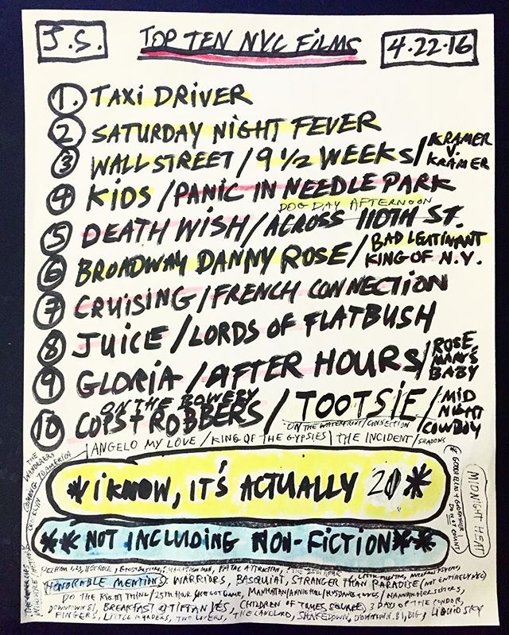

Hey friends,

Hope you're having a good Tuesday.

++

I posted the last two weeks' essays on my website. For those that didn't get a chance to read them, they're now preserved:

*   [The State of the Audience](https://www.guscuddy.com/2019/09/28/state-of-audience/)
    
*   [The State of Criticism](https://www.guscuddy.com/2019/09/28/state-of-criticism/)
    

These two are the beginning of a series of essays I want to write on the future of theatre. Next week, I'll have a new essay on the Cult of Algorithms, and theatre's role within this new world.

I also have lots more previous writing on my blog, if you want to check it out. (Though my recent writing is way better!)

++

Recently I've been heavily considering starting a podcast focusing on conversations around theatre, and the future of storytelling. I would talk to directors, designers, writers, artists, actors, leaders, and creators. There's a few OK theatre podcasts out there, but none that have quite whetted my appetite. If you have any ideas on this, shoot me an email. I plan on launching in November.

++

Today's issue has a lot more film stuff!

---

## **Notes from the Week 📽**

#### **[Jenna Wortham on White Filmmakers Addressing Whiteness](https://www.nytimes.com/2019/08/29/movies/white-privilege-nightingale-midsommar.html)**

Following up on last week's piece on good criticism, I wanted to highlight Jenna Wortham's [recent piece](https://www.nytimes.com/2019/08/29/movies/white-privilege-nightingale-midsommar.html) for the New York Times.

It specifically analyzes a few recent movies by white filmmakers that deal with race and whiteness. What I think is interesting—and so important—is how Wortham makes a point that it's essential that white filmmakers (and we can extrapolate this out to artists in general) unpack their own whiteness and privilege, especially when dealing with a story that touches on race in any way:

> And what a relief. **As a friend put it to me recently, “This is white people’s job now,” meaning that it’s time for white people to start helping one another see themselves in terms of their race and all the undeserved, inherited privilege that comes with it. It’s a self-examination that knows the difference between “woke” and self-awareness, and leans toward the latter**. It’s not easy work. “White progressives can be the most difficult for people,” Robin DiAngelo writes in her groundbreaking book, “White Fragility,” because she and others “do indeed uphold and perpetuate racism, but our defensiveness and certitude make it virtually impossible to explain to us how we do so.”

She examines why the movie _The Nightingale,_ while problematic, is more successful than the critically acclaimed _Last Black Man in San Francisco—_precisely because its white creator avoids addressing his own whiteness in a story about gentrification. If [Everything is Cinema](https://www.guscuddy.com/2019/09/28/state-of-criticism/), and an artist is inseparable from their life, then this is a major shortcoming.

---

#### **The connection between fashion and theatre**

It seems every week I link to a different something from playwright Jeremy O. Harris, which I take as a sign that we need more theatre artists making waves. But I really enjoyed his appearance on [the](https://wedontevenknow.libsyn.com) _[We Don't Even Know](https://wedontevenknow.libsyn.com)_ [podcast](https://wedontevenknow.libsyn.com), and thought they touched on a few really great topics (the messy entanglements that make up pop culture like _Black Panther_, the idea that art that makes you mad is provoking something unconscious, [the erasure of black influence on theatre](https://blackworkbroadway.com)). What I've been most taken with, though, is Harris' connection with fashion, which is discussed at 23:21.

Anna Wintour and GQ both highlighted Jeremy as someone who could change fashion's relationship with theatre (!). Harris' instagram stories frequently feature Gucci and other high fashion brands. Both fashion and theatre share an inherent theatricality, and both are best experienced in person. But while fashion has managed to use the internet to build its industry and has invigorated an entire new generation of fashion-obsessed kids online, theatre has almost completely fallen flat in that regard. What lessons can we learn from that?

---

#### **Josh Safdie's favorite NYC movies**

 

---

#### **A24 and the art of good marketing**

Speaking of the Safdie Bros., A24 is releasing their new film, _Uncut Gems_, this November. (I couldn't be more excited, and thought _Good Time_ was easily one of the best movies of 2017.) I regularly am amazed at how great A24 is at building a brand around producing and releasing high caliber independent films. They have been on a pretty [incredible streak](https://a24films.com/films), and their [social media presence](https://twitter.com/A24?ref_src=twsrc%5Egoogle%7Ctwcamp%5Eserp%7Ctwgr%5Eauthor) is outstanding. There's a lot that theaters can learn from them.

Recently, they have been releasing book versions of the scripts of their movies, with essays and photos, which have sold out. They look undeniably sexy (and _Moonlight_ has a foreword by... Frank Ocean, and an essay by Hilton Als):

https://twitter.com/A24/status/1177268223034757121

I think there is a lot of room for innovation in script publishing in theatre, as well. [3 Hole Press](http://www.3holepress.org) is one of the only companies doing anything interesting in this regard.

---

#### **More Assorted Links I Liked:**

1.  _[A Strange Loop](https://open.spotify.com/album/7vlAmEdZEOVdRUsB4fgrvC)_ [released its soundtrack.](https://open.spotify.com/album/7vlAmEdZEOVdRUsB4fgrvC) Give it a listen.
    
2.  ["Have you noticed white people never move out of your way?"](https://ift.tt/31Mt7Lm)
    
3.  [Can Algorithms Really Radicalize?](https://kylechayka.substack.com/p/can-algorithms-really-radicalize)
    
4.  [The Ancient World teemed with Birds; now we think with them](https://aeon.co/essays/the-ancient-world-teemed-with-birds-now-we-think-with-them)
    
5.  [The Rhetoric of the Hyperlink](https://www.ribbonfarm.com/2009/07/01/the-rhetoric-of-the-hyperlink/%0A). A brilliant essay from 2008 by Venaktesh Rao, if you're interested in how the internet has shaped language and thinking: "**The hyperlink is the most elemental of the bundle of ideas that we call the Web. If the bit is the quark of information, the hyperlink is the hydrogen molecule. It shapes the microstructure of information today**."
    
6.  [Would you make your art if you were the last person on earth?](https://sivers.org/tp3)
    
7.  [Mayor Pete... 🤦‍♂️](http://twitter.com/ira/status/1179132812756017152)
    

---

## _**End Note**_

 

_art by [samuel yates](http://www.samuelyates.com/images/works/Samuel-Yates-File-Cabinet-3.jpg)_

++

_That’s all for this week—thanks so much for reading!_

_If you enjoyed this, please forward it to some friends. If you’ve been forwarded this email and want to receive The Curtain every Tuesday, sign up below:_

[Sign up now](https://guscuddy.substack.com/subscribe?)

_As always, you can reply directly to this email and I’ll receive it. So feel free to do that about anything, like comments or compliments or dog videos._

_See you next week,_

_\-Gus_