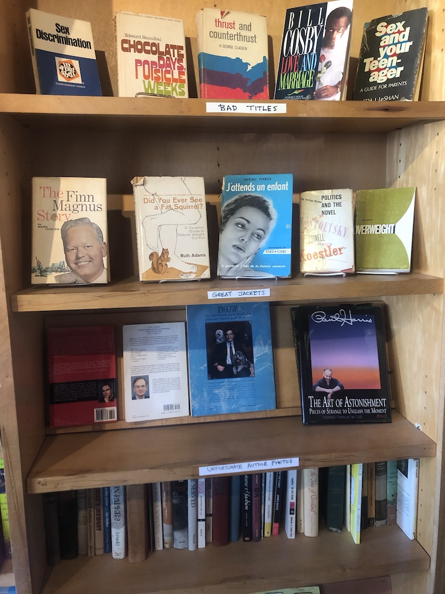
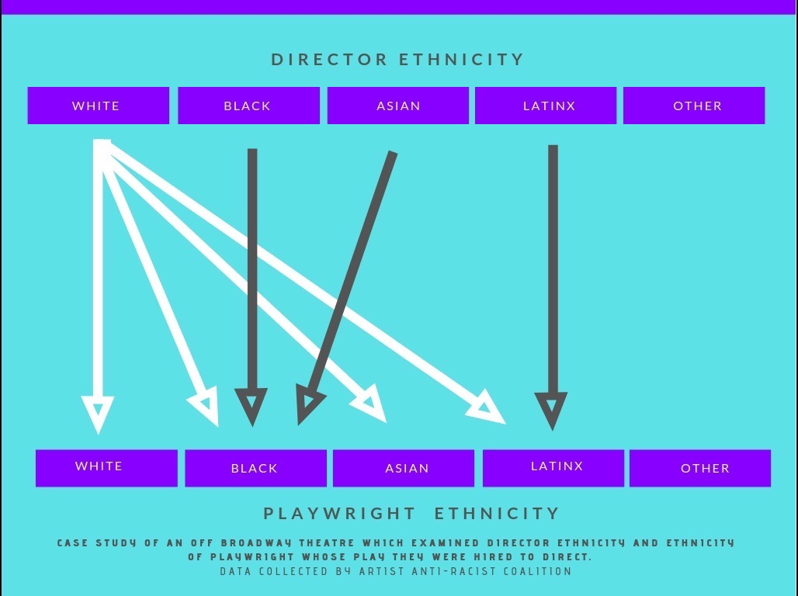
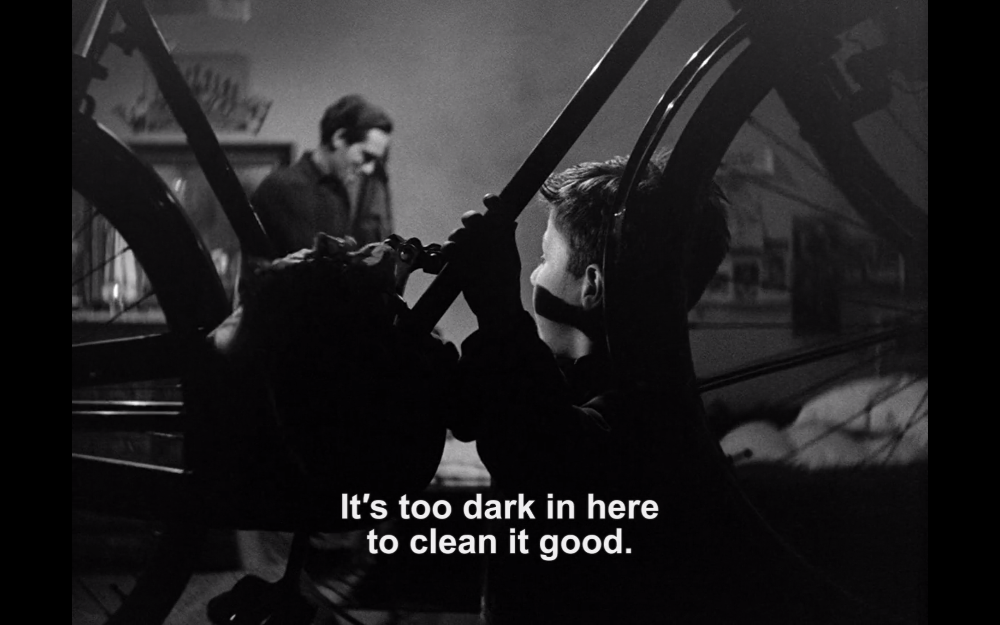

Hi friends,

Hope you’re having a good week.

++

When I was younger, I used to spend hours and hours discovering new music. It didn't matter if it was on online forums (sites like What.CD or RateYourMusic) or in physical record stores, there was still a constant feeling of discovery. I would make lists, comb through album art, go down genre rabbit holes, and continually be unearthing new things.

But things have changed.

Now, Spotify curates a Discover Weekly playlist for me each Monday, and gives me 6 new Daily Mixes every single day, along with constant other algorithmically quantified playlists. And yet, even with all that, I feel like I don't discover music anymore. Instead, I have it force fed me.

The oppressive efficiency of technology has led in practice to discovery being harder, despite it being in theory ceasier. As I was talking about with a friend recently, we crave human curation: hand-crafted recommendations from a real person who has a heart, who cares, who has passion.

It's the same feeling many of us have when opening Netflix: a strange sensation of not knowing what to watch at all, despite Netflix having determined what it thinks we should watch. This is a sort of [algorithmic dysphoria](https://kylechayka.substack.com/p/algorithmic-dysphoria-when-the-recommendations), a general unease that what the computers think of you is not *actually you*. Because these algorithms attempt to mimic our own unconscious by trying to detect what our tastes are, they often lead to an uncanny valley of discovery: the simultaneous feelings that you're missing out while still being overloaded with information.

##### SLOWiNG DoWN

With social media, push notifications, and algorithmic feeds, we mostly consume things from the last twenty four hours. We've been placed into a never-ending now, a present that has been stretched out into a stress-inducing infinity. This insatiable present is addicting, but fleeting.

Things that slow us down are becoming more and more valuable. These can be simple: a record store, laying under a tree, visiting a used book store, bird watching, an awareness of history.

_weird, serendipitous categories at Freebird Books & Goods in Brooklyn._

Art is another way to slow down.

Because art is partly nonsense. It is partly useless. It does not operate on an efficiency or productivity curve. It is slow, not interested in resolutions or answers but instead in reveling in questions and mysteries and pondering.

Whereas Silicon Valley hammers the complexity of our psycho-behavior into a logic, utility and money-driven set of wants, art and Slow Thinking seek the roundabout path. Logic-driven thinking is what gets us to the ugliness of Penn Station, forgoing the beauty of Grand Central because [ornamentation is unquantifiable and heretical to capitalism](https://www.currentaffairs.org/2019/02/death-to-minimalism). It's what gets us to [hostile architecture](https://gothamist.com/2019/08/14/hostile_architecture_nyc.php?fbclid=IwAR0Yd0kpF3Qe9Oj8lAlTHqk4JK71pF9Ft1QIZD4l-qSBiV6O0u5MBoXfwII), weaponizing a city against its poor, because there can be no public, non-commercial spaces. Spaces to dream and write and doodle, to think about things like art and mystery.

Art, of course, can be appropriated. It can be misused by corporations, media companies, and producers in ways that drive towards a bottom line. It can fall into commercialism, become expensive and inaccessible. This is what has largely happened to Broadway theatre in NYC—whereas theatre is an analog experience that lies beyond algorithms and in dreamlike presence, Broadway turns this into an experience to be quantified. That's how you end up with Scott Rudin producing theatrical madlibs like Sam Gold's *King Lear* starring Glenda Jackson and others.

But art, at its best, is an event that steps outside of the perpetual now of the attention economy, allowing us to shift our consciousness. It is erotic, in the complete sense of the word. In a live art, like theatre, it is analog and ephemeral, disappearing in the moment. The only place it has to live on is in the deep, unexplored corners of our brains, rumbling around and possibly coming back again.

It's telling that at the end of a great play, before applause sets in, the greatest, most profound response is also our most feared state: silence.

---

### 🍂 notes from the week

#### [who would tavi gevinson be without instagram?](https://www.thecut.com/2019/09/who-would-tavi-gevinson-be-without-instagram.html)

A really great, transparent piece written by Tavi Gevinson, one of the OG young digital natives, on how Instagram changed their life, giving her wealth and fame but also a lot of other problems. I found it both sad and eye-opening.

> For all my years growing up online, I am still unable to both rapidly and accurately manage so many realities at once: to account for hundreds of people’s feedback in a matter of minutes; to know what to give weight to and what to let go of, what to take at face value and what to read into, what strikes a chord because of a real insecurity I have and what strikes a chord because of a silly insecurity I’ve learned to have, what of other people is authentic or performance or both or neither, and how to catch my brain when it goes to this place

---

#### [should white directors direct plays by playwrights of color?](https://howlround.com/playwrights-color-white-directors-and-exposing-racist-policy)

Nicole Brewer in Howlround makes a case for No: because it’s actually racist policy. White directors are always allowed to direct plays written by a playwright of any ethnicity, whereas directors of color are generally hired to direct plays that align with their racial identity. This is a difficult conversation, and one I’m still thinking a lot about.

> **Hiring white directors to direct a play by a person of color—no matter if the playwright recommended them or if the artistic director made the decision—is a racist policy that allows racism to metastasize throughout the rest of the process**. This choice impacts the playwright’s work, the space in which actors of color create, and the experience of theatregoers of color who see the play. All artists have the choice to make and support work that upholds or opposes this racist policy.

---

#### [11 laws of showrunning](https://okbjgm.weebly.com/uploads/3/1/5/0/31506003/11_laws_of_showrunning_nice_version.pdf)

This obscure pdf by Javier Grillo-Marxuach from 2016 on how to run a contemporary TV show was recently re-surfaced to me. Despite not knowing his work at all, I found a lot of it to be really great and widely applicable beyond running a TV show. It touches on general creativity and any sort of leadership. My favorite part, though, was the end:

> Whether you choose to embrace this truth, **you owe it to the people who have signed up to work for you to not visit upon them the traumas of your past because that is the only way you think you can perform on the page**. You also owe it to them to come to **reckoning with the truth that your creativity and your pain are not one and the same**, and that the need to believe that in order to get the work done is incompatible with your current lot.

---

#### some more notes on phones in theaters

[A few weeks ago](https://guscuddy.substack.com/p/the-curtain-91719-) I wrote about [the state of audiences](https://www.guscuddy.com/2019/09/28/state-of-audience/), and considered whether phones have any place in the future of theatre. I’ve had some good discussions about that piece, and still don’t know where i really stand.

This issue has only continued to explode, as actor Joshua Henry [took an audience member’s phone away from him in the middle of a performance](https://www.nytimes.com/2019/10/06/theater/theater-etiquette-cellphone-anne-sophie-mutter.html). People continue to be divided on this. Some institutions are locking down no-phone performances with the new phone-sealing service Yondr, while others are experimenting with more relaxed and casual rules surrounding phone use. I don’t know which way it’s going to go.

In the SF Chronicle, [Lily Janiak argues](https://datebook.sfchronicle.com/theater/the-dog-whistle-of-phones-in-theater-or-why-audience-behavior-is-always-the-wrong-conversation) that conversation about audience behavior etiquette is always the wrong conversation, which is similar to the case I made.

---

#### jeremy o. harris and sara holdren corner

I just needed to start a new section where I rounded up all the latest news on these two since it seems that’s been half of my newsletters lately:

-   [Aisha Harris in the New York Times on Slave Play](https://www.nytimes.com/2019/10/07/opinion/slave-play-broadway.html)

-   [Sara Holdren in conversation with Taylor Barfield](https://www.vulture.com/2019/10/review-of-jeremy-o-harriss-slave-play-on-broadway.html) on Slave Play opening \[BONUS SARA HOLDREN CORNER: [her beautiful final review](https://www.vulture.com/2019/10/review-of-will-arberys-heroes-of-the-fourth-turning.html), on Will Arbery’s latest\].

-   [Michael Breslin twitter thread on the bad criticism of Harris](https://twitter.com/mischabreslin/status/1181560375071903745)

---

### End Note

_bicycle thieves_

_++_

_That’s all for this week—thanks so much for reading!_

_If you enjoyed this, please forward it to some friends. If you’ve been forwarded this email and want to receive The Curtain every Tuesday, sign up below:_

[Sign up now](https://guscuddy.substack.com/subscribe?)

_As always, you can reply directly to this email and I’ll receive it. So feel free to do that about anything._

_See you next week,_

_\-Gus_
