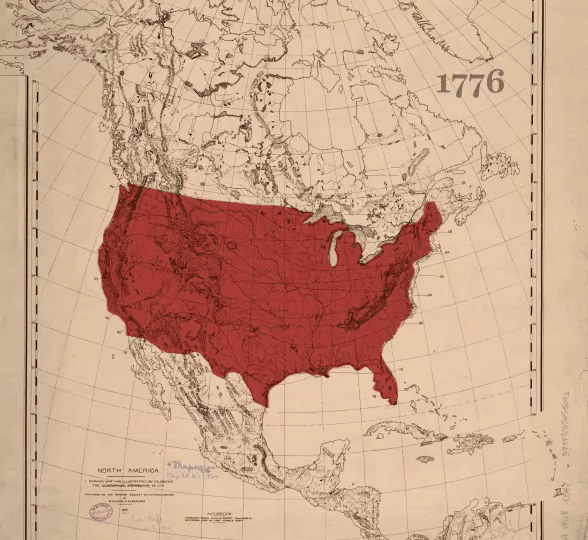
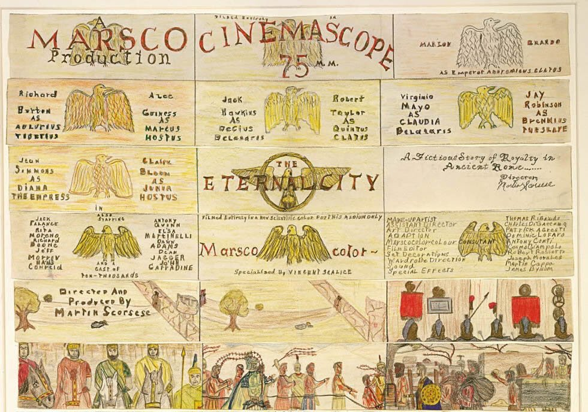

Hi friends,

Hope you’re having a great week!

++

### On Unforgettable Art

_**Simple and complex are not opposites.**_

The Safdie brothers make entertaining-as-hell, anxiety inducing movies that are also subversive, getting at deeper truths. Simple stories that stick in your head. In _Good Time_, Robert Pattinson plays a bank robber on a job that goes horribly awry. The plot is straightforward; its after-effects are not. 

Here’s how [they put it](https://a24films.com/notes/2017/08/a-note-from-the-safdie-brothers):

> We’ve often been dually obsessed with a specific type of genre movie. **Thrilling movies that were after something else as subtext**. Popcorn films... Termite art... **Stuff that you consume and later on find that you’ve got these termites inside of you refusing to go away, begging you to answer questions from the film**.

As I’ve been working with my buddy Elijah on writing our own web series, I keep thinking about that idea. _It doesn’t need to be complicated to be complex. It doesn’t need to be simplistic to be simple._ It can be entertaining and exhilarating and also be unforgettable.

The termites metaphor is a good one. Great art has an elemental and physical quality to it, as it burrows its way into your subconscious. 

Some great art treats this literally. We’ve been obsessed with _Succession_, which just ended its very entertaining and unforgettable second season. In a recent piece for the Atlantic, Megan Garber analyzed its world [in terms of its literal nature metaphors and language](https://www.theatlantic.com/entertainment/archive/2019/10/why-succession-works-so-well-horror/599932/) (spoilers for season 2 in that link). Characters insult each other as bugs and animals. And there is a physicality and elementality to the action and details: many scenes set in bathrooms, an unusual focus on human waste, and the persistent menace of nature. As Garber puts it, “_Succession_ is an itchy show.” Again with those damn termites.

..

Playwright Will Arbery (_Plano_, _Heroes of the Fourth Turning_) recently appeared on the new theatre podcast _[Upstage Left](https://podcasts.apple.com/us/podcast/upstage-left-intimate-conversations-with-new-york-theater/id1453432747)_, where he talked about his new play and his thoughts on theatre. Here were my takeaways:

**Mystery:** Great plays have mystery, a sense of the unanswerable. Questions that are more significant than answers. An easy message or moral—or even an easy question—is a recipe for forgetting. And plays (great ones) should be unforgettable. In the Safdies’ words, they should plant these termites in your brain that won’t go away. (This is how I felt with _Plano._ And I see _Heroes_ this weekend.)

Don’t provide easy answers. Don’t wrap up nicely. The point of art is not to answer definitively what something means. (Instead, watch a documentary or read an essay.) Theatre is about spending time with people in the same room and witnessing, hearing and having hard, investigative conversations, not reaching for solutions.

**Invitations:** As a playwright, you must build in invitations for other artists to crawl into the play and make it their own. There is an inevitable push and pull between the inevitability of the script and the beating hearts of the actors, designers, and director. This tension leads to magic, the liminal space of unconscious minds connecting.

**Whiteness:** Not enough white artists wrestle with their own whiteness, and the legacy and pervasiveness of white supremacy. (Artists of color have been doing this for a while now.) We need work that exposes itself, gets deep and vulnerable, and reaches somewhere scary, finding new ways to investigate and undo white supremacy and the patriarchy. Arbery has stated this was his goal with _Heroes_:

https://twitter.com/willarbery/status/1182424401813397504

In other words: _great work is in conversation with the visible world, while simultaneously diving deep and exploring the invisible world of the unconscious and uncanny._

..

> **The parts that embarrass you the most are usually the most interesting poetically, are usually the most naked of all, the rawest, the goofiest, the strangest and most eccentric and at the same time, most representative, most universal.**

**\- Allen Ginsberg**

---

## **🗒 Notes from the Week**

#### **[wesley morris on black theater's moment](https://www.nytimes.com/interactive/2019/10/09/magazine/tyler-perry-black-theater.html%0A)**

> He’s \[Tyler Perry\] there in the salaciously dysfunctional couplings of Jeremy O. Harris (“Slave Play,” “Daddy”), in the rambunctious episodic sketches of Jordan E. Cooper (“Ain’t No Mo’ ”), in the time warps and fraying family ties of Jackie Sibblies Drury (“Fairview,” “Marys Seacole”) — as an idea, as an energy, to be channeled, harnessed and critiqued. The Tyler Perry problem is really an ancient, larger worry about blackness and how to present it. How loud is too loud? How black is too black?

> **America needs a black theater. But black theater needs to be all over America, challenging, questioning, provoking, freaking people out, because these actually aren’t only black plays. They’re plays about race, and the experience of one race watching another, watching it not only suffer and struggle but also inspect itself.**

Another wonderful piece from Wesley Morris.

---

#### **helen shaw is the new ny mag critic**

After we [bemoaned the loss](https://www.guscuddy.com/2019/09/28/state-of-criticism/) of Sara Holdren a few weeks ago, Vulture/NY Mag announced that [Helen Shaw](https://twitter.com/helen_e_shaw?lang=en) is taking over as its theatre critic. Shaw is one of my other favorite theatre critics working right now.

Here she is in [an interview with](https://www.americantheatre.org/2019/10/11/helen-shaw-wants-to-be-the-anthony-bourdain-of-theatre/) _[American Theatre](https://www.americantheatre.org/2019/10/11/helen-shaw-wants-to-be-the-anthony-bourdain-of-theatre/)_:

> **Here’s my actual goal: to be the Anthony Bourdain of theatre in New York. I want to say to readers: You have no idea that you want to go to this weird corner and eat these spicy noodles, but trust me, you’ll love it. If I could do one millionth of that for theatre, I’d be happy.**

---

#### **[Maria Dizzia is going to play Heidi Schreck's role in the](http://www.playbill.com/article/tony-nominee-maria-dizzia-to-star-in-what-the-constitution-means-to-me-in-la-and-chicago)** _**[What the Constitution Means to Me](http://www.playbill.com/article/tony-nominee-maria-dizzia-to-star-in-what-the-constitution-means-to-me-in-la-and-chicago)**_ **[tour](http://www.playbill.com/article/tony-nominee-maria-dizzia-to-star-in-what-the-constitution-means-to-me-in-la-and-chicago) (!)**

---

#### **150 Years of Colonization**

_[Native American land loss from 1776-1930, via Ranjani Chakraborty:](https://twitter.com/ranjchak/status/1183723221104975872)_

 

---

#### **[Feral Hogs are taking over Texas](https://gimletmedia.com/shows/reply-all/n8hw3d)**

a weird + fascinating reply all episode.

---

### **🍂 End Note**

 

_storyboards by an 11 yr old Martin Scorsese_

_++_

_That’s all for this week—thanks so much for reading!_

_If you enjoyed this, please forward it to some friends. If you’ve been forwarded this email and want to receive The Curtain every Tuesday, sign up below:_

[Sign up now](https://guscuddy.substack.com/subscribe?)

_As always, you can reply directly to this email and I’ll receive it. So feel free to do that about anything._

_See you next week,_

_\-Gus_