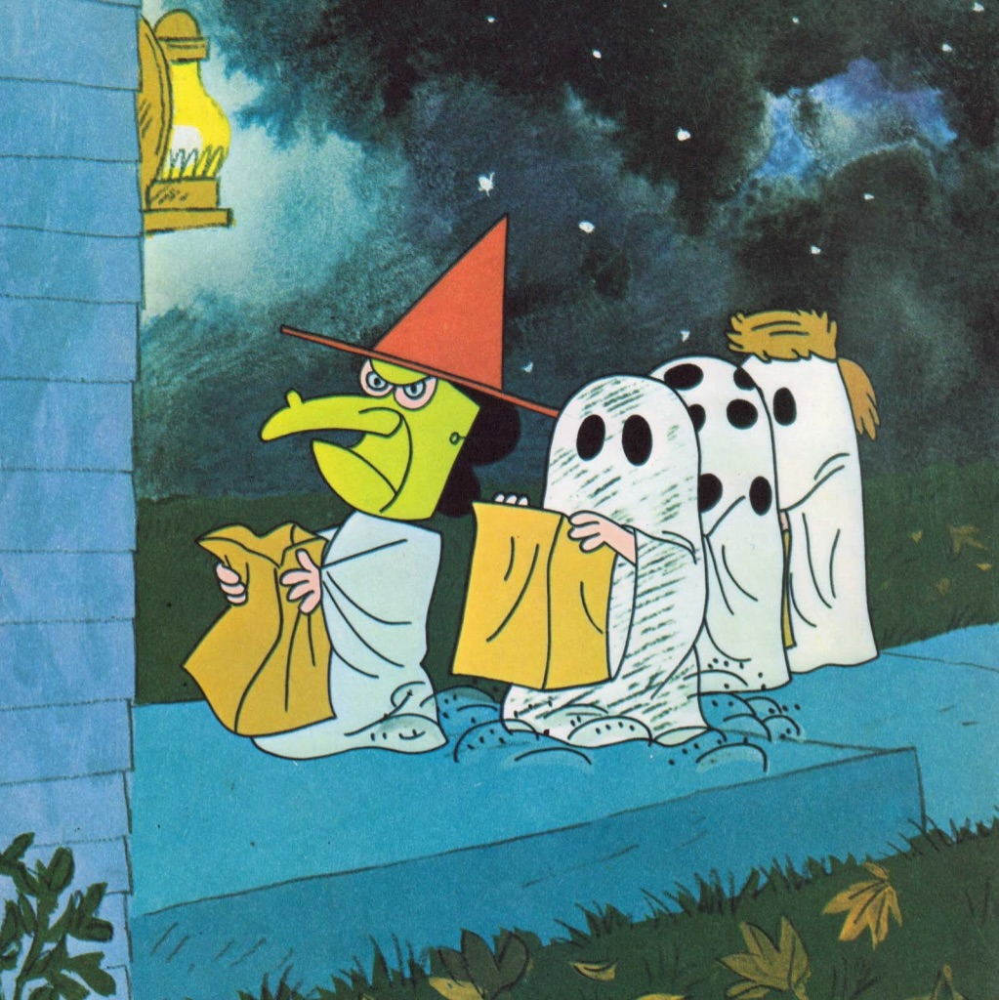

Hi all,

In an age where "getting ghosted" is a part of daily life and language, I am fascinated by how ghosts appear in different forms in our lives and in our art.

So a halloween-y essay/exploration on ghosts below. Let me know what you think.

Then some interesting notes from the week. Enjoy!

++

#### [Ghost Stories](http://guscuddy.com/2019/10/22/ghost-stories/)

The history of theatre is littered with ghosts and spirits. From _Hamlet_ to ghost lights to Ancient Greeks to contemporary plays, theatre has always explored the nature of here and there, life and death, reality and unreality. They are one of the most used and accessible tropes there is.

But ghosts surround us all the time in life, too. We speak of "getting ghosted" when we don't get a response from someone, as if they have disappeared into thin air. When we re-visit our home town after being away for months, we are haunted by ghosts: stores and buildings that have closed for an uncertain amount of time; memories of that street in the night; old songs that used to play on the radio. (There's that scene towards the end of _Before Sunrise_, when the streets and locations that seemed so magical in the night suddenly look so mundane in the morning light — those too have ghosts.) Walking around New York City, you are surrounded by the ghost map of your experiences in the city, mingling with the ghosts of the city's history. It might seem that ghosts and nostalgia are the same, but I don't think they are: ghosts visit us, whereas nostalgia is a feeling, often  unhelpful, that we get and indulge.

Of course, ghosts are also the most basic common unit of the fall classic: the scary movie. 

Scary movies and scary television have had quite the renaissance in the past few years, with more "artistic" and "prestige" efforts behind them, supported by the likes of Netflix, A24, or Jordan Peele. Movies like _Get Out_, _It Follows_, _The Witch_, _It_, _Hereditary_, _Us_, _A Quiet Place,_ or the 2019 Bong Joon-ho international hit _Parasite._ TV shows like _Stranger Things_, _Twin Peaks_, _The Walking Dead_, _Black Mirror_, or _American Horror Story_ traffic in scares in different degrees as well.

The broad revelation for many of us was that ghosts and horror speak to our current climate perhaps more clearly than any other genre. In a world on the brink of collapse in many different forms, in a white supremacist country, stories that speak to both the obvious and repressed horrors of 21st century civilization feel, despite their fantastic or supernatural elements, like truth. 

But while ghosts have been around theatre forever in different forms, you're hard pressed to find truly scary theatre. Shakespeare's bloody works, like _Macbeth_ or _Titus Andronicus_, are not really "scary" by today's standards, though certain productions can amp up the violence. The problem has a lot to do with scares being a micro form: the movie or TV director can control where we look. Theatre, however, cannot: the eye sees what it wants to see.

Earlier this year, however, I saw what I thought was perhaps the most successful scary theatre piece I've experienced (Lucas Hnath's _The Thin Place_ at the Humana Festival, which starts soon at Playwrights Horizons). And since then, I've experienced several pieces I would classify as horror theatre, ranging in form and success, but all speaking to something deep and true. It seems I was wrong: there is room for scary theatre, and it's often even scarier than movies.

_The Thin Place_ succeeded, for me, in part because of its consideration of theatre in three dimensional space. The fact that theatre exists in a room—and that there are many qualities to this room, as its lit by various lights—is such an obvious one that we sometimes forget that the most exciting theatre finds a way to sculpt energy in the space. Space is something that films cannot quite capture, in a visceral sense. Whereas at the movies we're seeing pictures laced together, in theatre we're not seeing pictures at all: we're seeing bodies and words and energy in space.

Will Arbery's explosive and terrifying _Heroes of the Fourth Turning_ also uses space and darkness, with a prologue that forces us to strain our eyes to see what's going on. Characters disappear into shadows, literally — it's not a trick of the camera — and we half expect a ghost to pop out. Instead, we're treated to sounds: the disturbing resonance of a real gunshot, and a horrifying screeching noise that a character says is from their generator.  

Arbery's work, though, is a different kind of scary: while it does use horror tropes, it's more of an intellectual horror piece, in the literal sense. As a group of conservatives gather in Wyoming, we see incredibly specific and fully drawn out characters spit out some of the most revolting right-wing ideas New York liberals can hear. The sensation I felt was an odd mix of fear, anger and sadness I've never quite felt in a theatre before: like my blood was actually boiling. The scariest part, besides that these ideas are real and exist and people believe them, was how hyper-articulate and smart the characters are: they have such conviction that they are right, even as they argue and fret over the nuances and types of conservatism, quoting philosophers and literature, that you feel like your own ideas about the world are being assaulted. There's no liberal character there to save you from these ideas, and the conservative characters aren't cartoons. When they speak of the "war" that is coming, it's as eerie and frightening as anything I experienced in Bong Joon-ho's new movie _Parasite_. And there's something magnetic and unnerving about plays that exist in real-time, building tension as we don't know formally how they will unfold.

_Heroes_ has been a bit of a polarizing show: on the one hand, it has been embraced by conservatives and catholics who finally feel "seen", and on the other hand it's been hailed by liberal critics as being a nightmarish horror play. Arbery is transposing his own catholic conservative upbringing to the stage in a work of incredible vulnerability — but it's been fascinating to see how different people interpret and experience the play in wildly different ways, as nightmare or reality, as horror play or sentimental play.

In Alexis Scheer's new play _Our Dear Dead Drug Lord,_ ghosts and a seance are again on the table, like Hnath's _Thin Place_. While I couldn't ultimately vibe with the production completely, it does offer a thrilling ghost trick in its final twenty minutes that was surprising and exhilarating. These sorts of tricks that break our expectations of what theatre is supposed to be are always the most exciting; they are what make theatre unique — if a production is innovative enough, anything can happen. And that uneasiness and uncertainty is scary.

Ghosts, in all their shapeshifting forms, reach far and wide and also deep into us and our subconscious, whether in life or in art, beyond just the month of October.

---

## **🗒 Notes from the Week**

#### **[What can we learn from art museums when it comes to new plays?](http://jeffreymjones.blogspot.com/2007/10/thinking-about-writing-about-thinking.html)**

In an old essay from 2007, Jeffrey Jones considers whether we just don't have the language to talk about new plays: it’s not the playwrights' fault if audiences don’t get something, but rather a problem in the framing. After all, he argues, don't we go to a museum and expect some sort of context?

> Theatre, unless I have been missing something, has spent almost no effort or energy in defining, let alone disseminating, a core set of terms and concepts by which new plays might be discussed and understood. 

---

#### **The lightning thief musical tweets like netflix**

I guess this companies-tweeting-like-people trend (complete with personas and lower case letters) is coming to Broadway. Here, we see _The Lightning Thief_ musical (yes, you read that correctly) contextualize its mostly bad reviews:

http://twitter.com/LTMusical/status/1184953692006633474

---

#### **[Damon Lindelof on nostalgia](https://www.rollingstone.com/tv/tv-features/watchmen-damon-lindelof-interview-896780/)**

> "I think nostalgia is dangerous. It's toxic. I don't want to get political, but this idea of, "Let's travel back to the past," particularly when you look at that idea through the construct of race and racial inequality in our country, that is bad. I see malevolence in Norman Rockwell paintings, and I wanted to talk about that, too."

His remix of _Watchmen_ started this Sunday.

---

#### **[The trouble with podcasts](https://alexdanco.com/2019/10/17/the-audio-revolution/)**

A piece on why audio and podcasts are Hot (in Marshall McLuhan terms), the most information-dense type of media we consume, and why we maybe should think carefully about what's being pumped into our ears: 

> But ever since I’ve stopped, I’ve noticed something change about my own writing and thinking. My brain is quieter. It’s clearer, and easier to navigate; like the gain on an amplifier had been cranked up for a long time, and we forgot about it, and only when you turn it down do you realize, “Hey that was a lot”.

---

#### **AOL Chat Rooms from the early internet are strange**

 

---

#### **Werner Herzog on making movies**

**“The best advice I can offer to those heading into the world of film is not to wait for the system to finance your projects and for others to decide your fate**. If you can’t afford to make a million-dollar film, **raise $10,000 and produce it yourself**. That’s all you need to make a feature film these days. Beware of useless, bottom-rung secretarial jobs in film-production companies. Instead, so long as you are able-bodied, head out to where the real world is. **Roll up your sleeves and work as a bouncer in a sex club or a warden in a lunatic asylum or a machine operator in a slaughterhouse**. Drive a taxi for six months and you’ll have enough money to make a film. **Walk on foot, learn languages and a craft or trade that has nothing to do with cinema**. **Filmmaking – like great literature – must have experience of life at its foundation**.”

---

#### **[Elena Ferrante on Writing Poetic Prose](http://www.theguardian.com/lifeandstyle/2018/dec/15/elena-ferrante-on-poetry-v-prose)**

The difference between poetry and prose, in Ferrante's eyes, is clear. There's a reason her writing has a sort of clear simplicity to it:

> But **writing prose with the rhythm, the harmony, the images that characterise a poem is a death trap**. What in verse can give form to a dazzling truth, in prose becomes the falsest of affectations. The sentence takes on a rhythmic cadence, the words and images are sentimental, the need to avoid the ordinary leads to bizarre formulations and artificial expressions

> **Then I said to myself that poetry – or, if you prefer, beauty – should be achieved line by line, through the medium of prose – that is, keeping strictly to a form of expression that is effective and clear.**

---

## **🍂** End Note

 

_the colors in_ it’s the great pumpkin, charlie brown _are so magnificent_

_++_

_That’s all for this week—thanks so much for reading!_

_If you enjoyed this, please forward it to some friends and/or enemies. If you’ve been forwarded this email and want to receive The Curtain every Tuesday, sign up below:_

[Sign up now](https://guscuddy.substack.com/subscribe?)

_As always, you can reply directly to this email and I’ll receive it. So feel free to do that about anything._

_See you next week,_

_\-Gus_