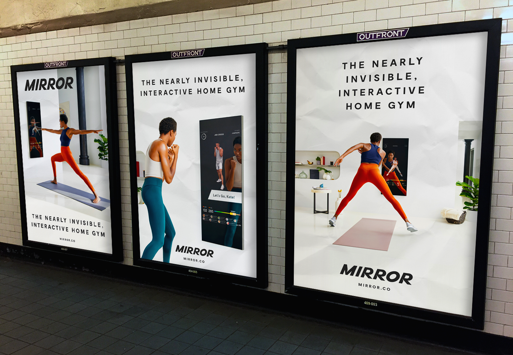
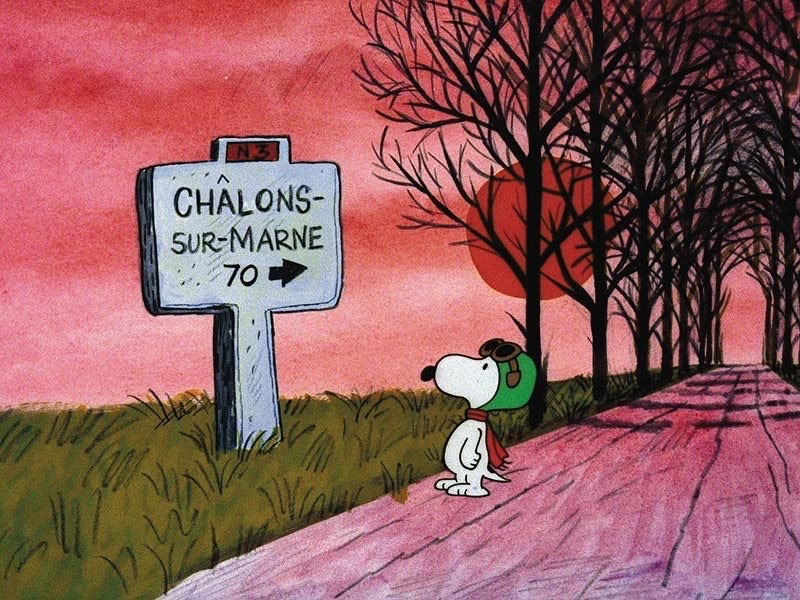

Hey everyone,

First, really scary stuff happening in California. The Kincade Fire has grown to 75,000 acres, and strong winds have been making it spread even faster. It’s currently only at 15% containment. This type of ecological disaster is awful and almost apocalyptic. It’s also a peak into the future, if we don’t make global changes fast.

++

Happy Halloween to everyone! Halloween is one of my most favorite holidays, because of how strange it is, and how close to the dead we are.

Anyway.

Some further expansions on the theme of the unconscious in art below. Then, great notes from the week.

---

#### What We Talk About When We Talk About the Unconscious

One of the main drivers of all great artists throughout history is not money, prestige, or helping people. Instead, it’s to bridge the space between the conscious and [unconscious](https://www.guscuddy.com/2019/06/25/art-and-unconscious/) worlds. To get the voices out of your head. To achieve some sort of quiet.

Art that comes from the unconscious also gets at a deeper mystery, for audiences. Mystery allows both our System 1 Brain—the quick thinking one—and System 2—the slower, effortful one—to operate in full. Sometimes it can seem a work isn't clear, when it's actually just [provoking disagreement from our own unconscious](https://twitter.com/chris_shinn/status/1116482341105483778) — our deeper, slower brain that we haven’t yet reconciled with.

The deeper you go, the more you expose and reveal, the more you pull from the raw and embarrassing stuff deep inside: the more compelling and also mysterious the art. Art that burrows towards a deeper truth, that in its central conceit mirrors the mystery of life and consciousness itself — that feeling of being anything at all, instead of nothing. This, as far as I know, is true in pretty much every form: visual art, music, movies, theatre, literature, etc.

Shallow introspection leads to shallow art. Or, in the words of David Lynch: "Little fish swim on the surface, but the big ones swim down below."

\*\*

**What does it mean to create from the unconscious?**

Life is not simple. It's filled with weird abstractions, ambiguity, complex patterns, and violence. For artists, the way through is to trust the unconscious, which is to say develop some sort of intuition.

For instance, as an actor, any attempt at conscious planning of "what's going to happen" will result in deadly, stilted performance. It may be able to fool some people on the surface for a short while, but soon audiences will realize that the work isn't in touch with the deeper layers of the human experience. In other words, it was created from the conscious, not the unconscious.

But what does it exactly mean to create from the unconscious?

For one, listening. Says Greta Gerwig: 

_"I spend a lot of time **listening** to what my characters are trying to tell me about who they are, and they’re always telling you. It’s the **mysterious** part of writing, where you have all this craft and you spend all this time making it as good as it can be, and then at the same time, **your unconscious knows more than you do**, and you have to keep that channel open."_

The strange thing about listening to the unconscious, of course, is that it doesn't really speak, because it is ancient. Instead, it [operates in images, metaphors, pictures, and dreams](http://nautil.us/issue/47/consciousness/the-kekul-problem). The job of the artist is to translate those into work.

> I always say, ‘Write in a trance and act in a trance.’ You don’t want to think consciously about what you’re putting on the page.

\- Mike Birbiglia

\*\*

**Unconscious in Theatre**

In theatre, the tradition for space and design has been a neutral open platform, all the way back to the Elizabethan stage. (This is why it bothers me when people talk about empty spaces in theatre being some sign of pretentious modernity.) 

These neutral, open, almost "incomplete" designs, coupled with great writing, allow for our unconscious brains to fill things in for us. (See: [the designs of Hildegard Bechtler](https://www.theguardian.com/stage/2019/oct/23/hildegard-bechtler-in-pictures).) They invite us in, rather than consciously telling us everything and shutting our unconscious out. It's just like with acting and all art, in that way: they can't be so literal and conscious-brained to stay on the surface. When theatre hits these marks—is truly vulnerable—it has a lightness and a feeling of being "limitless", as playwright Jeremy O. Harris and director Danya Taymor put it in [a podcast for Vineyard Theatre](https://player.fm/series/theatre-uncorked/episode-10-jeremy-oharris-and-danya-taymor).

It's an arena where the visible and invisible meet. Where we lay down the burden of consciousness for a bit, and see our own inner worlds laid bare.

---

## **🗒 Notes from the Week**

_This week, I’ve divided the notes into “Theatre” and more general “Culture”. So if you’re not interested in Theatre you can just scroll down to the next section!_

### 🎭 _theatre_

#### **Racist Box Office Practices at Second Stage**

Jose Solis tweeted a thread of his experience at the Helen Hayes box office, which has gained some legs on Twitter. The industry continues to disenfranchise audiences of color in whatever ways possible. An interesting and important side note is that the Box Office Union (which the Helen Hayes uses) is incredibly strong in NYC theatre, and also problematic.

http://twitter.com/josesolismayen/status/1186831453620973568

---

#### **[Annie Baker on Thinking Outside Genres](http://www.theguardian.com/stage/2019/oct/24/playwright-annie-baker-the-antipodes-national-theatre)**

> “**I’m not really that interested in genre**,” Baker admits. “I guess it goes back to my resistance to rules and conventions. If people say my plays span or incorporate different genres, I hope that just means they’re surprising. I do think both John and The Antipodes start out as somewhat innocent-seeming and then get a bit more mischievous, but that happened naturally.”

---

#### **Almeida to produce Daddy**

Will be interesting to see how Harris' work is interpreted in the UK.

http://twitter.com/AlmeidaTheatre/status/1187326464057860096

(And in other news, Jeremy O. Harris is [going to be on Late Night with Seth Meyers](https://twitter.com/LateNightSeth/status/1188893908014632966) this week.)

---

### **🧫** _**culture**_

#### **[Everything in Startup Culture is Fake and Nothing Makes Sense](https://www.theatlantic.com/ideas/archive/2019/10/say-goodbye-millennial-urban-lifestyle/599839/%0A)**

Derek Thompson in The Atlantic writes how the urban millennial lifestyle is about to become a lot more expensive, after WeWork's truly disastrous IPO attempt: more focus on profits, less on magic. Which is bad news for everyone. The thing that’s so hard to grasp: none of these companies actually make any money!

> If you wake up on a Casper mattress, work out with a Peloton before breakfast, Uber to your desk at a WeWork, order DoorDash for lunch, take a Lyft home, and get dinner through Postmates, **you’ve interacted with seven companies that will collectively lose nearly $14 billion this year.** If you use Lime scooters to bop around the city, download Wag to walk your dog, and sign up for Blue Apron to make a meal, that’s three more brands that have never recorded a dime in earnings, or have seen their valuations fall by more than 50 percent.

---

#### **Rectangular Wheat Fields are Fascist**

From James Scott's book _Against the Grain:_

> The key to the nexus between grains and states lies, I believe, in the fact that only the cereal grains can serve as a basis for taxation: visible, divisible, assessable, storable, transportable, and “rationable.”

---

#### **[The Four Most Successful Media Franchises Ever Are All Animated](https://en.wikipedia.org/wiki/List_of_highest-grossing_media_franchises)**

1.  Pokemon ($90B)
    
2.  Hello Kitty ($80B)
    
3.  Winnie the Pooh ($75B)
    
4.  Mickey Mouse & Friends ($70B)
    

From the great piece [Animation is Eating the World](https://www.michaeldempsey.me/animation).

---

#### **Bad Subway Startup of the Week**

 

New: a mirror that you can place in your lonely, sad, minimalist mansion that also lets you work out by yourself! And it only costs $1500!

---

#### **Good Criticism of the Week**

Two great tear downs:

*   [Richard Brody on how](https://www.newyorker.com/culture/the-front-row/springtime-for-nazis-how-the-satire-of-jojo-rabbit-backfires) _[Jojo Rabbit](https://www.newyorker.com/culture/the-front-row/springtime-for-nazis-how-the-satire-of-jojo-rabbit-backfires)_ [backfires](https://www.newyorker.com/culture/the-front-row/springtime-for-nazis-how-the-satire-of-jojo-rabbit-backfires)
    

*   [Pete Wells zero star review of Peter Luger Steak House](https://www.nytimes.com/2019/10/29/dining/peter-luger-review-pete-wells.html)
    

---

## **🍂 End Note**

 

_That’s all for this week—thanks so much for reading!_

_If you enjoyed this, please forward it to some friends and/or enemies. If you’ve been forwarded this email and want to receive The Curtain every Tuesday, sign up below:_

[Sign up now](https://guscuddy.substack.com/subscribe?)

_As always, you can reply directly to this email and I’ll receive it. So feel free to do that about anything._

_See you next week,_

_\-Gus_