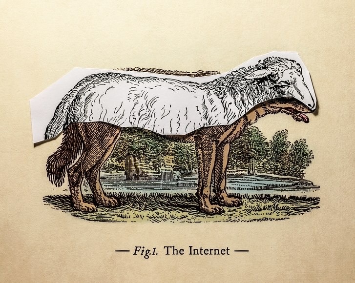
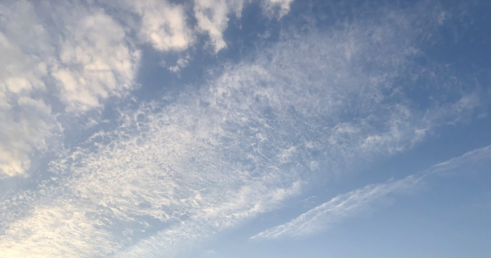

Hi friends,

Welcome to The Curtain, a weekly newsletter about culture, theatre, creativity, and other things. It’s written by me, [Gus Cuddy](http://guscuddy.com).

If you’ve been forwarded this email, you can sign up for yourself here:

[Sign up now](https://guscuddy.substack.com/subscribe?)

++

I’ve been thinking and writing a lot about slowness recently. Today’s essay is continuing to unpack what that means in today’s world, especially as it relates to creating art that doesn’t make money.

++

This is my 30th issue! Thanks for reading. If you know anyone who you think might enjoy these, please feel free to forward it to them, and tell them to sign up!

---

### The Unprofitability is the Point

In a [recent interview](http://www.theguardian.com/stage/2019/oct/24/playwright-annie-baker-the-antipodes-national-theatre) with The Guardian, playwright Annie Baker said something that stuck with me: _"I like theatre because it's so unprofitable."_

In the past, this is something that has bothered me. Shouldn't theatre do a better job at selling itself? (It actually should—but that's for another essay.)

Baker is embracing the unprofitability of theatre as something that makes it stand out in a capitalist culture that only values the bottom line, and something that makes it essential (though misunderstood). The truth is, there's not much place for art—especially of the analog variety—that is unprofitable. (That's partially why in the UK and Europe, the arts are subsidized.)

But even if, as in some cases, the art _is_ profitable, this profitability is not the point of art. Instead, the unprofitability is the point.

In Jenny Odell's new book _How to Do Nothing_, she quotes surrealist painter Giorgio de Chirico:

> _In the face of the increasingly materialist and pragmatic orientation of our age…it would not be eccentric in the future to contemplate a society in which those who live for the pleasures of the mind will no longer have the right to demand their place in the sun. The writer, the thinker, the dreamer, the poet, the metaphysician, the observer…he who tries to solve a riddle or to pass judgement will become an anachronistic figure, destined to disappear from the face of the earth like the ichthyosaur and the mammoth._

In other words, a future where anyone who dares to create something that is unprofitable is beaten down and ostracized by society. That future, more or less, is now—a world in which linear technological optimization, disruption, and profitability replace anything that is inefficient, analog, poetic, or unprofitable.

#### **Manifest Destiny, Neoliberalism and Techno-Utopianism as Titans of Profitability**

> _What the tastes of neoliberal techno manifest–destiny and the culture of Trump have in common is impatience with anything nuanced, poetic, or less-than-obvious. Such “nothings” cannot be tolerated because they cannot be used or appropriated, and provide no deliverables._
> 
> _\- Jenny Odell, How to Do Nothing_

There is a pervasive myth in the culture of Silicon Valley that Technology is, by nature, Good. It standardizes, levels, and innovates, delivers exorbitant profits to its founders, and supplies new (shitty) jobs to the economy. As someone who considers himself an optimist when it comes to technology, this can be a tough pill to swallow: innovation—especially profit-driven innovation—is not necessarily positive. 

For instance, when Gutenberg invented the Printing Press, there was a revolution in the ways information was transferred. (This story is not so clean cut in actuality—[there were several different iterations of printing before Gutenberg](https://en.wikipedia.org/wiki/Movable_type)—but, like Steve Jobs, the entrepreneurial Gutenberg is the one we remember as iterating on and popularizing a technology.) This revolution enabled books to be reproduced ad infinitum and literacy to spread (gradually). But the paradigm shift of movable type—that is, the mass production of a repeatable commodity—is the basis of the assembly line and 20th Century industrialism: a set of practices that caused immense violence and injustice. We can't directly blame Gutenberg for Henry Ford, but we can ceaselessly question the idea that technological optimization is always the Good path forward.

Meanwhile, enabling the spread of mass information comes with misinformation—a problem we are acutely familiar with now, as well. So while Gutenberg's revolution empowered many important voices, it also wrought fakes and frauds and racists and white supremacists. Just as with Facebook, the idea of the gatekeeper having been eliminated is not quite telling the full story. The gatekeepers merely shifted from monarchists and aristocracies to powerful individual white men like Zuckerberg or Gutenberg. 

When 21st Century startups were founded, important and immensely consequential decisions about free speech were made with a quick click of a mouse, under the dumb guise of optimism. After all, who wants to think that their platform of "free speech" will become a ground for radicalization and real-world terrorism?

>  _“I remember thinking, People in government, on the Supreme Court, are way smarter than me,” Huffman \[founder of Reddit\] said. “So, if something’s not illegal to say under U.S. law, why should I make it illegal to say on Reddit?”_
> 
> _\-[The Dark Side of Techno-Utopianism](https://www.newyorker.com/magazine/2019/09/30/the-dark-side-of-techno-utopianism)_

These tech bros—now and throughout history—have the ingrained belief that there is an inevitable march forward of history, that Silicon Valley must change the world. It's the same idea as Manifest Destiny, of colonization: that this marching and (man-)spreading is not only justified but inevitable. That everything needs to be "disrupted" or appropriated. That stillness, maintenance, and quiet are weeds to be rooted out by algorithmic loudness.

#### **Loud and Quiet, Profitability and Unprofitability, Markets and Gifts**

If you've ever walked around New York City or taken the subway, it's impossible not to notice that it seems like almost everyone has AirPods or other headphones in their ears these days. As I write this from a cafe, everyone here has headphones in. And I'm as guilty of this as anyone else: for the last year, I've pretty consistently had to wear AirPods as I'm commuting or walking around Manhattan, lest I feel naked and alone.

It's as if everyday life has an unbearable loudness to it that we must all attempt to distract ourselves from by creating our own private space through our headphones. And this isn't necessarily literal loudness—though it certainly is in NYC—but a loudness of media and technology and distraction. So we pump podcasts and NPR and Spotify Discover Weekly into our ears, on top of the world's loudness.

But all this noise is doing something to us. One argument is that audio is largely a high-resolution media—meaning it's in our face, giving us information—and that this is [affecting our brain circuitry](https://alexdanco.com/2019/10/17/the-audio-revolution/). Our brains are getting more and more wired to expect to be saturated by information-dense, non-participatory noise, whether it's via podcasts, Youtube, talk radio, or just background music. Meanwhile, these changes have led to our society moving away from nuance and openness, instead electing a president who thrives off discriminatory, closed-minded and racist soundbites.

Our urban ecosystem—stoked on by startups and a podcast boom—is so [loud, pervasive and Hot](https://leoncoe.substack.com/p/modern-cigarettes-loudness) that it mutes our senses from distinguishing the subtler, Cooler shades of nuance. There's no more room for quiet, no more room to think.

Which gets us back to unprofitable art.

Unprofitable art is, in capitalist terms, useless. But more than that, much of analog art requires some level of nuanced thinking, is "Cool" and participatory. We actually must engage with it, rather than it coming directly to our ears.

It's no wonder, then, that this sort of art is unprofitable. Our culture is primed to rebel against slowing down in any way. But I also think, like Annie Baker, that this art is more important than ever, and in as much danger as ever. Great art is not defined by its profitability, the lure of capitalization, or the push and pull of markets. Instead, it is a gift.

In Lewis Hyde's seminal book _The Gift_, he lays out the idea of a gift economy:

> **That art that matters to us—which moves the heart, or revives the soul, or delights the senses, or offers courage for living, however we choose to describe the experience—that work is received by us as a gift is received**. Even if we have paid a fee at the door of the museum or concert hall, when we are touched by a work of art something comes to us which has nothing to do with the price.

Great art that "revives the soul" is not found in the perpetual march of technology, or the Heat and loudness it brings. It's not maximally optimal, easily marketed, or simplistic. Instead, it's complex, nuanced, patient, Cool, and participatory. It's poetry, it's painting, it's theatre. It's weird and surprising. It comes from dreams and doing nothing. It's a gift. The unprofitability, not the profitability, is the point.

---

## ⚡️ Notes from the Week

#### **[How do your actions create burnout for others?](https://annehelen.substack.com/p/what-great-inconvenience)**

One thing that's difficult to reconcile with when living in a major city is how complicit so many of us are in contributing to a society that is unjust for others. This can be true in interpersonal relationships, but it's doubly true and more difficult to control when we are engaging with the "conveniences" many startups afford. 

> Think deeply and consistently about how your own actions, and standards, and practices create burnout in others
> 
> Are you willing to embrace that truly slight inconvenience — and maybe pay a few dollars more — so that a person’s job is significantly less shitty?

---

#### **NYC continues to weaponize itself against its poor**

It's unfathomable how much the MTA spends on trying to crack down on fare evaders, instead of improving an ancient Subway system. Their latest:

http://twitter.com/rosadona/status/1190289055126360065

---

#### [On Making Movies (and Art)](https://twitter.com/chrismcquarrie/status/1187023381251670017)

A good thread by screenwriter Chris McQuarrie on making movies:

> **After twenty five years in the craft, I’ve learned the secret to making movies is making movies - starting with little movies no one will ever see. The secret to knowledge is doing and failing - often and painfully - and letting everyone see.**

---

#### _the internet_

 

_[Illustration by Javier Jaén / Source: Getty](https://www.newyorker.com/magazine/2019/09/30/the-dark-side-of-techno-utopianism)_

---

## **🍂 End Note**

 

_the sky_

++

_That’s all for this week—thanks so much for reading!_

_If you enjoyed this, please consider forwarding it to some friends and/or enemies. If you’ve been forwarded this email and want to receive The Curtain every Tuesday, click the button below:_

[Sign up now](https://guscuddy.substack.com/subscribe?)

_And if you want to support my continued work on The Curtain you can [donate directly to me here](https://givebutter.com/Rbw0Ru)._

_As always, you can reply directly to this email and I’ll receive it. So feel free to do that about anything. You can also reach me at my personal email: [gus.cuddy@gmail.com](mailto:gus.cuddy@gmail.com)._

_See you next week!_

_\-Gus_