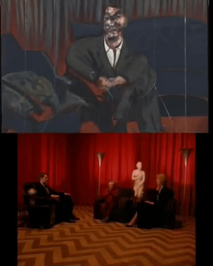

Hi friends,

I hope you’re having a great week.

This week I consider the idea of the remix and adaptation, something that builds off last week’s essay [on the toxicity of cultural nostalgia](https://guscuddy.substack.com/p/the-curtain-31-nostalgia-is-toxic) (which I got a very good response to!).

++

If you’ve been forwarded this email, you can sign up for The Curtain here:

[Sign up now](https://guscuddy.substack.com/subscribe?)

And if you know anyone who you think might enjoy these, please feel free to forward it to them, and tell them to sign up!

---

### The Age of the Remix

###### [art](https://www.behance.net/gallery/54061733/The-observatory?tracking_source=search-all%7Cremix) __[by Anxo Vizcaíno](https://www.behance.net/gallery/54061733/The-observatory?tracking_source=search-all%7Cremix)

++

We've been watching the new HBO adaptation of *Watchmen*, created by the fascinating Damon Lindelof, which re-centers Alan Moore and Dave Gibbon's comic around white supremacy in America (and specifically Tulsa, Oklahoma). It features [a diverse writer's room](https://gen.medium.com/damon-lindelof-heard-some-hard-truths-in-the-watchmen-writer-s-room-24101b6c11b7), including playwright Branden Jacobs-Jenkins (_An Octoroon_) as a Consulting Producer.

Last week, I [wrote about the pervasive, damaging nostalgia that is dominating so much cultural discourse](https://guscuddy.substack.com/p/the-curtain-31-nostalgia-is-toxic). *Watchmen* is the perfect example of a work of art that sticks a bomb into that nostalgia and blows it up. I really admire the audacity to take the most acclaimed comic of all time and to "remix" it (in Lindelof's words) into something new. Like [I wrote about last week](https://guscuddy.substack.com/p/the-curtain-31-nostalgia-is-toxic), it's capturing the "spirit" of the original, if not the "letter", and in that process is wrestling with the problematic aspects of the comic, and subverting some of its more regressive tropes, all while retaining what made that comic revolutionary.

What makes the show an even more successful remix is that it's not just solely messing with the original *Watchmen* text, but also other texts: the musical *Oklahoma* in its first episode, and the text of American history itself. (It is a show, after all, very specifically about Whiteness.)

I've been thinking a lot not just about the show but about the very idea of remixes as being an essential part of our culture today. They offer a subversion of Nostalgia, a chance to reuse the past for the present day. Remixes, sonically, are relatively modern—they originated in the late 60s in Jamaica. They reached new heights with the rise of the internet and services like Limewire or Bit Torrent. Today, the internet is essentially one big remix. (More on that later.)

Meanwhile, beyond the musical meaning, the history of art is also the history of remixes: Shakespeare is the most famous remixer of all-time. Almost all his work is, in some way, a remix of myths and stories, the political and the personal. There really is nothing new under the sun, just new ways of seeing.

Remixing can even be empowering, as is the case with Lil Nas X "appropriating" country music for “Old Town Road” and subsequently releasing a remix with Billy Ray Cyrus after being kicked off the Billboard Country chart. (The irony being that the history of the Billboard Top songs is generally the history of nonblack artists appropriating black music, an example of the negative side of remixing.) [Writes Wesley Morris](https://www.nytimes.com/interactive/2019/08/14/magazine/music-black-culture-appropriation.html):

> A black kid hadn’t really merged white music with black, he’d just taken up **the American birthright of cultural synthesis**. The mixing feels historical. Here, for instance, in the song’s sample of a Nine Inch Nails track is a banjo, the musical spine of the minstrel era. Perhaps Lil Nas was too American. Other country artists of the genre seemed to sense this. White singers recorded pretty tributes in support, and one, Billy Ray Cyrus, performed his on a remix with Lil Nas X himself.

This form of cutting, synthesizing, adapting, and remixing is also the basis of the digital age. For instance, the internet is non-linear, fractal, and psychedelic. It's held together by the hyperlink, which is the most elemental idea the internet has. It also represents an entire shift of consciousness: the hyperlink has become the basis of how we receive information today, how we interact with it, and how we think about it. Everything is connected with another thing. We can follow rabbit holes, just as our brain does. In a way, we are synthesizing and “remixing” information that we consume and piece together, rather than just linearly reading a book or newspaper.

The digital age also provides the practical tools for remixing content: editing movies, chopping up audio, and the ability to make things move slower, faster, backward, whatever. These tools are what enabled someone like early Kanye West to be a successful producer, based on his ability to recontextualize old soul records. But almost anyone using social media remixes in some form (especially with more aggressively creation-focused media, like Instagram or Tik Tok), applying filters and edits and songs to original content, slapping in pictures, or passing along memes.

But while remixing happens all the time online, it's also the basis of so much great art. Great art re-contextualizes its sources and inspirations, connects with contemporary politics and worldviews, and also represents a personal and authentic examination of its maker's life. With all those threads dangling together, it produces something “new”. (Only for it to be remixed again in the future.)

We live in an age where we too, as human beings, have to hold many dangling threads together in our heads. The complete totality of existence that is being alive in 2019 is overwhelming: all the information being constantly plugged into our ears and eyes and brain, the knowledge we are constantly on the brink of self-annihilation and environmental ruin, the constant fight against injustice. But so too must great art hold everything in its head at once: its implicit and explicit sources and inspirations, its central myth, its political and personal context. And when a piece of art is able to hold all of that in its grasp, remixing its sources with that of the world, it also appears breathtakingly original.

---

## 🗒 Notes from the Week

#### **The old model of Broadway is dead**

Diep Trans on why _Hadestown_ recouping (along with _What the Constitution Means to Me_) over other more "traditional" Broadway ventures, shows that original work created by women and starring POC sell:

http://twitter.com/diepthought/status/1193932426189381645http://twitter.com/diepthought/status/1193937325685968896

---

#### **[Disney is destroying independent cinemas](https://www.vulture.com/2019/10/disney-is-quietly-placing-classic-fox-movies-into-its-vault.html)**

Matt Zoller Seitz wrote this piece in Vulture on Disney's quiet vaultification of Classic Fox Movies — meaning that, since Disney owns Fox, these movies are "locked" behind Disney's commercial ventures. Independent cinemas (such as Rochester's Little Theater) aren't able to program Classic Fox movies like they once were.

> Disney considers any screen that’s taken up by an older movie, even one that’s owned by Disney, to be a screen that could be showing the new Marvel or Star Wars title instead

And it’s not just a niche thing:

> the estimated 600 independent first-run theaters left in the United States are the only reliable incubators for independent filmmakers who are unlikely to have their work screened in multiplexes dominated by Disney and other major distributors

---

#### **[Technology's flawed evolutionary argument](https://www.vox.com/the-highlight/2019/10/1/20887003/tech-technology-evolution-natural-inevitable-ethics)**

A few weeks ago, [I wrote about how the unprofitability of art is part of the point](https://guscuddy.substack.com/p/the-unprofitability-is-the-point) — and how technology and capitalism views anything that is inefficient to be worth disrupting in the name of "progress". It's "natural", "Darwinian", or "evolutionary". But this, of course, is a fallacy:

> In many ways, the American tech mogul blaming some invisible arc of innovation for his choices is simply an echo of the very ethos that founded America: progress at all costs. The men and women who colonized America largely saw progress as a march, a continual straight path, forward at all times, never to be questioned or slowed. Benjamin Franklin (himself an inventor) once wrote: “The rapid progress true science now makes occasions my regretting sometimes that I was born so soon. It is impossible to imagine the height to which may be carried, in a thousand years, the power of man over matter.”

---

#### **"Part of the work of being a maker is joining a community"**

Great thread by Jeremy O. Harris, responding to some criticisms of a thread screenwriter Chris McQuarrie wrote on breaking into show business:

https://twitter.com/jeremyoharris/status/1187437070073188353

https://twitter.com/jeremyoharris/status/1187437084841250818

---

#### **Francis Bacon & David Lynch**

---

#### **Should Netflix offer sped up delivery?**

A hot button issue, as many have rebelled against the idea that Netflix would offer an option to [watch things "sped up"](https://www.nytimes.com/2019/10/29/style/netflix-speed-playback-video.html). Richard Brody argues for it:

https://twitter.com/tnyfrontrow/status/1189181753816211456

https://twitter.com/tnyfrontrow/status/1189182747979538437

---

#### **Bernie Sinking 3's**

http://twitter.com/fshakir/status/1196220761842700288

---

## **❄️ End Note**

###### _a very good dog whose name is apparently moose_

++

_That’s all for this week—thanks so much for reading!_

_If you enjoyed this, please consider forwarding it to some friends and/or enemies. If you’ve been forwarded this email and want to receive The Curtain every Tuesday, click the button below:_

[Sign up now](https://guscuddy.substack.com/subscribe?)

_If you want to share the online version of this issue, you can access the entire archive [here](https://guscuddy.substack.com/archive?utm_source=menu-dropdown), or by clicking below:_

[Share](https://guscuddy.substack.com/p/the-curtain-32-the-age-of-the-remix?utm_source=substack&utm_medium=email&utm_content=share&action=share)

_As always, you can reply directly to this email and I’ll receive it. So feel free to do that about anything. You can also reach me at my personal email: [gus.cuddy@gmail.com](mailto:gus.cuddy@gmail.com)._

_See you next week!_
