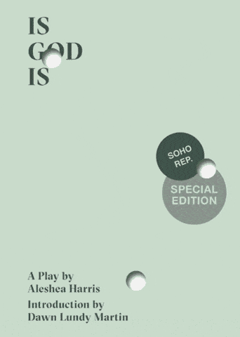
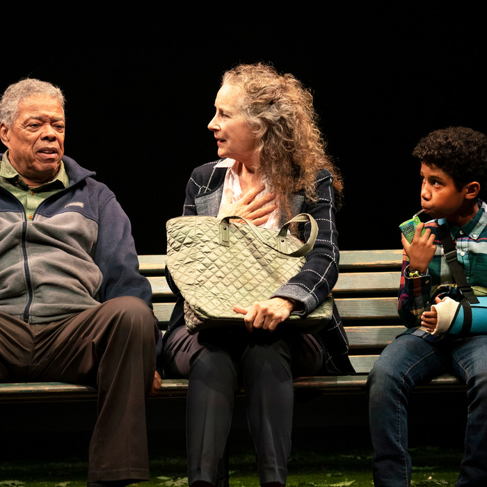

Hi friends,

No new essay this week—enjoy the holiday! Instead, I have a lot more Notes from the Week with short thoughts, and a new weekly section, called Recommendation of the Week. I'll be back next week with new writing.

Thank you all for reading!

++

_If you’ve been forwarded this email, you can sign up for The Curtain here:_

[Sign up now](https://guscuddy.substack.com/subscribe?)

_And if you get a chance, consider forwarding this to 1-2 friends who you think would like this!_

---

## **🗒 Notes from the Week**

#### **The Weird Aesthetics of Immersion**

In 2019 Netflix switched up its intro animation in a way that fits in with the entire company ethos. They try to make the experience of watching their content akin to tumbling into an immersive Netflixized dreamscape, which takes you into their world as if stumbling down a rabbit hole:

 

A similar thing happens when you click on an item to get more information in their app—the beginning softly plays in the background before the menu slowly fades away and it sinks you gently into the movie or TV show.

This all makes sense from a company that said that [sleep is their biggest competitor](https://www.fastcompany.com/40491939/netflix-ceo-reed-hastings-sleep-is-our-competition), of course.

---

#### **[Will Arbery and Caridad Svich on Keeping the Faith](https://howlround.com/keeping-faith?fbclid=IwAR0oxsshTCjDeByGW3QAXRQpEapRxgS-oi163uc6KWOHkB382BgT1NbNGMA)**

[A beautiful conversation](https://howlround.com/keeping-faith?fbclid=IwAR0oxsshTCjDeByGW3QAXRQpEapRxgS-oi163uc6KWOHkB382BgT1NbNGMA) between playwrights Will Arbery and Caridad Svich. Arbery's work and thinking has been a huge inspiration for me this year. I loved this quote:

> It’s interesting, this need for there to be light at the tunnel’s end. Or for a play to broadcast that light. **I think even a play at all is such a testament to hope**. The fact that we’re still making them, still gathering in rooms and sharing air, looking for clues about our fears and desires—what a hopeful thing! To force too much artificial hope on a play seems strange and lazy. **Let the hope be weird**. Let the hope look different every time.

And:

> **I believe in plays as gifts**. I believe in listening and reflecting back as a gift. Even if it’s a difficult gift. The more we do that for each other, as a nation, the more we reflect back to each other not only what menaces us in each other’s beliefs and work and platforms, but also that which we find beautiful and true.

---

#### **[The Invention of Thanksgiving](https://www.newyorker.com/magazine/2019/11/25/the-invention-of-thanksgiving)**

This Thanksgiving, let's make sure we continue to interrogate what exactly we're celebrating. While its meaning has shifted to be a celebration of food, family and gratitude, this is also a holiday built on myths and massacres. Despite knowing this, I [learned a lot from this great piece in the New Yorker](https://www.newyorker.com/magazine/2019/11/25/the-invention-of-thanksgiving):

> To mark the second occasion, the Plymouth men mounted the head of Ousamequin’s son Pumetacom above their town on a pike, where it remained for two decades, while his dismembered and unburied body decomposed. The less brutal holiday that we celebrate today took shape two centuries later, as an effort to entrench an imagined American community. In 1841, the Reverend Alexander Young explicitly linked three things: the 1621 “rejoicing,” the tradition of autumnal harvest festivals, and the name Thanksgiving. **He did so in a four-line throwaway gesture and a one-line footnote. Of such half thoughts is history made**.

The holiday as we know it was truly formed as a response to the trauma of the Civil War. But its motives were to gloss over atrocities and imagine a sanitized version of reunion (the same idea of [Nostalgia I've been writing about](https://guscuddy.substack.com/p/the-curtain-31-nostalgia-is-toxic)):

> The new story aligned neatly with the defeat of American Indian resistance in the West and the rising tide of celebratory regret that the anthropologist Renato Rosaldo once called “imperialist nostalgia.”**Glorifying the endurance of white Pilgrim founders diverted attention from the brutality of Jim Crow and racial violence, and downplayed the foundational role of African slavery.** The fable also allowed its audience to avert its eyes from the marginalization of Asian and Latinx labor populations, the racialization of Southern European and Eastern European immigrants, and the rise of eugenics. At Thanksgiving, white New England cheerfully shoved the problematic South and West off to the side, and claimed America for itself

---

#### **Alan Moore on Superhero Origins, and how the new Watchmen explodes this idea**

Writer Alan Moore in a [recently resurfaced interview](https://alanmooreworld.blogspot.com/2019/11/moore-on-jerusalem-eternalism-anarchy.html) on comic books:

> I would also remark that save for a smattering of non-white characters (and non-white creators) these books and these iconic characters are still very much white supremacist dreams of the master race. **In fact, I think that a good argument can be made for D.W. Griffith’s** _**Birth of a Nation**_ **as the first American superhero movie, and the point of origin for all those capes and masks**.

The latest episode of _Watchmen_ titled "This Extraordinary Being", co-written by Cord Jefferson, is almost an exact extrapolation and exploration of this idea. A frightening, disturbing, and true idea.

P.S. If you're caught up with _Watchmen_, here are some great pieces (huge spoilers!!!) written by black critics unpacking that radical episode:

*   [Angelica Jade Bastién](https://www.vulture.com/2019/11/watchmen-recap-episode-6-season-1-this-extraordinary-being.html) (Vulture)
    
*   [Jamelle Bouie](https://www.nytimes.com/2019/11/25/opinion/watchmen-hbo.html)  (New York Times)
    
*   [Joelle Monique](https://tv.avclub.com/watchmen-embraces-noir-roots-and-black-trauma-1840022364) (AV Club)
    
*   [Soraya Nadia McDonald](https://theundefeated.com/features/watchmen-episode-six-this-extraordinary-being/) (The Undefeated)
    

---

#### **[3 Hole Press](https://www.kickstarter.com/projects/3holepress/3-hole-press-fourth-season)**

3 Hole Press is one of the most exciting small press companies out there, publishing beautiful versions of great, original plays. In their fourth season, they're expanding beyond just plays to things like an original cookbook or a multidisciplinary tarot deck. In a theatrical publishing world dominated by DPS and Samuel French, [consider supporting 3 Hole Press here](https://www.kickstarter.com/projects/3holepress/3-hole-press-fourth-season). 

 

---

#### **[Amazing list of 1,000 movies from Sean Price Williams](https://letterboxd.com/damon_wolfgang/list/sean-price-williams-legendary-top-1000-films/detail/)**

[This is a terrific, weird, esoteric list](https://letterboxd.com/damon_wolfgang/list/sean-price-williams-legendary-top-1000-films/detail/) from the great cinematographer Sean Price Williams. If you're a nerd about collecting movies to watch like me, you'll love this.

---

#### **[David Lynch on Index Cards](https://gointothestory.blcklst.com/how-they-write-a-script-david-lynch-5de97888fd6f)**

> “Accepted into the institute’s Center for Advanced Film Studies in 1970, Lynch studied with the Czechoslovak film maker Frank Daniel, whose course on film analysis shaped his writing and directing habits. ‘’It’s a simple thing he taught me,’’ says Lynch. ‘’**If you want to make a feature film, you get ideas for 70 scenes. Put them on 3-by-5 cards. As soon as you have 70, you have a feature film**.’’ Except that he now dictates to an assistant, Lynch still works this way.”

Does Lynch actually do this? Unclear... 🤔

---

#### **[Top-Down vs Bottom-Up Mental Processing](https://aeon.co/essays/how-the-old-and-the-new-make-the-mind-ebb-and-flow)**

Beautiful article on how our brain perceives information: from the sensation-based bottom-up (forgoing the analytical when seeing things anew, like when we travel), and from the top-down (like when we see something for the thousandth time). I recommend reading the whole thing. It makes me wonder how this applies to how we perceive art: when we see tropes and stories for the thousandth time, are we mentally not able to engage and immersive ourselves like we would when we see something we've never seen before? 

---

## **Recommendation of the Week**

Other than _Watchmen_, which I have written about the last two weeks, this week’s recommendation is:

#### _**[The Underlying Chris](https://2st.com/shows/the-underlying-chris)**_ **[by Will Eno](https://2st.com/shows/the-underlying-chris)**

 

###### _photo by Joan marcus_

I enjoyed a lot of Eno's heartfelt and mysterious new play, but what I most loved was its wonderful, surprising and optimistic ending. Along with Sarah Einspanier’s _Lunch Bunch_, it is one of the most uplifting (and one of my favorite) endings to a play this year.

++

#### _End Note_

_That’s all for this week—thanks so much for reading!_

_If you enjoyed this, please consider forwarding it a friend. If you’ve been forwarded this email and want to receive The Curtain every Tuesday, click the button below:_

[Sign up now](https://guscuddy.substack.com/subscribe?)

_You can access the entire archive [here](https://guscuddy.substack.com/archive?utm_source=menu-dropdown)._

_As always, you can reply directly to this email and I’ll receive it. So feel free to do that about anything. You can also reach me at my personal email: [gus.cuddy@gmail.com](mailto:gus.cuddy@gmail.com)._

_See you next week!_

\-Gus