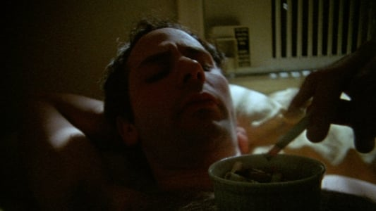

Hi friends,

Hope you had a wonderful holiday weekend, whatever you were doing.

December seems extra surprising this year, like it popped up out of nowhere. And now, all of a sudden, we’re about to enter into the 2020s. OK then.

---

#### **Thinking About the Best Movies of the Decade**

I'm a huge list nerd. Ever since I was little I would make lists and devour others' lists in a never-ending effort to catalog every movie, album, song, book, or play I experienced or wanted to experience. I'm a bit more wary of ranking things now (am I?), but I still love list-making, in all forms. (There's something satisfying about organizing things, content, thoughts, knowledge into bullet points on a list.)

Creating art is inherently personal, and so is list-making. It's important what's on a list, and sometimes (but not always) it's important what's not on a list.

When I think back on this decade in culture, the only medium I feel comfortable making a list for is movies. I saw plenty of theatre and listened to lots of music, but as I matured from High School to College to "Adulthood" over the last 10 years, movies have been the most consistent, overarching art form in my life, and my tastes and interests have changed and evolved rapidly.

The most significant thing I have learned artistically this decade—which applies broadly across cinema, theatre, music, and all art—is the importance of merging activism and aesthetics. It's no longer OK to separate someone's politics from their art, and I think that is for the better. I have learned that, to create great art, one needs to be totally vulnerable, introspective and personal, all while keeping one eye on the visible world (politics, society) and the other on the invisible (the unconscious, the unspoken, the uncanny).

As Richard Brody put it in [his decade recap](https://www.newyorker.com/culture/decade-in-review/the-twenty-seven-best-movies-of-the-decade):

> Yet this decade has also seen, in surprising ways, the convergence of these two currents of **activism and aesthetic**s in ways that I hope will continue in the next decade and beyond**.** Many of the substantial changes in the industry have come from the new generation of filmmakers—yes, mumblecore**. Its creators put into bold artistic action the fundamental premise that promises to turn minor shifts in the industry into a sea change: namely, the idea that the personal experience of filmmakers and a film’s participants is inseparable from the film’s process, its subject, its contents, and its style**.

On a personal level, I have had to interrogate my own early teenage tastes that slanted towards art from straight white men. I'm in an ongoing process to diversify and decolonize my intake of art. But favorite movies of the last ten years do not necessarily reflect that, and I hope that that will change.

That all being said, these are the 22 movies that stand out the most to me from the 2010s (excluding 2019, because I'm still processing). The bolded ones are my _favorite_ favorites:

-   American Honey (2016, Andrea Arnold)

-   Black Swan (2010, Darren Aronofsky)

-   Boyhood (2014, Richard Linklater)

-   Carol (2015, Todd Haynes)

-   **First Reformed** (2017, Paul Schrader)

-   **Frances Ha** (2012, Noah Baumbach)

-   Get Out (2017, Jordan Peele)

-   **A Ghost Story** (2017, David Lowery)

-   **Good Time** (2017, Josh and Benny Safdie)

-   The Grand Budapest Hotel (2014, Wes Anderson)

-   **Inside Llewyn Davis** (2013, Joel and Ethan Coen)

-   Lady Bird (2017, Greta Gerwig)

-   **Madeline’s Madeline** (2018, Josephine Decker)

-   **The Master** (2012, Paul Thomas Anderson)

-   **Moonlight** (2016, Barry Jenkins)

-   OJ: Made in America (2016, Ezra Edelman)

-   Phantom Thread (2017, Paul Thomas Anderson)

-   **The Social Network** (2010, David Fincher)

-   **The Tree of Life** (2011, Terrence Malick)

-   Under the Skin (2013, Jonathan Glazer)

-   The Wolf of Wall Street (2013, Martin Scorsese)

If I to choose one movie to keep it would be _Frances Ha_, which features one of the most original artists of the last ten years, Greta Gerwig.

Another list I liked: [K. Austin Collins](https://www.vanityfair.com/hollywood/2019/11/best-movies-decade-2010s-collins).

---

#### **The Best Theatre of 2019**

These are my ten favorite productions of the year.

An interesting note: not a single revival on this list. I think this is a sign of the poor quantity of truly interrogative and searching re-investigations of classics in New York, and the fact that this year I did slant towards seeing new theatre. We are truly in an exciting moment of great playwrights in America.

I missed (I'm sure) a lot of great theatre this year, but the ones I'm most regretting off the top of my head: the new David Byrne show, _Marys Seacole_, _Octet_, and _Soft Power_.

And I saw Derren Brown's *Secret* when it was at The Atlantic in 2017. It's playing on Broadway now and would probably be among my favorites of the year.

My list:

-   _A Play Titled After the Collective Noun for Female-Identifying 20-Somethings Living in NYC in the 2010s_ (Haleh Roshan, dir. Lauren Zeftel // Corkscrew Theatre Festival)

-   _Ain't No Mo_ (Jordan E. Cooper, dir. Stevie Walker-Webb // The Public)

-   _Heroes of the Fourth Turning_ (Will Arbery, dir. Danya Taymor // Playwrights)

-   _How to Defend Yourself_ (Lily Padilla, dir. Marti Lyons // Humana Festival)

-   _I Thought I Would Die But I Didn't_ (Bailey Williams, dir. Sarah Blush // The Tank)

-   _Is This a Room_ (Tina Satter, dir. Tina Satter // Vineyard)

-   _Lunch Bunch_ (Sarah Einspanier, dir. Tara Ahmadinejad // Clubbed Thumb)

-   _Plano_ (Will Arbery, dir. Taylor Reynolds // Clubbed Thumb @ Connelly Theatre)

-   _Slave Play_ (Jeremy O. Harris, dir. Robert O'Hara // New York Theatre Workshop)

-   _A Strange Loop_ (Michael R. Jackson, dir. Stephen Brackett // Playwrights)

-   _The Thin Place_ (Lucas Hnath, dir. Les Waters // Humana Festival)

If I had to choose one show, it would be _Heroes of the Fourth Turning_.

---

## **Notes from the Week**

#### **Robert Bresson**

Lately, I've been diving back into film, and I've been really into Robert Bresson. I'm fascinated with how different auteurs differentiate theater from film (something I've thought of in the reverse for a while).

Some quotes from his book/diary _Notes on the Cinematograph_:

1.  **“The point is not to direct someone, but to direct oneself.”**

2.  **“Nothing rings more false in a film than that natural tone of the theatre copying life and traced over studied sentiments.”**

3.  **“An image must be transformed by contact with other images as is a colour by contact with other colours.”**

4.  **“My movie is born first in my head, dies on paper; is resuscitated by the living persons and real objects I use, which are killed on film but, placed in a certain order and projected on to a screen, come to life again like flowers in water”**

For a starting place with Bresson, I recommend _Pickpocket_, _Au Hasard Balthazar_, or _Mouchette_.

---

#### **Egyptian History**

We went to the Brooklyn Museum over the Holiday weekend and walked through their Ancient Egypt section, which has an interesting exhibit on gender fluidity.

But I was really dismayed by the idea that there's been a false history of Egyptians being light-skinned, until recently. This was taken from the text in the exhibit:

> **Egyptologists no longer maintain the false hypothesis that lighter-skinned outsiders created Egyptian culture**.
>
> **Nineteenth-and early twentieth-century historians largely interpreted the archaeological evidence on the African continent through a racist filter that rejected the notion that Africans could create a high civilization.**

History, and how we construct and interpret its narratives, is always political.

---

#### Werner Herzog: “You are cowards.”

http://twitter.com/kateyrich/status/1199385571686260741

---

#### **Explaining New York Theatre**

A brilliant, niche thread:

https://twitter.com/jeffyadar/status/1199447792546123777

https://twitter.com/jeffyadar/status/1199447798107824128?s=20

https://twitter.com/jeffyadar/status/1199447811122700288?s=20

https://twitter.com/jeffyadar/status/1199447815522541569?s=20

https://twitter.com/jeffyadar/status/1199447824984883203?s=20

---

## Recommendation of the Week

_**Frownland**_ **(2007, Ronald Bronstein)**

This week’s recommendation: The very weird, disturbing and gnarly _Frownland_, directed and written by Ronald Bronstein (a longtime collaborator with the Safdie Brothers). Self-described by Bronstein as "a rotten egg lobbed with bad aim at the silver screen", which is what got me to watch it. It’s hardcore strange, nasty, and hard to watch. Apparently [fights broke out](https://www.theguardian.com/film/2008/oct/21/frownland) at early screenings. Available for streaming on The Criterion Channel, with an extra of Josh Safdie interviewing Bronstein.

++

#### _**End Note**_

_That’s all for this week—thanks so much for reading!_

_If you enjoyed this, please consider forwarding it to a friend or two. If you’ve been forwarded this email and want to receive The Curtain every Tuesday, click the button below:_

[Sign up now](https://guscuddy.substack.com/subscribe?)

_You can access the entire archive [here](https://guscuddy.substack.com/archive?utm_source=menu-dropdown)._

_As always, you can reply directly to this email and I’ll receive it. So feel free to do that about anything. You can also reach me at my personal email: [gus.cuddy@gmail.com](mailto:gus.cuddy@gmail.com)._

_See you next week!_

\-Gus
