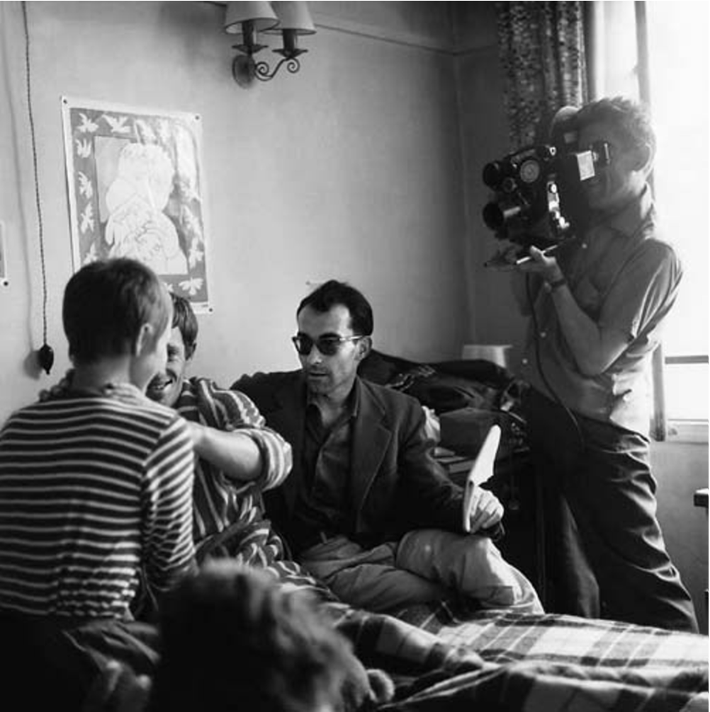

Hi friends,

_Welcome to The Curtain, a weekly newsletter about culture, theatre, movies, creativity, and other things. It’s written by me, [Gus Cuddy](http://guscuddy.com/)._

_If you’ve been forwarded this email, you can sign up for yourself here:_

[Sign up now](https://guscuddy.substack.com/subscribe?)

---

### Criticism and Making are not opposites. They’re the same thing.

 

###### _Godard directing_ Breathless_. (Source: Raymond Cauchetier)_

As the cliché goes, nothing is more feared by the artist than the deadly critic. We think of the two as enemies, as opposite sides of the spectrum: creativity is building things up, and criticism is tearing them down. This idea is pervasive and sometimes violent, [like when Michael Keaton’s character in](https://www.youtube.com/watch?v=4d5KovCbU8w) _[Birdman](https://www.youtube.com/watch?v=4d5KovCbU8w)_ [assaults a farfetched critic](https://www.youtube.com/watch?v=4d5KovCbU8w) (a scene applauded by many). Memes like "[Let People Enjoy Things](https://knowyourmeme.com/memes/let-people-enjoy-things)" demonize critics as joy-killers. But criticism is not about nit-picking and tearing down. It's about thinking critically. Media consumers who meme away criticism are scared of disagreement, and are often repressing a criticism that they recognize but are defensive of. They also might not have realized that it's perfectly possible to enjoy something and be critical of it at the same time. As Sara Holdren wrote in [her brilliant essay on being a critic and director](https://www.vulture.com/2018/12/i-make-plays-i-write-criticism-im-not-my-own-enemy.html), "plays aren't frogs, and taking one apart won't kill it."

Perhaps what scares people most about criticism is the articulation. It's incredibly difficult to articulate ourselves, and an inherently political act to do so. (As Anne Bogart says, "one of the most radical things you can do in this culture of the inexact is to finish a sentence.") But articulation and thinking-things-through is an act of creativity and building, not of destruction. It requires immense energy, vulnerability, and thoughtfulness; the result, if it is good, is a new way of thinking—not just an offering of an opinion.

Criticism and Making are often complementary processes, with the first leading to the second. Sometimes, as is the case with cultural critics like Wesley Morris, Jenna Wortham, or Hilton Als, criticism and making are one and the same. Many of the most iconic theatre directors throughout history (Peter Brook, Harold Clurman, Anne Bogart, to name a few) were also writers of theory on the craft—in effect, criticism. Criticism is a way to interrogate why something works or doesn't, allows us to wrestle with media and art and reconcile it (or not) with our own personal histories, ideologies, and tastes. This, in turn, makes us smarter creatives.

The classic example of critics-turned-makers is the French New Wave filmmakers. Truffaut, Godard, and Rivette used criticism as their own film school, writing and debating for the magazine _Cahiers du cinéma_, and using their hyper-intellectual and impassioned analysis to launch their own careers. (Truffaut dropped out of school at 14 in order to watch films; the three would spend all day long reading books and watching movies at their local cinema.) As Richard Brody writes in his book _Everything is Cinema_:

> Their method—the one that Godard himself undertook, at age nineteen—was **criticism**. It was a singular method, which served two purposes, revolutionary and didactic. **Godard and his young film-lover friends were learning how to make films by watching films;** they were giving themselves a conservatory education at the Cinémathèque and the CCQL. **By writing about the films they saw, they did two things: they elaborated and refined their ideas about the cinema, in anticipation of the day when they could make films; and they created for themselves a public identity that would get them the chance to make films**.

Criticism can be a launching pad, a form that allows space to think clearly and decisively about art, politics, philosophy, the personal—and how it all interrelates—and which teaches one about the making of art, rather than the reversed and dated view of the critic as the teacher, the lecturer. It happened in the 50s and 60s in Paris, and it is doubly true in [the age of the remix](https://guscuddy.substack.com/p/the-curtain-32-the-age-of-the-remix). [Ex-Critics like Andy Greenwald are now making TV Shows](https://www.nytimes.com/2019/10/22/arts/television/andy-greenwald-the-watch-podcast-briarpatch.html); [Cord Jefferson](https://cordjefferson.tumblr.com/work) started as a journalist and cultural critic, and now writes for _Succession_, _The Good Place_, and _Watchmen_ (he co-wrote "This Extraordinary Being", one of the most acclaimed episodes of the year); [Jeff Jensen](https://twitter.com/ewdocjensen?lang=en) was a TV critic (noted for his _Lost_ recaps) and now writes for _Watchmen_; Ta-Nehisi Coates went from blogger to essayist to writing for the _Black Panther_ comic series and his first novel. The list goes on.

If there's one thing that writing _The Curtain_ each week this year has taught me about the relationship between criticism and creativity, it's that it's all connected. I know writing and thinking critically about theatre, film, and other art has honed my taste and made me smarter about the make-up of things I like. As I work on other creative projects, I know that this refinement of my ideas carries over.

"Criticism" isn't a dirty word to be afraid of anymore. Instead, it’s an essential mindset to embrace. It's become an indispensable part of navigating the crowded landscape of art and media, and become inseparable from the actual act of making. In 2019, we’re all critics.

---

## Notes from the Week

#### **[What Theater Does for New York](https://www.nytimes.com/2019/11/20/theater/small-theaters-economic-impact-study.html)**

According to [a recent study](https://www1.nyc.gov/assets/mome/pdf/mome-small-theater-study-2019.pdf) commissioned by the mayor's office:

> **The study calculates that theaters aside from Broadway are responsible for $584 million in direct annual economic output, and estimates $1.3 billion in “direct, indirect and induced benefits.”** “Traditionally people have viewed this as a niche sector, but we found it’s a significant contributor to the creative sector in New York City, and also a significant economic driver,” said Anne del Castillo, the commissioner of the city agency

---

#### **['Slave Play' Plus One Program](https://broadwaynews.com/2019/12/10/slave-play-launches-new-initiative-with-patrons-gifting-tickets/)**

I've been hoping theatre would implement something like this soon: a model for rich theatergoers to fund tickets for people who wouldn't be able to attend for financial reasons.

By entering code "PLUSONE" at checkout you add $25 onto your ticket, which buys a ticket for someone who can't afford it.

It's a step in the right direction.

---

#### **[AI Begins a Novel](https://aiweirdness.com/post/189170306297/how-to-begin-a-novel)**

A hilarious and somewhat disturbing demonstration that a computer can probably write a better opening line than most. Here are some great ones:

> I was playing with my dog, Mark the brown Labrador, and I had forgotten that I was also playing with a dead man.
> 
> How many times have I had the misfortune to die?
> 
> The black stone was aching from the rain.
> 
> The moon was low in the sky, as though it had been shipped in from the farthest reaches of the solar system.
> 
> It was a rainy, drizzling day in the summer of 1869 and the people of New York, who had become accustomed to the warm, kissable air of the city, were having another bad one.

---

#### **[The Ugly Beautiful](https://catapult.co/stories/the-ugly-beautiful-and-other-failings-of-disability-representation-an-unquiet-mind-s-e-smith)**

A beautiful piece by s.e. smith on the possibilities and current shortcomings of disability representation. It’s something I’m committed to learning and thinking more about.

> It is deeply troubling for able-bodied people to learn that, at least for some of us, this is not the case—that we find beauty and pride in ourselves, not in how we can most align with what nondisabled people think human bodies and minds should look like.

---

#### **The Problem with Streaming**

From Richard Brody's [best movies of 2019](https://www.newyorker.com/culture/2019-in-review/the-best-movies-of-2019):

> **The need to pay constant attention to the services rather than the works turns critics into connoisseurs of shit, comparing one mediocrity against another in order to be able to assemble a list of what’s barely recommendable with a straight face by contrast with what’s even worse**. In the process, critical taste is inevitably shifted toward a new aesthetic (or anti-aesthetic) that leaves the best filmmakers of the time looking like backsliding conservatives clinging to ivory-tower traditions rather than what they are: audacious and forward-looking resisters to corporate production, not defenders but advancers of individual creation and conscience who overcome the redefinition of art as content—regardless of how their films may be marketed.

---

#### **[Martin Scorsese Tries to Cheat Death](https://lareviewofbooks.org/article/martin-scorseses-late-style/)**

In defense of the de-aging in _Irishman_:

> **The uncanniness of the de-aged trio should hurt The Irishman, but it doesn’t**. If anything, it’s difficult to imagine a more conventional approach suiting the movie. It’s a series of shaggy dog stories told by the elderly Sheeran in the nursing home in which he eventually died, which means that everything we’re seeing is **an old man’s best recollection of events he’d never told anyone until his functions were starting to fade**. When we remember the parents of our childhood, for example, it’s harder to picture them as they were instead of the last time we saw them. The Irishman, for better or worse, replicates this phenomenon, **capturing the awkwardness that results when our long- and short-term memories fight it out**.

[Great piece in LA Review of Books.](https://lareviewofbooks.org/article/martin-scorseses-late-style/)

---

## Recommendation of the Week

 ![Letters to a Young Artist: Straight-up Advice on Making a Life in the Arts-For Actors, Performers, Writers, and Artists of Every Kind by [Smith, Anna Deavere]](./Letters-to-a-Young-Artist:-Straight-up-Advice-on-Making-a.jpeg)

_**Letters to a Young Artist**_ **by Anna Deavere Smith**

A wonderful book that I’ve returned to several times throughout this year.

> Presence is your ability to both absorb the world around you by being fully in its presence, with all that is beautiful, troubling, and mundane. It is your ability to absorb and to transmit what you have absorbed, with the simplest of gestures. **Through discipline, you can learn how to absorb the complex and to translate it simply.**

---

#### _**End Note**_

_That’s all for this week—thanks so much for reading!_

_If you enjoyed this, please consider forwarding it to a friend or two. If you’ve been forwarded this email and want to receive The Curtain every Tuesday, click the button below:_

[Sign up now](https://guscuddy.substack.com/subscribe?)

_You can access the entire archive [here](https://guscuddy.substack.com/archive?utm_source=menu-dropdown)._

_As always, you can reply directly to this email and I’ll receive it. So feel free to do that about anything. You can also reach me at my personal email: [gus.cuddy@gmail.com](mailto:gus.cuddy@gmail.com)._

_See you next week!_

\-Gus