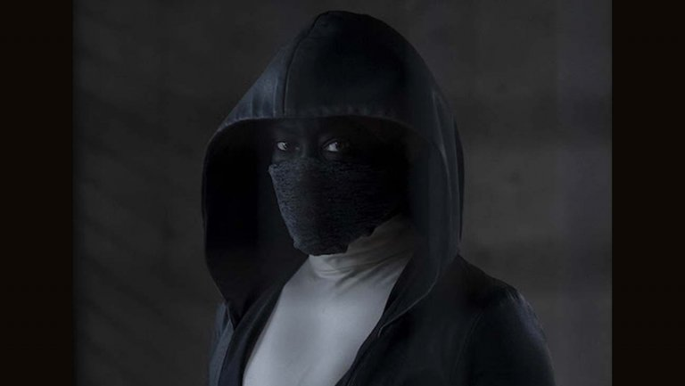
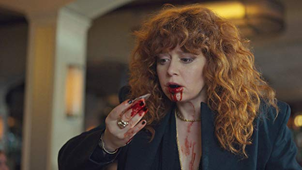
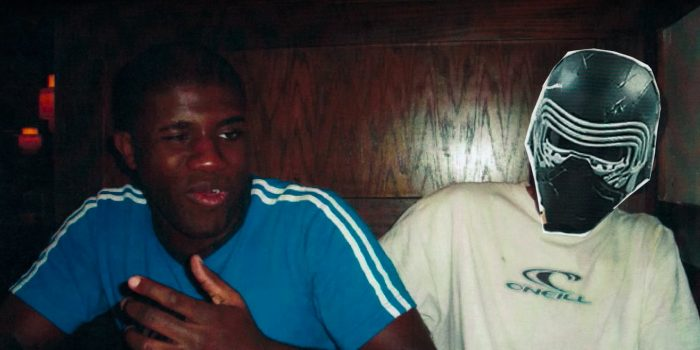

Hi friends,

_Welcome to [The Curtain](https://guscuddy.substack.com/archive), a weekly newsletter about culture, theatre, and creativity. It’s written by me, [Gus Cuddy](http://guscuddy.com/)._

_If you’ve been forwarded this email, you can sign up for yourself here:_

[Sign up now](https://guscuddy.substack.com/subscribe?)

++

A quick note: this week, I wrote a new short essay on how I viewed this year in culture. Next week I’ll be back on Christmas Eve and have the usual “Notes from the Week” and “Recommendation of the Week” sections, featuring curated links, articles, and recommendations.

---

### In 2019, We Wore Masks to Hide Our Trauma

In thinking about 2019, I keep thinking about the masks.

The mask hides something. It covers over the trauma and pain. It morphs our identity into something else. If 2015 was [the year we obsessed over identity](https://www.nytimes.com/2015/10/11/magazine/the-year-we-obsessed-over-identity.html), 2019 was the year we obsessed over trauma and the masks we wear to cover it up. 

_Watchmen_ is the most blatant example of this: a show that was concerned with literal masks and the violent trauma of white supremacy. Perhaps the biggest strength of the show was how it enabled its black lead characters "to mold history in ways their ancestors could not", [as Victor Luckerson wrote in The New Yorker recently](https://www.newyorker.com/culture/cultural-comment/the-great-achievement-of-watchmen-is-in-showing-how-black-americans-shape-history) (spoilers in that link!). It didn't just traffic in trauma for exploitation; it actively engaged and tussled with this trauma, attempting to make its own new, justice-seeking myths. In the end, while some masks were a necessity for its black heroes, the deep, generational trauma of racial injustice will not be healed with hiding. As Will Reeves tells his granddaughter: "You can't heal under a mask. Wounds need air."

 

But the exploration of masks and trauma didn't stop and start with _Watchmen_. In Bong Joon-Ho's massive hit movie _Parasite_, there is a different kind of mask. A mask that hides a deep and twisted political trauma, buried underneath itself. In Jordan Peele's _Us_ the mask is ourselves; similar to _Parasite_, it buries something dark and sinister. In _Succession,_ we saw [the hyper interrelation of wealth and trauma](https://www.vox.com/culture/2019/9/24/20870750/succession-hbo-review-season-2-recap), and the many perverse masks used to cover it up, generation through generation. In _Russian Doll_, Natasha Lyonne's character dies over and over as a type of mask, repressing her own deep, embedded trauma. In _Fleabag_'s second season, Fleabag grapples with the trauma of womanhood and grief, meeting a hot priest along the way who sees through her mask: her constant use of the fourth-wall as a means of fictionalizing and dissociating from her own reality.

 

In the fantastic short documentary _Ghosts of Sugar Land_, the interviewees wear cheap Party City masks to protect their identity as they talk about their childhood friend who was radicalized and joined ISIS; the masks are literal, hiding the trauma of being Muslim in America.

 

And in Jeremy O. Harris' _Slave Play_, the legacy of traumas in America, especially as it relates to interracial relationships, are laid bare; the mask—which may be one of healing, or not—is sexual.

Theatre has been an especially potent interrogator of trauma and the masks we wear. But it's also been a problematic one. [There is a legacy in theatre of white audiences paying to see stories about people of color suffering](https://www.americantheatre.org/2019/07/24/black-queer-and-here/); in many theatre's seasons, the "diversity" play is one of violence. Asking actors—especially women of color—to embody this violence and suffering for a white institution has a nasty feeling to it when it is not handled with care and delicacy (and let's be real—it's usually not). In this case, the historically oppressed characters are defined by their trauma; they aren't allowed to escape its confines. But in the last year or so more incredible works by writers of color were finally being produced; often, these plays have grappled with trauma in anarchic ways, subverting white audience expectations and defining themselves on their own means. In works like Michael R. Jackson's _A Strange Loop_ the trauma of black queerness is explored, but not reduced to consumable terms for white audiences (I fully admit the show was not made for me); instead, it's a story largely about the main character facing his parents. [As Wesley Morris wrote earlier this year](https://www.nytimes.com/2019/04/25/theater/african-american-playwrights.html), these plays are "responding — with anger, social acuity and structural chaos — to psychic devastation and national trauma, making roommates of today’s dismay and 400 years of horrors". 

As a nation, we have immense collective traumas that have left unbearable traces. And as individuals, we all have trauma passed down to us or that we experienced ourselves. It can only be repressed for so long before it comes shooting up to the surface, whether that be through a scary memory triggered by a seeming danger, or a country electing a blatant white supremacist. So much of the art I experienced this year was concerned with wrestling with these traumas and the masks we use to hide them. Some were just pointing to these buried things to make sure we have our eyes open; others (often the best ones) were attempting to heal. As we move forward into 2020, I hope as a culture we can continue to normalize the interrogation of trauma, and the necessary healing that follows.

++

_To be alive: not just the carcass_

_But the spark._

_That's crudely put, but..._

_If we're not supposed to dance,_

_Why all this music?_ 

###### _"To Be Alive" by Gregory Orr. Orr accidentally killed his younger brother in a hunting accident when he was 12._

---

#### _**End Note**_

_That’s all for this week—thanks so much for reading!_

_If you enjoyed this, please consider forwarding it to a friend or two. If you’ve been forwarded this email and want to receive The Curtain every Tuesday, click the button below:_

[Sign up now](https://guscuddy.substack.com/subscribe?)

_You can access the entire archive [here](https://guscuddy.substack.com/archive?utm_source=menu-dropdown)._

_As always, you can reply directly to this email and I’ll receive it. So feel free to do that about anything. You can also reach me at my personal email: [gus.cuddy@gmail.com](mailto:gus.cuddy@gmail.com)._

_See you next week!_

\-Gus