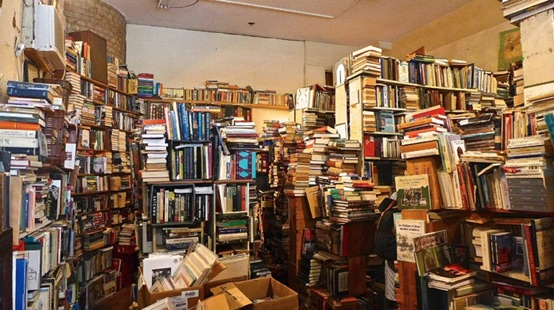

Hi friends,

_Welcome to [The Curtain](https://guscuddy.substack.com/archive), a weekly newsletter about culture, theatre, and creativity. It’s written by me, [Gus Cuddy](http://guscuddy.com/)._

_If you’ve been forwarded this email, you can sign up for yourself here:_

[Sign up now](https://guscuddy.substack.com/subscribe?)

---

### How creative output is tied directly to inputs

 

In Lewis Hyde's _The Gift_, Hyde explores the three steps in which the "gift" (as it relates to art) can occur and move through society. First, we have the initial gift: a work of art, an intuition, a dream, or a vision that in some way deeply affects our Self, inspiring us. Then, this Gift is transformed through the self by our own "gifts", our talents, our labor. When we speak of someone being "gifted", this is the process by which those gifts are used. Finally, there is the finished work: a new gift. The whole process can be boiled down to more reductive terms: _input_ leads to _transformation_ leads to _output_. 

I've been thinking more and more, as this year draws to a close, about how our inputs inform our outputs. And how, more than ever, we need to ensure we have high-quality inputs. In this age of information overload, our input can affect everything from our health to our creativity to our inner peace.

Information is like food. If you have too much low-quality, crappy food, you will get sick. It's a similar thing with information. We need to focus on having more nutrients and less junk. If you stumbled onto a buffet of food you wouldn't think of "food overload". Instead, you would identify that some things would be bad for you, some things would be OK, and a few things would be great. With the endless buffet of the internet, it's important to pick and choose. (And of course, indulging in junk food once in a while is also a wonderful treat.)

Most people have access to an incredible amount of information. But it can be difficult to sort through it all if you don't have strong filters. Strong filters—which never come through the algorithmic glaze of AI-curated playlists—enable _perspective_, which is one of the most valuable resources in the internet age. The ability to step back amidst the mountain of inputs, and offer perspective on what actually _matters_. This perspective is a type of output.

It's essential to remember that creative output is tied to input. Sebastian Junger wrote that "writer's block just means I don't have the ammo". Junot Diaz said to "read more than you write, live more than you read." Whenever I'm stuck, I look at my inputs: what am I consuming? Am I scrolling through Instagram and fiddling with web games all day? Or am I reading great writing, going to theatre and movies, walking through art museums, listening to inspiring music? There's a huge difference there.

I loved what music and culture writer Ted Gioia said on [a recent podcast episode](https://conversationswithtyler.com/episodes/ted-gioia/):

> **If you don’t have good input, you cannot maintain good output**. The problem is no one manages your input. The boss never cares about your input. The boss doesn’t care about what books you read. Your boss doesn’t ask you what newspapers you read. The boss doesn’t ask you what movies you saw or what TV shows or what ideas you consumed.
> 
> But I know for a fact, **I could not do what I do if I was not zealous in managing high-quality inputs into my mind every day of my life**. That’s why I spend maybe two hours a day writing. I’m a writer. I spend two hours a day writing, but I spend three to four hours a day reading and two to three hours a day listening to music.

Which brings us back to the gift. In order for our own "gifts" (whether they be writing, acting, composing, performing) to be working, we need to be open and receptive to the possibility of new gifts to make an effect on us. And that means paying attention to what we pay attention to: ensuring we're exposing ourselves to new things, broadening horizons, consuming high-quality inputs. It's not always easy to do this—Spotify playlists, for instance, are a feedback trap, basing what to recommend you based on what you've already listened to. In an endless echo chamber, how do you discover something truly new? By stepping outside the algorithmic trap, following intuitions, swapping recommendations, and seeking out new, exciting art and experiences. 

The richness of the full human and artistic spectrum is incredible. But in order to create new things we need to be in touch with serendipity, by exposing ourselves to high-quality inputs.

---

## 🗒 Notes from the Week

#### **[Ted Gioia's 100 Best Recordings of the Year](http://tedgioia.com/bestalbumsof2019.html)**

Speaking of inputs, I really enjoy Ted Gioia's list of the [100 best recordings of the year](http://tedgioia.com/bestalbumsof2019.html), which is eclectic and weird and full of things I mostly haven't heard of, let alone heard. (Bonus points for the gnarly, outdated website.)

---

#### **The best theatre critics of 2019 (Twitter Thread)**

http://twitter.com/AHarris1361/status/1209584491779350528

I [loved the responses to Aleshea Harris's question](https://twitter.com/AHarris1361/status/1209584491779350528). A treasure trove of new inputs. I discovered some amazing new critics.

It also lead to [this terrific thread from Jeremy O. Harris](https://twitter.com/jeremyoharris/status/1209607434202951681):

https://twitter.com/jeremyoharris/status/1209607434202951681

---

#### **[Marketing is an Invitation](https://twitter.com/jeremyoharris/status/1209202352600862720)**

Tremendous [Twitter thread](https://twitter.com/jeremyoharris/status/1209202352600862720) from Jeremy O. Harris on how (and why) they marketed SLAVE PLAY the way that they did:

> My politic broadly is THEATRE FOR ALL , so I wanted a free show, it also felt like reparations for black ppl not to have to pay for Slave Play. Troy Carter and @gregnobile wisely challenged that the perception could possibly reaffirm the idea that black audiences are broke.
> 
> Troy and Greg made the salient point that many people in the community scapegoat income disparity in order to not actually take responsibility for not actually inviting black audiences to the theatre
> 
> MARKETING IS AN INVITATION.  So even \[when\] we were giving tickets away on the side of the street people wouldn't be coming to see our shows if they didn't feel like the show was marketed to them.  Also our field can't change if WE don't change who we market to and how.

[Full thread here.](https://twitter.com/jeremyoharris/status/1209202352600862720)

---

#### **Disney and the Death of Cinema**

[Disney produced 80% of the top Box Office hits this year](https://www.theverge.com/2019/12/23/21034937/disney-star-wars-box-office-2019-marvel-pixar-star-wars-avengers-lion-king-frozen). Almost all of that came from their manufactured-in-a-boardroom-to-be-hits Marvel movies, sequels (_Toy Story 4_ and _Frozen 2)_, remakes (_Aladdin_, _The Lion King_), and the new Star Wars movie.

Speaking of the new Star Wars movie, I really didn't like it. So much so that it's actually made the previous movies worse—[Ben Lindbergh had a good piece on how that happened](https://www.theringer.com/movies/2019/12/20/21031442/star-wars-rise-of-skywalker-review-saga-ending) (spoilers). What exactly was the new trilogy about? Pretty much nothing except making Disney a shitload of money.

---

#### **Young Jean Lee on the Exploration of Class Inequality**

http://twitter.com/YoungJean_Lee/status/1209305221228314624

---

#### **The Entanglement of White Institutions and Black Artists**

This is from [a conversation](https://brooklynrail.org/2019/06/theater/In-Dialogue-Inner-Life-Out-Loud-A-Strange-Loop) between Branden Jacobs-Jenkins and Michael R. Jackson:

> Jenkins: I don't think there's a lot of conversation among black artists about their entanglements with whiteness. And how their voices are almost fully enabled because of white institutions, white kind of like audiences, white patronage, white criticism, and there's like very little interest in untangling that, or talking about that entanglement. And I just wonder what that is.

---

#### **[The End of Modernism](https://www.vulture.com/2019/10/jerry-saltz-new-moma-modernism.html)**

Loved Jerry Saltz's piece (published in October) on the new MoMA, looking back on modernism and closing the chapter on its history in art. Modernism was an important but ultimately limited form of artistic expression primarily made by and for white European males. The new MoMA seeks to address some of these concerns by forgoing its traditional chronological story of modernism:

> Now the museum is getting rid of the strict timeline. It’s getting rid of movements. Good! Measuring things that way does a disservice to art and to artists — as Willem de Kooning said, “It is disastrous to name ourselves.” MoMA will be hanging works from different eras, and different places, next to one another, opening up what had begun to seem like an airless, self-referential canon into something much more dynamic.
> 
> Most exciting of all, MoMA’s permanent collection will no longer be a static thing. Every six months, a third of it will be reinstalled

[Worth a read.](https://www.vulture.com/2019/10/jerry-saltz-new-moma-modernism.html)

---

#### **RIP - two wonderful quotes**

1.  "Facts don’t lead you very far, facts don’t lead you to the truth, they just lead to more facts." - [Ward Just](https://www.nytimes.com/2019/12/20/books/ward-just-dead.html) (who I just read about in the obituaries section)
    
2.  "We're all just walking each other home." - [Ram Dass](https://www.nytimes.com/2019/12/23/obituaries/baba-ram-dass-richard-alpert-dead.html) (whose _Be Here Now_ remains one of the most influential books on my life)
    

---

#### _**End Note**_

_That’s all for this week—thanks so much for reading!_

_If you enjoyed this, please consider forwarding it to a friend or two. If you’ve been forwarded this email and want to receive The Curtain every Tuesday, click the button below:_

[Sign up now](https://guscuddy.substack.com/subscribe?)

_You can access the entire archive [here](https://guscuddy.substack.com/archive?utm_source=menu-dropdown)._

_As always, you can reply directly to this email and I’ll receive it. So feel free to do that about anything. You can also reach me at my personal email: [gus.cuddy@gmail.com](mailto:gus.cuddy@gmail.com)._

_See you next week!_

\-Gus