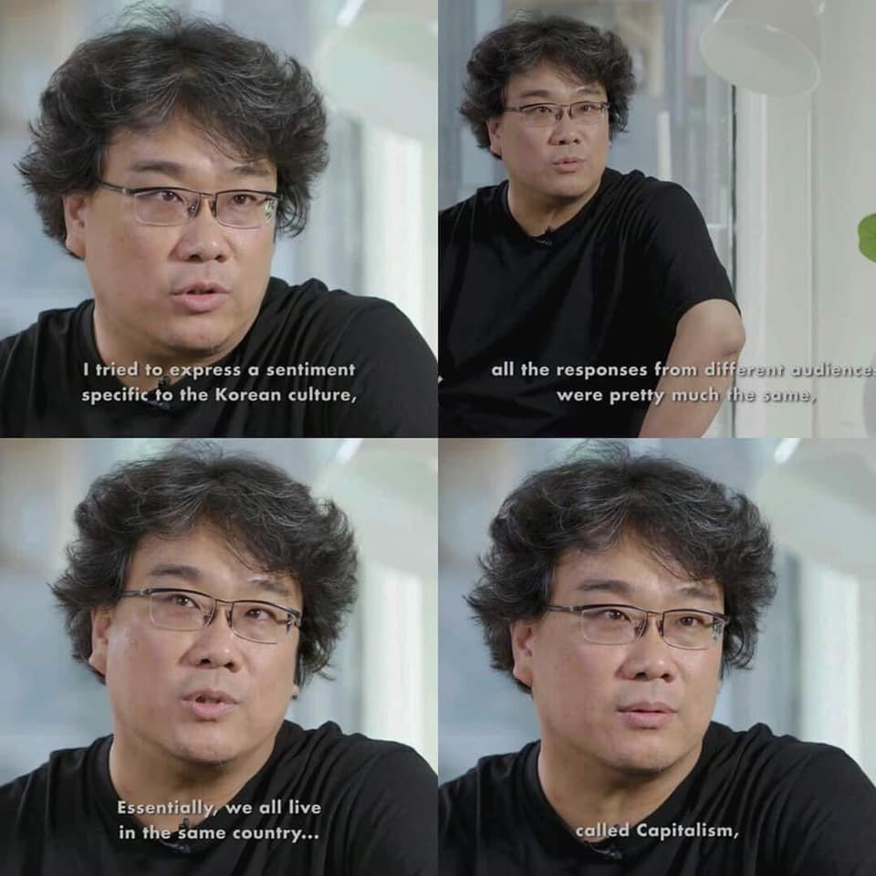

Hi friends,

_Welcome to [The Curtain](https://guscuddy.substack.com/archive), a weekly newsletter about culture, theatre, and creativity. It’s written by me, [Gus Cuddy](https://twitter.com/guscuddy)._

_If you’ve been forwarded this email, you can sign up for yourself here:_

[Sign up now](https://guscuddy.substack.com/subscribe?)

_This week is a special year-in-review edition._

---

Happy New Year!

In a lot of ways, this has been a very strange year for me. But one of the best things I’ve done is to start this newsletter.

To look back at the year, I collected some of my best, most well-received writing this year. For anyone who wants to see everything I've written in one place, this is your one-stop-shop. I’ve organized it by theme:

### Culture

**[Nostalgia is Toxic](https://guscuddy.substack.com/p/the-curtain-31-nostalgia-is-toxic)** and **[The Age of the Remix](https://guscuddy.substack.com/p/the-curtain-32-the-age-of-the-remix)** - Maybe my favorite essays I wrote this year, and a lens with which to view the assertive forces of art we have seen across mediums in the past year or two. 

**[The Year of the Mask](https://guscuddy.substack.com/p/the-curtain-36-the-year-we-wore-masks)** - An examination of a year in which we were obsessed with interrogating our trauma and covering it with different types of masks, whether that be literal (_Mandalorian_, _Watchmen_, _Ghosts of Sugar Land_), or metaphorical (_Parasite_, _Succession_).

**[Antidotes to the Cult of Algorithms](https://guscuddy.substack.com/p/the-curtain-10819-)** - Looking at why it feels harder to discover music in 2019 than ever, despite there being countless algorithms attempting to force-feed us new media. And what art's got to do with it.

**[Simplicity, Complexity, and Agency](https://guscuddy.substack.com/p/the-curtain-82019-)** - A look at how impossible it can feel to make a decision amidst the rebelling forces of complexity and simplicity in culture and tech in 2019.

**[Hyperlink Consciousness](https://guscuddy.substack.com/p/the-curtain-51419)** - Inspired by Marshall McLuhan, I did a very brief examination of the way tools have shifted our consciousness throughout history.

### Criticism

**[The State of Criticism](https://www.guscuddy.com/2019/09/28/state-of-criticism/)** - After Sara Holdren stepped down, I examined what makes good criticism in theatre and movies.

**[Criticism and Making are not opposites. They're the same thing](https://guscuddy.substack.com/p/the-curtain-35-criticism-and-making?r=iq1l&utm_campaign=post&utm_medium=web&utm_source=copy).** - A look at how criticism and making intersect more than many think; one makes you better at the other, and often they are the same thing.

**[Once Upon a Time in Coriolanus](https://guscuddy.substack.com/p/the-curtain-8619-)** - Reviews of _Once Upon a Time in...Hollywood_ and the Public Theater's _Coriolanus_. 

### Theatre

**[The State of the Audience](https://www.guscuddy.com/2019/09/28/state-of-audience/)** - What does it mean to be a theatre audience member today? Jumping off of Jeremy O. Harris' comments that phones don't bother him in theatre, I examine the trouble with blaming young audience members who use phones, and what we can do about it.

**[The Qualities of Good Theatre](https://www.guscuddy.com/2019/05/07/qualities-of-great-theatre/)** - A blog post I wrote in May on what I thought were the qualities of good theatre. I've grown a lot since this post in terms of writing, but I stand by the ideas.

**[The Unprofitability is the Point](https://guscuddy.substack.com/p/the-unprofitability-is-the-point)** - Theatre (besides the occasional successful commercial kind) is almost always at odds with profitability. But this is actually the point. The capitalist, technocratic demand for profitability leads to anti-Art (ala Disney).

**[The Internet and the Future of Theatre](https://guscuddy.substack.com/p/the-curtain-52119-).** A look at how the future of theatre lies in theatre artists leveraging the internet like Jeremy O. Harris has done in 2019 (clearly the biggest star of theatre this year).

**[Ghost Stories](https://www.guscuddy.com/2019/10/22/ghost-stories/)** - A critical examination of ghosts in culture and theatre: _Heroes of the Fourth Turning_, _The Thin Place_, and _Our Dear Dead Drug Lord_.

### Creativity

**[Inputs and Outputs](https://guscuddy.substack.com/p/-the-curtain-37-inputs-and-outputs)** - A brief essay on how curating your inputs leads to better outputs.

**[What we talk about when we talk about the unconscious](https://guscuddy.substack.com/p/curtain-29-what-we-talk-about-when)** - "One of the main drivers of all great artists throughout history is not money, prestige, or helping people. Instead, it’s to bridge the space between the conscious and unconscious worlds."

**[How to Make Unforgettable Art](https://guscuddy.substack.com/p/the-curtain-27-how-to-make-unforgettable)** - Looking at the Safdie Brothers and Will Arbery, I extract some ideas on what it takes to make unforgettable art. (In Arbery's case, specifically as a white creator.) "Simple and complex are not opposites."

++

Thank you for reading in 2019! I’m already excited about 2020 and the decade ahead.

---

## 🗒 Notes from the Week

#### Bong Joon-Ho on Parasite

 

---

#### [Adam Driver's Mysterious, Mesmerizing Presence](https://www.buzzfeednews.com/article/annehelenpetersen/adam-driver-marriage-story-star-wars-girls-career)

> What makes Driver exceptional isn’t just his size, or his Renaissance painting of a face, or his voice. It’s the way he manages to make it feel like he’s offering up every part of himself he has to give — but is still keeping a secret, whose contours you’re desperate to discover.

Loved [this profile](https://www.buzzfeednews.com/article/annehelenpetersen/adam-driver-marriage-story-star-wars-girls-career) of the great, weird Adam Driver by Anne Helen Petersen.

---

#### [White Nationalism's Deep American Roots](https://www.theatlantic.com/magazine/archive/2019/04/adam-serwer-madison-grant-white-nationalism/583258/)

I missed [this Adam Serwer piece](https://www.theatlantic.com/magazine/archive/2019/04/adam-serwer-madison-grant-white-nationalism/583258/) from April, but it's one of the best essays of the year, tracing how Hitler was inspired by Madison Grant's 1916 book _The Passing of the Great Race_, a book that was very influential in the United States.

> Grant’s purportedly scientific argument that the exalted “Nordic” race that had founded America was in peril, and all of modern society’s accomplishments along with it, helped catalyze nativist legislators in Congress to pass comprehensive restrictionist immigration policies in the early 1920s. His book went on to become Adolf Hitler’s “bible,” as the führer wrote to tell him.

[This recent article](https://www.nytimes.com/2019/12/28/us/politics/trump-2020-trumpstock.html?smid=nytcore-ios-share) in the New York Times about "Trumpstock" is also relevant:

> “They label us white nationalists, or white supremacists,” volunteered Guy Taiho Decker, who drove from California to attend the event. A right-wing protester, he has previously been arrested on charges of making terrorist threats. “There’s no such thing as a white supremacist, just like there’s no such thing as a unicorn,” Mr. Decker said. “We’re patriots.”

---

#### [Your Moods are For Sale](https://thebaffler.com/downstream/big-mood-machine-pelly)

The future is now: Spotify tracks your moods based on your listening habits, then sells them to advertisers.

> In Spotify’s world, listening data has become the oil that fuels a monetizable metrics machine, pumping the numbers that lure advertisers to the platform. In a data-driven listening environment, the commodity is no longer music. The commodity is listening. The commodity is users and their moods. The commodity is listening habits as behavioral data. Indeed, what Spotify calls “streaming intelligence” should be understood as surveillance of its users to fuel its own growth and ability to sell mood-and-moment data to brands.

---

#### Playwriting MFAs, and the Problem with Theatre vs Television

A terrific thread from Mike Lew:

https://twitter.com/MikeLew4/status/1209313549987799042https://twitter.com/MikeLew4/status/1209313551631958016https://twitter.com/MikeLew4/status/1209313552663818241

---

### End Note

_That’s all for this DECADE—thanks so much for reading!_

_If you enjoyed this, please consider forwarding it to a friend or two. If you’ve been forwarded this email and want to receive The Curtain every Tuesday, click the button below:_

[Sign up now](https://guscuddy.substack.com/subscribe?)

_You can access the entire archive [here](https://guscuddy.substack.com/archive?utm_source=menu-dropdown)._

_As always, you can reply directly to this email and I’ll receive it. So feel free to do that about anything. You can also reach me at my personal email: [gus.cuddy@gmail.com](mailto:gus.cuddy@gmail.com)._

_See you next week!_

\-Gus