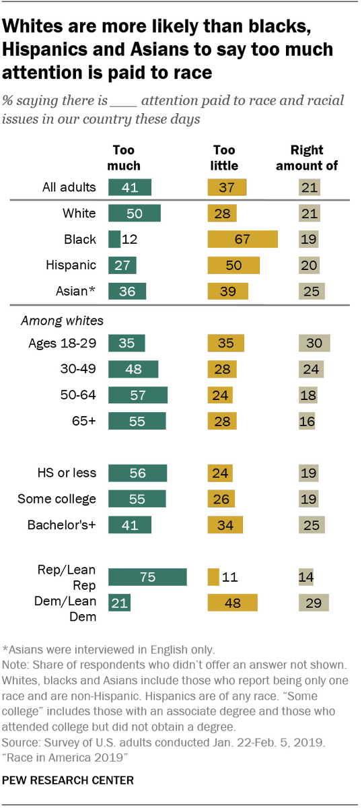
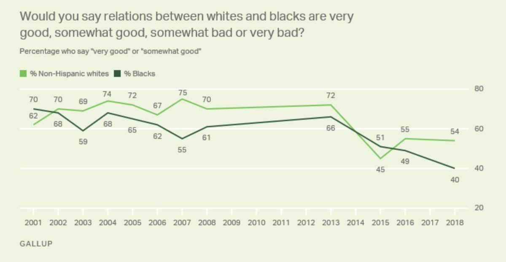
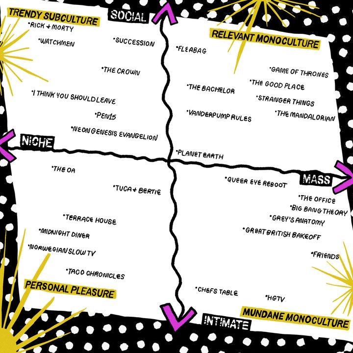
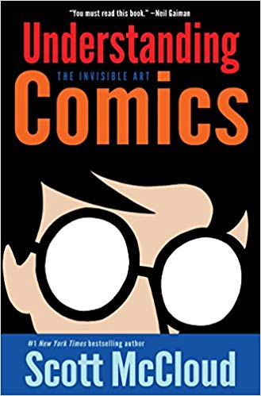
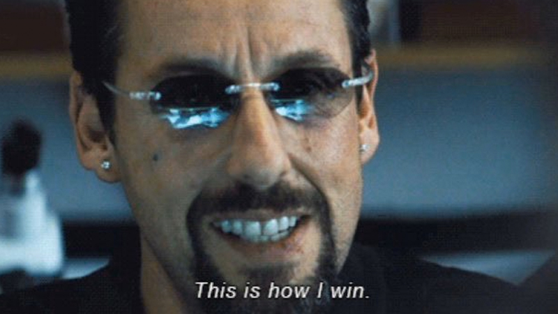

Hi friends,

_Welcome to [The Curtain](https://guscuddy.substack.com/archive), a weekly newsletter about theatre, culture and creativity. It’s written by me, [Gus Cuddy](https://twitter.com/guscuddy)._

_If you’ve been forwarded this email, you can sign up for yourself here:_

[Sign up now](https://guscuddy.substack.com/subscribe?)

---

#### The Entanglement

We live in webs of entanglements. Amidst history, society and pop culture, these entanglements live with us, whether we notice them or not.

Many entanglements are things we must constantly grapple with. As a nation, the United States is founded on life, liberty and the pursuit of happiness; it also has deeply rooted [white supremacy](https://www.theatlantic.com/magazine/archive/2019/04/adam-serwer-madison-grant-white-nationalism/583258/), misogyny, and violence. At the movies—an art form founded by immigrants—one of the cornerstone, influential works is _Birth of a Nation:_ the story of heroizing the Ku Klux Klan. Today, a movie like _Black Panther_ can be an influential pro-black work, while also being an intellectual property originally created by [two white men](https://en.wikipedia.org/wiki/Black_Panther_(Marvel_Comics)#Erik_Killmonger_/_N'Jadaka) and owned by mega-corporation Disney. In music, the most influential American genres like Jazz and Hip Hop were created by African-Americans, and yet are [constantly appropriated by white creators](https://www.nytimes.com/interactive/2019/08/14/magazine/music-black-culture-appropriation.html)—and appear in the Billboard Charts as a result. And at the theatre, we have a renaissance of incredible, radical black playwrights, yet these works consistently are appearing in white institutions, and seen by mostly white audiences.

In an interview in [Brooklyn Rail](https://brooklynrail.org/2019/06/theater/In-Dialogue-Inner-Life-Out-Loud-A-Strange-Loop) between playwrights Branden Jacobs-Jenkins and Michael R. Jackson, Jenkins touched on this last entanglement:

> I don't think there's a lot of conversation among black artists about their entanglements with whiteness. And how their voices are almost fully enabled because of white institutions, white kind of like audiences, white patronage, white criticism, and there's like very little interest in untangling that, or talking about that entanglement. And I just wonder what that is.

How do we live with these entanglements? Do we burn them down? Do we disentangle? Do we need to learn to live with them? Or can art put up a burning, fiery microscope to them?

Many white America simply ignore them. In a recent study from Pew Research Center, 50% of white Americans said “there is too much attention paid to race and racial issues in our country these days”. Likewise, most white Americans believe that relations between whites and blacks are “somewhat good”, whereas 40% of blacks say the same thing. (Thanks to [this great thread](http://twitter.com/michaelharriot/status/1216460438419968000) by Michael Harriot for the charts.)

 

There have been numerous great plays by writers of color in recent years that have attacked this entanglement: Jackie Sibbles Drury's _Fairview_, Aleshea Harris' _Is God Is_, Jordan E. Cooper's _Ain't No Mo_, Jeremy O. Harris' _Slave Play_, and many more. Yet much of theatre from the director and production side have not caught up. Most theaters are vastly white, and this whiteness runs deep, often all the way to [box office practices](http://twitter.com/josesolismayen/status/1186831453620973568). Then there is the constant entanglement of white directors directing works by playwrights of color. (Almost 90% of directors hired at the ten largest off-Broadway theaters between 2007 and 2017 were white.) The reverse—directors of color getting to direct white writers’ work—is largely not true, as Nicole Brewer [showed in Howlround](https://howlround.com/playwrights-color-white-directors-and-exposing-racist-policy). When diagrammed, this ends up looking quite literally like an entanglement (but a lopsided one):

  

In the case of _Slave Play_, Harris is tussling dangerously with white supremacy and eroticism. As Dr. Avgi Saketopoulo (a queer pschyoanalyst focusing on trauma, gender and sexuality) [recently wrote in the LA Review of Books](https://lareviewofbooks.org/article/consentsowhite-on-the-erotics-of-slave-play-in-slave-play/), "In contrast to works of art that portray the history of chattel slavery in the past tense, _Slave Play_ puts its audience on a collision course with how this history pulses through us in the present." She goes on to write that "_Slave Play_ hints at how, amid the trauma of having a body entangled with ghastly histories, projects of emancipation may take unexpected paths." Harris is exploring the entanglement of historical traumas and sexuality; while it has been divisive, it's also one of the only works on Broadway in recent years that has attacked the entanglement at all. In _The Root_, Harris [recounted what director Robert O'Hara said](https://www.theroot.com/it-should-cost-you-something-as-it-debuts-on-broadway-1837972463): "if you’re going to see a play called _Slave Play_, it should cost you something, and the cost of that is the recognition of how we’re still entangled in that history."

The entanglement is not easy to escape. It can be exorcised, but will never be fully disentangled, not at least in this generation. It's the entanglement of being American: of living on stolen, blood-soaked land; of living in a system that still privileges people by the color of their skin; of wrestling with our own personal and historical legacies and traumas. And it's the entanglement of art, creators, institutions, and power. In 2020, we have to hold it all in our heads. The first step to overcoming the entanglement, though, is to acknowledge that it is there in the first place.

---

## 🗒 Notes from the Week

#### **[Monoculture and the Internet](https://www.vox.com/the-goods/2019/12/17/21024439/monoculture-algorithm-netflix-spotify)**

[Brilliant long-form piece](https://www.vox.com/the-goods/2019/12/17/21024439/monoculture-algorithm-netflix-spotify) on "monoculture" (i.e. TV events like _Game of Thrones_ or the Super Bowl) and whether they exist in the age of internet algorithms. Written by the very good Kyle Chayka, whose new book _[The Longing For Less](https://www.bloomsbury.com/us/the-longing-for-less-9781635572100/)_ is coming out next week.

> We could arrange various modes of digital media consumption on a chart, with a horizontal axis of the scale at which the content was designed to exist (trying to appeal to many people, or a smaller group?) and a vertical axis of the context in which the content is consumed (do you actively discuss it with others, or watch it privately?)

 

---

#### **[Varying Textbooks in the United States](https://www.nytimes.com/interactive/2020/01/12/us/texas-vs-california-history-textbooks.html)**

A fascinating and disturbing report on how American history textbooks differ subtly between California and Texas, emphasizing different perspectives on guns, borders, race, gender and more. The entanglement continues, and its complexity is deepened.

---

#### **[Is theater ridiculous?](https://www.nytimes.com/2019/12/30/arts/theater-in-movies-tv-books.html%0A)**

Interesting piece from Jesse Green looking at how theatre has recently been depicted in the movie _Marriage Story_, the book _Trust Exercise_, and the TV shows _Barry_ and _The Kominsky Method._ These works generally view theatre as "a cult of losers".

---

#### **On the Oscars:**

Not really worth talking about, but I did really like [Richard Brody's essay](https://www.newyorker.com/culture/the-front-row/the-fossilized-2020-oscar-nominations) (as usual) on the fossilization of the 2020 Oscar Nominations. Above all, the Academy reflects a disturbing attitude on what constitutes good filmmaking, has no clue what a director does, and views black filmmakers and actors in a demeaningly one-sided box.

---

## Recommendations

_**[Understanding Comics](https://en.wikipedia.org/wiki/Understanding_Comics)**_ **[by Scott McCloud](https://en.wikipedia.org/wiki/Understanding_Comics)**

 

This amazing comic on comics touches on the history of comics and art, visual design, Marshall McLuhan, representation, and how we interact with media. I just read it for the first time, but it’s a classic. Highly recommended.

**Uncut Gems**

 

Also obviously _Uncut Gems_, which is one of the best (and certainly the most frenetic and anxiety-inducing) movies of the year. I enjoyed [this piece](https://www.newyorker.com/magazine/2019/12/16/the-safdie-brothers-full-immersion-filmmaking) in The New Yorker on the Safdie Bros "full immersion" filmmaking.

---

_That’s all for this week—thanks so much for reading!_

_If you enjoyed this, please consider forwarding it to a friend or two._

_You can access the entire archive [here](https://guscuddy.substack.com/archive?utm_source=menu-dropdown)._

_As always, you can reply directly to this email and I’ll receive it. So feel free to do that about anything. You can also reach me at my personal email: [gus.cuddy@gmail.com](mailto:gus.cuddy@gmail.com)._

_See you next week!_

\-Gus