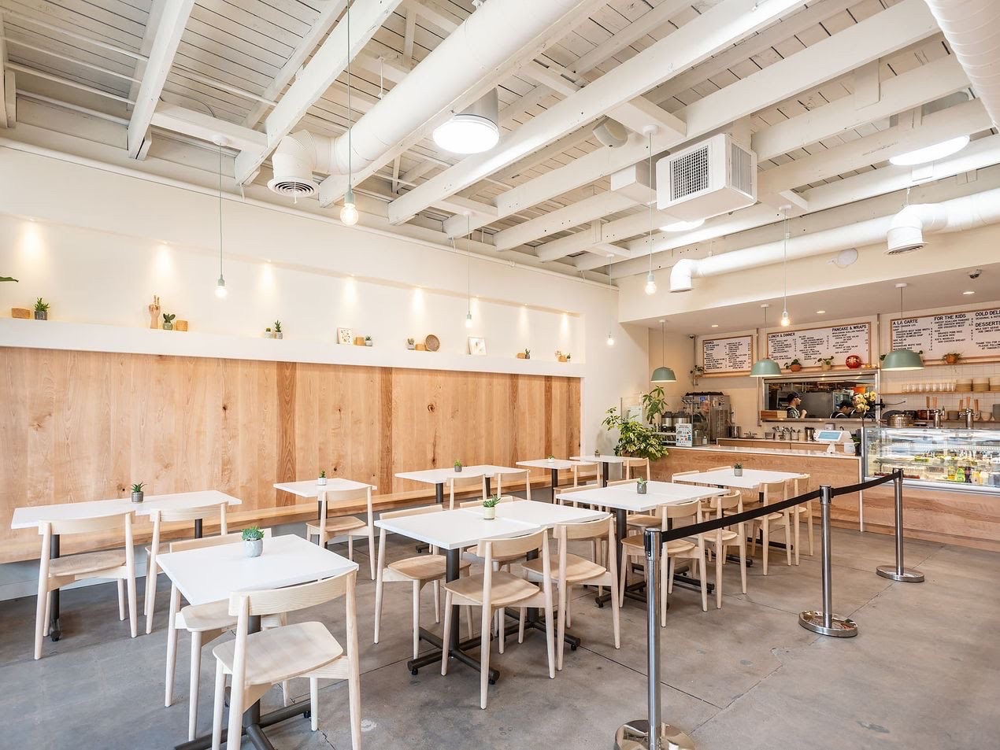

Hi friends,

_Welcome to [The Curtain](https://guscuddy.substack.com/archive), a weekly newsletter about theatre, culture and creativity. It’s written by me, [Gus Cuddy](https://twitter.com/guscuddy)._

_If you’ve been forwarded this email, you can sign up for yourself here:_

[Sign up now](https://guscuddy.substack.com/subscribe?)

---

In the late 2000s, I became obsessed with a blog called [Zen Habits](https://zenhabits.net/). Written by Leo Babauta, _Habits_ was one of the OG self-help blogs, promoting minimalism as a way of life and a productivity hack. It taught seventh grade me to wake up early, try meditating, go on runs (that one didn't last long), set your "MITs"—or "Most Important Tasks"—for the day, and declutter as a means of happiness. It spawned a spin-off site focused on being a minimalist (pre-dating the cringe-inducing _[Minimalists](https://www.theminimalists.com/)_), and several books and courses. Zen Habits wasn’t alone: blogs on minimalism became an entire genre, and an important precursor to the Marie Kondo-ization of culture. Bolstered as a necessity by the 2008 recession, minimalism became commandeered as a rallying cry for hipsters, and an answer to the crass, maximalist consumerism of the 90s and early 2000s. It also became a marketing tactic and a style of reverse consumerism, often privileging (surprise) affluent white men who could "adopt" minimalism as an aesthetic, negating greed with faux-simplicity.

The aesthetic of minimalism has been surprisingly sturdy. Although originating primarily as an avant-garde genre in American art in the 1960s, minimalism has found a new home not only with the rise of Zen Habits and similar blogs, but with the age of Instagram (which itself took over the visual mantle from the Tumblr and Pinterest days). In those years since Facebook bought it for one billion dollars in 2012, Instagram’s use has skyrocketed, and with that the aesthetics of cleanliness, simplicity, and minimalism. Generally this centers around “beautiful” people, clothing, places, and architecture. Clean lines, clean colors (like white), and a supposed removal of the “excess”. Many startups have capitalized on these aesthetics to formulate a brand, usually accompanied by the same sans-serif fonts spelling out bland slogans equating buying their product or service—which “simplifies” life in some way—with more purpose. But, as we know, startups do not really simplify; the illusion of making our lives simpler has been sold to us for as long as capitalism has been around, and is the propeller that keeps materialism running. Minimalism, thus, has become a brand: for individuals, for influencers, and for companies.

What this amounts to is a suffocating _sameness_ in design. This is evidenced by elements of culture as innocuous as [book covers](https://twitter.com/internetkendra/status/1215126916249767936), or in the trends of something like interior design—[what writer Kyle Chayka has deemed “airspace”](https://www.theverge.com/2016/8/3/12325104/airbnb-aesthetic-global-minimalism-startup-gentrification)—that is monopolizing cafes, AirBNBs, hotels, Brooklyn co-working spaces, and the like. It’s hard not to feel there is something political to these aesthetics. In a piece for _Current Affairs_, Nathan J. Robinson deemed the minimalism design trend as “[the aesthetic language of gentrification](https://www.currentaffairs.org/2019/02/death-to-minimalism)”.

 

##### This could be anywhere in gentrified Brooklyn.

But how did we get here? How did a style of art become a grossly capitalized aesthetic, fitting in with [the flattening whims of algorithms](https://guscuddy.substack.com/p/the-curtain-10819-?r=iq1l&utm_campaign=post&utm_medium=web&utm_source=copy)? Part of it can be attributed to the relentless drive towards optimization and profitability that technology and capitalism have wrought. This drive brings with it an oppressive noisiness, one that minimalism-as-a-cult promises to redeem (either through a podcast or ebook, or for the price of $10 a month). The heat of modernity leads to a ["longing for less"](http://www.theguardian.com/lifeandstyle/2020/jan/03/empty-promises-marie-kondo-craze-for-minimalism), as Chakya calls it. An unquenchable thirst for a more simple world, or a [nostalgia](https://guscuddy.substack.com/p/the-curtain-31-nostalgia-is-toxic) for an authenticity that was never really there.

But the world is not simple, and the aesthetics of minimalism do not truly reverberate as activism. Instagram-able minimalism is a privilege, and one that cannot be separated from the maximalist chaos of the world. If you want to just live with your MacBook, great, but that computer was made in sweat shops; your Whole Foods trip is powered by one of the most powerful monopolies in the history of capitalism; your Uber home allows you convenience at the cost of contributing to environmental pollution and unethical working conditions. It’s become almost impossible to minimize our contradictions. Any minimalism is entangled with a maximalist, immense web of disgusting and complex capitalist structures. That’s why Internet personalities like _[The Minimalists](https://www.theminimalists.com/)_ have an air of moral righteousness that rings so false; despite the motivations for their desire to consume less being understandable, these affluent white men are able to be minimalist because of a system of immense economic inequality and violence.

It's a shame, though, that minimalism has been co-opted by marketing. Because in art, at its core, the genre can lead to the occasional glimpse of the transcendent. There is a tradition (and cliché) of minimalism in theatre (["I can take any empty space and call it a bare stage"](https://en.wikipedia.org/wiki/The_Empty_Space)), much of which has been beaten to death by European theatre. Sometimes this leads to sets so minimalist as to not even be there, in the case of Sam Gold's cold _[Glass Menagerie](https://www.nytimes.com/2017/03/09/theater/the-glass-menagerie-review.html)_. And sometimes it leads to works of brilliant invention, like Tina Satters' weird and scary _Is This a Room_. The theatre, after all, has been thought of as a place where the invisible can be made visible. And the invisible, it must be said, is decidedly minimalist. Likewise, minimalism in fine arts, such as Agnes Martin, can be immensely overpowering. And minimalism in music need not be mere background music. Composers like Julius Eastman ([a favorite of Jeremy O. Harris](https://pitchfork.com/thepitch/what-slave-play-writer-jeremy-o-harris-is-listening-to-right-now/)), have created minimalist music that is politically and culturally charged. 

But some of the great works of pop culture in recent years have seen a fascinating melding of minimalist and maximalist energies. When I think back on theatre like _A Strange Loop_, _Slave Play_, _Oklahoma_, _Fairview_, _An Octoroon_, or _Heroes of the Fourth Turning_, I don't necessarily think of spare, minimalist artistic impulses. Instead, I think of creators that stuffed their work to the brim with compelling, exhilirating ideas; then, they let the strength of the invisible in theatre—the part the audience fills in—take care of the rest. In TV like _Watchmen_, _Fleabag_, or _Euphoria_, maximalist ideas were stuffed into minimalist scaffolding: nine episodes and done for _Watchmen_, two seasons of six episodes of thirty minutes for _Fleabag_, and eight episodes for _Euphoria_. And in the movie _Uncut Gems_, maximalist filmmaking and energy exoploded a minimalist story spine. The point isn't necessarily to cut out everything, or even to cut out all that's "inessential", or that's "excess". Sometimes what seems like excess is actually what's in the shadows or what's lurking beneath. As Werner Herzog [said in an interview with GQ](https://www.gq.com/story/werner-herzog-profile-cave-of-forgotten-dreams), "We have to have our dark corners and the unexplained. We will become uninhabitable in a way an apartment will become uninhabitable if you illuminate every single dark corner and under the table and wherever—you cannot live in a house like this anymore." Shallow maximalism illuminates the whole apartment, but shallow minimalism shows just the table. The true invisible bridging between minimalism and maximalism happens when we allow the shadows to fall as they may.

I’ve grown since the days of obsessing over minimalism blogs, but I still fall victim to its trappings. It’s hard not to in 2020. But what I want to be weary of is using minimalism as a means of ignoring the hard-cut realities of society, and confusing its seductive aesthetics with any sort of real-world change. The cult of minimalism is strong, and its effects are dulling; the world does not need to be seen in Helvetica, black and white, or neatly folded squares. One can live simply and minimally without fooling themselves of its supposed importance. And one can create art that celebrates the brilliance of Minimalism, while engaging maximally with what really matters. Anything less is, to put it simply, not enough.

---

### Notes from the Week

*   [Josh Fox vs The Public](https://www.nytimes.com/2020/01/18/theater/josh-fox-public-theater-canceled-show.html). Helen Shaw’s [great review](https://www.vulture.com/2020/01/reviews-the-conversationalists-and-the-truth-has-changed.html) reveals some bizarre additional details: “Fox is also willing to bend reality to his narrative. A show that we’re told will run 90 minutes is actually an unbroken two hours plus an unannounced talkback. (This might seem minor, but it can have major repercussions in a tightly scheduled festival, in which every artist needs to share space.) Also, at the end of the performance I saw, a handful of people stood to applaud, but the majority did not. He then asked us all to stand, to raise a fist for freedom and resistance. Then he took a picture. I noticed that he recently Instagrammed an image of a unanimous “standing ovation” at the Public, in the fists-raised pose he asked for. The Truth … is malleable.”
    
*   the Safdie Bros. [short film with Adam Sandler](https://vimeo.com/382811408)
    
*   on the [theatrical terror of](https://medium.com/@christianlewis_11156/on-theatrical-terror-our-dear-dead-drug-lord-and-the-thin-place-2c2dd6c2e768) _[Drug Lord](https://medium.com/@christianlewis_11156/on-theatrical-terror-our-dear-dead-drug-lord-and-the-thin-place-2c2dd6c2e768)_ [and](https://medium.com/@christianlewis_11156/on-theatrical-terror-our-dear-dead-drug-lord-and-the-thin-place-2c2dd6c2e768) _[Thin Place](https://medium.com/@christianlewis_11156/on-theatrical-terror-our-dear-dead-drug-lord-and-the-thin-place-2c2dd6c2e768)_ (cf. [my piece on this](http://guscuddy.com/2019/10/22/ghost-stories/))
    
*   [10 Female Directors to Hype Up (Who Aren’t Greta Gerwig)](https://wearyourvoicemag.com/entertainment-culture/10-female-directors-to-hype-up)
    
*   [Silence has become a luxury](https://ift.tt/2QSSlFk)
    
*   [For 13 Years, He Has Humanized the Villain of ‘Oklahoma!’](https://ift.tt/2TGun1W)
    
*   Uh oh: [Clearview AI is making everyone’s faces searchable by the police](https://www.nytimes.com/2020/01/18/technology/clearview-privacy-facial-recognition.html) 
    

---

### End Note

_That’s all for this week—thanks so much for reading!_

_If you enjoyed this, please consider forwarding it to a friend or two._

_You can access the entire archive [here](https://guscuddy.substack.com/archive?utm_source=menu-dropdown)._

_As always, you can reply directly to this email and I’ll receive it. So feel free to do that about anything. You can also reach me at my personal email: [gus.cuddy@gmail.com](mailto:gus.cuddy@gmail.com)._

_See you next week!_

\-Gus