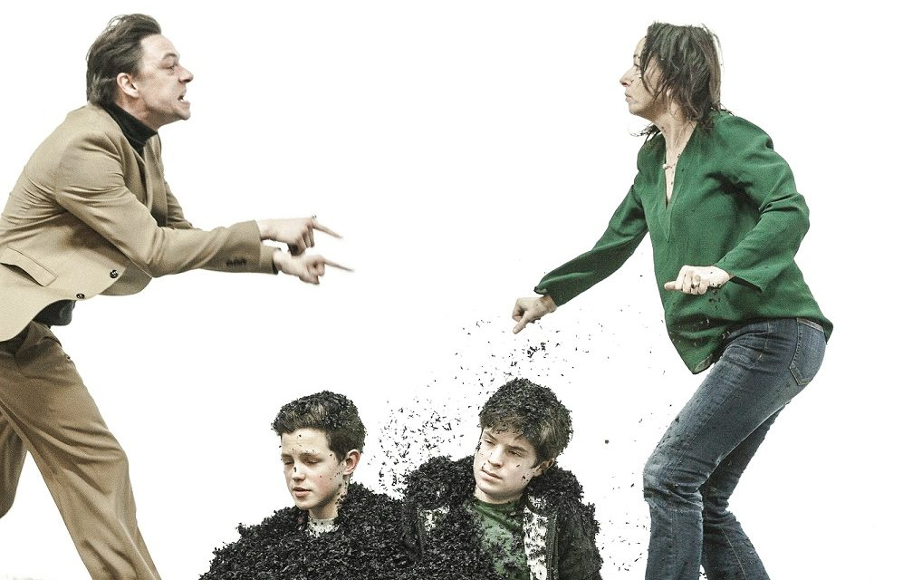
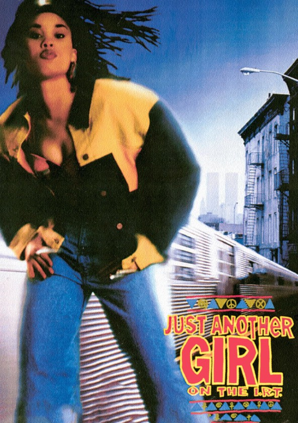

Hi friends,

_Welcome to [The Curtain](https://guscuddy.substack.com/archive), a weekly newsletter about theatre, culture and creativity. It’s written by me, [Gus Cuddy](https://twitter.com/guscuddy)._

_If you’ve been forwarded this email, you can sign up for yourself here:_

[Sign up now](https://guscuddy.substack.com/subscribe?)

---

### The Rise of the Influencer Playwright and Director

Last night my partner and I saw Simon Stone's adaptation of _[Medea](https://www.bam.org/medea)_ at BAM. I originally saw Stone's production at [International Theatre of Amsterdam](https://ita.nl/nl/) (Ivo Van Hove's theater, then titled Toneelgroep), and it has since played across Europe, including a [recent successful stint](https://www.theguardian.com/stage/2019/mar/07/medea-review-barbican-london-simon-stone) at the Barbican in London. What struck me most about it is that, despite the excellent and popular Rose Byrne and Bobby Canavale playing the lead roles, the name we talked about most after was that of Stone's, its maestro. Did his adaptation work? Did its [minimalist](https://guscuddy.substack.com/p/the-cult-of-minimalism-and-the-untapped), white set adequately contain its energies, or did it veer too far into pretension?

 

##### The original Dutch production. Photo by Sanne Peper.

Stone is part of a recent class of "auteur" theatre directors, along with the likes of Ivo Van Hove, Sam Gold, Robert Icke, or Daniel Fish, to name several others that have recently been produced on Broadway. Obviously, the first (unfortunate) thing that jumps out from that list is that they are all white men. Theatre has been disappointingly regressive with how it produces its non-male and non-white directors; rarely are they given the type of platform these men have received, and almost never the artistic license, no matter how excellent they may be. But auteur directors are nothing truly new to modern theatre: ushered on largely by Peter Brook, there have been many in the last 60 years (though, it should be noted, not many before that.) Brook, Wilson, LeCompte, and [others rounded out the 1980s](https://www.nytimes.com/1985/11/24/theater/auteur-directors-bring-new-life-to-theater.html). But what has differentiated the recent class is not only their commercial success, but also their prestige as the key influencers for the production.

The future of theatre, like film and television, rests on the rise of the influencer and, to a lesser extent, the dominance of the overreaching institution. Film, of course, has its auteurs, both new and old, like Scorsese, Gerwig, the Safdie Brothers, Joon-Ho, Tarantino, Duvernay, Peele, Lee, Anderson, or Copolla. Some, like Fincher and Lynch, have moved into television, as well. And institutions like Netflix and HBO have dominated the marketplace of TV, while Disney has dominated content altogether. But in theatre, the rise has been more subtle. Auteur directors never quite broke through to “mainstream” until recently, and while playwrights have traditionally been the hierarchical trendsetters of theatre (think Tennessee Williams, Arthur Miller, or Beckett), this new class is not only terrifically diverse (in many ways), but there is [a nascent leveling](https://guscuddy.substack.com/p/the-curtain-52119-?r=iq1l&utm_campaign=post&utm_medium=web&utm_source=copy) of the playing field between “downtown” and “uptown” work. 

This idea of the “influencer director”, then, is in concert with the recent rise of the “influencer playwright”. These individual forces have largely replaced the predominance of collectives and, at the same time, lessened the power of the medium-tier institution. In Helen Shaw’s [recent piece](https://www.vulture.com/2019/12/the-2010s-in-theater-spidey-hamilton-gatz-and-much-more.html) reviewing the decade, she notes the rise of the influencer playwright, writing that in the 2010s “one New York era faded (of experimental collectives) and another began (the Influencer Playwright)”. 

When we say influencer playwright, we’re talking about someone like Lin-Manuel Miranda, who turned _Hamilton_ into a national fever that consumed even the Obamas. We’re also talking about someone like Jeremy O. Harris, who turned the off-Broadway success of _Slave Play_ into a Broadway run, [working with Rihanna](https://www.nytimes.com/interactive/2019/05/20/t-magazine/rihanna-fenty-louis-vuitton.html) and becoming a fashion icon. Clubbed Thumb alum Heidi Schreck had _What the Constitution Means to Me_ have similar success at New York Theatre Workshop, then also went on to Broadway and is currently touring the country. Performer, playwright and artist Taylor Mac, a long-hailed staple of the downtown scene, made their debut on Broadway last year. Playwright Jordan E. Cooper, whose _Ain’t No Mo_ was one of the most exciting debuts of 2019, was one of the first (?) playwrights who [appeared on The Breakfast Club](https://www.youtube.com/watch?v=37R1kwv1HWg). And Alexis Scheer’s _Our Dear Dead Drug Lord_ had a wildly extended run at the WP Theatre, and also broke the weekly and nightly gross records for the space.

Theatre artists are influencers in a similar way to how YouTubers or Instagram stars are: their name has become synonymous with their work. While many institutions still struggle under the weight of trying to reconcile theatre with the 21st century by insisting on the “importance of stories”, as Helen Shaw puts it, influencer playwrights and directors go on creating compelling work that people gather to see and buzz about. The unifying theme? Many of these artists create work that is uniquely theatrical, often creating situations that make audiences implicitly or explicitly involved, such as in _Fairview_ or _What to Send Up When it Goes Down_; others focus on the arguments and dialogue at the core of another type of theatre, which in general appeals to an older audience. 

Theatre artists that create exciting work become “brands” in and of themselves, outside the institutions that produce them. The new Lin-Manuel, Jeremy O. Harris, Annie Baker, Jackie Sibbles Drury, Will Arbery, Lucas Hnath, or Aleshea Harris are all an event that is defined by its playwright. Just as with the new Ivo Van Hove, Simon Stone, or Tina Satter. Sometimes these artists have online brands, like with the über-influencers O. Harris or Miranda. But other times the internet is contributing to discourse and buzz, like with Fish’s _Oklahoma_ becoming known as “Sexy Oklahoma”, or with Arbery’s _Heroes_ inspiring many online think pieces.

What does this mean for the future of theatre? It’s not yet clear. Institutions like The Public or the National Theater still prove to be extremely powerful, but even there there is a whiff of the slow dinosaur, of a bureaucracy that cannot move at the lightning speed of the internet. I expect these institutions can and will adapt, but this probably means the concentration of power among theatre institutions will lend itself to a powerful few, as with film and TV. The rise of the influencer playwright and director also bleeds into things like criticism. Critics like [Jose Solis](https://twitter.com/josesolismayen?ref_src=twsrc%5Egoogle%7Ctwcamp%5Eserp%7Ctwgr%5Eauthor) and [Sara Holdren](https://twitter.com/swholdren?lang=en) (who now works as a director) have defined themselves as unique presences amidst a sea of sameness. 

And implicit in all of this is the seeming disempowerment of the individual actor. Theatre, to be clear, is a collaborative form that is constructed by many people; while there may be one overarching “artist” for a production, everyone involved is an artist who brings their unique selves to the table. As an actor, I worry about an attitude of reverence to the playwright (or director). It creates a hierarchy where they shouldn’t necessarily be one. And, after all, the only thing that ultimately matters is the actor: they are the ones on stage, who we see, who are speaking the words. But the current state of theatre lacks many influencer actors, true old school stars, as most of the “stars” of theatre are now Hollywood actors. Still, I am optimistic about the rise of influencer playwrights and directors being ultimately a good thing for theatre: the more quality work, the better.

In sports, player empowerment has been the story of the NBA in the past couple years. Movies like 2019’s _High Flying Bird_, directed by Steven Soderbergh, dramatize this struggle by showing that, without its players, the NBA and its owners are nothing. A similar movement is happening within theatre. Strong institutions still are an important force in theatre. But without their artists, they are nothing. 

---

## Notes from the Week

**Simon Stone**

From an [interview with The Stage](https://www.thestage.co.uk/features/interviews/2019/yerma-director-simon-stone-on-bringing-his-radical-medea-to-london-i-dont-make-directors-theatre-thats-a-misjudged-analysis/):

> “I don’t make ‘directors’ theatre’ – that’s a purely misjudged analysis. People say that any aesthetic newer than the 1950s is immediately ‘directors’ theatre’, but it’s not. It’s just a reflection of the world we live in. “I would actually say I’m much more traditional, in terms of theatre,” he adds. “For much longer in its history, theatre has looked like my production of Medea: an empty stage, a void, in which people talk to each other. It’s very obtuse to assume that the removal of detail turns something into ‘directors’ theatre’.”

I love [his talk with Anne Bogart](https://www.youtube.com/watch?v=Qficpne0ITo), as well. I learned a lot from it. And [the recent New York Times feature](https://www.nytimes.com/2020/01/01/theater/simon-stone-medea-bam.html) on him was good.

---

*   [Was Broadway ready for](https://www.nytimes.com/2020/01/27/theater/slave-play-broadway-interviews.html) _[Slave Play](https://www.nytimes.com/2020/01/27/theater/slave-play-broadway-interviews.html)_[?](https://www.nytimes.com/2020/01/27/theater/slave-play-broadway-interviews.html)
    
*   [Jia Tolentino on minimalism](https://www.newyorker.com/magazine/2020/02/03/the-pitfalls-and-the-potential-of-the-new-minimalism) (with a very similar title to my piece [last week](https://guscuddy.substack.com/p/the-cult-of-minimalism-and-the-untapped) 🤔)
    
*   [Isaac Butler on Shakespeare and politics](https://medium.com/@parabasis/following-the-action-some-thoughts-on-shakespeare-and-politics-5c84181a1732)
    
*   [Who’s watching your porch?](https://www.nytimes.com/2020/01/19/style/ring-video-doorbell-home-security.html)
    
*   Good tweet:
    

http://twitter.com/eleanorjburgess/status/1218554904006025217

---

###   
Recommendation

**[Just Another Girl on the I.R.T](https://www.newyorker.com/culture/the-front-row/the-still-astonishing-just-another-girl-on-the-irt?source=EDT_NYR_EDIT_NEWSLETTER_0_imagenewsletter_Movies_ZZ&utm_campaign=aud-dev&utm_source=nl&utm_brand=tny&utm_mailing=TNY_Movies_012420&utm_medium=email&bxid=5c7477ea3f92a46844779575&cndid=48285544&mbid=&utm_term=TNY_Movies)**

 

This striking movie from 1992 was recently featured in Film Forum’s series of “[Black Women: Trailblazing African American Actresses & Images, 1920–2001](https://filmforum.org/series/black-women-trailblazing-african-american-actresses-images-1920-2001)”. Directed by Leslie Harris (her only feature), it’s an original, alive and personal investigation of a young black girl growing up in Brooklyn. Streaming on Criterion Channel.

---

### End Note

_That’s all for this week—thanks so much for reading!_

_If you enjoyed this, please consider forwarding it to a friend or two._

_You can access the entire archive [here](https://guscuddy.substack.com/archive?utm_source=menu-dropdown)._

_As always, you can reply directly to this email and I’ll receive it. So feel free to do that about anything. You can also reach me at my personal email: [gus.cuddy@gmail.com](mailto:gus.cuddy@gmail.com)._

_See you next week!_

\-Gus