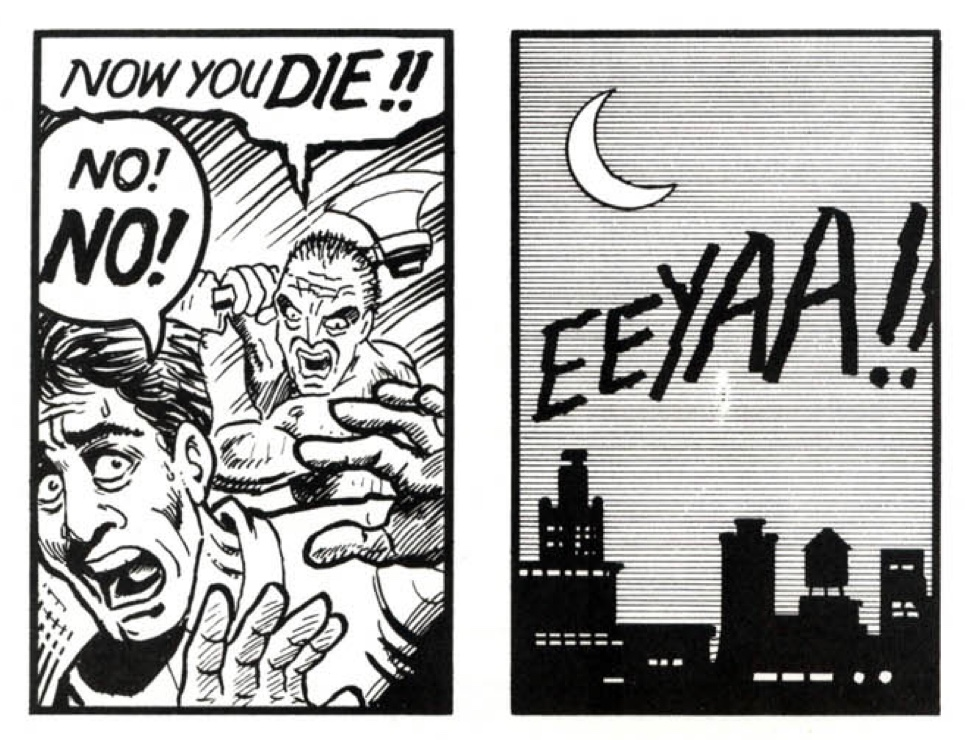
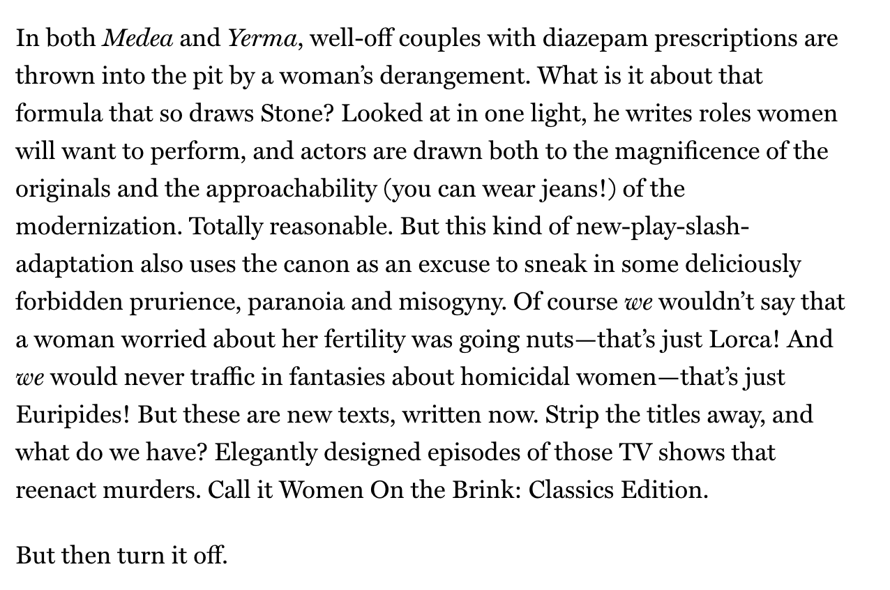

Hi friends,

_Welcome to [The Curtain](https://guscuddy.substack.com/archive), a weekly newsletter about theatre, culture and creativity. It’s written by me, [Gus Cuddy](https://twitter.com/guscuddy)._

_If you’ve been forwarded this email, you can sign up for yourself here:_

[Sign up now](https://guscuddy.substack.com/subscribe?)

---

### The Sound, the Silence, the Invisible

Silence is becoming more and more scarce. Last year, noise complaints to 311 in New York City reached an all-time high. Helicopters, street noise, airplanes, music, and other 21st-century ambiance combine with the increasing density of cities to create a perpetual noisiness to modern-day urban life. That’s why everywhere you go in the city you see people with AirPods in, trying to block out the world with more noise. (Apple’s new AirPods Pro even has noise-blocking technology in a tiny, wireless package; I’ll admit that I’m attracted to the idea.) These “wearables”, as Apple classifies them, are in essence an extension of the ear, in McLuhan terms. We are replacing the noise with our own self-chosen noise, like our algorithmically verified Discover Weekly, or Michael Barbaro’s lulling voice on _The Daily_. If we took our earbuds out, we’d have to face the suffocating, unbearable loudness that drills into our minds, the hellish and terrifying fireball of noise that is the subway at Union Square. It can all feel a bit like we’re in _Uncut Gems_\-land, unable to quite grab a chance to breathe. This noise is hot, direct, in-your-face.

Loud noises are not good for us, that much is clear. They spike stress hormones, which can lead to a host of health issues. And as cities become denser, the noise will only get more deafening. (And will likely be worse in poorer communities and communities of color.) That’s why silence is now a luxury: only the affluent can afford space where they can be in peace. The other day I stumbled upon a new startup called “[getaway](https://getaway.house/)”. The premise? An easily rented cabin with amenities in nature to “unplug from the daily hustle”, complete with a phone lockbox. At prices around $200/night, it’s like rich camping, and reminiscent of the original American escaper-from-society-kind-of, Thoreau. But despite the faux-austerity, the attraction is clear: get me into _silence_, a “pure” state to re-connect.

The heat of modern loudness must be countered with the coolness of nature, of simplicity, of boredom, of quiet. Of sitting and thinking. Sure, we have bandaid solutions, like meditation “apps” that use your phone to help you meditate. But these are a bit like dealing with the devil, a slippery slope of endlessly cycling Wellness Capitalism perpetuated by Instagram and its Explore page. We don’t need more information. What people are looking for is not another app, or podcast, or ebook. It’s something far deeper.

One trait of a cool society is a capacity for nuance, which is something we, as a scaldingly hot society, do not have. But one of the best places to find nuance, even in an inescapably hot society, is in art. In John Cage’s famous _4’33_, there is nothing but silence, or rests, for the piece’s entirety. What Cage might be after is the sense of nuance that accompanies empty space, and the incredible involvement of the invisible. By reframing our perspective on music itself, we fill the invisible silence with emotion, thought, and reaction; in other words, nuance.

In the comics, there is something called the “gutter”, which is the space between the panels. In that space, everything that makes comics work happens: our brains take two images, and link them together into a narrative.

 

##### Try to not tell a story from these two images, from Scott McCloud’s _Understanding Comics_

The grammar of this invisible magic is called “closure”. Closure is what we do all the time when we fill in the invisible. It makes us complicit in a piece of art: whether that’s as a reader in comics, as an audience member in the theatre, or as a listener to John Cage’s _4’33_. In theatre, the invisible is many things: it’s the baggage we bring in as an audience, it’s the unspoken and repressed parts of life, it’s the spiritual, and it’s the actual act of theatre itself, which is a medium of metaphors defined by incomplete representations that require our brains to fill things in. Closure is the bridge between us and there.

The invisible is nuanced, and the invisible is often silent. But that doesn’t mean it isn’t heard; the best art leaves an impression on us in a deep way, such that we’re not even sure we can point to exactly how or why. That’s the invisible at work. While startups try to profit off of trying to correct for the hot noise of today by making cool silence into a commodity, we can turn our brains to something deeper. The invisible, then, can be an antidote to the noise of today. It’s the space between panels, the space between music, the space between words, and the space between thoughts.

"Build your film on white, on silence and on stillness." - Robert Bresson

---

## Notes from the Week

*   **The Profitability is the Point**: [Disney Buys Filmed "Hamilton" Rights for... Wait for It (😉)... $75 Million](https://deadline.com/2020/02/disney-paid-75-million-hamilton-movie-deal-lin-manuel-miranda-largest-film-acquisition-ever-1202849929/). This is the filmed stage version they did YEARS ago. Who ever said theatre was [unprofitable](https://guscuddy.substack.com/p/the-cult-of-minimalism-and-the-untapped)?
    
*   [Helen Shaw's review of](https://www.vulture.com/2020/01/how-do-you-solve-a-problem-like-medea.html) _[Medea](https://www.vulture.com/2020/01/how-do-you-solve-a-problem-like-medea.html)_ is excellent, and I have to say has made me reconsider Stone's work:
    

 

*   [My Instagram](https://nplusonemag.com/issue-36/essays/my-instagram/) by Danya Tortorici: great essay on the seductive hole of a $100 billion company.
    
*   [The Age of Instagram Face](https://www.newyorker.com/culture/decade-in-review/the-age-of-instagram-face) by Jia Tolentino - on an Instagram kick, missed this piece in December: "The face is distinctly white but ambiguously ethnic—it suggests a National Geographic composite illustrating what Americans will look like in 2050, if every American of the future were to be a direct descendant of Kim Kardashian West, Bella Hadid, Emily Ratajkowski, and Kendall Jenner (who looks exactly like Emily Ratajkowski)."
    
*   The internet is weird moment of the week: 
    

http://twitter.com/TurnerNovak/status/1219847747920113665

---

### **End Note**

_That’s all for this week—thanks so much for reading!_

_If you enjoyed this, please consider forwarding it to a friend or two._

_You can access the entire archive [here](https://guscuddy.substack.com/archive?utm_source=menu-dropdown)._

_As always, you can reply directly to this email and I’ll receive it. So feel free to do that about anything. You can also reach me at my personal email: [gus.cuddy@gmail.com](mailto:gus.cuddy@gmail.com)._

_See you next week!_

\-Gus