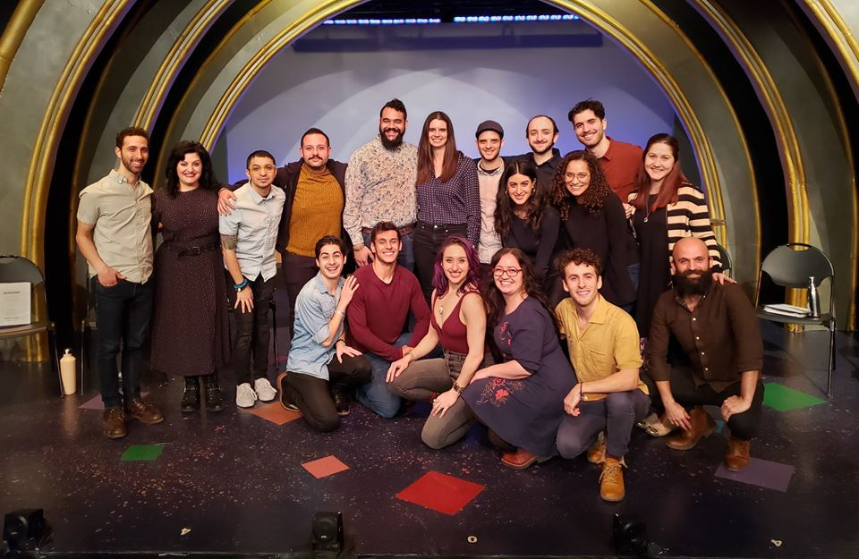

Hi friends,

_Welcome to [The Curtain](http://guscuddy.substack.com/), a weekly newsletter exploring theatre, culture, media, and the future. It’s written by me, [Gus Cuddy](http://guscuddy.com/)._

_If you’ve been forwarded this email, you can sign up for yourself [here](http://guscuddy.substack.com/subscribe)._

---

I have some new thoughts to share on the politics of minimalism, inspired by the recent reaction to Ivo Van Hove’s _West Side Story_, and building off some of my recent writing.

This past week I also participated in the reading of a new musical called _Borders_, by Janine McGuire and Arri Lawton Simon, presented at York Theatre. I had a blast. Here’s a nice picture of us afterwards:

 

I didn’t do as much reading or writing as I would have liked last week, but I had a lot of fun being in a rehearsal room again.

---

### The Hidden Conservatism in Minimalism

Philip Johnson was a Nazi, that much is clear.

The man who built the iconic minimalist “glass house” and other twentieth century architectural achievements was also a fascist Nazi sympathizer for much of his life. But this fascism wasn’t separated from his work. In many ways, it manifested itself in Johnson’s strict designs. Kyle Chayka writes in _The Longing for Less_ about the glass house:

> His sympathy for fascism is apparent in the strictness of the architecture itself. It’s a house built for and by a single person, demonstrating a kind of megalomaniacal possessiveness. The architect has nothing at stake in making a visitor comfortable, only himself.

 

##### Philip Johnson’s glass house.

Twentieth century modernism emerged in the mid century after two devastating world wars. As Chayka puts it, modernism “offered an antiseptic, ahistorical alternative to what came before it—a vision of a safer and cleaner world, with cosmopolitan equality for all who inhabited its architecture.” The de-ornamentation of minimalism, in other words, was its own type of Puritanism. It enabled a type of [subtle nostalgia](https://guscuddy.substack.com/p/the-curtain-31-nostalgia-is-toxic) and regressive politics.

[By flattening things out](https://guscuddy.substack.com/p/the-cult-of-minimalism-and-the-untapped), we may be able to achieve some sort of transcendence. But often we are merely hiding away from the immense complexity and [entanglements](https://guscuddy.substack.com/p/the-curtain-40-the-entanglement) of the world.

A few weeks ago, [I grappled](https://guscuddy.substack.com/p/european-theatre-vs-american-theatre) with some of the flattening that the important theatre director Ivo Van Hove does. The tides have turned against Van Hove a bit. What once went felt startlingly fresh—like a glass of cold water thrown against the face of American theatre—now feels a bit familiar and played out. At his best, Van Hove can offer spectacular and brutal visions of our inner psyches. But at his worst, Van Hove’s largely apolitical work can feel removed and regressive, problematic in similar ways to Johnson’s.

 

As expected, the reviews for his new _West Side Story_ on Broadway are severely mixed—in the truest meaning of that word. [Some](https://www.nytimes.com/2020/02/20/theater/west-side-story-review-sharks-vs-jets-vs-video.html) [were](https://www.vulture.com/2020/02/theater-review-a-new-west-side-story-onscreen-all-the-way.html) [harshly](https://www.thedailybeast.com/ivo-van-hoves-west-side-story-broadway-revival-aims-to-shock-but-ends-up-lost-in-time) critical, while [others](https://www.washingtonpost.com/entertainment/theater_dance/this-gutsy-new-west-side-story-is-unlike-any-youve-seen--and-its-exhilarating/2020/02/20/3f3533e6-5017-11ea-9b5c-eac5b16dafaa_story.html) [defended](https://www.timeout.com/newyork/theater/west-side-story-broadway-review-revival-ivo-van-hove) or [lauded](https://www.latimes.com/entertainment-arts/story/2020-02-20/ivo-van-hove-west-side-story-broadway-review) its perceived boldness.

Alexandra Schwartz in _The New Yorker_ wrote [one of the most scathing critiques of the production](https://www.newyorker.com/magazine/2020/03/02/a-grim-take-on-west-side-story), one that mirrors the problems of minimalism in art. She writes:

> The production is an infuriating example of what happens when a powerful style calcifies into shtick—infuriating because so much that is exciting, even revelatory, here is crushed beneath the director’s insistence on a vision that feels narrow and doctrinaire. He wants to make us see an iconic work with new eyes, but all we can see is him.

Van Hove’s minimalism, now pushed to the heights of commercial mainstream in theatre, has become conservative. It’s not anything we haven’t seen before, and it’s not anything Van Hove hasn’t done already. This _West Side Story_ has a shallow grasp of race in America, as well. [In an op-Ed for the](https://www.nytimes.com/2020/02/24/opinion/west-side-story-broadway.html) _[New York Times](https://www.nytimes.com/2020/02/24/opinion/west-side-story-broadway.html)_, critic Carina del Valle Schorske writes about how this version doesn’t do anything to unpack the show’s deeply problematic representation of Puerto Ricans:

> This production also renders the Jets as a multiracial gang, concocting a fantasy world in which bigoted whites form an alliance with African-Americans against Puerto Rican migrants — a bid, in Ms. De Keersmaeker’s words, “for inclusion of the American population today.” But it’s unlikely black New Yorkers would seek (or find) security among white Americans rather than among their Caribbean, Middle Eastern and Central American neighbors. Mr. van Hove’s casting misrepresents the real solidarities that form at the margins of U.S. citizenship — and perhaps more dangerously, shifts our focus away from the enduring problem of white supremacist violence. “Inclusion” here is code for willful colorblindness.

This is a type of something I call “two-dimensional racism”: when we treat diversity and inclusion as a quota to fill, as merely putting actors of color on stage without interrogating any deeper. It’s not anything new—in fact, it’s written into the very fabric of the show’s existence. Said Sondheim before writing: "I’ve never been that poor and I’ve never even met a Puerto Rican.”

That the production is also intertwined in a gross story about one of its actors being a sexual harasser—and that Van Hove and producer Scott Rudin have defended him, despite protestors outside the theatre every night—only speaks further to the politics of this kind of production. One that has the veneer of being radical, that commercially wants to be apolitical, but that is in actuality regressive and conservative.

---

## 📝 Notes from the Week

*   [Beyond “Decolonizing” the Syllabus in theatre](https://howlround.com/beyond-decolonizing-syllabus)
    
*   [Amazing Twitter thread](https://twitter.com/drinksolapop/status/1140945936891469824) (and follow) of NYC-related history tidbits: documents, videos, and more
    
*   [Sam Esmail goes on](https://overcast.fm/+PHbu7g47M) _[The Big Picture](https://overcast.fm/+PHbu7g47M)_ [podcast](https://overcast.fm/+PHbu7g47M) and plays a fun directors-through-the-decades game
    
*   [fiction and the age of lies](https://www.lrb.co.uk/the-paper/v42/n04/colin-burrow/fiction-and-the-age-of-lies)
    
*   [Wtf is this new American Buffalo doing?](http://www.playbill.com/article/american-buffalo-to-offer-historically-priced-tickets)
    
*   [True Crime Obsessed is the first podcast coming to Broadway](http://www.playbill.com/article/true-crime-obsessed-will-be-the-first-live-podcast-on-broadway)
    
*   [RIP Andrew Weatherall](https://pitchfork.com/thepitch/remembering-andrew-weatherall-the-uk-producer-who-bridged-rock-and-dance-music/)
    
*   [Reading colonialism in](https://tropicsofmeta.com/2020/02/17/reading-colonialism-in-parasite/) _[Parasite](https://tropicsofmeta.com/2020/02/17/reading-colonialism-in-parasite/)_
    

---

## Recommendation

**[Endlings](https://www.nytw.org/show/endlings/) (Celine Song, dir. Sammi Cannold // New York Theatre Workshop**)

 

Go see _Endlings_! I found a lot to love and admire in this very smart new play from Celine Song in a production that originated at A.R.T. Sammi Cannold, its director, is 25. (God damn it!) It features a 4,000 gallon water tank on stage, which was enough to get me intrigued.

---

### End Note

_That’s all for this week—thanks so much for reading!_

_If you enjoyed this, I would really love it if you forwarded it to a friend or two._

_As always, you can access the entire archive [here](http://guscuddy.substack.com/archive)._

_You can reply directly to this email and I’ll receive it. So feel free to do that about anything. I love to hear back from people._

_See you next week!_

\-Gus