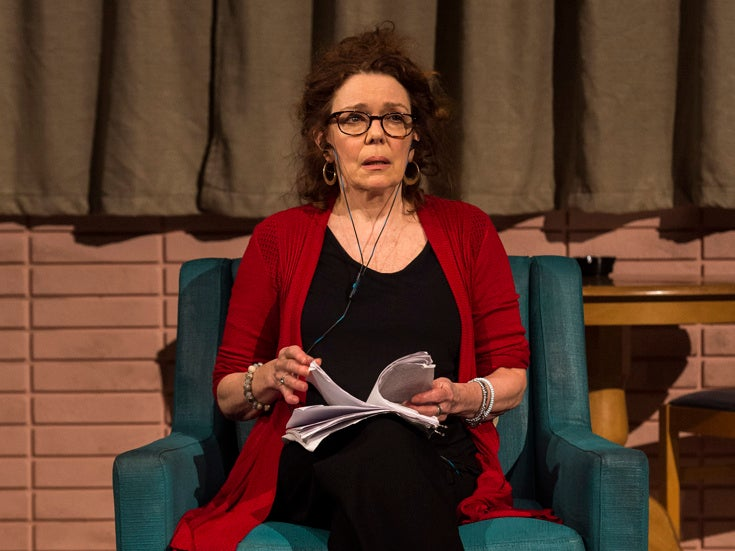
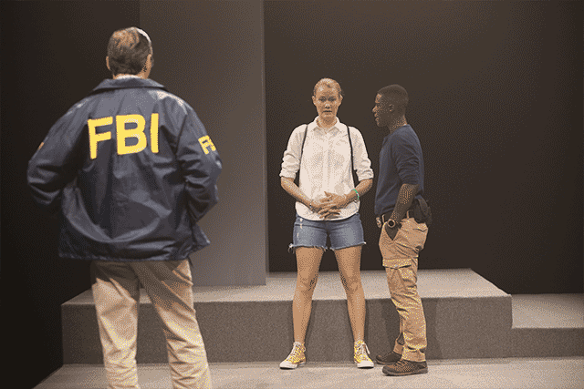
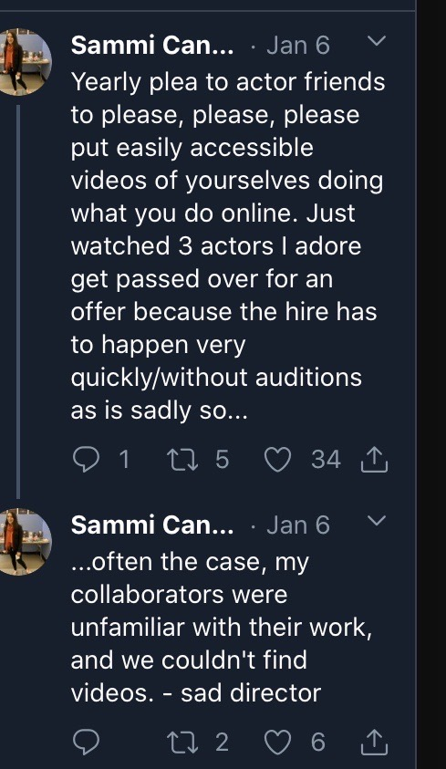
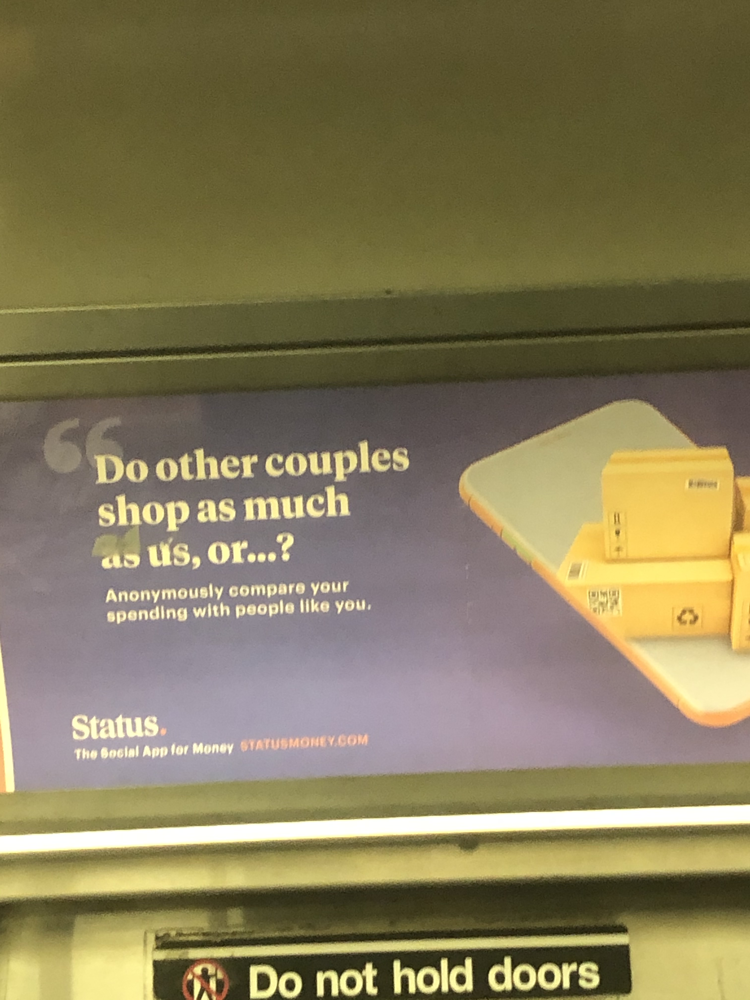
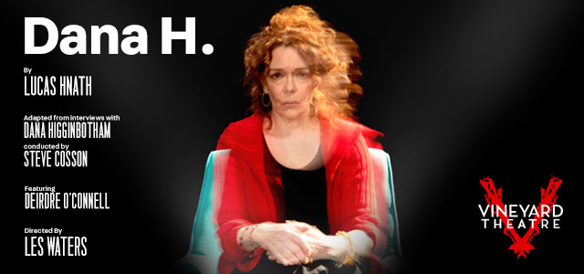

Hi friends,

_Welcome to [The Curtain](http://guscuddy.substack.com/), a weekly newsletter exploring theatre, culture, media, and the future. It’s written by me, [Gus Cuddy](http://guscuddy.com/)._

_If you’ve been forwarded this email, you can sign up for yourself [here](http://guscuddy.substack.com/subscribe)._

---

### How to tell the truth: perception, illusion and un-reality.

Over the weekend I caught Lucas Hnath’s new work, _[Dana H](https://www.vineyardtheatre.org/dana-h/)_, which I thought was one of the most stunning things I’ve seen in a long time. As a piece of theatre, it’s shocking and sort of unreal: Hnath has cut together real-life interviews (conducted by Steve Cosson of The Civilians) with his mother, retelling her harrowing story of being abducted by a member of the Aryan Brotherhood, into a 75-minute sort of “narrative”. This audio is then played for us while Deidre O’Connell puts in a pair of headphones and lip-syncs the entire thing, beat for beat. That’s pretty much the entire show. But its effect is devastating, a feeling not like anything I’ve quite felt before in the theatre.

 

##### Deidre O’Connell in the exceptional _Dana H_

_Dana H_ plays in interesting conversation with the Vineyard’s first show of their season, _Is This a Room_. That show was also a piece of excellent documentary theatre based on a transcript, an FBI interrogation with Reality Winner, which Tina Satter assembled into a weird, otherworldly piece of hyper-naturalistic theatre. The actors spoke the transcript word for word—every awkward pause and cough and hm and throat clearing, every weird background noise and seeming non sequitur. What both _Dana H_ and _Is This a Room_ accomplish is to subvert our expectation of theatre as a medium of illusion.

 

##### Is this a room?

When we go see a piece of theatre that is going to tell us a story, there is always a layer of disbelief and illusion—which is what makes theatre theatre. In great theatre the leap we have to make is very easy, but it’s still there: sets aren’t real, props are merely representations of things. We get swept up in the illusion of the whole thing. But in the case of Hnath and Satter’s new work, they take you out of that safe space, and into another realm entirely.

_Dana H_ subverts our expectations of what theatre should be so hard that it is tough to even define what exactly it is doing so incredibly well. But the play knocks against our very perception of how we perceive truth, facts, art and reality—how we pick up the pieces and assemble narratives. Performatively breaking the fourth wall is one thing, but hearing a real-life story—from its real-life source—is something else entirely. (In a way, Ma-Yi’s _Suicide Forest_, now returning for a run at ART/NY, shares a similar theme: its also about a real-life mother, and the playwright and her real mother perform in the show together.) It would be dark and harrowing—but formally simplistic—to just listen to an audio recording of Hnath’s mother. But by putting an actor onstage and giving her the Herculean task to perform an entire monologue without speaking—for some, the major interpretative instrument that an actor has—we witness something else entirely: a true blending of art and reality that shakes us deeper than either could be just by themselves.

This documentary aspect of art has become an increasingly popular trend that can be deeply mined. It makes sense: in an age where social media acts as a sort of performance and mini-art-sharing, blending the lines between performance and reality, it tracks that “art” and “performance” are bringing in more of reality. We can even see this with a recent movie like the Safdie Brothers’ _Uncut Gems_, which remixes a real-life NBA game with a fictional story of a gambling jeweler, starring actors (Adam Sandler) and real people playing versions of themselves (Kevin Garnett). The effect with that movie, I found, was similarly dizzying. Somehow by inserting reality into a story it makes the stakes feel that much higher, and raises our anxiety levels through the roof. Movies are also a medium fundamentally based on illusion; by deconstructing and subverting that illusion in small or large ways, we can lose our footing beneath us.

 

##### KG

I’m increasingly fascinated by how art and reality, lies and truth, perception and facts can all intertwine and intermingle. In a time of fake news, unreliable sources of truth, and issues of believing survivors, it seems like these kinds of work can hold a grip on us in a new, entirely unexpected way.

---

## Notes from the week

#### Beyond “Decolonizing” the Syllabi: Creating space

Loved [this piece](https://howlround.com/beyond-decolonizing-syllabus) in Howlround on working beyond just “decolonizing” theatre syllabi at Boston Conservatory at Berklee, working with anti-racist workshop leader Nicole Brewer. What I took away most from it is that active inclusion doesn’t need to mean forcing people of color to undertake emotional labor to educate white people. Creating and holding space is uncomfortable—but we have to live with that discomfort. 

It reminds me of something we did at a recent workshop of a new musical about Israel and Palestine I was recently a part of. In the first hours of rehearsal, the director led us in creating a set of clear guidelines that we could all abide by for the space. By addressing issues of cultural accuracy head-on and giving permission to mess up, we were able to make the space feel a little bit more inclusive for all the experiences in the room."

---

#### Jeremy O. Harris and HBO

In one of the most exciting deals for any recent theatre-maker I can think of, Jeremy O. Harris [signed a two-year overall deal with HBO](https://variety.com/2020/tv/news/slave-play-writer-jeremy-o-harris-hbo-overall-deal-1203521034/). It will have him developing a pilot produced by A24 based off his thesis (lol), and sign on as a co-producer of Season 2 of _Euphoria_. But most importantly, HBO is giving him a discretionary fund to use “in the theatrical space”, which he can use to commission, fund, produce, whatever."

*   Said Harris on [Instagram](https://www.instagram.com/jeremyoharris/?hl=en):
    

> But what fills me with the pride and exhilaration is the fact that @HBO wouldn’t take my initial “No, thank you” and asked what I wanted most then delivered: **A way to share tv $$ with theatre artists**. **I’ve always felt that there was something vampiric and fucked up abt theatre artists being told if they wanted to have a career that paid they had to write for tv** Not every playwrights wants to nor should, I hope that more economies can be built for artists who do go to tv to share that wealth with the artists who inspire us doing the work that most fulfills us.

---

#### Actors: Put Clips of You Online

(I need to do this.) This is from Sammi Cannold, the young director of _Endlings_ at New York Theatre Workshop:

 

---

#### More Dystopian Subway Startups

 

I collect these like it’s my job.

---

## Recommendation

**[Dana H. (Lucas Hnath, dir. Les Waters // Vineyard Theatre)](https://www.vineyardtheatre.org/dana-h/)**

 

Obviously it’s _[Dana H](https://www.vineyardtheatre.org/dana-h/)._ Do go see it, if you can. (I got a rush ticket on TodayTix for $25.)

---

### End Note

_That’s all for this week—thanks so much for reading!_

_If you enjoyed this, I would really love it if you forwarded it to a friend or two._

_As always, you can access the entire archive [here](http://guscuddy.substack.com/archive)._

_You can reply directly to this email and I’ll receive it. So feel free to do that about anything. I love to hear back from people._

_See you next week!_

\-Gus