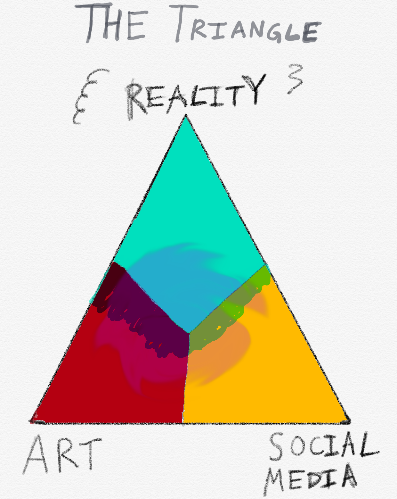
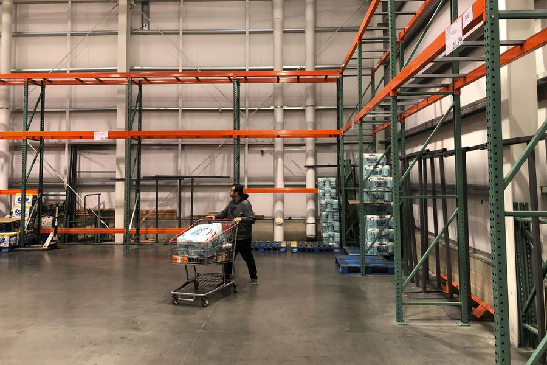
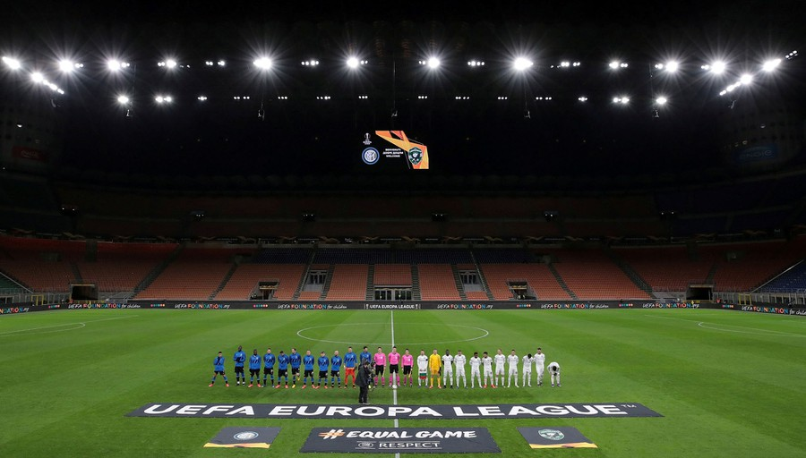
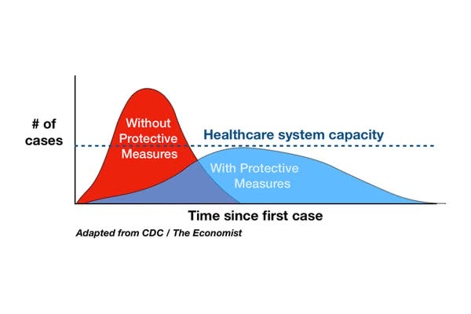

Hi friends,

_Welcome to [The Curtain](http://guscuddy.substack.com/), a weekly newsletter exploring theatre, culture, media, and the future. It’s written by me, [Gus Cuddy](http://guscuddy.com/)._

_If you’ve been forwarded this email, you can sign up for yourself [here](http://guscuddy.substack.com/subscribe)._

---

Welcome to a special Wednesday edition of The Curtain. I was traveling across the country yesterday (😷), and wasn’t able to get it out.

Obviously, this coronavirus is very scary, and should not be taken lightly. Please stay safe.

---

Last night I saw [Marin Theatre Company](https://www.marintheatre.org/)‘s production of _[Love](https://www.marintheatre.org/productions/love)_ by Kate Cortesi (which is on the Kilroys’ [List](https://thekilroys.org/list-2019/)), which my partner Mari is in. It’s an excellent production if you’re in the Bay Area.

---

### Vulnerability in Art in 2020

Recently I’ve been finally attempting to read Karl Ove Knausgaard’s _My Struggle_ series, which is a massive six volume set that is basically one incredibly detailed, somewhat mundane, yet strikingly vulnerable (to the point of embarrassment) and addicting memoir. In the first volume, Knausgaard spends at least 60 pages recounting a single night of trying to get beer for a New Year’s Eve party. It’s exhaustingly thorough and detailed, flipping a microscope onto himself in a way that’s somehow both cringe-inducing and fascinating.

Knausgaard’s books have become a literary sensation, especially in his native Norway. His success , I think, speaks to a broader trend of blurring the lines between reality and art. [As I’ve written about before](https://guscuddy.substack.com/p/the-curtain-46-how-to-tell-the-truth), this is a time when we have art that is increasingly intermingling with reality and social media, to form some sort of weird triangle. Everything bleeds into another thing, and the three inform one another:

 

“The duty of literature is to fight fiction. It’s to find a way into the world as it is," [Knausgaard says.](https://www.newyorker.com/culture/the-new-yorker-interview/karl-ove-knausgaard-the-duty-of-literature-is-to-fight-fiction)

Presenting life-as-is in all its mundane but tremendous tragedy is not necessarily anything new. Chekhov was doing this at the turn of the 20th century. In the preface to his version of _Uncle Vanya_, adapter/director Robert Icke quotes Chekhov (in what I believe is his own translation):

> Life must be exactly as it is, and people as they are. Not on stilts. Let everything on the stage be just as complicated – and at the same time just as simple – as it is in life. People eat their dinner, just eat their dinner, and all the while their happiness is being established – or their lives are being broken up.

Something about the magnifying glass of the stage, of art, can make the regular everydayness of life heartbreaking.

But Chekhov was more subtle about how he revealed himself. Today, we can longer separate the art from the artist. It’s telling that one of the most persistent recent tropes in theatre I’ve seen is the playwright-as-character. We have to remind ourselves that the artist is often inseparable from what we’re seeing before us.

This merging of “activism and aesthetics” as Richard Brody put it in his [decade in review](https://www.newyorker.com/culture/decade-in-review/the-twenty-seven-best-movies-of-the-decade) piece, is about combining the personal and political and turning them into vulnerability. In a way, this is the culmination of part of the mission of Jean-Luc Godard and the filmmakers of the French New Wave, who saw films as being united with the lives of their creators, as well as the social and political climate at large.

In an age of [hyperlink consciousness](https://guscuddy.substack.com/p/the-curtain-51419) where our lives have become less and less private, the individual artist who finds new ways to explore being vulnerable will continue to be the most fascinating.

---

## Notes from the week

#### Theatre and COVID–19

[A Broadway usher has the coronavirus](https://www.nytimes.com/2020/03/11/theater/broadway-show-usher-coronavirus.html#click=https://t.co/HUlNBGRKP9). Unfortunately, and I don’t say this lightly, Broadway needs to have a mass cancellation. This pandemic is going to hit theaters really hard, and I’m not sure what the solution is yet.

Meanwhile, [Scott Rudin is making ticket prices $50](https://deadline.com/2020/03/scott-rudin-broadway-coronavirus-50-tickets-to-kill-a-mockingbird-west-side-story-1202878245/) to all Broadway productions he’s a producer on for the rest of March. (There is something really awful about this.)

---

#### A Strange Loop is going to Woolly Mammoth (and maybe Broadway?)

https://twitter.com/TheLivingMJ/status/1237055899124015104

[Here’s the piece in the Washington Post](https://www.washingtonpost.com/entertainment/theater_dance/woolly-mammoth-theatre-hopes-it-has-the-next-big-broadway-musical-in-a-strange-loop/2020/03/08/15f14cd2-5fd9-11ea-b29b-9db42f7803a7_story.html):

> “In a first for the District’s singularly iconoclastic theater company, a new musical with Broadway dreams will be produced in Woolly Mammoth’s D Street NW headquarters. With performances to begin Sept. 15, the show even has a New York producer who’s vying for a home for it in one of Broadway’s 40-odd, highly sought-after theaters.”

---

#### Emptiness and the Coronavirus

Scary photos from this great collection in [The Atlantic](https://www.theatlantic.com/photo/2020/03/empty-spaces-due-coronavirus-fears/607666/).

 

---

#### Clarkisha Kent’s “Kent Test”

Love this test from Clarkisha Kent:

https://twitter.com/iwriteallday_/status/1236649354661892098?s=21

---

#### Tracy K. Smith on Poetry

Enjoyed Ezra Klein’s [interview](https://www.vox.com/podcasts/2020/2/27/21154139/tracy-k-smith-poet-laureate-the-ezra-klein-show-wade-in-the-water) with poet Tracy K. Smith:

> Poetry is the language that sits really close to feelings that defy language. Poetry nudges some of our feelings of joy or confusion or desire toward feelings that we can recognize and describe

---

#### Our job: flatten the curve!!!!

Wash your hands, try not to touch your face, and stay home if you’re sick.

 

[(via)](https://www.nytimes.com/2020/03/11/science/coronavirus-curve-mitigation-infection.html)

---

#### Assorted Theatre News

*   [Madhuri Shekar Named Recipient of 2020 Lanford Wilson Award" by American Theatre](http://bway.ly/2nsrdd)
    
*   [Robert Icke is going to adapt and direct Animal Farm](https://www.broadway.com/buzz/198673/another-orwell-robert-icke-adaptor-of-1984-will-take-on-animal-farm-in-2022/)
    

---

## Recommendations and Notes

I recommend the absolutely wild _[Suicide Forest](http://ma-yitheatre.org/shows/suicide-forest/)_ by Haruna Lee, which is having an encore run at ART/NY. It really hits hard on the vulnerability I wrote about this week.

*   I liked _Endlings_ a lot more than [reviewers](https://www.nytimes.com/2020/03/09/theater/endlings-review-celine-song.html) [it](https://www.vulture.com/2020/03/every-day-a-little-death-endlings-and-unknown-soldier.html) [seems](https://www.timeout.com/newyork/theater/endlings). The production is flawed, but the jarring, disjointed tension at work in the play hooked me in, especially at its end. I think it’s tremendously written by Celine Song. But it’s definitely a precarious act that threatens to tumble under the weight of its own invention.
    
*   _[Sanctuary City](https://www.nytw.org/show/sanctuary-city/)_ by Martyna Majok is worth seeing. I enjoyed the first half of the play immensely, and thought Rebecca Frecknall’s direction had a crispness, lightness and physicality to it that felt alive. It’s the second half of the play where I started to have some questions, about both the play and production.
    

---

### End Note

_That’s all for this week—thanks so much for reading!_

_If you enjoyed this, I would really love it if you forwarded it to a friend or two._

_As always, you can access the entire archive [here](http://guscuddy.substack.com/archive)._

_You can reply directly to this email and I’ll receive it. So feel free to do that about anything. I love to hear back from people._

_See you next week!_

\-Gus