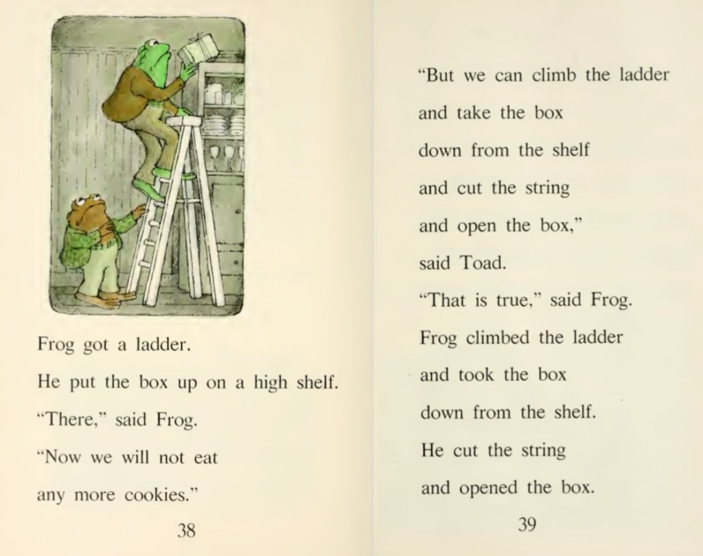

Hi friends,

_Welcome to [The Curtain](http://guscuddy.substack.com/), a weekly newsletter exploring theatre, culture, media, and the future. It’s written by me, [Gus Cuddy](http://guscuddy.com/)._

_If you’ve been forwarded this email, you can sign up for yourself [here](http://guscuddy.substack.com/subscribe)._

_Please, if you are enjoying this—forward it to a friend, or share [this link](https://guscuddy.substack.com/). Thank you!_

---

These are extraordinary times. It seems an eternity has passed since last week.

Since then, pretty much the entire country has shut down, including all theatre, film, and TV production. Theatre, in particular, is being hit extremely hard. Broadway, off-Broadway, and pretty much all theatre across the country has ceased, for the foreseeable future.

It’s not a good time to be someone whose livelihood requires people in a communal space.

In order to try to gather my thoughts, I started collecting thoughts and resources for the future of theatre in the age of the Coronavirus. I [published a Twitter thread](https://twitter.com/guscuddy/status/1239692936498925568), that I’m re-publishing here:

++

### Theatre in the Age of Corona

All theatre is closing down for the foreseeable future in New York and across the country. It's going to rock this industry to its core. I'm starting a thread tracking all the things that are happening regarding theatre in this scary time.

First, a moment for all the shows that just opened, or were set to open, which had to unexpectedly and unceremoniously shut down their runs. For most of them, probably forever. It sucks.

How are people going to get paid? How are theaters going to survive? How are we going to innovate? These are all pretty big burning questions right now. The truth is, nobody knows what's going to happen.

We're in uncharted territory for this industry. We've moved into a position where no one can predict the future with any degree of certainty, and so we've even ["lost the narrative"](https://www.ribbonfarm.com/2020/03/09/plot-economics/), resorting to just trying to take in as much raw data as possible.

But many theaters around the country are finding ways to film and stream their shows, with wide shots and close ups, with special permission from Actor's Equity. Some are even collaborating with [BroadwayHD](https://www.broadwayhd.com/). [A.C.T.’s productions are already available to purchase](https://secure.act-sf.org/overview/gloria-tonistone-streaming) and stream — and available for the price you want to pay.

Perhaps this new form of digital accessibility can become more widespread in the future, rather than just an exception in a pandemic. But it does needs to be done right. Otherwise, people will just turn on Netflix or Disney+ instead.

And who actually gets to watch these filmed shows? Just ticket buyers? What about other people who want to check it out? Filmed theatre isn't perfect—it almost always loses something in translation. But it's a start.

"Theatre doesn’t translate that well to film, but I think you can get a sense if something works well." - [director Rebecca Frecknall](https://www.americantheatre.org/2020/03/13/the-show-goes-online/).

You can watch Young Jean Lee's 2011 performance of her show WE'RE GONNA DIE (which just was forced to close its new run at Second Stage) online for free 

https://twitter.com/YoungJean_Lee/status/1238268661086867456

You can also go to [OntheBoards.TV](http://OntheBoards.TV) and use the code ARTATHOME20 for free streaming thru the end of April. They have an excellent collection of experimental theatre, dance, music, and category-defying work.' Recs here:

https://twitter.com/Helen_E_Shaw/status/1239237406467010561

But perhaps the biggest question for theatre: will artists still get paid? For many New York theaters, the answer seems to be yes. For now. 

https://twitter.com/arsnova/status/1238232430798143489

But I'm not sure how things will fare elsewhere in the country, and for smaller theaters. This is a difficult time for everyone involved. Everyone is losing work. 

If you can afford it, please don't ask for a refund if you bought a ticket and the show has been canceled. Many theaters NEED this money. And if you can, donate. [“There is no ‘surplus’ in nonprofit.”](https://www.vulture.com/2020/03/there-is-no-surplus-how-off-broadway-theater-is-coping.htm)

We need to dig deep and find new ways to support artists and keep theaters alive. Insurance will only partially cover Broadway. Everyone else will have to be bailed out. Non-profit theaters don't have a lot of extra cash laying around, especially without spring galas.

Small and mobile theaters that don't have full calendars of programming may be able to escape alive. But even then, they are going to need a boost. Government may help, and we need to urge them to do so. But it's probably more likely to come from corporate donors.

One of the best resources I've seen for theaters and artists is [the page that ART/NY is compiling](https://www.art-newyork.org/coronavirus-resources). They're doing a tremendous job. All we can do right now is to help each other.

And [La Mama](http://lamama.org/) has been sitting on [CultureHub](https://www.culturehub.org/) for a while now. It's a fantastic platform that aims to bridge art & technology. They are working with [HowlRound](https://howlround.com/) to help stream select productions from the theatre community.

There's also [Theatre Without Theater](https://t.co/JdFnJvzj3p?amp=1), which popped up on Instagram and has already started to blow up. It's a nightly 7:30pm broadcast aiming to fill the void, by featuring performances, songs, & more from the theatre community. Highly recommended.

The 24 Hour Play Festival is doing “Viral Monologues”, posting a new monologue on [their Instagram](https://www.instagram.com/24hourplays/) every 15 minutes for 24 hours.

I also wonder how we'll continue to have innovations with audio theatre. There's a lot of money in podcasts right now, and their value is only going to increase. No one has yet "unlocked" fiction/theatre podcasts. I'd love to see a lot more experimentation in this space.

Obviously, classes are also moving online. [Playwright Jaclyn Backhaus is beta-testing teaching an online playwrigint class via Zoom](https://twitter.com/jaclynbackhaus/status/1238563178025377792)—open to all. [As is Young Jean Lee](https://twitter.com/youngjean_lee/status/1239309367419248653?s=21).

This kind of innovation and new, networked thinking is going to be what's required for theatre to make it through this. We can't operate on the same old assumptions + old ways of doing things. It's a great time to re-think everything, especially around accessibility.

It's imperative that the next time this happens we can be better prepared, with a social safety net that allows people to remain afloat. Till then, here's a great list of resources for freelancers: [https://covid19freelanceartistresource.wordpress.com/](https://covid19freelanceartistresource.wordpress.com/)

The bottom line: support your local theater, and others too if you can. This is going to require a collective effort to make it through this.

---

## Notes from the Week

#### Coronavirus Resource

[I like this synthesized document from Noah Brier.](https://docs.google.com/document/d/1m2sx5cEqCF5tRGpAhaspu2U1uq2gFF13Uy7C1wM86nQ/mobilebasic#) It contains lots of resources and recommendations.

---

#### Blogging is coming back

Kyle Chayka started an old school blogspot blog with tons of contributers called [“indoor voices”](https://indoor-voices.blogspot.com/).

https://twitter.com/chaykak/status/1238552886000455681

I absolutely love this idea. And the aesthetic here is on point.

---

#### The Case of the Missing Hit

Loved this [Reply All episode](https://t.co/Vqcl8nDDa1) on a man being haunted by the memory of a pop song...that doesn't seem to exist. It's a fascinating look into what happens when something is lost in the age of the internet—did it ever really happen?

---

#### Frog and Toad

 

---

## End Note

_That’s all for this week—thanks so much for reading!_

_If you enjoyed this, I would really love it if you forwarded it to a friend or two._

_As always, you can access the entire archive [here](http://guscuddy.substack.com/archive)._

_You can reply directly to this email and I’ll receive it. So feel free to do that about anything. I love to hear back from people._

_See you next week!_

\-Gus