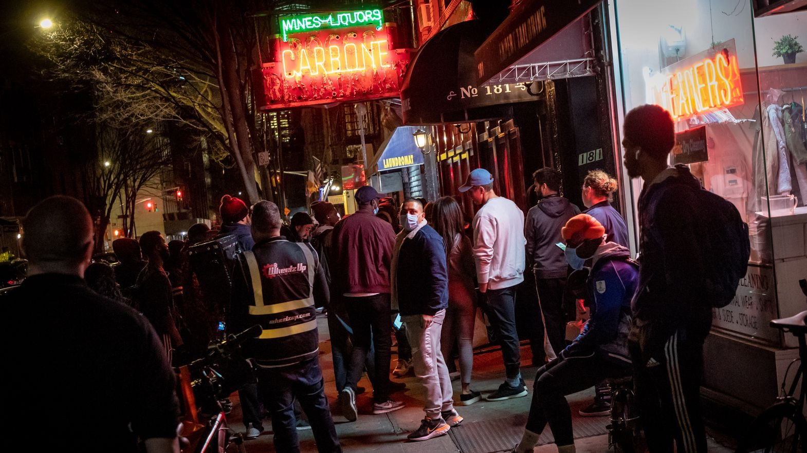
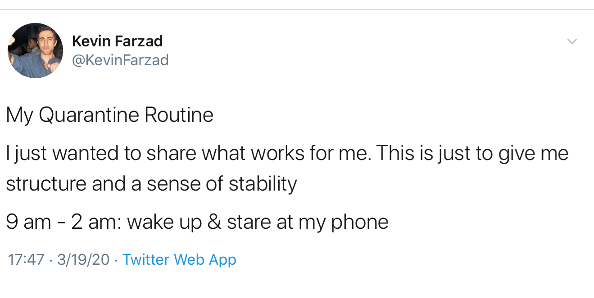
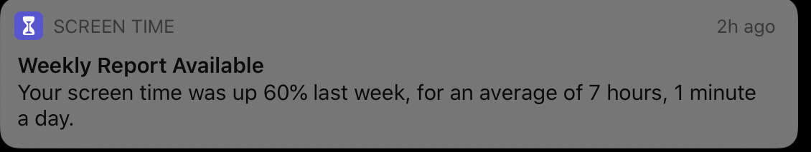
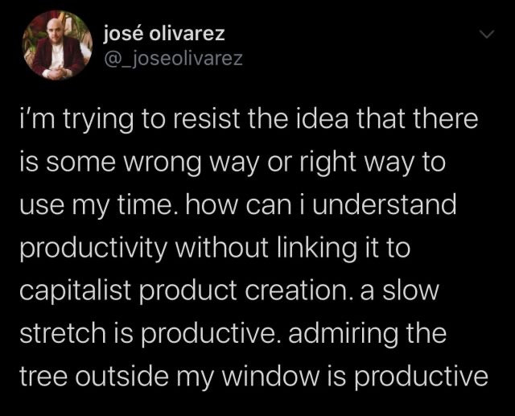

Hi friends,

_Welcome to [The Curtain](http://guscuddy.substack.com/). It’s written by me, [Gus Cuddy](http://guscuddy.com/). If you’ve been forwarded this email, you can sign up for yourself [here](http://guscuddy.substack.com/subscribe)._

_First, somehow I got off by one number in numbering these issues. This is actually **Curtain #50**, despite last week being number 48. Oof. Counting was never my strong suit._

---

This is a crazy time, and I hope everyone is staying safe and well. 

The only certain thing these days seems to be that we have an enormous amount of uncertainty facing us. I'm sure you are already inundated with an overwhelm of dispiriting news, so I'm going to try to avoid directly covering _too_ much "news" items here. (There also seems to be a week's worth of news every day, so it seems futile for a weekly newsletter to try to cover any of that.)

But, in short: [theater workers and entertainment workers need to be bailed out](https://broadwaynews.com/2020/03/19/congressmen-sign-letter-urging-for-protection-of-theater-workers/). Citizens need direct cash payments. We don't need another corporate bailout. Rent is due.

---

I read Jenny Offill's _[Weather](https://www.nytimes.com/2020/02/07/books/review/weather-jenny-offill.html)_ this week while in quarantine. I've gone back and forth on it (more on this next week), but I really loved that in its postscript she leaves an ancillary website: **[Obligatory Note of Hope](https://www.obligatorynoteofhope.com/)**. It has a really lovely collection of **["Tips for Trying Times"](https://www.obligatorynoteofhope.com/tips/tip-1/)**, which are supplemented by wonderfully curated quotes. I highly recommend browsing through them.

In these scary times, things like this are medicine for the soul. (Though beware the [Great Corniness](https://mailchi.mp/gethighfield.com/a-great-corniness-is-coming?e=2d7e6c5820).) There's also a [Ways to Get Involved](https://www.obligatorynoteofhope.com/get-involved.html) section, offering up a few environmental activism movements. Some of my frustration with the book—and with much of the literature of climate change—is that it feels somewhat navel-gazing and [trapped in time](https://www.newyorker.com/books/under-review/are-novels-trapped-by-the-present) (again, more on this next week), so I appreciate that these are some more direct calls-to-action.

---

## 📝 Notes from the week

#### [The Trickle Up](https://trickleup.uscreen.io/)

[From Playbill](https://www.playbill.com/article/taylor-mac-niegel-smith-and-more-launch-10-monthly-subscription-service-to-help-artists-below-the-poverty-line-during-covid-19):

> Over 50 New York City artists have banded together to launch The Trickle Up, a video streaming service—available at $10 a month—from which donations will be used to help artists living below the poverty line during the coronavirus pandemic. The platform, launched March 23, aims to get 10,000 subscribers and to then distribute $10,000 to 10 different artists affected by COVID-19 cancellations every month.
> 
> Trickle Up is launched by Taylor Mac, Kristin Marting, Morgan Jenness, Emily Morse, and Niegel Smith, along with the aid of participating artists like playwrights Mac, Dominique Morisseau, Annie Baker, Paula Vogel, Suzan-Lori Parks, Lynn Nottage, Lucas Hnath, Sarah Ruhl, Lloyd Suh, Kristoffer Diaz, Ann Washburn, Lisa Kron, and Lisa D’Amour, directors Rachel Chavkin, Lear DeBessonett, Liesl Tommy, Smith, and many more.

[This is a neat idea.](https://trickleup.uscreen.io/) Once again, I love the efforts to try to find new means of innovating in theatre and art, especially around money. I'm not 100% confident that something like this is going to be sustainable, but I'm excited about artists trying new things.

---

#### Young Jean Lee playwriting workshop recording

https://twitter.com/YoungJean_Lee/status/1241896287320104960

What an amazing resource. I'm all-in on making theatre education more accessible by tenfold. This is a great step towards that.

---

#### Why we need a rent freeze to save New York theaters

https://twitter.com/thetanknyc/status/1241108838104907776?s=21

---

#### [Real Estate for the Apocalypse](http://www.theguardian.com/news/2020/mar/17/real-estate-for-the-apocalypse-my-journey-into-a-survival-bunker)

A brilliant piece, kind of fun, pretty disturbing, very strange, very American:

> Vivos’s new South Dakota location went by the name xPoint. Each of the bunkers, evenly spaced across 18 sq miles of prairie land, had an area of 204 sq metres – significantly larger than my own (admittedly not very large) house. The place would, it was claimed, be home to somewhere between 6,000 and 10,000 people and would become “the largest survival community on Earth”. It was pitched at a demographic somewhere between the super-wealthy clients for Vivos’s luxury underground shelters and the doomsday preppers who planned to survive the apocalypse through manly grit and YouTube knowhow. It was the future domain, in other words, of the post-apocalyptic petit bourgeoisie.

---

#### Clubbed Thumb Biennial

I love this prompt from [Clubbed Thumb](https://www.clubbedthumb.org/):

> Every other year Clubbed Thumb invites playwrights to propose plays inspired by a particular prompt. The application is open to all, and read blind. The winning proposal(s) receive (or split) a $15,000 award and two years of development support.
> 
> For this year's commission consider The Decameron by Giovanni Boccaccio - but don’t write about the Plague. Consider The Decameron as a piece that came from the ashes of the Plague but is decidedly a piece of the Renaissance. Consider it as a celebration of voice and style, as a compendium of stories from a wide span of sources. Consider it as an opportunity to take a deep research dive, if that’s your thing.
> 
> Then do with that what you want, jump off it in form, content, what have you. Feel free to take inspiration from just a little piece.
> 
> Your play should have no fewer than three people, and up to ten, and most of them should be female. 
> 
> Very few of these characters should be blood relatives.
> 
> You may only specify three props.
> 
> You may have no stage directions longer than twelve words. You may only have seven stage directions.
> 
> Time: (of all scenes) night — except for one which can be dawn or dusk.
> 
> One very fancy costume.
> 
> An insect. 
> 
> These constraints apply to the whole play.

Also, gosh, I did not know [“The Decameron”](https://en.wikipedia.org/wiki/The_Decameron), but Werner Herzog also mentions it in the first answer of his [recent New York Times magazine interview](https://www.nytimes.com/interactive/2020/03/23/magazine/werner-herzog-interview.html).

---

#### Modern design history in one photo: COVID-19 edition

 

---

#### Streaming movies

Hollywood is starting to release movies "on-demand" that were slated to be released in theaters now. [Here's how to get them](https://www.vox.com/culture/2020/3/20/21188408/coronavirus-streaming-movies-digital-emma-onward-invisible-man-birds-prey-way-back).

---

#### [The disaster that is that "Imagine" cover](https://www.nytimes.com/2020/03/20/arts/music/coronavirus-gal-gadot-imagine.html)

> In this clusterclump of hyperfamous people with five seconds’ too much time on their hands, however, “Imagine” may have met its match. By the end, it has been pummeled and stabbed, disaggregated, stripped for parts and left for trash collection by the side of the highway. It is proof that even if no one meets up in person, horribleness can spread.

[A total, hilarious evisceration](https://www.nytimes.com/2020/03/20/arts/music/coronavirus-gal-gadot-imagine.html) of the very embarrassing "Imagine" cover coordinated by Gal Gadot and other celebrities.

---

#### [Carbone in NYC](https://ny.eater.com/2020/3/23/21190803/carbone-crowds-nyc-delivery-takeout-coronavirus)

> The famously exclusive red-sauce restaurant started offering delivery last week in response to new COVID-19 measures, and the demand has been overwhelming — with one customer waiting more than an hour for takeout

 

This can't be good.

---

#### We're all Edward Hopper paintings now

 

---

#### The Quarantine Routine

 

Yeah, that tracks:

 

But also:

 

---

### End Note

_That’s all for this week—thanks so much for reading!_

_If you enjoyed this, I would really love it if you forwarded it to a friend or two._

_As always, you can access the entire archive [here](http://guscuddy.substack.com/archive)._

_You can reply directly to this email and I’ll receive it. So feel free to do that about anything. I love to hear back from people._

_See you next week!_

\-Gus