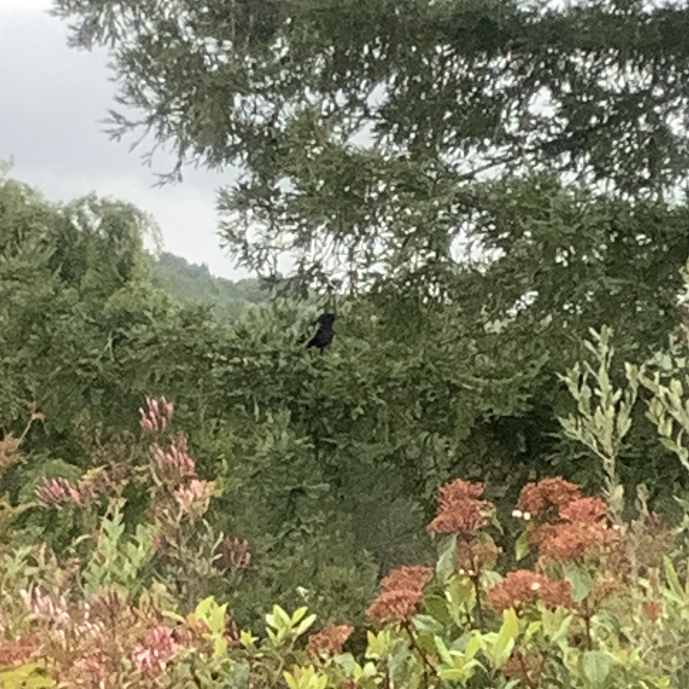

Hi friends,

_Welcome to [The Curtain](http://guscuddy.substack.com/). It’s written by me, [Gus Cuddy](http://guscuddy.com/). If you’ve been forwarded this email, you can sign up for yourself [here](http://guscuddy.substack.com/subscribe)._

_I’d love it if you forwarded this email to a friend!_

---

Hope you’re staying safe and well, wherever you are. All is OK here, though I’m eating more rice, beans, and pasta than ever. (OK, since middle school.)

I’ve also seen some cool things just staring out a window for most of the time, like two crows eating gopher on a tree branch:

 

---

### Bottom Up, Not Top Down

I’m convinced that one of the main curses of my life is that I know more _about_ movies than I’ve actually _seen_ movies. 

Over the course of the last ten years, I’ve created countless syllabi, read endless articles, and curated what can only be described as a quantum amount of lists of lists on the history of film. I made a plan to watch the entire [They Shoot Pictures, Don’t They?](http://www.theyshootpictures.com/) list (itself a curation of many lists) before I was 23; it didn’t happen. I thought for sure I would have at least gotten through [the AFI list](https://www.afi.com/afis-100-years-100-movies-10th-anniversary-edition/) by now; nah. There are many filmmakers who have had a large influence on me when I’ve only seen one or two of their movies; for some, I’ve seen none. To be clear, I don’t think this is inherently a bad thing. Learning to talk about experiences you’ve never experienced is probably an essential part of the modern age; I think this is what Pierre Bayard is getting at in his book _[How to Talk About Books You Haven’t Read](http://www.amazon.com/gp/product/1596915439/ref=as_li_tl?ie=UTF8&camp=1789&creative=390957&creativeASIN=1596915439&linkCode=as2&tag=ribbonfarmcom-20&linkId=66Y2TBSHSYSHGHLE)_. (But I’m not actually sure—I’ve never read it.)

But now that we’re effectively in Quarantine, Mari and I have started to watch movies. Sometimes two a day! This has been my dream for so long; finally, with unlimited free time, I can surf the niche waves of cinematic universes that I’ve always thought more about than actually experienced. 

But there is a critical difference to this newfound luck: it emerged organically, bottom-up.

I’ve realized that every other previous effort I’ve had to watch movies has been top-down: I’ve tried to assemble massive spreadsheets of information, and then got frustrated with my brain when it was unable to muster up the motivation to even know where to start. But starting is the hardest thing, and the most important.

I had it all backwards. The best way to start is bottom-up: doing what is interesting and in front of you, instead of trying to adhere to some grand pie-in-the-sky vision. For getting into a movie watching habit, it means actually just watching whatever you want to watch. We decided to watch Céline Sciamma’s _Portrait of a Lady on Fire_, a movie we’ve both wanted to watch for a while. It’s not on any of my canon lists (yet), but it was what was in front of us: a recent, acclaimed movie that has been recommended to me many times. (Keeping up with the cultural conversation is a perfectly bottom-up motivation that works.)

Watching _Portrait_ led to a bottom-up rabbit hole. Since we liked the movie, we decided to watch the rest of Sciamma’s work. This, then, connected with something we’ve been trying to do: watch mostly movies directed by women. Eliza Hittman‘s new film _Never Rarely Sometimes Always_ was just released, and had a lot of buzz in the film world. It’s $20 to rent which is a lot, so we watched her previous two movies on Hulu, _It Felt Like Love_ and _Beach Rats_.

All of a sudden, we’ve watched a lot of movies! And it emerged organically.

I think there’s a reason this bottom-up approach works especially well today. In the Information Age, where we are constantly bombarded and overloaded with new info, it’s more important than ever to be able to adapt and leverage information powerfully. Old, industrial-age manufacturing processes are centered around top-down, plan-based construction: you have a vision, and you work towards it by working backwards from the vision, step by step, till you know what to do.

But in the digital age, this is far too slow. Information comes at us so fast, and things change so quickly, that trying to stubbornly stick to some long-term vision can lead to things going off the rails. We need to be quick on our feet, and the best way to do this is by starting from the bottom up. Starting from the bottom up means allowing yourself the freedom to tinker in the direction that’s most interesting to you—and allowing that direction to change. It’s OK to leave the end vision hazy because it’s going to change a lot, and you’re probably never going to get there—and if you do, it’s not going to be exactly what we imagined.

I’ve been thinking about this more because this time of social distancing has been tough for people in so many ways. For those of us who are privileged to have a lot of free time right now, it can be easy to beat ourselves up for not optimizing every second of this time. We have been conditioned to treat time as money. Now that we have an abundance of it, it seems that we need to use it so wisely: be as productive as possible, invent calculus like Isaac Newton did during quarantine, or write _King Lear_ like Shakespeare did.

We might even try to commandeer time itself by laying out a master plan, top-down, that we will commence on to complete our goals. (Goals that might not necessarily even be self-imposed, but that we’ve inherited from society.) But I think it’s important to resist those urges, and instead just do what’s interesting to us, right now. Letting our interests and loves guide us, letting our next projects and goals emerge organically. Trying the other way around is like building a stack of LEGOs with one brick at the bottom and a hundred at the top: pretty, but it’s all going to come toppling down with the slightest bump.

---

## 📝 Notes from the Week

#### [Williamstown goes full audio](https://www.nytimes.com/2020/04/07/theater/coronavirus-williamstown-audible.html)

Well, it’s finally come to pass: a major theatre is collaborating with Audible to deliver their entire season via audio.

Williamstown is going to use all of their actors—including Bobby Canavale and Audra McDonald—pay their artists, and professionally record them with sound engineers. They say they’re going to try to do it in person, which seems very strange to me. Isn’t the point of something like this the idea that you could record remotely?

Still, I’ll be very interested to see how they adapt something like Robert O’Hara’s version of _A Streetcar Named Desire_. As bullish about audio as I’d been in the past, this does seem…weird. But I’m excited a theatre is going to give this a shot.

---

#### Zia Anger and the Power of the Moving Image

Another artist I’ve been following for a while is [Zia Anger](http://www.ziaanger.com/). Her recent work _My First Film_ is a fusion cinema and live theatre experience, which Richard Brody [wrote up in a glowing review](https://www.newyorker.com/culture/the-front-row/an-extraordinary-performance-at-metrograph-zia-angers-my-first-film). She toured the experience around, but is now doing live stream performances of it. As far as I know, the only way to get in on these is to [follow her on Twitter](https://twitter.com/AngerZia), which I recommend.

I also loved [this piece](https://thecreativeindependent.com/people/zia-anger-on-why-moving-images-are-more-important-than-words/) in The Creative Independent with Anger, about why moving images are so important:

> Right now, in this whole paradigm shift, moving images are the great equalizer.

---

#### [Stop trying to be productive](https://www.nytimes.com/2020/04/01/style/productivity-coronavirus.html)

[Taylor Lorenz writes](https://www.nytimes.com/2020/04/01/style/productivity-coronavirus.html):

> This urge to overachieve, even in times of global crisis, is reflective of America’s always-on work culture

---

#### Notes on Thomas Ostermeier

Everyone in the online theatre world has been talking about [Schaubuhne](https://www.schaubuehne.de/de/start/index.html) and their streaming theatre, and the virtues of auteur director Thomas Ostermeier. (His old production of _Hamlet_, for instance, was recently featured.)

What I always find interesting about Ostermeier is that he’s considered a conservative theatre maker in Berlin. I recommend the book [“The Theatre of Thomas Ostermeier”](https://www.amazon.com/Theatre-Thomas-Ostermeier-Peter-Boenisch/dp/1138914479) for a great (if sometimes academic) resource on Ostermeier’s process, with interviews from actors and essays from Ostermeier. It only has two reviews on Amazon and that’s baffling to me.

There are two big things I took away from the book. First is his approach towards what he calls “realism” in theatre: it’s an attempt to “portray the world as it is, and not as it looks.” This means that “naturalism” is not the point. Secomd, despite his (and many others’) reputation for “directors’ theatre” (often used in a derogatory way), Ostermeier ultimately believes that nothing is more important than the actor—and how they can be totally liberated on stage.

---

### Recommendations

Some great film recommendations from the past few weeks:

*   Portrait of a Lady on Fire (Celine Sciamma)
    
*   Tomboy (Celine Sciamma)
    
*   Beach Rats (Eliza Hittman)
    
*   Losing Ground (Kathleen Collins)
    

---

### End Note

_That’s all for this week—thanks so much for reading!_

_If you enjoyed this, I would really love it if you forwarded it to a friend or two._

_As always, you can access the entire archive [here](http://guscuddy.substack.com/archive)._

_You can reply directly to this email and I’ll receive it. So feel free to do that about anything. I love to hear back from people._

_See you next week!_

\-Gus