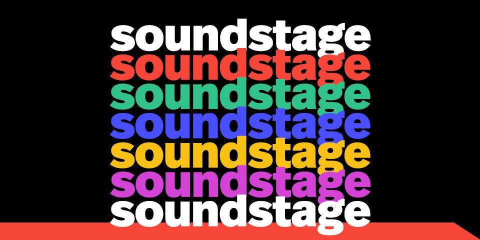
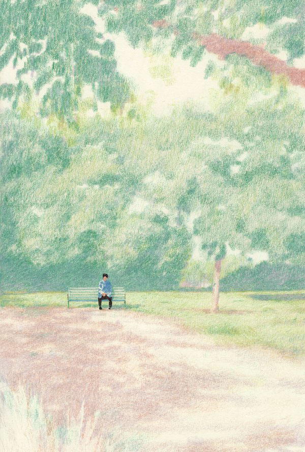

Hi friends,

_Welcome to [The Curtain](http://guscuddy.substack.com/), a newsletter about culture, theatre, creativity, art, and the future. It’s written by me, [Gus Cuddy](http://guscuddy.com/)._

_New reader? Subscribe for free below:_

[Sign up now](https://guscuddy.substack.com/subscribe?)

---

Hope you’re safe and well.

It seems we’re settling into this new normal, at least for now. It looks that social distancing efforts are working to some extent, which is great. But I still just don’t know when we’re going to be able to gather in large crowds again—and I don’t think anybody does.

While we’re stuck here, I want to start a series on _The Curtain_ of interviewing theatremakers, filmmakers, writers, and artists about the future of art, both autographic and allographic (for a definition, see this week’s Notes from the Week). I’m really excited about this—if you have any suggestions, let me know.

++

#### PRIME by Heather Christian - theatre for your ears - is a success

 

[Playwright’s Horizon’s Soundstage](https://www.playwrightshorizons.org/watch-listen/soundstage/) is a free podcast project that has been in the works for a while, now—far before the pandemic hit. They launched it early in April, though, for obvious reasons. As I’ve written out [before](https://guscuddy.substack.com/p/the-curtain-52-bottom-up-not-top), I’m both optimistic about the potential of audio theatre and skeptical about its reach.

I’ve only listened to PRIME once, but I loved it. It’s exactly what I’ve always wanted audio theatre to be—it’s not a radio play, it’s not just recorded theatre: it’s a theatrical experience, uniquely suited to the audio form. The intimacy of modern audio listening—a medium we usually experience with earbuds, that’s become less of something external and more just an extension of our ears—mirrors, in some way, the intimacy of theatre. And the easier access of high-quality recording tools can make these experiences feel alive and personal. I loved Christian’s music, and the simple, direct form of the piece, which felt refreshing and actually _alive_. [Critic Helen Shaw also loved it](https://www.vulture.com/2020/04/review-heather-christians-prime-a-practical-breviary.html).

The description for _PRIME: A Practical Breviary_:

> Inspired by breviary masses performed by cloistered monks, PRIME employs modern language and rich, contemporary musical arrangements to reimagine what a modern prayer for a Tuesday morning at 6AM might sound like. 

[You can listen here.](https://www.playwrightshorizons.org/watch-listen/soundstage/)

I’m really excited to hear how the other commissioned playwrights, which includes Jordan Harrison (Marjorie Prime), Lucas Hnath (The Thin Place), Qui Nguyen (Vietgone), and Robert O’Hara (Bootycandy)—an unfortunately all-male list, but I’m assuming they will announce more—take on this challenge. I’m especially interested to hear what Hnath does with the form. His _DANA H._, which unfortunately closed early, was [a stunning mix of documentary theatre, personal story and performance feat](https://www.guscuddy.com/2020/03/11/how-to-tell-the-truth/). Part of the rise of success in podcasts has been due to the true-crime genre, popularized in shows like Serial, S-Town, My Favorite Murder, and many more. I’m fascinated to see how playwrights might be able to use those tropes, whether sincerely or by subverting them, as they intermingle with their own work.

---

#### Understanding Film and Theatre

Since we’ve been trapped at home, I’ve been watching a lot more movies, and also watching some filmed theatre. I’ve spent a lot of time mulling over the relationship between the two seemingly similar mediums—and, more abstractly, the qualities of great art.

I’m working on a longer essay trying to understand, in depth, the two mediums. I’m including some of that here.

##### Theatre is a medium of metaphor, film is a medium of relation

Literalism is the great enemy of theatre. If I wanted to see something literal, I would go watch a period movie.

Instead, theatre is an art form of metaphors. It is not merely a visual medium. If it were, you could just have a painter make a pretty stage picture. But that’s not what we’re going for. It’s through metaphor that we, as audiences, fill in the gaps. It’s through metaphor that we come to better understand ourselves, better exercise our empathy. The possibilities in theatre are limitless when it is treated in such a way. Suddenly, every aesthetic limitation it seems to have is seen in a new dimension.

Likewise, there is film that reproduces the bland and theatrical (that is to say, naturalistic theatre)—merely aiming to be a photographic reproduction of a stage show—and then there is film that uses all the resources of cinema and cinematography—moving images, sound, editing—to actually _create_.

The power of film comes from the **inter-relation** of its images and sounds as they are cut together; images coming into contact with other images are analogous to colors coming into contact with other colors when painting. The act of creation involves moving images and sounds—capturing people, not just characters—sliced together into something that is a personal manifestation of the filmmaker’s unconscious. 

Which brings us to a shared similarity: both theatre and films—and all art that I know—are acts of _creation_, driven from the unconscious.

Merely reproducing something—whether that be theatre reproducing film (such as in a piece that doesn’t understand what form it wants to be), or film photographically reproducing theatre (such as in a boring movie that just tries to film actors doing acting things)—is not art. Even attempts to naturalistically reproduce “life” are not necessarily art. Real art involves actual creation, creation that makes something that is _alive_. (A sink/swim test for a piece of theatre is the simple question: does it feel alive?)

There can be exceptions: sometimes the humbling, human attempt at representation can be artful. Still, I would argue that even these attempts—usually seen in grand paintings—are not aiming at exact photographic reproduction. They are aiming at a deeper _realism_: to portray the world as it is, not how it looks.

For example, when I look at [one of Rembrandt’s late self portraits](https://www.nationalgallery.org.uk/paintings/rembrandt-self-portrait-at-the-age-of-63) I see, on the one hand, an attempt to reproduce life. But on the other hand, Rembrandt’s painting portrays the world _as it is_, not necessarily how it looks. The facial detail is there—capturing his older, declining face—but the rest is loose, blurry, shadowy. What Rembrandt wanted us to see was the expression of this moment on his mind—drawing focus to his aging face, seen in the same way his younger self-portraits were.

---

## Notes from the Week

#### What we’ve been watching

As I wrote about [last week](https://guscuddy.substack.com/p/the-curtain-52-bottom-up-not-top), Mari and I have been watching movies only made by women. It’s been really refreshing for me to try to open my eyes more to perspectives that are not my own. I’m keeping a running and evolving checklist of what we want to see. If you want to check it out and/or follow along, [you can check it out here](https://www.guscuddy.com/files/womenfilm.md).

What I liked this week:

*   The Rest I Make Up (HIGHLY recommend this tremendous documentary on Maria Irene Fornes, directed by Michelle Memran)
    
*   Atlantics (Mati Diop)
    

https://twitter.com/guscuddy/status/1248120461512151041?s=21

---

#### Autographic vs Allographic art

[Nelson Goodman in “Languages of Art”](https://plato.stanford.edu/entries/goodman-aesthetics/) defines two different types of art: autographic (identified with handwork) vs allographic (re-created in performance).

It’s an interesting distinction that is especially pronounced today, with both the internet and COVID–19 strongly favoring autographic art.

But can there be crossover between the two?

Autographic:

*   Film (sort of)
    
*   Painting
    
*   Sculpture
    
*   Writing
    
*   Recorded Music
    

Allographic:

*   Theatre
    
*   Dance
    
*   Live Music
    

---

#### Get yourself some digital scripts

https://twitter.com/3HolePress/status/1248248063958769670

I highly recommend [3 Hole Press](http://www.3holepress.org/) as a small publisher of scripts. Support them by grabbing a $5 PDF of one of their published scripts right now.

---

#### German Theatre

I guess another cool thing about theatre becoming more literate with the internet is that we’re also becoming more international. [Here’s a great thread on Berlin theatre that’s available to stream](https://twitter.com/playcompany/status/1248321580536487938?s=21).

https://twitter.com/playcompany/status/1248321580536487938?s=21

---

#### What to do during a plague, Shakespeare-style

From [Rob Weinert-Kendt’s feature in American Theatre, “No Show”](https://www.americantheatre.org/2020/03/31/no-show/):

> Shakespeare’s career was famously interrupted by the Black Plague, during which time, as Edelstein pointed out, the Bard and his colleagues did three things: **“They made plans for what they were going to do when theatres reopened. They toured the provinces, sold props, costumes, bundled plays and sold them—that’s how the First Folio got made. And they went to the King and said, ‘Help.’”**

The whole thing is a recommended, overview-style read.

---

### End note

 

###### _Artwork by [Kyutae Lee](https://www.behance.net/kokooma)_

_That’s all for this week—thanks so much for reading!_

_If you enjoyed this, I would really love it if you forwarded it to a friend or two._

_As always, you can access the entire archive [here](http://guscuddy.substack.com/archive)._

_You can reply directly to this email and I’ll receive it. So feel free to do that about anything. I love to hear back from people._

_See you next week!_

\-Gus