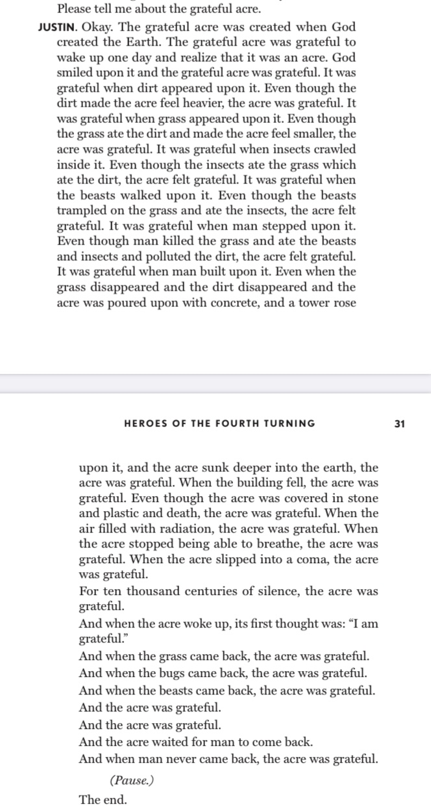
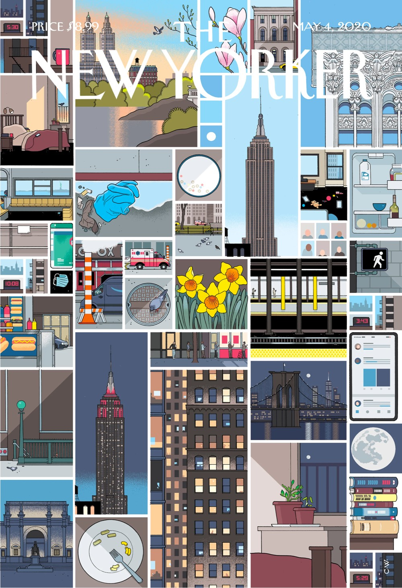
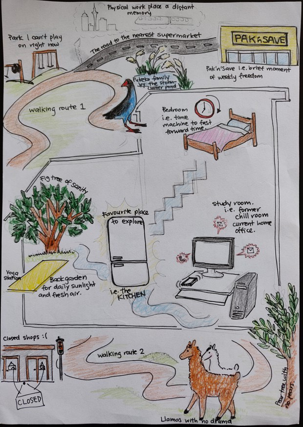
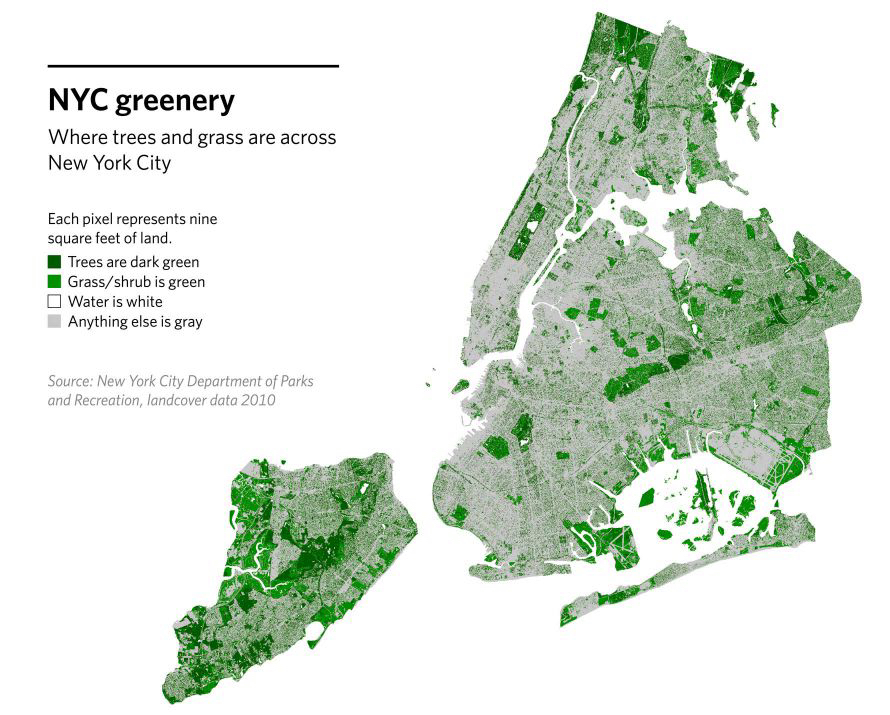

Hi friends,

_Welcome to [The Curtain](http://guscuddy.substack.com/), a newsletter about culture, creativity, theatre, and the future. It’s written by me, [Gus Cuddy](http://guscuddy.com/)._

_New reader? Subscribe for free below:_

[Sign up now](https://guscuddy.substack.com/subscribe?)

---

I hope, during this weird time, we’re able to be in touch with our breath. For a lot of us, this is one big, long, uncertain pause. It’s not clear when this will end or what, for many artists, the future will exactly look like. But since I attended playwright [Will Arbery](https://twitter.com/willarbery)’s masterclass (more below) and he talked about his theory of breath in theatre, I’ve been thinking about how our individual and collectives breaths have been seized. As we stumble through this darkness, let’s not forget to check in with ourselves and breathe.

---

## Notes from the Week

#### Notes from Will Arbery’s masterclass

I really enjoyed the first online [Perspectives on Playwrighting (POP)](https://www.playwrightshorizons.org/about/programs/perspectives/) masterclass hosted by Playwrights Horizons, featuring Will Arbery.

Arbery opened with a revealing and vulnerable look at his own path to becoming a playwright, and explained the one thing that he looks for in a play above all else: its relationship to breath. If a play can teach you how to breath, he says, it will stay inside our bodies. Breath, ironically, is the unique aspect of theatre: what Sarah Ruhl [calls](https://www.vanityfair.com/style/2020/03/whiting-award-2020-sarah-ruhl-keynote) the magical substance of air—and what is also keeping us away from theatre right now.

The most interesting part of the masterclass, though, was when Arbery shared his own screen via Zoom, and walked us through everything that was on the desktop of his computer. In this age of video conferencing, its a revealing gesture to show what’s actually going on inside the “glowing rectangle” we stare into for hours on end. His folders were messy and imperfect, filled with draft after draft of plays (the vast majority of which no one has ever heard of). It was a reminder that creative work doesn’t follow any sort of rote algorithm.

 

_(From Arbery’s Heroes of the Fourth Turning)_

The next masterclasses are with Clare Barron (Dance Nation), Michael R. Jackson (A Strange Loop), and Larissa Fasthorse—three terrific and exciting theatre-makers whose work recently premiered at Playwrights—and I’m looking forward to all of them. (They’re free to join on [Playwrights’ website](https://www.playwrightshorizons.org/).)

Arbery has also been conducting [a superb interview series](https://www.playwrightshorizons.org/watch-listen/interview-project/) that started at the beginning of April. He’s interviewed amazing playwrights like [Aleshea Harris](https://www.playwrightshorizons.org/shows/trailers/interview-project-aleshea-harris/), [Mona Mansour](https://www.playwrightshorizons.org/shows/trailers/interview-project-mona-mansour/), and [Kate Cortesi](https://www.playwrightshorizons.org/shows/trailers/interview-project-kate-cortesi/). 

And, while we’re on the subject of Playwrights, they have been on fire recently with their play choices and the artists they bring in. I’m a huge fan of the job that Lizzie Stern is doing as the Literary Manager there, and others agree:

https://twitter.com/graham_schmidt/status/1254186404478963713

---

#### Here’s one idea…

Almost every theater has cancelled the remainder of their 2019–2020 seasons, and most major theaters have decided to cancel their summer seasons. But not [Barrington Stage](https://barringtonstageco.org/), as [Michael Paulson reports](https://www.nytimes.com/2020/04/28/theater/barrington-stage-coronavirus.html):

> Instead, it will concentrate on one-person shows, and stage a play in which the central relationships are so strained that social distancing will not be a stretch.

All ticket holders will be required to wear masks, there will be no intermissions (to avoid bathroom lines) and they will reduce their seating capacity from 520 to 163, so that they can seat people according to social distancing.

On the one hand, I admire the real attempt to make this work. But on the other…will anyone show up? And is this even the ethical thing to do?

---

#### Portraits of COVID

Here’s Chris Ware’s [New Yorker cover](https://www.newyorker.com/culture/cover-story/cover-story-2020-05-04):

 

It accompanied [this great piece](https://www.newyorker.com/magazine/2020/05/04/twenty-four-hours-at-the-epicenter-of-the-coronavirus-pandemic) from the local correspondents on a day in the city during COVID–19, reaching far and wide:

> The labyrinthine streets of Brighton Beach were so unbusy you could forget the sidewalks and wander in the middle of them anywhere. The whole city had become a waiting room.

And [here are some beautiful homemade maps of life under lockdown](https://www.citylab.com/life/2020/04/neighborhood-maps-coronavirus-lockdown-stay-at-home-art/610018/):

 

On the topic of COVID–19, it does seem that indoors—and [poor ventilation systems](https://wwwnc.cdc.gov/eid/article/26/7/20-0764_article)—could be part of the real danger here:

https://twitter.com/zeynep/status/1253710609692209153?ref_src=twsrc%5Etfw

While it’s too early to draw conclusions, Africa does have the [lowest reported death tolls](https://www.ft.com/content/e9cf5ed0-a590-4bd6-8c00-b41d0c4ae6e0). It seems we do need to consider [how indoor spaces are designed](https://www.amazon.com/Healthy-Buildings-Indoor-Performance-Productivity-ebook/dp/B082DL19Q1/ref=sr_1_1?crid=3SL1955EN3KCG&dchild=1&keywords=healthy+buildings&qid=1588081098&s=books&sprefix=healthy+bu%2Cstripbooks%2C210&sr=1-1), from a health perspective.

---

#### NY Drama Critics’ Circle Award ceremony

We can all attend virtually now, which is kind of cool!

https://twitter.com/FeldmanAdam/status/1255201731790733313

---

#### Living Like an Artist

> “This version of living like an artist evokes something closer to corporatized mindfulness, a heightened attentiveness to the world for the sake of problem-solving (and maybe renting a loft).” 

\-[Kyle Chayka on Jerry Saltz’s new book,](https://newrepublic.com/article/157222/jerry-saltz-how-be-artist-instagram-self-help) _[How to Be an Artist](https://newrepublic.com/article/157222/jerry-saltz-how-be-artist-instagram-self-help)_

---

#### Iranian Cinema recommendations

While we continue to work through an eclectic stream of women-only filmmakers over here, I’ve been collecting some notes on what other areas of film I’d love to explore more. One that’s jumped out at me is Iranian cinema, a category in which I have seen embarassingly little.

There was a great [small thread](https://twitter.com/magadizer/status/1254533426947985409) on Twitter recently that I followed with a discussion about Iranian filmmakers, and [I’ve compiled what I found here](https://www.evernote.com/l/AQPgyrSFTGBL-Is7m516CdDKVf8jj7DlZXs).

---

#### Travis Scott hosted a concert on Fortnite

Fortnite is the first step into [the metaverse](https://www.matthewball.vc/all/themetaverse):

https://twitter.com/MrDalekJD/status/1253468093659004928?ref_src=twsrc%5Etfw

---

#### David Lynch: Look a little closer

> My childhood was elegant homes, tree-lined streets, the milkman, building backyard forts, droning airplanes, blue skies, picket fences, green grass, cherry trees. Middle America as it’s supposed to be. **But on the cherry tree there’s this pitch oozing out – some black, some yellow, and millions of red ants crawling all over it. I discovered that if one looks a little closer at this beautiful world, there are always red ants underneath**. Because I grew up in a perfect world, other things were a contrast. 

—David Lynch 

---

#### NYC is Greener than you think

 

---

#### People are moving away from California

> There’s a catch, however, at least in the eyes of many Idahoans: a disproportionate number of newcomers are coming from California. In the 12 months from July 2017 to July 2018, Californians accounted for nearly 60 percent of Idaho’s net migration. The state is far from alone in this regard. **According to the U.S. Census Bureau, six of the seven fastest-growing states in the nation in percentage terms Nevada, Idaho, Utah, Arizona, Washington, and Colorado are in the West. In all six, California is the largest source of new residents.**

[Source](https://www.city-journal.org/california-migration-idaho)

---

### End Note

 

###### by [Analeovy Pereznafarrate](https://www.itsnicethat.com/articles/analeovy-pereznafarrate-art-280420)

_If you have a friend that you think would enjoy this, I would really love it if you forwarded it to them. It means a lot to me._

[Share](https://guscuddy.substack.com/p/the-curtain-55-a-collective-breath?utm_source=substack&utm_medium=email&utm_content=share&action=share)

_As always, you can access the entire archive [here](http://guscuddy.substack.com/archive)._

_You can reply directly to this email and I’ll receive it. So feel free to do that about anything. I love to hear back from people._

_See you next week!_

\-Gus