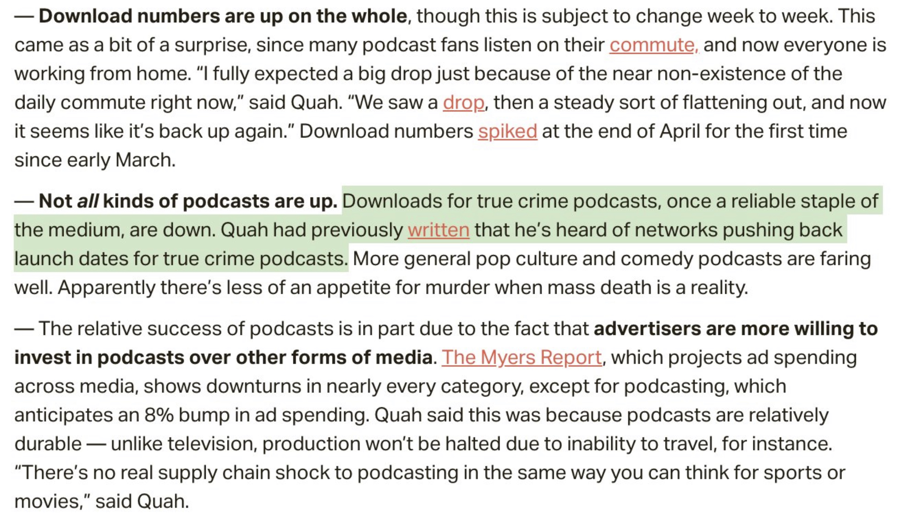
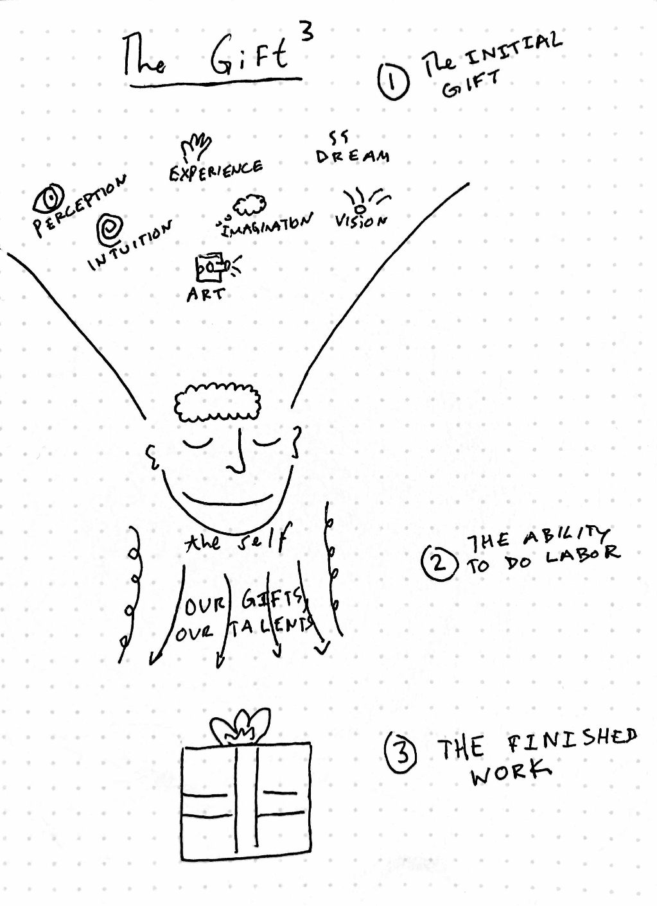

Hi friends,

_Welcome to [The Curtain](http://guscuddy.substack.com/), a newsletter about culture, theatre, film, creativity and the future. It’s written by me, [Gus Cuddy](http://guscuddy.com/)._

_New reader? Subscribe for free below._

[Subscribe now](https://guscuddy.substack.com/subscribe?)

---

Hope you're having a great week and staying safe and treating yourselves well. 🦦

Let's get into it.

++

### Awards and Otherwise

Exciting news this week, as the Pulitzer awards were announced, as well as the off-Broadway Lucille Lortel awards.

https://youtube.com/watch?v=4HBXCm9ovaU

_A Strange Loop_ [winning the Pulitzer Prize for Drama](https://www.pulitzer.org/winners/michael-r-jackson) is a significant moment in American Theatre. For one, it’s not the type of show that generally wins a Pulitzer or even makes it this far into the cultural consciousness—but then again, no show has ever been quite like *A Strange Loop*. Michael R. Jackson constructed a hyper-intelligent and equally personal high-concept metafictional musical that defies categorization and subverts our expectations, especially for what white audiences expect to see from an acclaimed show by a black writer. Part of the distinctive power of *A Strange Loop* is that it speaks completely as itself—as the opening number puts it, traveling through the world “in a fat, black queer body”—and caters to no (white) audience expectations of what it “should” be except Jackson’s own unconscious. That it’s the first musical to ever win the Pulitzer without a Broadway run (and only the tenth musical to ever win it, period) speaks to part of the internet’s influence on [the democratization of theatre](https://guscuddy.substack.com/p/the-curtain-52119-?r=iq1l&utm_campaign=post&utm_medium=web&utm_source=copy): great shows can catch fire and spread online and by word of mouth much easier now, attracting a different crowd than the traditional Broadway audience.

https://twitter.com/TheLivingMJ/status/1257429921720406021

https://twitter.com/larryowenslive/status/1257391045366681600

The other finalists—*Soft Power* by David Henry Hwang and Jeanine Tesori, and *Heroes of the Fourth Turning* by Will Arbery—are also exceptional works that speak to what has been an exciting few years for theatre, before its abrupt total shutdown.

https://twitter.com/willarbery/status/1257405066346221578

Outside of the Drama Prize, I was so pleased to see [Soraya McDonald be a finalist for the Criticism award](https://www.pulitzer.org/finalists/soraya-nadia-mcdonald-undefeated)for her excellent essays on culture, largely covering theatre and film. She has been an inspiration for me in the past year. I also really enjoy [finalist Justin Davidson’s architecture criticism](https://www.pulitzer.org/finalists/justin-davidson-new-york-magazine).

https://twitter.com/SorayaMcDonald/status/1257389552660070405

Meanwhile, the prestigious off-Broadway Lucille Lortel Awards awarded top prizes to *Heroes of the Fourth Turning* and Dave Malloy’s musical *Octet*, while Larry Owens won for Best Actor in a Musical.

https://twitter.com/larryowenslive/status/1257099111133741068

https://twitter.com/willarbery/status/1257114564375777281

The superb *[Dana H.](https://www.guscuddy.com/tellthetruth)* also won for best solo show, while Emily Davis won Best Actress for *Is This a Room?*. [You can read the full list here.](https://static1.squarespace.com/static/5b7b0419b27e39794ba4151b/t/5eb02c9ef40769666395447e/1588604063747/35th+Annual+Lucille+Lortel+Awards+Recipients.pdf)

++

### Women Filmmakers List, and some notes on my continued exploration in the art of cinema

As I’ve written about before, my partner Mari and I have been trying to watch only films directed by women since we’ve been in quarantine. The result, for me, has been pretty eye-opening to my own biases, and I’ve discovered many incredible artists and genres. Coming back to devouring film like I used to in high school—after letting theatre take most of the foreground for the last 8 years—has been truly exciting, because there is just *so much* to it.

I’m reminded of the great Howlround piece [“Against the New Play”](https://howlround.com/against-new-play), in which the author finds the extensive, rich history of film as an antidote to milquetoast theatre. The ubiquity of access to films on the internet makes exploring these worlds all the more enticing.

I put together [a public Letterboxd list](https://boxd.it/5bBF4) of our working list of filmmakers and films to explore. It’s not by any means complete or exhaustive, and we’ll continue to add items to it, but at 100+ films it offers a great survey. If you’ve never used Letterboxd, you can sort the list by several different criteria, and if you have a pro account you can also filter by streaming service availability.

Looking for a recommendation? I highly recommend Elaine May’s *[Mikey and Nicky](https://www.newyorker.com/magazine/2015/05/11/a-mans-world-movies-richard-brody)*. (If you have [Criterion Channel](https://www.criterionchannel.com/), there are some amazing extras as well.)

One of the indispensable critics for navigating film, for me, has been the New Yorker’s [Richard Brody](https://www.newyorker.com/contributors/richard-brody). One of the things I’ve been exploring this week is Brody’s writing on “neo-realism”, and the unfortunate trope in independent filmmaking of having poor and working-class characters be ciphers without a deep, imaginative inner life—which is usually matched by austere, [conservative aesthetics](https://guscuddy.com/conservatism-in-minimalism). In 2009, [Brody wrote](https://www.newyorker.com/culture/richard-brody/about-neo-neo-realism), in response to an A.O. Scott [piece](https://www.nytimes.com/2009/03/22/magazine/22neorealism-t.html) on “Neo-Neo Realism”:

> What Scott praises is, in effect, granola cinema, abstemious films that are made to look good for you but are no less sweetened than mass-market products, that cut off a wide range of aesthetic possibilities and experiences on ostensible grounds of virtue. It’s not new; it’s self-consciously, fashionably old-fashioned.

I’ve been thinking about that a lot recently: where are we hiding behind a simple aesthetic, rather than engaging with the deeper issue at play?

---

#### Lauren Oyler

Recently I’ve enjoyed exploring the work of Lauren Oyler, who is one of the most perceptive book critics I’ve discovered this year, and has amassed an [impressive body of work](https://laurenoyler.tumblr.com/selected-work). She came to my attention with her [mixed review](https://www.newyorker.com/books/under-review/are-novels-trapped-by-the-present) of Jenny Offil’s *Weather*, a review that I identified with and expanded on [here](https://guscuddy.substack.com/p/the-curtain-51-trapped-in-time-). She also wrote a [provocative takedown](https://www.lrb.co.uk/the-paper/v42/n02/lauren-oyler/ha-ha!-ha-ha) of Jia Tolentino’s *Trick Mirror*—a review I don’t necessarily agree with, but that I admire nonetheless. I also enjoyed her recent piece [reflecting on the language of the internet](https://lrb.co.uk/the-paper/v42/n09/lauren-oyler/short-cuts):

> **The efficiency offered by internet language is less a short cut to meaning than to social cohesion**. But its use isn’t always reassuring, even if you’re in on the joke. **When someone turns to our shared catalogue of ironic signifiers, I assume they don’t want me to get too close**, or they feel our conversation isn’t worth the energy it would take to come up with something original. After all, that’s why I use them.

I recommend exploring her work if you’re in the mood for smart, engaging literary criticism.

---

#### One way to quarantine

From [Kyle Chayka’s Media Diet](https://whyisthisinteresting.substack.com/p/why-is-this-interesting-the-monday-6bc) on the very good newsletter Why Is This Interesting:

> _Tell us the story of a rabbit hole you fell deep into._
>
> During quarantine, my girlfriend and I are reading The Iliad (Fagles translation) out loud with two friends on a semi-nightly basis over Zoom. This kind of entertainment is maybe 2800 years old and designed to read out loud, so it seems appropriate. The epic poem is gripping, funny, sad, dramatic, episodic — basically prestige TV. It’s also one of the earliest cultural rabbit holes. Its meanings and intentions and structure have been debated since whenever it was actually invented. So just as much fun as reading the text is figuring out what other people have said about it, or if the soldiers were actually wearing bronze armor and why their shields were made of oxhide. One tidbit: The Iliad is possibly divided into 24 books because that’s how many scrolls it had to be separated into in order to be written down; each book was one scroll.

---

#### Podcast Listening

Surprisingly, some podcasts are seemingly pandemic-proof. [But not true crime](https://www.patreon.com/posts/36738859):

---

#### The Wife Glitch

Lots to think about in [this piece](https://thebaffler.com/outbursts/the-wife-glitch-schaffer) by Jennifer Schaffer about how technology is commodifying the female partner:

> It is no coincidence that the first artificial intelligence boom began around the same time as the sexual revolution; no coincidence that the history of women in computing has been roundly overwritten by the myth of male coding genius; no coincidence that the voice coming out of your smart device is almost always a woman’s. Stemming from a fundamental arrogance on the part of men—the idea that work historically performed by women is so straightforward, so mindless even, that it can be effectively programmed— the latter part of the twentieth century saw a rise in technologies aimed at making traditional women’s work faster, simpler, or redundant.

---

#### The Gift

My illustration of the three forms of *[The Gift](http://www.lewishyde.com/publications/the-gift)*: 1) the gift as artistic inspiration, which leads to, 2) using our “gifts” or talents, which leads to 3) a work of art—a gift—to share with the world.

---

## End Note 🍂

###### _[Art by Rafael Eifler](https://weandthecolor.com/living-spaces-by-rafael-eifler/116058)_

++

_That’s all for this week!_

_If you know someone that you think would enjoy this, I would really love it if you forwarded it to them and told them to subscribe. It means a lot to me._

[Share](https://guscuddy.substack.com/p/the-curtain-56-pulitzer-prizes-and?utm_source=substack&utm_medium=email&utm_content=share&action=share)

_As always, you can access the entire archive [here](http://guscuddy.substack.com/archive)._

_You can reply directly to this email and I’ll receive it. So feel free to do that about anything. I love to hear back from people._

_See you next week!_

\-Gus
