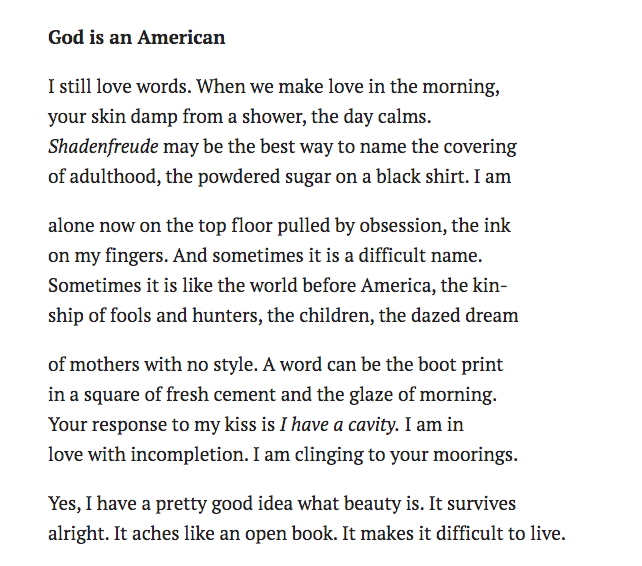

Hi friends,

_Welcome to [The Curtain](http://guscuddy.substack.com/), a newsletter about culture, theatre, film, creativity and the future. It’s written by me, [Gus Cuddy](http://guscuddy.com/)._

_New reader? Subscribe for free below._

[Subscribe now](https://guscuddy.substack.com/subscribe?)

---

I hope you’re doing well, staying safe, and staying sane.

This week: the short term and the long term of live art, reflections on art being “necessary”, notes from playwright Clare Barron’s masterclass, and collected esoterica.

++

#### The Long and the Short of It: on the future of live art

This week this video from [Guthrie Theater](https://www.guthrietheater.org/) Artistic Director Joseph Haj was shared a lot:

https://youtube.com/watch?v=eZ1b8XX0XZA

Haj declares that nothing can replace the liveness of theatre, a tradition that has been around for centuries and centuries and will, undoubtedly, be around for centuries more. I like and respect Haj and I agree with the sentiment that he expresses: there is something indestructible about theatre. The fact that it is still around shows that it is, in some way, intertwined with what it means to be a human in civilization. The long past of theatre stretches out into a presumably long future.

But is this the sentiment we need right now? I too am not particularly worried about the long-term future of theatre and live art. I am, however, worried about the short to medium term future of theaters. By Haj’s own admission, theaters are not doing well right now. The Guthrie setting up [a mini-season in March 2021](https://www.americantheatre.org/2020/05/09/guthrie-to-stay-closed-until-march-2021-mini-season/)is, at least, an honest admission that theatre is not going to be around for a while. (Broadway keeps pushing back [their start date](https://t.co/ETNVxGthxp) to still-unrealistic times.) But who is to say that March is going to be that much better? Nobody has any sense of certainty about any part of this situation; if the United States response continues to be disastrous, and no miracle vaccine is procured by early 2021, we could be in for a long, dark road ahead.

Suffice to say: in the short to medium term, theatre is not going to be OK. Many theaters [have](https://www.eventcombo.com/e/small-venue-rent-forgiveness-town-hall---litindiespace-39242) and will close. We need massive fundraising ([virtual](https://www.woollymammoth.net/events/springbenefit) [galas](https://www.classy.org/campaign/the-tank-gala-2020/c276195) galore!), rent freezes, funding and bailouts. But we also need new ways of thinking about theatre, new ways of exploring its language. It’s a medium of many things: of [breath](https://guscuddy.substack.com/p/the-curtain-55-a-collective-breath?r=iq1l&utm_campaign=post&utm_medium=web&utm_source=copy), of physicality, of metaphor. Some of those languages are certainly not replicable online; some, in new and exciting ways, may be.

To be clear: some day, we will return to theaters. It’s not that theatre won’t survive in the long run—it will—but that that is, in effect, a both romantic and almost defeatist attitude. It’s a form of throwing our hands up to tradition, without doing any deeper interrogating into how theatre might be able to evolve. Haj is right that live theatre cannot be replaced by any video form (“we have a name for it”, he says, referring to performances on camera, “that’s what film is, and that’s what TV is”), but it’s not a stretch to say it can be supplemented (by amazing content like Playwrights Horizons POP masterclasses) and even expanded upon. We’re only very early on, and we’ve already seen some intriguing examples, both in the sense of [actual content](https://www.newyorker.com/magazine/2020/05/18/the-first-great-original-play-of-quarantine) and in [accessibility](https://www.timeout.com/newyork/theater/the-best-theater-to-watch-online-may-12). Instead of falling back on old clichés about the durability of the live experience, we need new thinking, new forms, new paradigms, new roles that old institutions might not be able to fulfill under a limited view of what theatre can be.

---

#### **“Necessary” , “Essential”, and what it means to create art**

These days, there is a lot of discussion about what constitutes being an “essential” worker. (Generally, it’s the most important and also the lowest paid jobs.) Along the way, there’s been a lot of soul searching about what it means to be an inessential business, what processes are actually inessential, and what industries are not quite essential but “important” enough to be bailed out.

The arts have to deal with being, well, inessential. But what does it actually mean to be inessential? Surely we can’t mean that all art could actually be dispensed with without any consequences? Does that mean that live theatre should be low on the priority list for saving? Art’s relationship to being essential to society, in some form, has a long history. It seems to be a human need to create beauty and meaning, to self-express, to wrestle with the thorny issues and politics of their time. But can we truly say that any singular work of art is essential? I’m not sure that we can argue, ethically, that any single piece of art actually “needs” to exist; in a pithy manner, art is pointless—that is the point.

However, we live in strange times—even prior to the devastating effects of COVID–19—and many people now can’t resist inscribing a movie, play, or book as “necessary” or “essential”. Art is constantly evaluated for [its moral quality first](https://www.nytimes.com/interactive/2018/10/03/magazine/morality-social-justice-art-entertainment.html), and aesthetic quality second. This is not necessarily a bad thing—[the merging of activism and aesthetics](https://www.newyorker.com/culture/decade-in-review/the-twenty-seven-best-movies-of-the-decade) in the creation of art can be powerful—but the constant urge for critics to deem a work of art “necessary” (or worse, a “necessary masterpiece”) can be limiting. In [a 2018 piece](https://www.nytimes.com/2018/05/08/magazine/what-do-we-mean-when-we-call-art-necessary.html) for the New York Times Magazine, Lauren Oyler explores the question of what we mean when we call a work of art “necessary”:

> There are many noncomprehensive adjectives we can apply to good art: moving, clever, joyous, sad, innovative, boring, political. But good art doesn’t have to be any of these things, necessarily; **what we want out of it is possibility**. To call a work “necessary” keeps the audience from that possibility and saps the artist of autonomy as well. That it’s frequently bestowed on artists from marginalized backgrounds pressures these artists to make work that represents those backgrounds. Worse, it subtly frames their output as an inevitability, something that would have happened regardless of creative agency, and thus suggests that these artists are less in control of their decisions and skills than their unnecessary counterparts.

Art, in atomized form, is not necessary. Implying that it’s our *duty* to experience some piece of art is an idealized and misguided notion. And art, in economic terms, is not deemed essential either. So, what is art? Merely a frivolity or a luxury? That doesn’t feel true, either. Instead, I like to think that art is an electric jolt to culture, allowing a society to buzz and feel alive. In one sense, that work is, of course, essential—opening us to the richness and multitudes of the human experience.

But it’s always worth considering deeply: what keeps us doing this? How can art coexist in a world with so much injustice? How can we read novels, go to the movies, or see an opera when there are people deeply suffering, every day, all around the world? What makes art “necessary”, what makes it “essential”? I’m not sure there is a correct answer. But the tension that this consideration provides is, in some manner, necessary and essential for making good art in our times.

---

_**Notes from Clare Barron’s Masterclass**_

Playwrights Horizons continued their [POP series](https://www.playwrightshorizons.org/about/programs/perspectives/) with an incredible masterclass from playwright Clare Barron (_Dance Nation_). Barron spoke a bit about her writing practice, led us in fun and titillating writing exercises, and then answered questions.

Barron emphasized *making writing feel good*. For many of us, this is a huge shift: writing can often be a painful affair. She had us do our writing exercises on the craziest and most transgressive paper we could find (back of a letter, butcher paper), use weird writing utensils (sharpies!) and to write in whatever position we wanted (the floor, laying down, etc.). In other words: to work like a visual artist.

She told us the three most important tenets for writing a play, as passed down to her from the school of [Mac Wellman](https://en.wikipedia.org/wiki/Mac_Wellman) and [Young Jean Lee](https://youngjeanlee.org/):

1.  Make it bad

2.  Make it boring

3.  Make it stupid

Don’t try to write something good or even something interesting; give yourself permission to write the most melodramatic, on-the-nose, dull, silly scene possible. Often, it’s this freedom that can unlock something miraculous.

I’ve made my full notes public [here](https://www.evernote.com/l/AQMgLcU_2y9MibrHl1kowQnWuRyvJL5f-J0).

The next session is on Monday, May 18th with Pulitzer Prize winner Michael R. Jackson (! *A Strange Loop*!). It’s free to sign up.

++

_**Good and Interesting Tweets from the Week**_

https://twitter.com/Helen_E_Shaw/status/1258795799049273345?ref_src=twsrc%5Etfw

https://twitter.com/MarkHarrisNYC/status/1259558980130672641?ref_src=twsrc%5Etfw

https://twitter.com/robertwicke/status/1260344032049405954?ref_src=twsrc%5Etfw

https://twitter.com/AndrewRusseth/status/1260029741429518340

https://twitter.com/josh_benny/status/844379869186265088?s=12

++

_**Assorted Links**_

-   the manuscript scores of egyptian composer aziz el-shawan, my great uncle, are now [completely available online for free via the harvard loeb music library](http://blogs.harvard.edu/loebmusic/2020/05/05/uqbal-mit-sanah-aziz-el-shawan/), thanks to my incredible cousin salwa el-shawan castelo-branco

-   the HAMILTON movie version is [coming to disney+ on july 3rd](https://www.nytimes.com/2020/05/12/movies/hamilton-movie-disney-plus.html). take that, filmed-theatre-doesn’t-sell crowd!!

-   theatre is not going to be OK, but there might be even more immediate problems at hand: [we are probably going to have a major disruption to the food supply chain](https://www.vox.com/recode/2020/5/8/21248618/coronavirus-meat-shortage-food-supply-chain-grocery-stores).

-   the long read: [How Greenwich Republicans Learned to Love Trump](https://www.newyorker.com/magazine/2020/05/11/how-greenwich-republicans-learned-to-love-trump)

++

_**Poem of the week**_

Terrance Hayes:

[via](https://twitter.com/AriaAber/status/1259269255754919938?ref_src=twsrc%5Etfw)

++

_**Pull Quote**_

“The most beautiful part / of your body is wherever / your mother’s shadow falls” ~ [Ocean Vuong](https://www.newyorker.com/magazine/2015/05/04/someday-ill-love-ocean-vuong)

---

### End Note

##### _art by [vicki ling](https://www.instagram.com/vickilingart/)_

++

_That’s all for this week! Thanks so much for reading._

_If you know someone that you think would enjoy this, I would really love it if you forwarded it to them and told them to subscribe. It means a lot to me._

[Share](https://guscuddy.substack.com/p/the-curtain-57-the-long-and-the-short?utm_source=substack&utm_medium=email&utm_content=share&action=share)

_As always, you can access the entire archive [here](http://guscuddy.substack.com/archive)._

_You can reply directly to this email and I’ll receive it. So feel free to do that about anything. I love to hear back from people._

_See you next week!_

\-Gus
