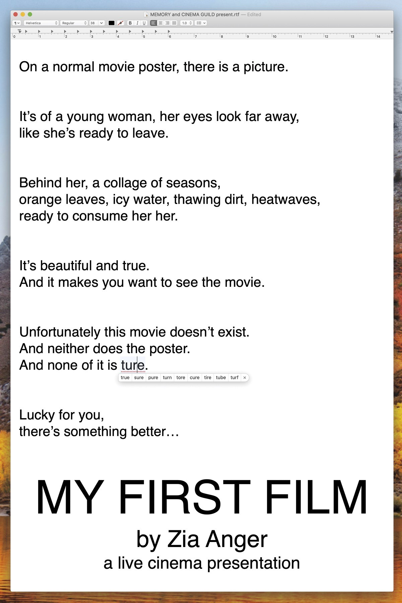
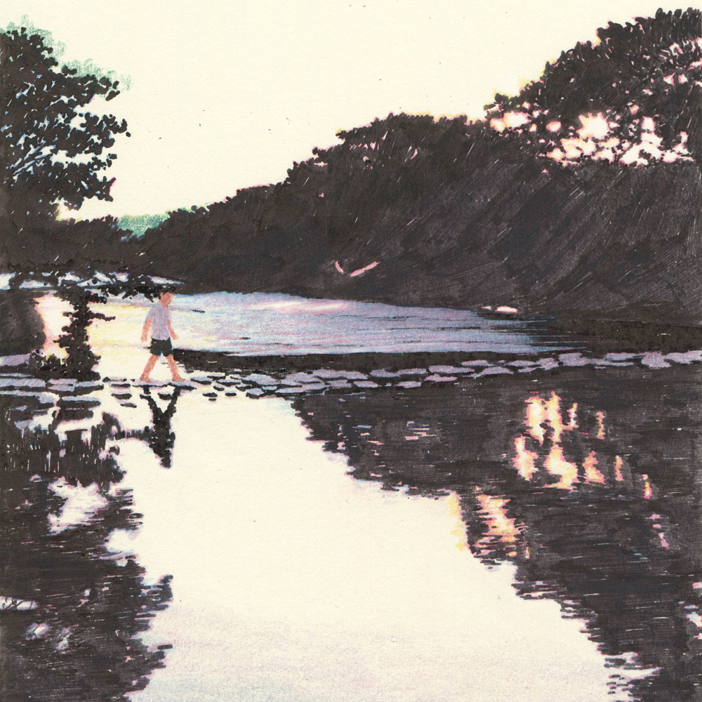

_Welcome to [The Curtain](http://guscuddy.substack.com/), a weekly newsletter exploring culture + arts in the digital age. It’s written by me, [Gus Cuddy](http://guscuddy.com/)._

_New reader? Subscribe for free below._

[Subscribe now](https://guscuddy.substack.com/subscribe?)

---

_A quick programming note: I am experimenting with some new formatting for the newsletter. If you like reading_ The Curtain_, I'd love your thoughts on what you like to see in here. Thanks!_

---

### **NEW FORMS: COULD FILM AND THEATRE CONVERGE?**

This week I saw two exceptional pieces that blended the lines between theatre and film in fascinating ways.

The first was Zia Anger's exceptional _[My First Film](https://memory.is/my-first-film)._ Anger first debuted her piece as [a live cinema performance](https://www.newyorker.com/culture/the-front-row/an-extraordinary-performance-at-metrograph-zia-angers-my-first-film) that has been touring around the country since 2018. In it, Anger projects her laptop onto the theater's big screen, where she plays segments from her "abandoned" first film, speaks only through typing text into TextEdit, clicks around on video files, and interacts with audience members digitally (she asks them to leave their phones on). In other words, it's an experience that, in many ways, could translate perfectly to a live stream. 

 

In the live stream rendition, all those elements are still there. What makes it different, however, is that we aren't amidst an actual _physical_ audience. Instead, Anger has figured out how to expertly capture the feeling of being in a collective space with others, better than any online theatre I have seen so far. To begin with, the space in the live stream is limited: it's capped at a number I’m assuming is under 100 people. Anger would tweet about an upcoming "show" on Twitter, and spots would fill up within a day. Already, entering the stream, there is an aura of exclusivity, of this being a singular experience we are going to share in—not something pre-recorded that can never capture the feeling of "liveness".

When we enter the live stream, however, Anger immediately makes it a collective digital circle. With a soft hum of music playing, she puts a note on her screen that gives us an Apple ID to text. With Messages open on her screen, people start texting in, and we see their messages and their phone numbers. (She makes clear that you need to be comfortable with your number being shared in the space.) Anger plays short videos from her computer (actually old saved Instagram stories), and sends them live to people texting in, often writing back with short messages. She also encourages anyone who gets a text back to start texting others, creating a virtuous circle of sharing. It's actually the most connected to others I've felt in a "theatre-y" way since we lost live theatre.

Throughout the performance—which primarily covers her using her sadly lost and abandoned film to explore personal and professional trauma—we never lose the sense of this being a communal experience. There are several more instances throughout the show of "audience interaction" as well, some of which are very powerful.

While _My First Film_ is classified as a "live cinema presentation", I'm not sure if it can really fit neatly into any category at all. It's not quite theatre, and it's not quite a movie—but it's something somewhere in between, a birth of a wholly original new form. As I've [written about before](https://guscuddy.substack.com/p/the-curtain-55-a-collective-breath), sharing one's screen is an alluring kind of nakedness and vulnerability right now, when all so many of us. seem able to do is stare at our screens. It makes sense that there is much to be excavated in the way of creating art in this realm, especially when leveraging the power of the live experience.

Richard Nelson's excellent new "Zoom" play _[What Do We Need To Talk About?](https://publictheater.org/news-items/buckets/conversations/what-do-we-need-to-talk-about/)_ creates a different kind of "theatre" experience. Nelson's latest is a continuation of his Apple Family cycle, one of the two main play cycles that he has been presenting at the Public Theater over the last ten years. It was originally presented as a Youtube live stream for some 5,000 viewers, but is now available to replay on demand. The convenience of being able to hit "play" on a play whenever you want is nice, but you do certainly lose something of the live experience—especially in contrast to something like Anger's _My First Film_. 

Nevertheless, there is something that feels like _theatre_ here—though it's not immediately clear what _it_ is. As Helen Shaw [writes](https://www.vulture.com/2020/04/the-apple-family-is-muted-in-grief-but-not-on-zoom.html):

> In the Time Before, I tended to be a bit glib about what constitutes “theater”—I like a big tent, so I figured anything (dance, storytelling, drama) that happened in a theater counted. But now even that expansive definition seems paltry. What Do We Need to Talk About? was made for and with screens, yet it still tastes totally of theater. **Maybe it’s the top notes of language, or the length of engagement among the cast, or the way that the audience’s own imagination is a crucial player?** I’m trying to place it.

For starters, it's a piece of "digital" theatre—though can you really call it that, if it's just theatre?—that feels uniquely suited to its form. [Writes Alexandra Schwartz](https://www.newyorker.com/magazine/2020/05/18/the-first-great-original-play-of-quarantine): "“What Do We Need to Talk About?” (directed by Nelson) takes place, inevitably, on Zoom, which, for once, **isn’t an irritating technical compromise but an integral plot point**."

Like all good theatre, _What Do We Need ToTalk About?_ considers carefully its form, and what it is that makes it unique. In this case, it makes use of Zoom to highlight its hyper-realism, retain a sense of intimacy, and let its terrific actors' subtle performances truly shine. The play is moving and funny, blending [fact with fiction](https://www.guscuddy.com/tellthetruth), and feels like it was always meant to be seen this way, in this moment—a mirror of our own lives.

It's interesting to consider the quality of video presented in Nelson's production; it differs greatly from video used in a lot of other theatre, like that used in [an Ivo Van Hove show](https://www.guscuddy.com/conservatism-in-minimalism). Another lesson to take from the success of _What Do We Need To Talk About?_ is that video does have a tonal quality—not everything needs to be super HD. In fact, the imperfection of webcams over Zoom _helps_ the production—it would have a very different feel if it were all shot perfectly in high-definition.

But I still wonder if there's a way to combine the live energy of _My First Film_ with the theatrical hyper-realism that's found in _What Do We Need To Talk About?._ Both feel fresh and alive, distinctive works that aren't marred by the lack of a physical, live space but instead are helped by it. They also feel on the verge of something even deeper and perhaps grander: could film and theatre—different forms, but ever intertwined—find ways to converge into an entirely new-but-familiar form that emerges from and speaks to this moment in time?

[What Do We Need To Talk About?](https://publictheater.org/news-items/buckets/conversations/what-do-we-need-to-talk-about/) _is available to stream for free [on Youtube](https://www.youtube.com/watch?v=R76oRm76mMM&feature=emb_title) until June 28th._

_Sign up for the [MEMORY mailing list](https://memory.is/my-first-film) or [follow Zia Anger on Twitter](https://twitter.com/AngerZia) for updates on future showings of_ My First Film.

---

### **🗒 NOTES FROM THE WEEK**

_**DISNEY AND THE POTENTIAL FUTURE OF ALGORITHMIC BROADWAY THEATRE**_

Speaking of film and theatre converging, _Hamilton_ has been bumped up from a 2021 movie theater premiere to instead start streaming on Disney+ on July 3rd, which I mentioned last week but haven't had a fuller word on. 

_Hamilton,_ which Disney bought just the rights for for an absurd $75 million, is one of the highest profile offerings that the streaming service is putting out in the next couple months, even as Disney has moved many of its upcoming theatrical releases to [direct-to-Disney+](https://twitter.com/ballmatthew/status/1248764164320800768). I think there is a lot of troubling contradictions to the whole way _Hamilton_ has played out, but it's telling that Disney, one of the savviest companies in the world, has invested this much in literally a filmed piece of theatre. When theatre hits on Broadway, it _hits._ Its exclusivity leads to hype, celebrity, and money, which is attractive to a company like Disney.

One needs only to read about Disney Theatrical Productions' [upcoming slate of productions](https://www.playbill.com/article/disney-theatrical-productions-reveals-next-steps-for-hercules-and-the-jungle-book-musicals-aida-revival-more), many of which are populated by incredibly talented theatre artists, to understand this. But I worry that Disney is falling into the algorithmic trap when planning theatre; they pick an Intellectual Property, then pick [theatre "names" seemingly out of an algorithmic](https://guscuddy.substack.com/p/the-curtain-6419-) generator to develop these productions. The aim, of course, is money: these are commercial ventures, and they set out that way from the beginning. But theatre created in a boardroom, for me, will never really be theatre; unlike theatre created primarily from the artists first, it's made solely to exist in a market economy, not a gift economy. Art can exist and thrive in both economies simultaneously, but to quote Lewis Hyde: "a work of art can survive without the market, but where there is no gift there is no art."

+++++

_**SPOTIFY JUST TOOK OVER PODCASTING. THAT’S UNFORTUNATE.**_

Late breaking news this week that's massive for the world of podcasts: [the Joe Rogan Experience podcast is becoming a Spotify exclusive](https://www.theverge.com/2020/5/19/21263927/joe-rogan-spotify-experience-exclusive-content-episodes-youtube). This means, starting in September, all his audio and video content will only be available via Spotify. I don't like Rogan very much, but one cannot deny his influence: he's one of the most popular podcasters in the world, and perhaps the most influential. The exact numbers of the deal have yet to be disclosed, but my estimate, based on [Spotify's acquisition of The Ringer](https://www.businessinsider.com/spotify-ringer-deal-price-250-million-podcasting-bill-simmons-report-2020-2) for almost $200 million, is that it's going to be a whole lot of goddamn money.

It's pretty evident, based on Spotify now buying several major podcast creators (including Gimlet Media), that they are attempting to corner the market on podcasts, and effectively become the supreme "aggregator" of content for podcast. And with this acquisition, they've pretty much won.

It's probably not a surprise that I don't think this is a very good thing. One of the main strengths of podcasts is that they are, in effect, an "open" protocol. Many people have pointed out that podcasts are a lot like the early web—an internet not dominated by massive, monopolizing tech companies. [RSS](https://en.wikipedia.org/wiki/RSS) is the backbone of podcasts, which is one of the most basic and open formats there is on the internet—like a self-hosted website or email. Many people don't realize that iTunes and Apple do not host or "deliver" podcasts. Instead, iTunes is simply a directory of RSS feeds that are hosted elsewhere, like a virtual yellow pages for podcasts.

But Spotify is not built on RSS—in fact, Spotify is not open at all. They are a closed platform, a gatekeeper that effectively owns any content it serves. Content can be monetized in any way they see fit, or taken down whenever they want. This makes them dominating the podcasting industry not really a good thing—we shouldn't want to give massive companies more of our data, to be sold to advertisers. By closing off podcasting to be overseen by a gatekeeper, they close off the lifeblood of a free, open, and completely independent platform. 

+++++

#### **LINK ROUND-UP**

**🎟** _**THE THEATRE WORLD**_

— **[3Views On Theater](https://3viewstheater.com/)** launched this week. What was supposed to be a website with criticism and writing about theatre from a diverse collection of writers has transformed into a website that **highlights shows that were postponed, suspended, or closed early** because of COVID-19. They do have some reflections by theatre artists, but I still hope we see more original longer writing—I think this could be an interesting platform for thinking about theatre, and I'd personally still love to see essays and criticism from their writers about previous productions, as well as on the state and future of theatre.

—Over in _American Theatre_, they're [thinking about](https://www.americantheatre.org/2020/05/18/vr-theatre-doesnt-seem-so-distant-anymore/) **[VR theatre](https://www.americantheatre.org/2020/05/18/vr-theatre-doesnt-seem-so-distant-anymore/)**... (I _really_ don't think this is going to be a thing.)

—**CBS is replacing the Tony's** with.... [a](https://pagesix.com/2020/05/16/broadway-pros-fuming-after-cbs-replaces-tonys-with-grease-singalong/) **[Grease Singalong](https://pagesix.com/2020/05/16/broadway-pros-fuming-after-cbs-replaces-tonys-with-grease-singalong/)** (hahaha). This is what network TV thinks theatre is.

**📺** _**THE VIDEO WORLD**_

— **Quibi**, the new extremely rich and star-studded streaming service with vertical video only available on smart phones is, well, a **[disaster](https://www.nytimes.com/2020/05/11/business/media/jeffrey-katzenberg-quibi-coronavirus.html)**. The problem? Quibi **fell in love with an idea** (people watch things on their smart phones) before thinking about content (nothing has really achieved lift-off) and practicality (you can't share it, can't watch on TV). Platforms like Tik Tok, which grew bottom-up through user content figuring out what vertical video should be, are smashing top-down structures like Quibi. 

**— RIP Lynn Shelton**, the film director and "mumblecore" pioneer who tragically died last week at the age of 54. [Indiewire has a great list](https://www.indiewire.com/2020/05/lynn-shelton-movies-streaming-1202231755/) of where to stream her work. Last night Mari and I watched her 2019 movie _Sword of Trust,_ starring her late partner Marc Maron, which we loved. I warmly recommend it. Maron, on his podcast, had an [emotional, beautiful tribute](https://slate.com/culture/2020/05/lynn-shelton-dead-marc-maron-wtf-podcast-episode.html). 

**🎤** _**THE AUDIO WORLD**_

— Friday saw the release of new **Perfume Genius**, new **Moses Sumney**, and new **Charli XCX** albums, all of which I recommend. I also enjoyed [Jia Tolentino talking to Perfume Genius](https://www.newyorker.com/culture/the-new-yorker-interview/perfume-genius-wants-to-make-you-feel-less-lonely%5C) in _The New Yorker_.

**📰** _**THE MEDIA WORLD**_

— Media Twitter is ablaze over new _New York Times_ media columnist **Ben Smith** (formerly of Buzzfeed) **writing [a fiery piece](https://www.nytimes.com/2020/05/17/business/media/ronan-farrow.html?smid=tw-share) trying to poke holes** in the massive celebrity of _New Yorker_ #MeToo investigative reporter **Ronan Farrow**:

> Mr. Farrow, 32, is not a fabulist. His reporting can be misleading but he does not make things up. His work, though, reveals the weakness of a kind of resistance journalism that has thrived in the age of Donald Trump: That if reporters swim ably along with the tides of social media and produce damaging reporting about public figures most disliked by the loudest voices, the old rules of fairness and open-mindedness can seem more like impediments than essential journalistic imperatives.

It's grown into a _New York Times_ vs _The New Yorker_ war, which to be fair is pretty fun to watch:

https://twitter.com/e_alexjung/status/1262197779968872450

— Disappointing: **media layoffs continue around the country**. Condé Nast [laid off 100 employees](https://twitter.com/maxwelltani/status/1260562724234432513?s=20), Buzzfeed furloughed [68 employees](https://www.cnn.com/2020/05/13/media/conde-nast-buzzfeed-cuts/index.html?utm_term=link&utm_content=2020-05-14T07%3A01%3A06&utm_medium=social&utm_source=twbusiness), Quartz laid off [80](https://twitter.com/kerrymflynn/status/1260940338400804867), Vice laid off [55 US and 100 international employees](https://twitter.com/maxwelltani/status/1261288135025188868). 

**🎮** _**THE GAMING WORLD**_

— And if you were wondering about the future of gaming, [the new](https://vimeo.com/417882964) **[Unreal Engine 5](https://vimeo.com/417882964)** (the basis of many modern games) looks... _really_ real

---

### **🍂 end note**

 

_art by_ [Kyutae Lee](https://www.behance.net/gallery/38411565/Drawing)

+++++

_That’s all for this week! Thanks so much for reading._

_If you haven’t yet, please [subscribe](https://guscuddy.substack.com/subscribe)._

_The best way to support my work is is to forward this email to someone else you think would enjoy it, and tell them to subscribe. It means a lot to me._

[Share](https://guscuddy.substack.com/p/the-curtain-57-the-long-and-the-short?token=eyJ1c2VyX2lkIjo4NzM1NjEsInBvc3RfaWQiOjQ1MzgzNSwiaWF0IjoxNTg5OTUyMDAyLCJpc3MiOiJwdWItMjc1MSIsInN1YiI6InBvc3QtcmVhY3Rpb24ifQ.MnUeDZFKbyv0nauW4sH0MD1UhrQq45QgLFdS_Ikzi-A&utm_source=substack&utm_medium=email&utm_content=share&action=share)

_**[You can also support me directly by donating.](https://givebutter.com/thecurtain)**_

_As always, you can access the entire archive [here](http://guscuddy.substack.com/archive)._

_You can reply directly to this email and I’ll receive it. So feel free to do that about anything. I love to hear back from people._

_And [follow me on Twitter](https://twitter.com/guscuddy), if you don’t already._

_See you next week!_

\-Gus